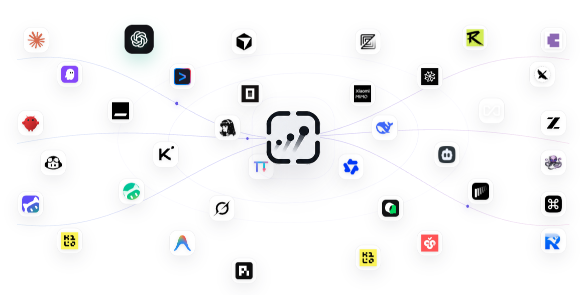
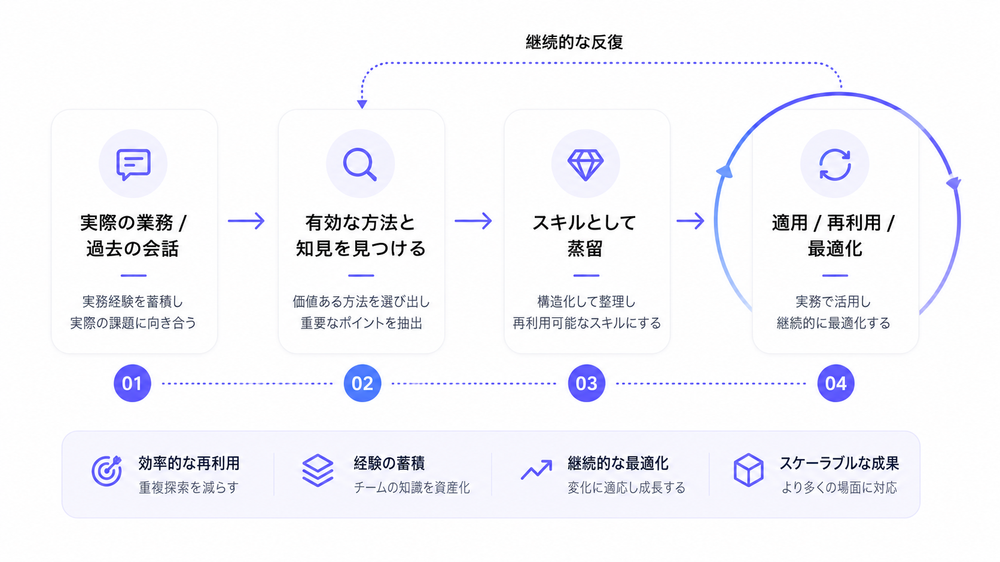
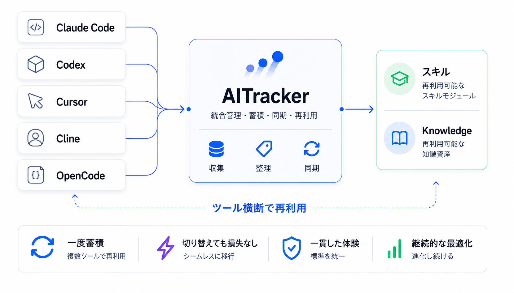
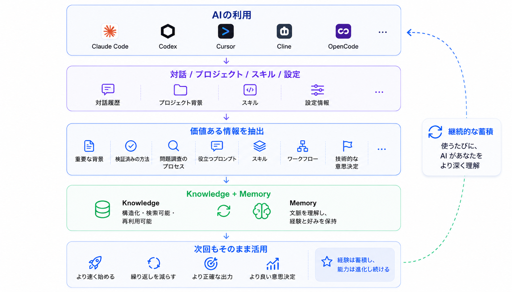
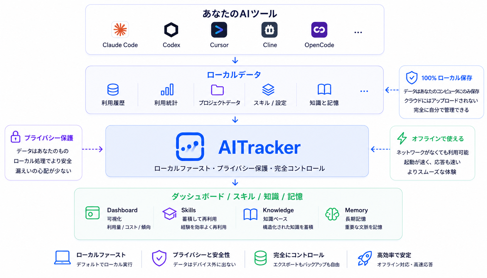
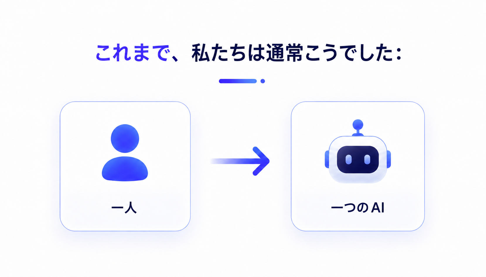
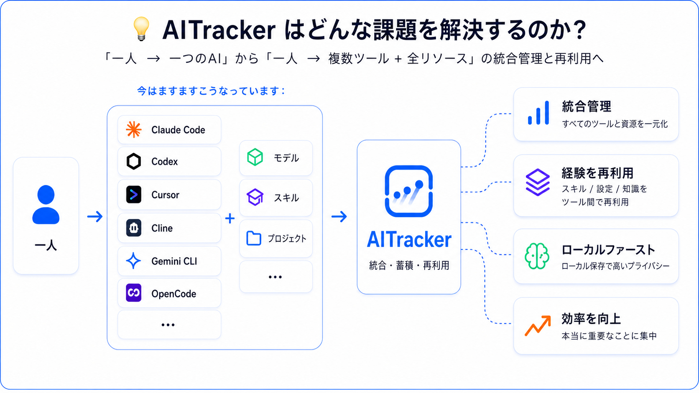

# AITracker

[English](../README.md) | [简体中文](README_CN.md) | [日本語](README_JA.md) | [한국어](README_KO.md)

> **どれだけトークンを使い、いくら費やし、どのAgentツールが最も使いやすいかを、一目で把握。**

AITrackerは、**オープンソースでローカル動作するAIワークスペース**です。

Claude Code、Codex、CursorなどのAIツールにおけるトークン、コスト、利用傾向を自動的に追跡し、Skillsやよく使う設定を一元管理します。実際の作業や利用履歴からSkillsを蒸留し、個人ナレッジベースと長期記憶を構築することで、AIの利用を次回も再利用できる能力へと変えていきます。

**オープンソース · ローカルファースト · アカウント不要**

> 注：元READMEで参照されていた画像のうち、現在アクセスできる4枚を `assets/aitracker-ja/` に収録しました。画像内の中国語を含む3枚は元ファイルが見つからなかったため、該当箇所に補足を付けています。元画像をご提供いただければ、画像内の文言も日本語に置き換えた完成版に更新できます。

---

## ✨ なぜAITrackerが必要なのか？

AIツールはますます増えています。

Claude Code、Codex、Cursor、Cline、Gemini CLI、OpenCode……

しかし、ツールが増えるにつれて、新たな問題も生まれます。

- 自分は実際にどれだけAIを使ったのか？
- トークンと費用はどこに使われているのか？
- どのツール、どのモデルが自分に最適なのか？
- Skillsなどの設定が、あちこちに分散していないか？
- 別のAIツールに乗り換えるたび、設定をやり直していないか？
- 今日うまくいった方法を、次回もそのまま使えるか？
- AIが自分のプロジェクトや長期的な作業経験を覚えてくれないか？

**AITrackerは、これらを一つの場所に集約します。**

AIの利用状況を把握し、AIの能力を管理し、Skillsを蒸留し、知識と長期記憶を蓄積する。AITrackerは、AIを一度きりの道具で終わらせません。

---

## 🌟 主な機能

| 機能           | 説明                                                                       |
| ------------ | ------------------------------------------------------------------------ |
| **AI利用分析**   | 複数のAIツールについて、トークン、コスト、モデル、プロジェクト、利用傾向を自動集計。AIをどれだけ使い、どこに費用がかかったかを把握できます。 |
| **AIツール分析**  | 実際の利用データをもとに、ツールやモデルごとの利用頻度、消費量、傾向を比較し、自分に合うAIを見つけられます。                  |
| **Skills管理** | 異なるAIツールに散在するSkillsを自動検出し、一元管理。重複した検索やメンテナンスを減らします。                      |
| **設定管理**     | Rulesなど、よく使うAI設定をまとめて管理し、ツールをまたいだ再利用を段階的に実現します。                          |
| **Skills蒸留** | 実際の作業、過去の会話、うまくいった手順から、再利用できる経験を抽出し、Skillsとして蓄積します。                      |
| **ナレッジベース**  | プロジェクト資料、方法、経験、価値ある情報を整理し、個人ナレッジベースとして継続的に蓄積します。                         |
| **長期記憶**     | プロジェクトのコンテキスト、利用習慣、重要な経験を継続的に保存し、AIを使うたびにゼロから始める必要をなくします。                |
| **ローカル優先**   | 中核データと設定を優先的に自分のコンピューターへ保存。アカウントなしで主要機能を利用できます。                          |

---

## AIの利用状況を把握する

AITrackerは、コンピューター上のAIコーディングツールの利用データを自動収集し、分散したデータを一つのダッシュボードにまとめます。

確認できる情報：

- トークン使用量
- 入力 / 出力 / Cache Token
- 日次、週次、月次のコスト
- AIツールごとの利用状況
- モデルごとの利用状況
- プロジェクトごとの消費量
- 利用傾向

もう、感覚だけでAIの利用量を判断する必要はありません。

> **どれだけ使い、いくら費やし、どれが最適かを、一目で把握。**

---

## AIの能力を管理する

本当に管理が難しくなっているのは、AIツールそのものだけではありません。異なるツールに散在する設定や能力も、管理すべき対象です。

AITrackerは、こうした設定を自動的に見つけ、統一された管理画面を提供します。

特定のSkillがどのディレクトリにあるかを覚えておく必要も、ツールを変えるたびに設定をやり直す必要もありません。

---

## Skillsの蒸留

本当に価値のあるSkillは、必ずしもゼロから書く必要はありません。

AITrackerは、実際の作業、過去の会話、すでにうまくいった手順から、再利用する価値のある経験を見つけ出し、段階的にSkillsへと蒸留します。

「今回はようやくうまくいった」を、「次回からそのまま再利用できる」へ。

---

## ツールをまたいだ再利用

便利なSkillが、Claude Codeだけのものになってはいけません。

一度うまくいった設定も、Codex、Cursor、その他のツールへ切り替えたからといって、最初からやり直すべきではありません。

AITrackerは、異なるAIツールの上に共通の能力レイヤーを構築することを目指しています。

一つの場所で管理し、異なるAIツールで使い続ける。

図中の主なメッセージ：一度蓄積して複数ツールで再利用／切り替え自在でシームレスに移行／一貫した体験を標準化／継続的に最適化し、絶えず進化。

---

## ナレッジベースと長期記憶

AIは毎日、大量の会話を生み出します。しかし、本当に残す価値があるものは、その一部にすぎません。

たとえば：

- プロジェクトの重要な背景
- 検証済みの方法
- 問題を切り分けたプロセス
- 使いやすいPrompt
- Skill
- Workflow
- 重要な技術的意思決定

AITrackerは、こうした価値ある情報を**ナレッジベースと長期記憶**へ段階的に蓄積します。

AIが毎回ゼロから始めることは、もうありません。

---

## より多くのAIコーディングツールに対応

AITrackerは、複数のAIツールで使うことを前提に設計されています。主なAIコーディングツールへの対応を段階的に進めています。

`Claude Code` · `Codex` · `Cursor` · `Cline` · `Gemini CLI` · `OpenCode` · ...

現在、**36以上のAIツールについてデータ収集・識別シナリオに対応**しており、今後も拡張を続けます。

---

## Local First

AITrackerは、デフォルトでローカル環境上で動作します。

AIの利用履歴、統計データ、Skills、Rules、知識、記憶は、優先的に自分のコンピューターへ保存されます。

**アカウント登録なしで主要機能を利用できます。**

あなたのデータは、あなた自身のものです。

---

## AITrackerが解決したいこと

これまで、私たちは通常このように使っていました：

> 配図（従来の使い方）：元READMEの参照先にある画像ファイルが現在見つからないため、原図をこの版には埋め込めていません。

これからは、ますますこのような形になります：

AIツールは、ますます強力になり、ますます増えています。

しかし私たちには、こうしたAIの能力を**把握し、管理し、蓄積するための、本当に自分自身の場所**がありません。

それが、AITrackerの目指すものです。

> **AIを把握する → 能力を管理する → 経験を蒸留する → 継続的に蓄積する。**

---

## コントリビューション

AITrackerはオープンソースです。

Issueや、新しいAIツールへの対応に関する提案を歓迎します。

利用中のAIコーディングツールがAITrackerにまだ対応していない場合も、ぜひお知らせください。

---

## ライセンス

AITrackerはGNU General Public License version 3以降（GPL-3.0-or-later）の下でライセンスされています。詳しくは[LICENSE](../LICENSE)をご覧ください。

---

## Star

AITrackerがお役に立ったら、ぜひプロジェクトにStarをお願いします。ありがとうございます。
