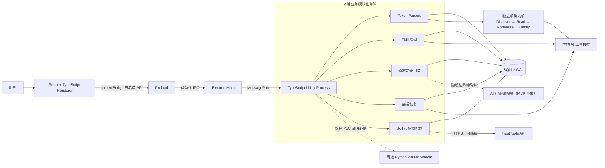

# TrustTools V3.0 架构决策记录

| 属性     | 值                  |
| -------- | ------------------- |
| 文档类型 | 架构决策记录 (ADR)  |
| 项目名称 | TrustTools V3.0     |
| 版本     | v1.3                |
| 创建日期 | 2026-07-27 14:49:27 |
| 更新日期 | 2026-07-31          |
| 生成工具 | tech-selection      |
| 文档状态 | 草稿                |

## 修订记录

| 版本 | 修改时间            | 修改内容                                                             |
| ---- | ------------------- | -------------------------------------------------------------------- |
| v1.3 | 2026-07-31          | 同步 PRD v5.0：删除 Memory 模块，替换为 Session Recovery；更新架构图 |
| v1.2 | 2026-07-27 15:00:47 | 新增独立采集内核、数据源接口重构和独立实现 ADR                       |
| v1.1 | 2026-07-27 14:54:39 | 调整为全栈 TypeScript 架构；Python 从核心后端降为可选 parser sidecar |
| v1.0 | 2026-07-27 14:49:27 | 初始版本                                                             |

---

## ADR-001：采用全栈 TypeScript 作为核心技术路线

### 状态

proposed

### 背景

TrustTools 的核心职责是读取和处理用户本机文件、日志与 SQLite 数据，再通过 Electron Dashboard 展示和管理。它不是独立部署的服务端产品。现有工程已经采用 React 和 TypeScript。

### 决策

Renderer、Electron Main、preload、Utility Process、parser、领域模型和数据访问统一使用 TypeScript。V1 默认安装包不携带 Python 运行时。

### 备选方案

- React/Electron + Python FastAPI
- Node 本地 API + Python parser worker
- 全部业务直接运行在 Electron Main

### 权衡

- 收益：单语言、共享类型、统一调试与打包，减少跨进程 DTO 和联调成本。
- 代价：需要用 TypeScript 自研原计划中的 parser。
- 风险：少数复杂数据格式可能缺少成熟 Node 库。
- 运维影响：安装包只维护 Electron/Node 运行时。

### 后果

Python 仅在某个 parser 经过 PoC 证明无法经济地用 TypeScript实现时，作为无状态 sidecar 引入；它不能拥有主数据库或成为全局 API。

### 复审触发条件

- 两个以上 P0 parser 的 TypeScript 实现成本显著失控
- 关键格式只能由稳定 Python 生态支持
- Python sidecar PoC 的总体成本低于 TypeScript 实现

---

## ADR-002：采用 Main、Renderer、Utility Process 三层进程模型

### 状态

proposed

### 背景

全站 JavaScript 不代表把业务全部放入 Electron Main。文件监听、日志解析、SQLite 查询和安全扫描可能阻塞事件循环或崩溃，必须与窗口和生命周期隔离。

### 决策

- Renderer：React SPA，仅负责 UI。
- Preload：最小权限桥接。
- Main：窗口、托盘、自启、更新、权限和进程监管。
- Utility Process：所有本地领域业务、parser、数据库和网络适配器。
- Worker Thread：Utility Process 内按需处理 CPU 密集任务。

### 备选方案

- Main 直接承载全部业务
- Python 子进程承载全部业务
- 每个模块独立服务

### 权衡

- 收益：保持 TypeScript 融合，同时隔离重任务和故障。
- 代价：需要设计进程生命周期和消息协议。
- 风险：Utility Process 崩溃后正在运行的任务需要恢复。
- 运维影响：Main 负责健康检查、重启和退出清理。

### 后果

业务模块在代码上分层，在部署上共享一个 Utility Process。任何模块都不能绕过 repository 层直接拥有第二个写数据库连接。

### 复审触发条件

- Utility Process 成为资源瓶颈
- 安全扫描需要更强权限隔离
- 某模块需要独立升级或独立崩溃域

---

## ADR-003：采用类型化 IPC，不以 localhost HTTP 作为 V1 核心

### 状态

proposed

### 背景

Renderer 与本地业务都随 Electron 安装并运行，不存在跨设备或独立部署需求。HTTP 会额外引入端口、鉴权、CORS、服务发现和第二套契约。

### 决策

Renderer 通过 `contextBridge` 暴露的白名单 API 调用 Main；Main 通过 MessagePort 与 Utility Process 通信。共享 TypeScript contract 包定义命令、事件、响应和错误，Zod 负责运行时校验。

### 备选方案

- localhost HTTP/JSON
- Renderer 直接访问 Node.js
- 通用字符串 channel IPC

### 权衡

- 收益：端到端类型安全，无端口和本地 HTTP 攻击面。
- 代价：需要维护消息路由和超时取消机制。
- 风险：契约过度宽泛会重新形成权限泄漏。
- 运维影响：所有跨进程调用统一携带 request ID、超时和结构化错误。

### 后果

- 禁止 `nodeIntegration`。
- 启用 `contextIsolation` 和 sandbox。
- 禁止向 Renderer 暴露任意文件读写、任意 shell 或通用 IPC send。
- 文件选择由 Electron dialog 返回经过校验的用户授权路径。
- V1.1 浏览器插件如需接入，再单独增加最小回环 API 适配层。

### 复审触发条件

- 浏览器插件进入 MVP
- 需要第三方本地客户端访问
- IPC 吞吐或消息大小成为瓶颈

---

## ADR-004：采用 React Vite SPA，移除桌面生产包的服务端运行时

### 状态

proposed

### 背景

现有项目是 React + TypeScript + TanStack Start。桌面客户端不需要 SSR、SEO 或独立 Node Web Server。

### 决策

复用 React、Tailwind CSS、Radix UI、TanStack Router/Query 和 Recharts，将桌面生产形态客户端化为 Vite SPA。

### 备选方案

- 保留 TanStack Start 全栈运行时
- Vue 3 重写

### 权衡

- 收益：复用现有 UI，减少运行时层次。
- 代价：需要调整 server route 和数据获取方式。
- 风险：未来独立 Web 版需要单独构建入口。
- 运维影响：桌面包只加载本地静态资源。

### 后果

所有数据通过 preload contract 获取；组件和 hooks 不直接依赖 Electron API。

### 复审触发条件

- 同期交付公网 Web 版
- 出现 SSR 或 SEO 硬需求

---

## ADR-005：SQLite 在 Utility Process 中作为唯一在线事实源

### 状态

proposed

### 背景

产品需要多维下钻、分页、时间聚合、Skill 索引、会话搜索和迁移。JSONL 不适合承担综合在线查询。

### 决策

使用 SQLite WAL。首选 `better-sqlite3`，数据库连接仅存在于 Utility Process。锁定 Electron 版本后同步验证 Node 内置 `node:sqlite`，若满足迁移和性能要求则可替换原生 addon。

### 备选方案

- Node 内置 `node:sqlite` 直接定案
- JSONL + SQLite 双写
- 纯 JSONL
- Python sqlite3

### 权衡

- 收益：事务、索引、FTS、聚合与 TypeScript 集成成熟。
- 代价：`better-sqlite3` 需要匹配 Electron ABI。
- 风险：Electron 升级时原生模块需要重建验证。
- 运维影响：electron-builder 必须执行 native dependency rebuild。

### 后果

- 单写者、短事务、批量提交。
- 稳定幂等键防止重复计费。
- 使用小时/日聚合表保障 Dashboard 性能。
- 应用升级前自动备份并执行顺序迁移。
- JSONL 只用于导出和诊断。

### 复审触发条件

- `node:sqlite` 在目标 Electron 版本中达到可接受稳定度
- 原生 addon 构建持续阻塞发布
- 数据规模超出 SQLite 适用边界

---

## ADR-006：采用事件监听加周期对账的 TypeScript 采集器

### 状态

proposed

### 背景

纯文件事件可能因休眠、崩溃、批量写和日志轮转丢失变化；纯轮询又会增加资源消耗。

### 决策

使用文件事件库进行低延迟增量采集，并用周期 reconciliation 补偿。每个工具是独立 TypeScript parser adapter，维护源版本、游标和幂等键。

### 备选方案

- 纯文件监听
- 固定间隔全量扫描
- Python watchdog

### 权衡

- 收益：跨平台、实时性和可靠性平衡。
- 代价：需要游标恢复和事件去重。
- 风险：复杂 SQLite/protobuf 源的 TypeScript parser 工作量可能被低估。
- 运维影响：每个 parser 输出健康状态、最近成功时间和错误摘要。

### 后果

主力 P0 parser 必须逐个 PoC。普通 I/O 使用 Node 异步 API；CPU 密集解析进入有界 Worker Thread 池。

### 复审触发条件

- P0 parser 出现无法接受的生态缺口
- 监听在目标平台持续不稳定
- 大文件解析超过资源预算

---

## ADR-007：采用 electron-builder 单运行时分发

### 状态

proposed

### 背景

产品要求 DMG 和 NSIS 安装包。全栈 TypeScript 架构无需额外 Python 运行时。

### 决策

使用 electron-builder 打包 Electron 应用。构建阶段重建 SQLite 原生模块，分别生成 macOS arm64、macOS x64 和 Windows x64 制品。

### 备选方案

- Electron Forge
- electron-builder + PyInstaller
- 首次启动下载外部运行时

### 权衡

- 收益：安装包、升级链路和运行时更简单。
- 代价：原生 SQLite addon 增加 ABI 构建矩阵。
- 风险：签名、公证和 native rebuild 失败。
- 运维影响：CI 必须在目标平台构建并执行安装级冒烟测试。

### 后果

V1 安装包不包含 Python。若未来引入 parser sidecar，必须独立提交 ADR 并重新评估体积、签名、升级和内存。

### 复审触发条件

- 采用无原生 addon 的稳定 SQLite 方案
- 分发工具无法满足签名或自动更新要求
- 引入必要的非 Node sidecar

---

## ADR-008：AI 安全审查保持条件接受

### 状态

proposed

### 背景

“静态规则 + AI 审查”与“原始数据全部本地”仍存在数据出机冲突，这与核心语言无关。

### 决策

静态扫描在 Utility Process 本地完成；AI 审查通过适配器接入。产品确认隐私边界前不绑定默认云端供应商。

### 后果

若允许云端，只发送脱敏后的最小必要片段并显式征得用户同意；若禁止源码出机，则 V1 只交付静态扫描或用户自带本地模型。

### 复审触发条件

- 产品确认 Skill 源码出机政策
- 确定默认 AI 服务及成本承担方式
- 本地模型满足体积、内存和 30 秒目标

---

## ADR-009：独立数据源采集实现

### 状态

proposed

### 背景

TrustTools 面向多种本地 AI 工具数据源，产品明确要求代码、接口和实现结构独立维护。

### 决策

只研究以下事实：

- AI 工具把 token 指标写到什么本地介质
- 数据是 event、delta、snapshot 还是 estimate
- 如何识别追加、截断、轮转、原子替换和数据库变化
- 哪些工具会产生镜像或重叠记录
- token 字段的 Provider 特有语义

不继承其 parser 函数、`rollout.js`/`sync.js` 结构、queue/cursor schema、本地 API、CLI、测试或 fixture。

### 备选方案

- 直接复用 MIT 代码并保留 NOTICE
- 对参考代码做语言或命名改写
- 完全不研究参考项目，从零探索所有数据源

### 权衡

- 收益：减少数据源探索盲区，同时保持独立实现和未来开源辨识度。
- 代价：需要单独编写行为规格、fixtures 和全部 parser。
- 风险：同一数据格式可能自然产生相似逻辑，需保留独立设计证据。
- 运维影响：建立来源登记、相似度扫描和开源审查门禁。

### 后果

- 固定参考版本，避免开发期间持续追随其内部实现。
- 研究输出不得包含源代码片段。
- 开发 PR 只能引用行为规格和公开 Provider 文档。
- 当前 `<10%` 相似度作为辅助指标，不作为唯一合规依据。

### 复审触发条件

- 需要直接复用某段 MIT 代码
- 参考项目许可证或归属发生变化
- 相似度检查或人工审查发现高风险同源结构

---

## ADR-010：采用事务化 Adapter 采集内核

### 状态

proposed

### 背景

参考项目验证了多数据源增量采集的主要困难：不同介质、累计快照、文件重写、跨源重叠、活跃会话补写和多安装环境。若每个 parser 自行管理游标、去重和写入，将重复制造边界错误。

### 决策

自研采集内核拆分为：

1. Source Catalog
2. Instance Discovery
3. Change Detection
4. Format Reader
5. Provider Decoder
6. Privacy Projection
7. Usage Normalization
8. Dedup / Overlap Resolution
9. Transactional Ingest
10. Incremental Aggregation

Provider Adapter 只负责发现 Provider 实例和翻译其数据语义；游标、事务、去重、隐私和聚合由平台内核统一负责。

### 备选方案

- 每个 parser 独立读写 SQLite
- 统一大 parser + 大型 sync orchestrator
- 保留 JSONL queue 和独立 cursor 文件

### 权衡

- 收益：故障隔离、接口独立、统一正确性和低同源风险。
- 代价：前期需要先实现采集框架和 contract。
- 风险：抽象过度可能压不住 Provider 特例。
- 运维影响：每次采集都产生 ingestion run、adapter version 和结构化诊断。

### 后果

- Adapter 不接触 UI、Electron Main、HTTP 或聚合查询。
- 规范化事件和 checkpoint 在同一 SQLite 事务提交。
- 崩溃恢复允许重复读取，不允许重复计费。
- source instance 隔离原生、WSL、profile 和多安装目录。
- 特例通过 adapter capability 描述，不通过内核中的 Provider 名称分支实现。

### 复审触发条件

- 三个以上 Provider 无法适配统一读取/提交模型
- Adapter contract 频繁破坏兼容性
- 事务吞吐无法满足首次扫描目标

---

## ADR-011：被动采集优先，Hook 仅作为可选唤醒机制

### 状态

proposed

### 背景

参考项目通过修改第三方工具配置安装 SessionEnd/notify hook，以获得秒级刷新，同时也需要处理配置不可写、只读文件系统、WSL 和卸载清理。TrustTools 是常驻 Electron 客户端，可以通过文件监听和周期对账实现核心采集。

### 决策

- 默认不修改第三方配置。
- 本地文件/数据库被动读取是主路径。
- 文件事件用于低延迟唤醒，周期对账用于可靠性补偿。
- 只有在被动路径无法满足时，才提供用户明确授权的 trigger-only hook。
- Hook 只发送“某数据源可能变化”的信号，不携带 prompt、回复或 token 明细。

### 备选方案

- 首次安装自动写入所有支持工具的 hook
- 仅定时全量扫描
- 每个 Provider 自行选择，无统一政策

### 权衡

- 收益：侵入性更低，卸载干净，减少第三方配置冲突。
- 代价：极端情况下刷新延迟高于 SessionEnd hook。
- 风险：文件系统事件可能丢失。
- 运维影响：必须保留周期 reconciliation 和“数据最后更新时间”状态。

### 后果

Hook 是能力增强，不是 parser 正确性的前提。无 hook、断网和客户端休眠恢复后，下一次对账仍能补齐数据。

### 复审触发条件

- 某 P0 工具不落本地可读数据
- 被动采集持续无法满足 2 分钟首数据目标
- 用户明确接受自动配置集成

---

## ADR-012：统一 event/delta/snapshot/estimate 测量语义

### 状态

proposed

### 背景

不同 AI 工具的 token 字段可能表示单次事件、变化量、累计快照或上下文估算。把快照当增量会重复计费，把上下文大小当累计 token 会造成严重膨胀。

### 决策

每个 Adapter 必须声明测量类型，并把结果标为 exact、normalized 或 estimated。未知语义不能进入精确费用指标。

### 后果

- snapshot 必须使用持久基线求差，并处理归零与回退。
- estimate 单独展示，不能静默混入精确总额。
- 缺少输入/输出拆分时保留 unknown component，不凭空分摊。
- 每个 Provider 上线前必须与官方统计对账。

### 复审触发条件

- 领域模型无法表示新 Provider 的计量语义
- 用户更偏好估算覆盖率而非精确值
- Provider 发布官方稳定 usage API

---

## 13. 选定架构基线

## 14. 对后续架构设计的关键前提

- 全栈 TypeScript 是默认核心路线。
- Python 重构工时评估作为历史备选材料，不再决定系统边界。
- V3.0 是单应用、多进程的模块化单体。
- Renderer 无特权；Main 无业务；Utility Process 无 UI。
- 类型化 contract 是前端、壳和采集模块的协作边界。
- localhost API 不进 V1 核心，只为未来浏览器插件保留扩展点。
- SQLite 仅由 Utility Process 管理。
- P0 parser 必须逐个做 TypeScript 可行性 PoC。
- AI 数据出机政策仍是架构批准前的产品决策项。
- 不引入外部实现模板或运行时。
- 所有 Provider 接口、存储 schema、IPC 和查询接口重新设计。
- 规范化事件、去重索引和 checkpoint 必须事务化提交。
- 被动采集为默认，hook 不得成为正确性前提。
- Adapter 测试使用独立生成或用户授权脱敏的 fixture。
