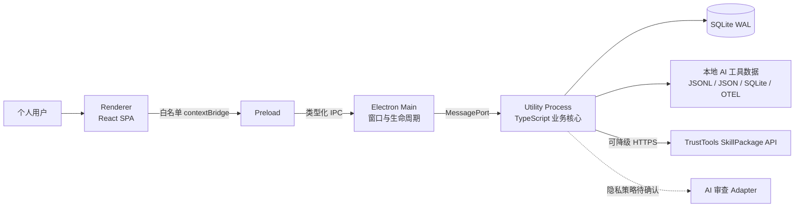
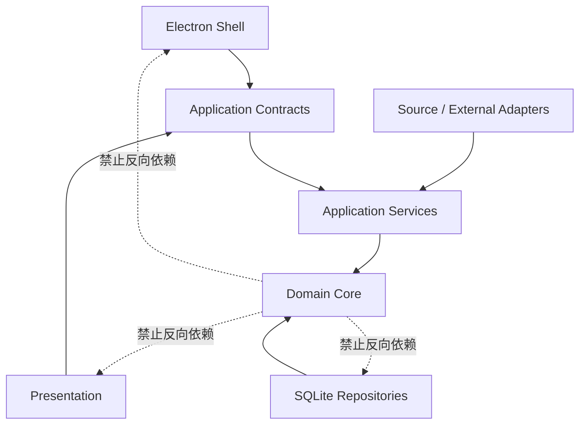

# TrustTools V3.0 架构设计文档

| 属性   | 值                   |
| ---- | ------------------- |
| 文档类型 | 架构设计文档 (ARCH)       |
| 项目名称 | TrustTools V3.0     |
| 版本   | v2.0                |
| 创建日期 | 2026-07-24 14:08:36 |
| 更新日期 | 2026-07-27 15:18:44 |
| 生成工具 | architecture-design |
| 文档状态 | 草稿                  |

## 修订记录

| 版本   | 修改时间                | 修改内容                                                                        |
| ---- | ------------------- | --------------------------------------------------------------------------- |
| v2.0 | 2026-07-27 15:18:44 | 基于需求简报 v1.9、PRD v2.1 和 ADR v1.2 重构；采用全栈 TypeScript、Electron 多进程模块化单体和独立采集内核 |
| v1.0 | 2026-07-24 14:08:36 | 旧版初始架构，已被 v2.0 取代                                                           |

---

## 1. 背景与目标

### 1.1 问题陈述

TrustTools V3.0 是面向个人 AI 开发者的本地桌面工具。它从用户本机已有 AI 工具产生的日志、会话元数据、SQLite 数据库和 Skill/Memory 目录中提取可用指标，统一提供：

- Token 消耗、费用和多维下钻
- Skill 发现、健康度、清理和多 Agent 安装
- Skill 静态安全检测和条件式 AI 审查
- TrustTools Web Skill 库搜索、下载和版本检查
- Memory 目录聚合和浏览
- macOS、Windows Electron 客户端

系统不是 AI 聊天客户端，也不是云端 SaaS 后端。核心价值来自“在不上传用户完整对话的前提下，把本地 AI 资产和消耗数据变成可信、可解释、可管理的信息”。

### 1.2 业务目标

| 目标                   | 架构含义                    |
| -------------------- | ----------------------- |
| 安装后 2 分钟内看到 Token 数据 | 首次扫描必须可分阶段、可并发、可流式反馈    |
| 覆盖 10+ AI 工具         | 数据采集必须是 Adapter 扩展模型    |
| Token 计数准确率 ≥95%     | 需要可追溯事件、测量语义、去重和官方基准对账  |
| 安全检测 30 秒内出报告        | 静态扫描必须本地执行；AI 路径需要超时和降级 |
| Skill 市场安装 <15 秒     | 下载、检查、安装要有明确事务和失败恢复     |
| 无账号、安装即用             | 本地功能不得依赖云端身份和云数据库       |

### 1.3 架构目标

1. **数据可信：** 同一数据无论重复扫描、日志重写或应用崩溃都不能重复计费。
2. **隐私优先：** prompt、回复、工具参数和完整对话正文不进入 TrustTools 持久层。
3. **低认知负担：** 适配 1 名负责人 + Codex 的研发模式，减少语言、进程和部署种类。
4. **独立开源：** TokenTracker 只作为数据源行为参考，接口、代码、数据模型和测试全部独立。
5. **跨平台：** 同一 TypeScript 核心覆盖 macOS 和 Windows，平台差异封装在适配边缘。
6. **可演进：** 新增 Provider、Skill 目标或 Memory 来源时，不修改稳定核心。

### 1.4 非目标

- 不做账户、团队、跨设备同步或云端备份。
- 不在 V1.0 提供浏览器插件。
- 不执行不受信任 Skill；只做静态检查和用户决定。
- 不构建本地微服务集群。
- 不复刻 TokenTracker 的 CLI、HTTP API、queue/cursor schema 或 UI。
- 不为未来假设的海量用户设计云端水平扩展。

## 2. 输入验证、假设与约束

### 2.1 输入完整性检查

| 检查项       | 状态      | 依据                                    |
| --------- | ------- | ------------------------------------- |
| 需求文档或功能描述 | ✅ 已提供   | 需求简报 v1.9、PRD v2.1、需求审计 v3            |
| 技术选型偏好或约束 | ✅ 已提供   | 技术选型矩阵 v1.2、ADR v1.2                  |
| 团队规模与组织结构 | ✅ 已提供   | 1 名负责人，研发主要由 Codex 执行                 |
| 数据规模      | ✅ 已提供   | 10 万条数据的 30 天查询目标；更长期规模未明确            |
| 响应时间      | ✅ 已提供   | 页面 <2 秒、图表 <1 秒、30 天查询 <3 秒           |
| 可用性与恢复    | ⚠️ 部分提供 | 本地应用无 SLA；要求离线可用，未给出恢复时间              |
| 吞吐量与并发    | ⚠️ 部分提供 | 单机单用户；首次扫描峰值未量化                       |
| 数据一致性     | ✅ 已提供   | Token 不重复、检测次数和安装结果必须一致               |
| 安全与合规     | ✅ 已提供   | 本地化、无完整对话、Clean Room、MIT NOTICE       |
| 可维护性      | ✅ 已提供   | 全栈 TypeScript、Provider 插件化、Codex 主导研发 |
| 成本约束      | ⚠️ 部分提供 | 无基础设施预算；AI 审查成本承担方未确定                 |

必要输入已经齐全。部分质量属性不阻塞核心架构，以下列为显式假设和验证项。

### 2.2 假设

| 编号   | 假设                                                | 置信度 | 影响与验证方式                  |
| ---- | ------------------------------------------------- | --- | ------------------------ |
| A-01 | 单机只有一个 TrustTools 活跃实例                            | 高   | 使用单实例锁验证；第二实例唤醒第一实例      |
| A-02 | 常态并发为单用户、低 QPS，峰值来自首次扫描                           | 高   | 用 Wave 1 五类数据源并发扫描做基准    |
| A-03 | 三年内规范化 usage facts 不超过 1000 万条                    | 中   | 达到 500 万条时复测索引、聚合和备份     |
| A-04 | 本地数据库可接受强一致事务，短时阻塞优于重复计费                          | 高   | ingestion transaction 压测 |
| A-05 | Electron、Utility Process 和 SQLite 合计可控制在 200MB 左右 | 低   | 必须用签名安装包实测，不能用开发模式估算     |
| A-06 | 主要 AI 工具继续在本地保留可读取的 usage 元数据                     | 中   | 每个 Provider 单独维护兼容性探针    |
| A-07 | Codex 可持续生成代码、测试和文档，但产品负责人承担最终决策与验收               | 高   | 所有关键变更保留 ADR、测试证据和人工批准   |
| A-08 | 云端 AI 审查不是本地核心功能的可用性前提                            | 高   | 断网和拒绝上传场景必须通过测试          |

### 2.3 不可变约束

- GUI 使用 Electron，支持 macOS 13+（Apple Silicon + Intel）和 Windows 10/11 x64。
- 核心运行时采用 TypeScript，不默认携带 Python。
- Renderer 无 Node.js 权限；Electron Main 不承载领域业务。
- SQLite 是 TrustTools 本地在线事实源。
- 所有本地功能无需登录。
- 原 AI 工具完整对话不写入 TrustTools 数据库、日志或诊断包。
- TokenTracker 固定参考快照为 v0.83.6 / `32df4fe`，只研究行为。
- TokenTracker 只参考数据获取逻辑，其他实现不纳入架构。
- 对外开源前执行许可证、NOTICE、相似度和来源审查。

### 2.4 TokenTracker 参考边界

只参考四类数据获取信息：

1. 各 AI 工具的数据存放位置和介质。
2. 追加、截断、替换、SQLite 更新等增量判断方式。
3. Provider 原始字段到统一 Token 字段的换算规则。
4. 同一事件、镜像记录和累计快照的去重方式。

TrustTools 使用这些信息重新实现 TypeScript Adapter。TokenTracker 的 CLI、本地 API、UI、文件结构、queue/cursor schema、函数接口和测试均不使用。

### 2.5 可调整约束

- `better-sqlite3` 与 `node:sqlite` 在 PoC 后二选一。
- AI 审查模型、供应商和数据出机政策待确认。
- 10+ Provider 的具体顺序可按样本可得性调整。
- Hook 默认关闭；若被动采集无法满足时，可对单个 Provider 提供用户授权的 trigger-only hook。

## 3. 架构驱动因素

### 3.1 优先级

| 优先级 | 驱动因素               | 设计响应                                     |
| --- | ------------------ | ---------------------------------------- |
| P0  | Token 数据正确性        | 事务化 ingestion、稳定事件身份、测量语义、重放幂等           |
| P0  | 本地隐私               | Privacy Projection、最小日志、无对话持久化           |
| P0  | 独立开源               | Clean Room、独立 contract/schema/tests、来源登记 |
| P0  | 单人 + Codex 可维护性    | 单仓库、模块化单体、单语言、自动化门禁                      |
| P0  | macOS/Windows 一致交付 | 平台适配层、同一领域核心、目标平台构建                      |
| P1  | 首次 2 分钟可见          | 分层扫描、优先 Provider、进度事件、增量聚合               |
| P1  | 10+ Provider 扩展    | Source Adapter、能力描述、独立兼容性测试              |
| P1  | 后台资源 <200MB        | Utility Process、有限 worker、流式读取、聚合表       |
| P1  | 离线可用               | 本地核心无云依赖，市场和 AI 明确降级                     |
| P2  | Skill 市场体验         | 外部 API Adapter、下载暂存、原子安装、回滚              |
| P2  | AI 安全审查            | 可插拔 AI Adapter、数据最小化、kill switch         |

### 3.2 关键质量场景

#### QA-01：重复扫描不重复计费

- **触发：** 客户端崩溃发生在数据读取后、状态保存前。
- **响应：** 重启后允许重新读取相同记录。
- **结果：** 稳定 dedup key 阻止重复写入；checkpoint 与 accepted facts 同事务提交。

#### QA-02：日志被截断或原子替换

- **触发：** Provider 更新、账户切换或归档导致 inode、size 或内容边界变化。
- **响应：** Change Detection 判断追加、截断、替换或轮转。
- **结果：** 从安全边界重新读取，通过事件身份去重，不丢失新增数据。

#### QA-03：Provider schema 变化

- **触发：** 某 AI 工具升级并修改本地格式。
- **响应：** 单个 Adapter 进入 degraded 状态，记录未知 schema。
- **结果：** 其他 Provider 继续采集；UI 展示数据新鲜度和兼容性警告。

#### QA-04：断网

- **触发：** TrustTools Web API、定价源或 AI 服务不可达。
- **响应：** Token、Skill、本地静态扫描和 Memory 继续工作。
- **结果：** 市场与 AI 功能明确降级，不阻塞本地启动和查询。

#### QA-05：恶意或超大 Skill

- **触发：** 用户拖入包含路径穿越、压缩炸弹、超大文件或符号链接的 Skill 包。
- **响应：** 解包前检查限制，扫描在受限任务中执行。
- **结果：** 不写出暂存目录、不执行文件、不泄漏源码，返回结构化风险。

#### QA-06：Utility Process 崩溃

- **触发：** parser 或 native SQLite addon 异常退出。
- **响应：** Main 记录退出原因并有限次数重启。
- **结果：** 未提交事务回滚；UI 显示恢复状态；连续失败进入安全停机。

### 3.3 单人 + Codex 的组织驱动

本项目不按“团队边界”拆服务，而按“认知边界”拆模块：

- 一个 Git 仓库、一个产品版本、一个发布列车。
- 模块通过 TypeScript contract 和 repository 接口隔离。
- 每个模块必须有 README、架构测试和失败场景测试，便于 Codex 在局部上下文中工作。
- 生成代码不能绕过 lint、类型检查、单元测试、契约测试和架构 guardrail。
- 关键数据算法要求 golden fixtures 和属性测试，不能只依赖 Codex 自评。
- 产品负责人保留范围、隐私、数据准确性和发布批准权。

Codex 是研发工具，不是 V3.0 产品运行时依赖。用户使用 TrustTools 时不需要 Codex 在线。

## 4. 推荐系统形态

### 4.1 形态选择

推荐采用：

> **单部署单元、内部多进程、按业务域分模块的本地模块化单体。**

| 形态                   | 交付复杂度 | 故障隔离 | 单人维护 | 数据一致性 | 结论  |
| -------------------- | -----:| ----:| ----:| -----:| --- |
| Electron 多进程模块化单体    | 4     | 4    | 5    | 5     | 推荐  |
| 全部业务放在 Electron Main | 5     | 1    | 4    | 4     | 放弃  |
| localhost 服务化后端      | 2     | 4    | 2    | 4     | 放弃  |
| 多本地微服务               | 1     | 5    | 1    | 2     | 放弃  |

### 4.2 顶层运行时

### 4.3 依赖方向

稳定的领域核心不依赖 Electron、React、SQLite、Provider 文件格式或外部 API。框架和数据源都位于可替换边缘。

### 4.4 顶层业务边界

后续详细设计按以下限界上下文展开：

| 上下文                | 核心职责                  | 主要状态                                |
| ------------------ | --------------------- | ----------------------------------- |
| Usage Intelligence | 数据采集、归一化、费用、下钻和预警     | usage facts、checkpoints、aggregates  |
| Skill Assets       | Skill 发现、健康度、安装、清理、恢复 | skill inventory、installations、trash |
| Skill Security     | 本地静态扫描、报告、检测次数、AI 适配  | scan jobs、findings、quota            |
| Skill Distribution | Web Skill 搜索、下载、版本和更新 | catalog cache、downloads、versions    |
| Memory Index       | 目录配置、隐私投影、索引和浏览       | memory sources、metadata index       |
| Desktop Platform   | 窗口、托盘、自启、更新、权限、任务监管   | app settings、runtime health         |

边界之间不共享内部表结构，只通过 Application Service 和领域事件协作；物理上仍使用同一个 SQLite 数据库和同一个 Utility Process。

### 4.5 主要权衡

- **选择单体而非服务：** 获得事务一致性和单人可维护性，代价是必须靠架构测试防止模块侵蚀。
- **选择多进程而非单进程：** 隔离 UI、生命周期和重任务，代价是需要类型化 IPC、超时和崩溃恢复。
- **选择统一 SQLite：** 简化备份、迁移和查询，代价是所有写操作必须服从单写者和事务纪律。
- **选择 Adapter 扩展：** 新 Provider 不修改核心，代价是前期 contract 和兼容性测试投入较高。
- **选择被动采集优先：** 降低侵入性，代价是部分 Provider 的刷新速度可能低于自动 Hook。

## 5. 分块生成状态

本次已完成第一块：

- 背景与目标
- 输入验证、假设与约束
- 架构驱动因素
- 推荐系统形态

下一块将展开：

- 六个限界上下文的组件职责与依赖规则
- 数据采集内核的详细组件模型
- SQLite 数据模型、事务边界、索引、迁移和恢复
