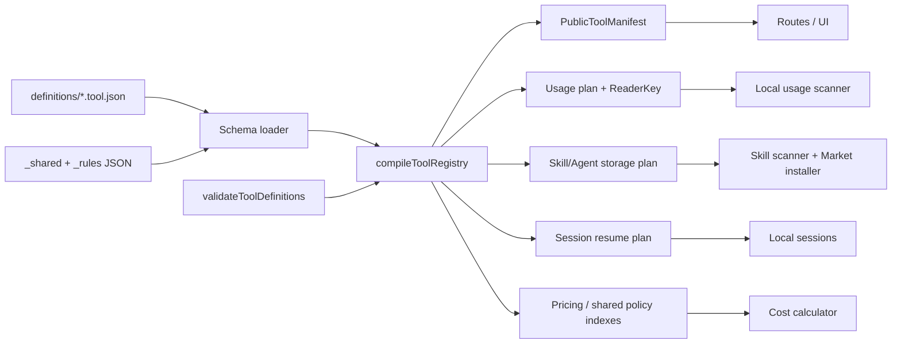

# TrustTools AI 工具模块化架构设计

| 属性     | 值                                     |
| -------- | -------------------------------------- |
| 文档类型 | 架构设计文档 (ARCH)                    |
| 项目名称 | TrustTools-AI工具模块化                |
| 版本     | v1.6                                   |
| 创建日期 | 2026-08-05 14:39:08                    |
| 更新日期 | 2026-08-06 17:07:33                    |
| 生成工具 | agile-feature-dev、architecture-design |
| 文档状态 | 草稿                                   |

## 修订记录

| 版本 | 修改时间            | 修改内容                                                   |
| ---- | ------------------- | ---------------------------------------------------------- |
| v1.6 | 2026-08-06 17:07:33 | 回写决策记录 D2/D3 批准差异：pricing/security 目录漂移、生成/校验入口与依赖方向（P3-1） |
| v1.5 | 2026-08-05 16:55:05 | 补齐共享规则包、配置边界和当前代码残留的迁移要求           |
| v1.4 | 2026-08-05 16:35:57 | 定价专项方案改为内建离线规则包，移除模型价网络权威路径     |
| v1.3 | 2026-08-05 16:12:35 | 补齐遗漏能力、跨平台路径模型和共享配置集                   |
| v1.2 | 2026-08-05 16:00:55 | 改为内建 JSON 定义；移除指定目录加载与用户覆盖             |
| v1.1 | 2026-08-05 14:42:59 | 补充 source-aware 计费、公共 manifest 交付边界与注册白名单 |
| v1.0 | 2026-08-05 14:39:08 | 初始架构设计与迁移方案                                     |

## 1. 背景、目标与成功标准

TrustTools 已支持 27 个 AI 开发工具，并已有工具目录、用量采集适配器、Skill 扫描规则、价格表、会话恢复逻辑和市场安装目标。但这些知识分散在 `src/lib/tools/catalog.ts`、`src/lib/local-usage/adapters/catalog.ts`、`src/lib/local-skills/agent-rules.ts`、`src/lib/pricing/catalog.ts` 等处；新增一个工具会修改多个文件，且不能从一个位置判断该工具究竟支持哪些能力。

本次重构将每个工具的静态知识收敛为独立的 `*.tool.json`，例如 `codex.tool.json`。任何业务模块只能消费注册表的派生结果，不能维护自己的工具名单、工具名称或路径常量。

成功标准：

1. 新增一个“已有通用采集器支持”的工具时，只新增一个配置文件和一个注册表导出；不改 UI、市场、探测、Skill 或价格消费者。
2. 特殊格式工具只额外实现一个受控 Reader，并在该工具配置中引用 Reader ID；配置文件不含 I/O、网络、环境读取或解析代码。
3. 工具是否支持“探测、用量、上下文分析、Skill、Agent、会话恢复、市场安装、价格估算”等能力可由同一配置直接回答。
4. 配置在模块加载时和 CI 中同时校验：ID、路径安全性、能力组合、Reader 引用、模型价格匹配优先级均不可失效。
5. 现有 27 个产品目录工具、2 个遗留采集来源（AiPy/Cline）、9 个 Skill Agent、Codex/Claude 原生采集、上下文分析、3 个会话恢复工具及既有价格计算的行为保持兼容；迁移期间可随时回滚。
6. macOS、Windows 10、Windows 11 均由同一份工具 JSON 驱动；Linux 有明确的 XDG 路径和 `planned` 能力状态，后续启用不需要变更契约。
7. 工具相关规则按“每工具、跨工具共享、专项规则”分层：没有工具专属语义的扫描预算、通用字段映射、Skill/Market 顺序、使用分类和安全规则不复制进每个工具文件，但同样必须内建、可校验、可版本化。

非目标：本期不支持从用户指定目录、市场目录或网络加载工具定义；不执行任意第三方 JavaScript/TypeScript；不把工具解析器动态下载到本机，也不承诺所有 27 个工具都具备用量、Skill 或恢复能力。工具定义更新随应用源码和版本发布生效。

## 2. 输入验证、假设与约束

| 检查项           | 状态        | 结论                                                                                                  |
| ---------------- | ----------- | ----------------------------------------------------------------------------------------------------- |
| 功能描述         | ✅ 已提供   | 每个工具以独立 `*.tool.json` 描述全部相关能力；不支持指定目录运行时加载。                             |
| 技术约束         | ✅ 已提供   | 现有 React + TypeScript + TanStack Start + Electron 单仓库；目标为 macOS、Windows 10/11，预留 Linux。 |
| 团队规模与所有权 | ⚠️ 部分提供 | 未提供；方案按 1–5 人维护同一模块化单体设计，不拆微服务。                                             |
| 数据规模、吞吐量 | ⚠️ 缺失     | 假设为本机日志扫描、百级工具配置、单用户交互；配置编译在启动期执行。                                  |
| 延迟/可用性      | ⚠️ 缺失     | 假设探测与扫描仍可异步，页面 P95 < 500ms（缓存命中时）。                                              |
| 安全与合规       | ✅ 部分提供 | 延续“仅读结构化元数据、不读取/持久化对话正文”；JSON 定义和构建期 loader 均需防路径逃逸。              |

关键假设的置信度为中等。若团队将扩展为多包、多进程独立交付，或需要由远端动态发布工具定义，应在进入实施前重新评审注册表加载与签名分发方案。

现有工作区有未提交的 Skill 和文档修改。本方案不覆盖那些文件；迁移实施应在独立分支上进行，并以当前工作树为基线完成行为对照测试。

## 3. 架构驱动因素与现状映射

| 驱动因素             | 现状证据                                                      | 架构回应                                                                |
| -------------------- | ------------------------------------------------------------- | ----------------------------------------------------------------------- |
| 一个工具，多种能力   | `AI_TOOLS` 只描述名称和探测路径；Skill、Adapter、价格另有目录 | 单个 `ToolDefinition` 聚合能力配置，再按领域派生索引。                  |
| 特殊解析不可纯配置化 | Codex/Claude 解析与上下文统计具有专门实现                     | 配置只引用稳定 Reader Key；Reader 实现由受控工厂注册。                  |
| 本地路径与隐私安全   | 外部 adapter 已限制相对路径、只读 SQL                         | Registry 使用同等路径规则；运行时解析后的绝对路径不可泄露给浏览器。     |
| UI 需安全消费        | 工具名称、功能状态用于 Dashboard、Sources、Skills、Market     | 建立无 Node API 的 `public-manifest.ts`，由同一注册表导出安全展示字段。 |
| 价格需要确定性       | 当前 `MODEL_PRICES` 使用函数 matcher，规则不易审计            | 改为声明式 `ModelRateRule`，编译时生成索引并报告重叠与未知匹配。        |
| 可渐进迁移           | 现有产品功能与未提交工作不能中断                              | 先建立双读/对照，再逐消费者切换，最后删除兼容层。                       |
| 配置可审计且易编辑   | 希望模块化，又不引入运行时可执行插件                          | 使用 JSON + Zod/JSON Schema 校验；配置只随构建发布。                    |
| 跨平台一致性         | 同一工具在 macOS/Windows/Linux 的根目录、命令和可用性不同     | 通过平台目标、平台组和共享路径 profile 声明差异，禁止分叉整份工具配置。 |
| 遗留/自定义采集边界  | AiPy/Cline 和 `custom:*` 目前不完全在目录内                   | AiPy/Cline 纳入隐藏 registry 定义；删除外部 adapter 运行时入口。        |
| 共享规则仍散落代码   | 通用字段映射、Skill 顺序、扫描预算、使用分类和安全规则是常量  | 增加共享策略/专项规则包；只保留解析与安全执行逻辑在 TypeScript。        |

## 4. 推荐系统形态与核心决策

推荐形态是**模块化单体中的内建 JSON 工具目录 + TypeScript 注册表/受控 Reader**，而不是可执行插件、运行时目录加载或微服务。

原因：工具数量是几十级，所有能力都运行在同一桌面客户端且共享隐私、缓存、Electron IPC 与发布节奏。JSON 让工具能力成为可审查、无副作用的声明数据；TypeScript 保留给 schema、注册表、解析器和价格计算等行为。JSON 与应用一同构建，既避免运行时目录扫描和供应链风险，也方便新增工具时只增加一个数据文件。

| 决策         | 采用                                              | 放弃/代价                         | 复审触发条件                                               |
| ------------ | ------------------------------------------------- | --------------------------------- | ---------------------------------------------------------- |
| 配置格式     | 版本控制内的 `*.tool.json` + Zod/JSON Schema 校验 | JSON 不支持注释、函数和复用表达式 | 通用默认值由 loader 补齐；说明写在 docs，不写入配置。      |
| 扩展机制     | 配置引用 Reader/Feature Key，工厂映射到内建实现   | 新日志格式仍需编写 Reader         | 同类工具超过 5 个重复 Reader 后，抽通用 Reader。           |
| 工具目录     | 按工具拆文件、集中注册                            | 首次迁移涉及较多 import 变更      | 工具数超过 100 时，按 provider 子目录组织。                |
| 价格归属     | 价格规则随工具配置声明，注册表统一编译            | 跨工具同名模型要明确优先级        | 多工具共享同一计费来源时，新增 provider 级可复用片段。     |
| 全局规则归属 | 与工具无关的可调业务规则放入共享/专项 JSON 包     | 文件数量增加                      | 规则需要按工具引用、按运行时策略或属于安全扫描时再新增包。 |
| 配置加载     | 只加载仓库内固定 definitions 目录的内建 JSON      | 需要重新构建/发布才会生效         | 未来确有生态需求时，以单独 ADR 评估签名 JSON 包。          |

## 5. 目标目录与依赖规则

```text
src/lib/tool-registry/
├── contracts.ts                 # 领域类型：ToolDefinition、Capability、ReaderKey
├── schema.ts                    # Zod schema、跨字段校验与 TypeScript 推导类型
├── loader.ts                    # 读取内建 JSON、补齐默认值并报告带文件名的诊断
├── registry.ts                  # 汇总、编译派生索引、get/list API
├── public-manifest.generated.ts # 预构建生成的 UI 安全投影；不导入完整 config
├── definitions/
│   ├── _shared/
│   │   ├── platform-profiles.json # macOS / Windows / Linux 基底、平台组与状态
│   │   ├── generic-reader-defaults.json # 通用 JSON/JSONL 字段候选、默认文件上限
│   │   ├── scanner-policy.json    # lookback、文件/目录/行数上限、缓存版本策略
│   │   ├── skill-market-policy.json # Skill/Market 的 toolId 顺序和可安装过滤策略
│   │   └── usage-taxonomy.json    # 使用行为分类、可展示类别与受控 debug hint
│   ├── _rules/
│   │   └── README.md             # 指针：security-rules.json 实际位于 src/lib/security/（批准 diff D2）
│   ├── manifest.json             # 有序 29 个 {id, path}，UI 顺序冻结基线（决策 D7）
│   ├── codex.tool.json
│   ├── claude-code.tool.json
│   ├── cursor.tool.json
│   ├── aipy.tool.json            # legacySupport=true, catalogVisible=false
│   ├── cline.tool.json           # legacySupport=true, catalogVisible=false
│   └── ...每个支持来源一个文件
├── definitions.generated.ts     # build 前生成的内建 JSON import 清单
└── readers/
    ├── contracts.ts             # UsageReader、SessionReader 接口
    ├── usage-readers.ts         # ReaderKey -> 内建 usage reader 的 key 分派（解析实现留在 local-usage/adapters、claude-context.ts、codex-context.ts）
    └── session-readers.ts       # ReaderKey -> 内建 session reader

src/lib/local-usage/             # 保留扫描、聚合、缓存；只查询 registry；原生 usage/context reader 实现所在
src/lib/local-skills/            # 保留文件发现、安装和同步；只查询 registry
src/lib/local-sessions/          # 保留聚合视图；只调用 session reader registry
src/lib/tools/                   # 过渡期兼容导出，最终仅保留 detection 或删除
src/lib/pricing/                 # 定价模块：契约 + compiler + resolver + 费率数据；规则数据不入 tool-registry（批准 diff D3）
├── contracts.ts / compile.ts / normalize.ts / resolve.ts / calculate.ts
├── index.ts / registry.ts / tool-policy.ts / dynamic.server.ts / server-fns.ts
├── pricing-definitions.generated.ts # npm run generate:pricing-imports 生成（compile/registry 消费）
└── rules/                       # 规则数据（pricing-manifest.json 入口 + 6 个 rule pack + 定价目录）
    ├── pricing-manifest.json    # pack 清单与各 JSON 路径（见专项架构）
    ├── {defaults,openai,anthropic,google,china-providers,tool-routing}.rules.json
    ├── model-catalog.json / billing-routes.json / model-alias-rules.json
    ├── route-selection-rules.json / fallback-profiles.json / rate-packs/
    └── tool JSON 只声明 modelObservation；pricing 模块经 pricing-definitions.generated.ts 解析规则

src/lib/security/                # 内建安全规则事实源（批准 diff D2）
├── security-rules.json          # 内建安全扫描规则、severity、版本与分类（26 条）
└── security-rules.generated.ts  # npm run generate:security-rules 生成（sha256 版本化）
```

`scripts/generate-tool-imports.mjs` 只扫描仓库内固定 `definitions/` 源目录，并生成带显式 JSON import 的 `definitions.generated.ts`；应用运行时不扫描任何目录、不接受路径参数、更不根据用户输入动态 import。依赖方向必须为：`routes/components -> 领域服务 -> tool-registry contracts/registry -> JSON definitions`；Reader 实现可以依赖本领域解析工具，但 JSON 定义不依赖任何实现。`tool-registry` 不得导入 route、React、Electron IPC 或 server function。`public-manifest.generated.ts` 由校验通过的 registry 在 prebuild 生成，只包含 display、能力状态与 i18n key；浏览器不得导入完整 definitions 或 Node Reader。

pricing 与 security 的规则数据不在 tool-registry 目录内（批准 diff，见《tool-registry-json-migration-decisions.md》D2/D3），生成/校验入口与依赖边界如下：

- **pricing**：实现位于 `src/lib/pricing/`，规则数据位于 `src/lib/pricing/rules/`（`pricing-manifest.json` 入口 + 6 个 rule pack + model-catalog/billing-routes/model-alias-rules/route-selection-rules/rate-packs/fallback-profiles）。`npm run generate:pricing-imports` 生成 `src/lib/pricing/pricing-definitions.generated.ts`；`npm run verify:pricing-rules` 在构建期校验规则重叠、未知匹配与 parity。
- **security**：内建安全规则事实源位于 `src/lib/security/security-rules.json`；`npm run generate:security-rules`（`node --import tsx scripts/generate-security-rules.mjs`）生成 `security-rules.generated.ts`，已接入 prebuild，构建期安全 gate 校验。
- **依赖方向**：pricing 只消费 tool-registry 注册表派生结果（`getToolDisplay`/`getPricingPolicyRefs`/`getUsagePlan`，即 toolId 与 modelObservation 相关），tool-registry 不反向 import pricing 的规则数据；security 不依赖 tool-registry 与 pricing。

共享配置集只保存跨工具重复的声明数据，不能含 Reader 代码、命令或可执行表达式。工具 JSON 通过受限 ID 引用共享 profile/rule set；loader 在构建期展开引用并检测循环、未知 ID 和同字段冲突。共享配置的优先级固定为 `shared default < platform group < platform target < tool definition`；这里的最后一层是内建工具文件，不是用户 override。同一层级重复定义即构建失败。

## 6. 每工具配置契约

工具定义是纯 JSON 数据，使用 Zod 和导出的 JSON Schema 校验。示意（字段为设计契约，不是本次提交的代码）：

```json
{
  "$schema": "../tool-definition.schema.json",
  "configVersion": 1,
  "id": "codex",
  "catalogVisible": true,
  "display": { "name": "Codex CLI", "nameZh": "Codex CLI", "icon": "codex" },
  "platforms": {
    "macos": "supported",
    "windows": "supported",
    "linux": "planned"
  },
  "detection": {
    "locations": [
      {
        "targets": ["macos", "windows", "linux"],
        "base": "home",
        "path": ".codex"
      }
    ],
    "executable": { "shared": ["codex"], "windows": ["codex.exe"] }
  },
  "storage": {
    "dataRoots": [
      {
        "targets": ["macos", "windows", "linux"],
        "base": "home",
        "path": ".codex"
      }
    ],
    "skills": {
      "roots": [{ "base": "CODEX_HOME_OR_HOME", "path": "skills" }],
      "markers": ["SKILL.md", "skill.md"],
      "maxDepth": 3
    },
    "agents": { "mode": "unsupported" }
  },
  "capabilities": {
    "usage": { "mode": "native", "reader": "codex-rollout-v1", "paths": [] },
    "context": {
      "mode": "native",
      "reader": "codex-context-v1",
      "dimensions": ["tools", "skills", "commands", "mcp"]
    },
    "skills": { "mode": "read-write" },
    "agents": { "mode": "unsupported" },
    "sessions": {
      "mode": "resume",
      "reader": "codex-session-v1",
      "command": ["codex", "resume", "{sessionId}"]
    },
    "market": { "mode": "install-target" },
    "security": { "mode": "scan" }
  },
  "pricing": { "ruleSetRefs": ["openai-codex"], "rules": [] }
}
```

约束：

- `id` 是稳定 kebab-case，永不复用；展示名称可修改但必须有 i18n key 或中文/英文文本。
- 所有路径是相对路径或预定义的 `home`/受控环境变量基底；禁止绝对路径、`..`、NUL、glob 外的执行语义。
- `usage.mode` 为 `native`/`adapter` 时必须引用已注册 Reader，`unsupported` 时不得声明读取路径；`sessions.mode = resume` 必须有受控命令 token 模板和会话 Reader。
- Skill、Agent、Market 是独立能力：没有 Skill 根目录的工具不得自动成为市场安装目标。
- 价格规则是声明式，不可在 config 中放 `matches()` 函数；未知模型按其工具的 fallback policy 返回 `estimated`、`unpriced` 或 `not-billable`，绝不把未命中静默视为精确零价。费用查询一律接收 `event.source`（即 `toolId`），不得继续仅按 `model` 全局查价；运行时价格快照的键也必须为 `(toolId, normalizedModel)` 或含有无歧义 provider 归属。
- `configVersion` 从 1 开始。破坏性字段改名须增加 loader 迁移器或新版本，不能静默改变旧配置含义。
- JSON 不允许注释、函数、环境变量插值或任意命令；路径基底只能取 schema 列出的枚举值。说明、示例与变更理由放在相邻文档或 schema `description` 中。
- `context` 是独立 capability：`native` 必须引用 ContextReader Key，`heuristic` 必须声明可用维度，`unsupported` 不得暴露上下文分析入口；它不能仅作为 UsageReader 的隐式副作用。
- `catalogVisible=false` 仅允许用于仍需兼容采集的遗留来源（AiPy/Cline）；它们不进入 27 工具产品目录，但与所有其他工具一样必须有完整 JSON 定义。

### 6.1 跨平台配置与统一管理

平台目标为 `macos`、`windows10`、`windows11`、`linux`；为避免 Windows 10 与 Windows 11 复制相同路径，loader 定义平台组 `windows = [windows10, windows11]`，工具 JSON 使用 `windows` group。运行时 Electron 的 `win32` 一律解析为该 group，不依据 Windows 小版本分叉；只有两版本确有差异时才允许添加 `windows10` 或 `windows11` 精确覆盖。

| 配置点     | macOS                         | Windows 10 / 11                     | Linux（预留）                                                                  | 统一方式                                                  |
| ---------- | ----------------------------- | ----------------------------------- | ------------------------------------------------------------------------------ | --------------------------------------------------------- |
| 用户主目录 | `home`                        | `userProfile`                       | `home`                                                                         | `platform-profiles.json` 映射 base ID。                   |
| 应用数据   | `Library/Application Support` | `AppData/Roaming` / `AppData/Local` | `XDG_CONFIG_HOME` / `XDG_DATA_HOME`，缺失时回退 `~/.config` / `~/.local/share` | JSON 使用 base ID，不能写绝对路径。                       |
| 可执行文件 | 通常无后缀                    | 同一命令名加 `.exe`                 | 通常无后缀                                                                     | `executable.shared` + `executable.windows` 覆盖。         |
| 能力状态   | `supported`                   | `supported`                         | `planned`，未验证能力保持 `unsupported`                                        | 每 capability 可按平台覆盖，不能把 planned 当 supported。 |

每个 location 以 `{ targets, base, path, glob? }` 表达；一个共享 location 使用多个 targets，一处平台差异仅写该 target/group 覆盖。`resolvePlatformPlan(toolId, capability, runtimePlatform)` 返回唯一标准化路径计划，并在 `linux: planned` 时不执行扫描。Linux 首期仅验证 schema、XDG 展开和 UI 状态，待真实日志 fixture、Reader 和 Electron 打包验证通过后，才将对应 capability 从 `planned` 提升为 `supported`。

“Agent 目录”需与 Skill 目录分开建模：`storage.agents` 描述工具自身的 agent 定义所在位置和只读/可写权限；`capabilities.agents` 描述 TrustTools 是否扫描、展示或同步它。尚未确认各工具的 agent 格式时，先保留 `mode: "unsupported"`，不要把 Skill 目录误当作 Agent 目录。

### 6.2 共享策略与专项规则的边界

| 规则包                                       | 应配置的事实                                                  | 主要消费者                         | 不应配置的实现                           |
| -------------------------------------------- | ------------------------------------------------------------- | ---------------------------------- | ---------------------------------------- |
| `platform-profiles.json`                     | OS target/group、路径 base、XDG fallback、planned 状态        | detection、usage、skills、sessions | `wsl.exe` 调用、path/realpath 实现。     |
| `generic-reader-defaults.json`               | 通用记录字段候选、格式、默认 file-size 上限                   | generic UsageReader                | JSON/JSONL/SQLite 解析代码、SQL 执行器。 |
| `scanner-policy.json`                        | lookback、每来源文件/目录/行数上限、缓存命名/失效策略         | local-usage/session scanner        | 文件遍历、缓存读写、超时实现。           |
| `skill-market-policy.json`                   | 以 `toolId` 表示的 UI 顺序、市场可安装条件、默认 marker/depth | Skills、Market                     | 下载、解压、原子安装与路径安全实现。     |
| `usage-taxonomy.json`                        | 工具/命令类别、展示名称、受控分类 hint                        | Context/Usage Dashboard            | 上下文解析、脱敏/命令签名算法。          |
| `src/lib/pricing/rules/*.rules.json`         | 模型转换、费率、历史生效期、fallback profile（入口 pricing-manifest.json） | Pricing Registry                   | 金额计算、汇率请求、JSON loader。        |
| `src/lib/security/security-rules.json`       | 内建 rule id、类别、severity、pattern、消息、rulesVersion     | Security scanner                   | RegExp 编译、ReDoS 防护、文件读取。      |

`src/lib/security/security-rules.json` 与用户个人安全规则是不同边界：前者是随客户端发布的内建规则包；后者属于用户状态，只能经过严格 schema/长度/安全正则校验后存储，不能影响工具探测、Reader、价格或会话命令。`tool-overrides.json`、`usage-adapters.json` 和 `custom:*` 不属于本期允许的配置层，必须删除而不是迁入共享包。

必须保留在 TypeScript 的内容包括 Reader/ContextReader/SessionReader 实现、路径与 WSL 解析、resume ID 和路径安全校验、网络/解压/缓存 I/O、BigInt 费用计算及安全规则的正则防护。它们是受控执行面，不是运营可任意编辑的数据。

## 7. 注册、派生索引与运行时流程



`loadBuiltinDefinitions()` 解析内建 JSON、补齐安全默认值并聚合文件级诊断；`compileToolRegistry(definitions)` 再按 `id` 建 Map、按 capability 建列表、建立 Skill/Market 目标、编译路径计划、合并并按优先级排序价格规则、生成 `PublicToolManifest`。`prebuild` 运行同一编译器，将 manifest 与定义版本 hash 写为受版本控制忽略的生成文件；开发模式在内建 JSON 变更后重建。运行时服务不加载目录或文件，只调用下列 API：

| API                                            | 用途                                                          |
| ---------------------------------------------- | ------------------------------------------------------------- |
| `getTool(id)` / `requireTool(id)`              | 读取单工具完整定义（仅 server 代码）。                        |
| `listTools({ capability })`                    | 按能力过滤，取代手写工具数组。                                |
| `getUsagePlan(toolId)`                         | 返回 parser/adapter 所需的路径、格式、Reader Key。            |
| `getSkillPlan(toolId, environment)`            | 解析受控环境变量后的 Skill/Agent 根目录。                     |
| `resolvePlatformPlan(toolId, capability, os)`  | 解析 macOS/Windows/Linux 共享或覆盖后的唯一位置与状态。       |
| `getSessionPlan(toolId)`                       | 返回 session reader 与安全恢复命令模板。                      |
| `listSessionTools()` / `getToolDisplay(id)`    | 派生会话筛选白名单、恢复来源与统一展示名称。                  |
| `findModelRate({ toolId, model, occurredAt })` | 按工具、模型、价格生效期查询，不命中则 `null`。               |
| `getPublicTools()`                             | 返回不含真实路径、命令、环境变量和内部 Reader Key 的 UI DTO。 |

启动期校验应聚合所有错误并中止开发/CI，生产环境记录不可用工具并降级为“配置无效”，避免一个工具配置导致整个应用崩溃。开发命令另加 `npm run verify:tool-registry`，打印工具数、每项能力数、价格规则数与诊断。

## 8. 数据、一致性与外部配置

### 8.1 配置层级

| 层级      | 位置                                                        | 权威性           | 允许内容                                                     |
| --------- | ----------------------------------------------------------- | ---------------- | ------------------------------------------------------------ |
| 内建定义  | `src/lib/tool-registry/definitions/*.tool.json`             | 最高，随应用发布 | 工具能力、跨平台路径、Reader Key、恢复模板、价格规则包引用。 |
| 共享定义  | `src/lib/tool-registry/definitions/_shared/*.json` 与 `src/lib/pricing/rules/*.rules.json` | 最高，随应用发布 | 平台 profile、平台组、共享价格规则包。                       |
| 生成产物  | `definitions.generated.ts` / `public-manifest.generated.ts` | 从属，不手工编辑 | JSON import 清单、公开 UI 投影、内建定义版本 hash。          |
| 缓存/快照 | `~/.trusttools/*`                                           | 非权威           | 用量索引、市场缓存、汇率展示快照。可删除重建。               |

本期不存在用户覆盖和运行时配置加载。每次应用构建根据全部内建 JSON 生成 `toolRegistryVersion` hash；用量缓存携带该 hash。应用升级后 hash 改变时执行安全的增量失效，防止路径或 Reader 计划变更时误用旧解析结果。

### 8.2 价格规则

模型价格、模型名转换与未知模型降级的权威方案见《`docs/develop/architecture/TrustTools-模型定价与转换规则-架构设计文档.md`》。每条规则至少包含 `id`、工具 scope、受限 matcher、canonical model、USD nano 费率、有效期、优先级、来源和复核日期；其 JSON 随客户端打包，编译器拒绝歧义。`MODEL_PRICES`、`OFFICIAL_PRICES` 与所有模型级静态兜底价格均迁入 rule pack，不能残留 TypeScript 常量。客户端不联网查询或覆盖模型价格；汇率 URL/TTL/缓存仅是显示币种的独立平台能力，不能改变 USD 定价或规则包版本。

### 8.3 会话与恢复

会话恢复 Reader 仍只产出 ID、时间、模型、项目路径、Token 汇总等既有脱敏元数据。恢复命令不由字符串拼接生成，而是从工具 JSON 的 token 数组模板生成；`sessionId` 必须经既有安全正则验证，最终 UI 仍只提供复制，不自动执行。`SessionSource`、server function 的允许筛选来源、resume command 和 UI 的 source label 都从 `listSessionTools()` / `getToolDisplay()` 派生，不得再维护 `claude-code/codex/grok` 常量表。

## 9. 安全、隐私、可观测性与故障降级

| 场景                    | 防护/降级                                                                                                        |
| ----------------------- | ---------------------------------------------------------------------------------------------------------------- |
| 恶意路径或 glob         | JSON schema/loader 拒绝绝对路径、遍历、NUL、超长字段；扫描器再做 realpath 边界检查。                             |
| 旧外部 SQL adapter      | M4 删除 `usage-adapters.json` 和 `custom:*` 运行时入口；内建 SQLite 查询只存在受审计 JSON 中，继续执行只读限制。 |
| 配置中引用不存在 Reader | CI/启动期诊断；该工具在 Sources 中显示“配置不可用”，其他工具继续。                                               |
| Reader 解析失败         | 单文件/单工具错误隔离，保留诊断和上次成功快照；不可读取 prompt/回复正文。                                        |
| 价格无匹配或冲突        | 无匹配显示费用未知；冲突阻塞构建，不能依赖数组顺序悄悄选择。                                                     |
| 内建 JSON 损坏          | 构建/CI 失败并报告具体文件；不产生可发布构建。                                                                   |

每次扫描记录 `toolId`、`readerKey`、耗时、文件数、事件数、跳过数、诊断码和 `toolRegistryVersion`，禁止记录会话正文、命令参数或 API 密钥。开发/CI 指标：配置总数、重复 ID=0、无效 capability=0、所有 Reader Key 已解析、价格重叠=0、公共 manifest 不含绝对路径/环境变量/恢复命令。

## 10. 迁移策略与兼容边界

采用“先编译、后切流、再删除”的绞杀式迁移：

1. 新 registry 与旧目录并存，建立 parity fixtures，比较 27 个产品目录工具、2 个 legacy source、9 Skill Agent、既有 usage/context/session 支持集与价格结果。
2. 先将 `AI_TOOLS` 的事实迁入配置，旧 `src/lib/tools/catalog.ts` 临时改为从 registry 派生的兼容导出；不改变任何 UI。
3. 按无副作用到高风险顺序切换：工具探测/Sources → Skill/Market → 通用 adapter → 原生 usage Reader → sessions → pricing。
4. 每一阶段先启用双读影子校验：同一 fixture 的旧、新事件数量、字段、费用和 resume command 必须相同；发现差异时新路径不接管。
5. 所有消费者接管且发布一个稳定版本后，删除 `AI_TOOLS`、`SKILL_AGENT_RULES`、内建 adapter list、旧静态价格表和兼容导出。

不要在首个迭代中把 27 个工具“补齐”为完整能力。`unsupported` 是明确、可测试的产品状态；只有获得真实样本和 fixture 后，才把工具能力升级为 `adapter`、`native`、`context` 或 `resume`。

## 11. 测试设计输入与验收门禁

必测流程：

1. 对每个内建配置（27 产品目录 + AiPy/Cline legacy）编译通过，ID、名称、平台路径、能力和 Reader Key 均合法。
2. Codex 的 `CODEX_HOME` 覆盖、默认 `~/.codex`、Skill 目录和 Session/Usage 路径保持现有行为。
3. 27 工具的安装探测、Sources 三态与现有快照完全一致。
4. 9 个 Skill Agent 的多根目录、marker、递归深度、安装目标和冲突处理一致。
5. Codex/Claude 原生 reader、generic JSON/JSONL/SQLite adapter、context reader、3 个 session reader 的 fixture 输出与旧实现相同；异常文件隔离。
6. 价格：精确匹配、日期快照、缓存读/写、未知模型、重叠规则、动态快照 fallback。
7. 安全：JSON 语法/Schema 错误、路径遍历、环境变量空值、恶意 session ID、公共 manifest 脱敏断言；确认 `usage-adapters.json`/`custom:*` 不再被加载。
8. 平台矩阵：macOS、Windows 10、Windows 11 分别验证 path resolver、探测、Skill/usage/session plan 和打包烟测；Linux 验证 XDG 展开与 `planned` 状态，不执行未支持扫描。
9. 回归：`npm run lint`、`npx tsc --noEmit`、所有 Node tests、`npm run test:e2e`、macOS/Windows 桌面构建；Linux 预留 build job 待 capability 启用。

建议质量门槛：registry/validator/pricing compiler 100% 分支覆盖；Reader 迁移保持现有覆盖率不下降；新工具配置每个 capability 至少一条正例和一条非法组合反例。

## 12. 风险与待确认项

| 风险/待确认                           | 影响                     | 缓解与责任                                                                     |
| ------------------------------------- | ------------------------ | ------------------------------------------------------------------------------ |
| 各工具实际 Agent 目录和格式未确认     | 误扫描或错误写入         | 先将 `agents` capability 标为 unsupported；由产品/维护者以真实安装验证后开启。 |
| 工具日志格式漂移                      | 采集缺失或误计费         | Reader 版本化、匿名结构 fixture、每次升级加入样本。                            |
| 模型别名跨工具冲突                    | 费用估算错误             | 价格查询要求 `toolId`，不允许全局模糊优先级。                                  |
| Windows 10/11 路径分叉或 Linux 误扫描 | 漏采、误采或访问无关目录 | 以平台 group/resolver 统一；Linux planned 不扫描；按 OS fixture/CI 验证。      |
| `custom:*` 外部 adapter 残留          | 支持能力绕过内建 JSON    | 在 M4 删除配置加载、类型和 UI/API 入口；测试不再读取该文件。                   |
| 一次性迁移范围过大                    | 回归和合并风险           | 严格按任务清单逐 Task commit；每阶段保留双读开关。                             |
| 未来希望运行时扩展工具                | 供应链与沙箱风险         | 本期明确不支持；未来单独 ADR 评估签名 JSON 包、信任链与兼容策略。              |

## 附录：自检摘要

**检查时间**：2026-08-05 16:35:57
**检查范围**：全文

### 已修正项

- 将“工具模块化”拆分为内建 JSON 定义、受控 Reader 和 build-time loader，避免把解析代码塞进配置或执行未知插件。
- 明确 Skill 与 Agent 目录是不同能力，避免当前 Skill 规则被误用为 Agent 规则。
- 为价格规则增加工具上下文、日期和冲突验证，避免全局函数 matcher 的隐式优先级。
- 增加公共 manifest，防止 Node 路径、环境变量和恢复命令进入浏览器渲染层。
- 将现有仅按模型的计费查询改为 source-aware 离线规则包解析；模型价格不再由动态快照覆盖。
- 移除指定目录、用户覆盖和运行时加载，明确工具 JSON 只随源码构建发布。
- 将 context、legacy source、官方静态价格、会话筛选/展示名和跨平台路径纳入 registry 配置与派生 API。
- 将通用字段映射、扫描预算、Skill/Market 顺序、使用分类和内建安全规则划入共享/专项规则包，并明确其执行实现仍在 TypeScript。

### 遗留待确认项

- 团队规模、目标发布周期、性能/SLA 与基础设施预算未提供；当前按单桌面客户端、小团队维护假设设计。
- 27 个工具中 Agent 根目录和数据格式的权威清单尚未验证；不得凭名称推断写入位置。
- 通用估算费率和内建安全规则的更新责任人仍需产品确认；模型价格本期不使用动态网络源。
- Linux 的真实日志样本、Reader 和 Electron 打包尚未验证；本期仅保留 schema/XDG/状态设计。

### 使用的假设

- 配置数量在百级以内，静态编译开销可忽略（高置信）。
- 现有 Electron、本地优先和 TypeScript 技术栈继续保留（高置信）。
- 初期由小团队在同一代码库发布，模块化单体优于服务拆分（中等置信）。
