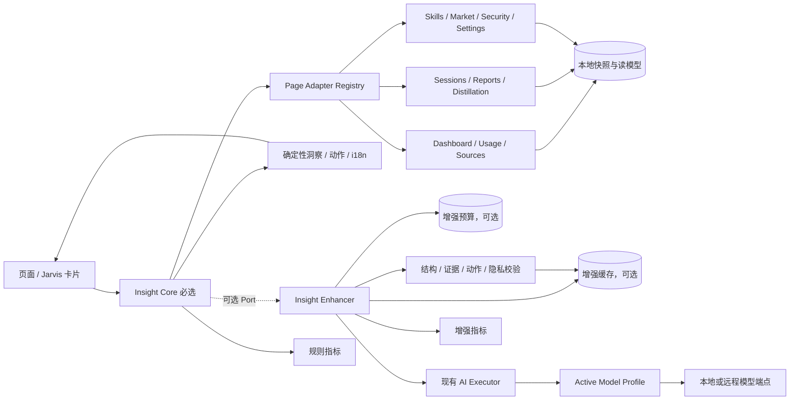
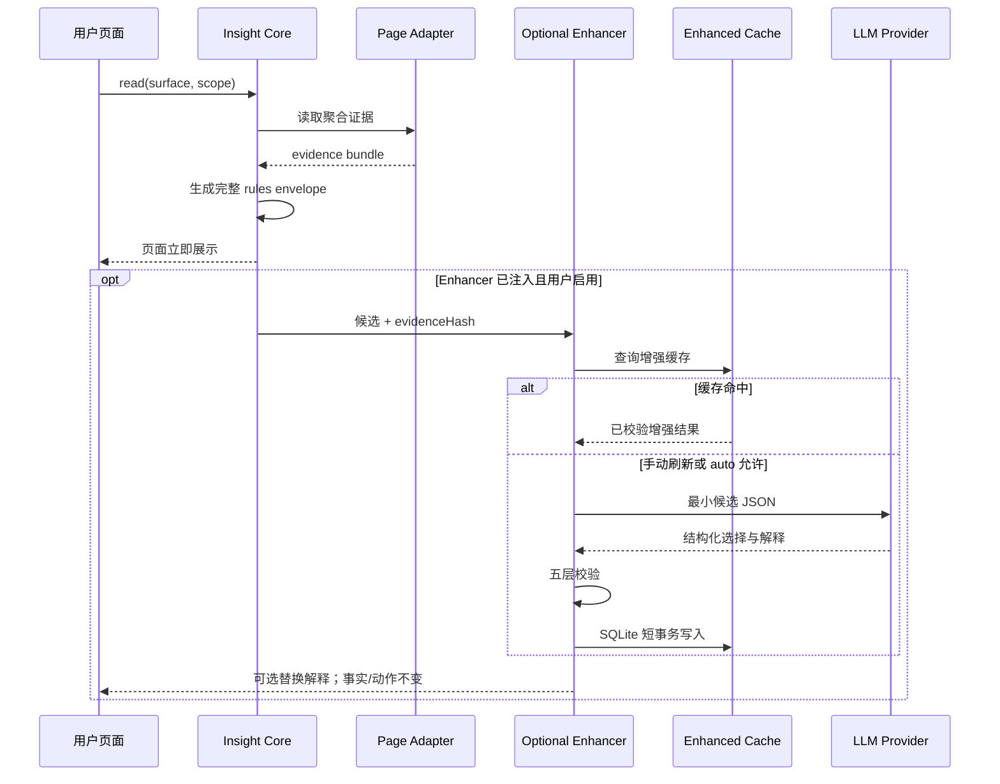

# TrustTools 全页面“今日洞察”双模式架构设计与实施方案

| 属性 | 值 |
|------|-----|
| 文档类型 | 架构设计文档 (ARCH) |
| 项目名称 | TrustTools-今日洞察双模式 |
| 版本 | v1.2 |
| 创建日期 | 2026-08-19 10:12:46 |
| 更新日期 | 2026-08-19 11:53:04 |
| 生成工具 | agile-feature-dev + architecture-design + product-manager |
| 文档状态 | 草稿 |

## 修订记录

| 版本 | 修改时间 | 修改内容 |
|------|---------|---------|
| v1.2 | 2026-08-19 11:53:04 | 将 Enhancer 的 Atomic JSON 缓存/预算方案更新为 Electron 43.4.1 内置 SQLite 3.53.1 的 WAL 存储方案，与本地数据库架构统一 |
| v1.1 | 2026-08-19 10:25:57 | 调整为双模式架构：无大模型为完整必选基线，大模型仅作为可选增强；重排实施、验收与发布路径 |
| v1.0 | 2026-08-19 10:12:46 | 基于 V3.0 需求文档和当前主仓实现，形成全页面今日洞察 LLM 接入架构、页面矩阵与实施计划 |

---

## 0. 结论摘要

推荐建设“**必选 Insight Core + 可选 Insight Enhancer**”双模式能力。全页面今日洞察的完整功能不依赖大模型：安装后即使用真实读模型、确定性规则和本地 i18n 文案产出事实、解释与行动建议。LLM 只是在用户主动配置并启用后，对同一批确定性候选进行排序、语气调整和补充解释。

两种运行模式：

1. **规则模式 `rules`（MUST，默认）**：各业务模块把真实读模型投影为 `InsightEvidenceBundle`，本地规则生成 1–3 条完整洞察。无需模型 Profile、API Key、网络、LLM 缓存或调用预算。
2. **增强模式 `enhanced-manual|enhanced-auto`（SHOULD，可选）**：在规则结果已经成立的基础上，通过可选 `InsightEnhancerPort` 调用 LLM。模型只能选择候选和生成受约束的解释，精确数字、实体、严重度与动作仍由本地代码渲染。

核心交付原则：

- 14 个 UI 路由必须先在 `rules` 模式下独立通过功能、性能、隐私和国际化验收。
- `InsightCore` 不依赖 `ai-orchestration`；只有组合根注入 `InsightEnhancerPort` 时才加载模型能力。
- 未配置模型不是错误或降级，而是产品的正常默认状态；UI 不应持续提示“能力缺失”。
- 增强器未安装、未启用、未授权、离线、超时、超预算或输出无效时，继续显示相同证据版本的规则洞察。
- 首页已有 `ai-insight.server.ts` 仅作为可选增强试验参考，不能成为今日洞察核心能力的依赖。

## 1. 输入验证与需求分析

### 1.1 输入完整性

| 检查项 | 状态 | 依据与影响 |
|---|---|---|
| 需求文档或功能描述 | ✅ 已提供 | V3.0 PRD、需求简报、数据采集规范均明确“今日洞察”的产品定位、页面和真实数据来源 |
| 技术选型与约束 | ✅ 已提供 | React 19、TanStack Start/Router、TypeScript、Electron、本地优先；模型 Profile 与 `ai-orchestration` 仅供可选增强复用 |
| 团队规模与组织 | ✅ 已提供 | 需求简报记录 2 人全职；适合模块化单体，不适合拆微服务 |
| 数据规模与并发 | ✅ 基本提供 | 单用户本地桌面应用，规则模式主要读取本地快照；只有增强模式存在模型频控问题 |
| 响应时间 | ⚠️ 部分提供 | 需求要求 2 秒内可感知；规则模式进入首屏路径，增强模式必须异步非阻塞 |
| 可用性与恢复 | ✅ 架构目标明确 | 无模型时必须完整可用；增强器任何故障不得改变规则模式结果和页面可用性 |
| 安全、隐私与合规 | ✅ 核心约束明确 | 本地优先、不上传原始内容、API Key 不出服务端、输出需脱敏；远程 LLM 的聚合数据发送仍需显式授权 |
| 成本预算 | ❌ 未提供 | 不阻塞规则模式发布；仅阻塞增强模式的自动生成默认开启 |
| 模型供应商 | ⚠️ 部分提供 | 属于可选外部依赖；已支持的 Profile 可复用，但核心模块不得静态依赖 Provider |

关键输入足以继续架构设计。规则模式不存在模型供应商、授权和 Token 成本依赖，可以独立发布；成本上限和远程聚合数据授权只影响增强模式。

### 1.2 业务目标

- 在不配置大模型的情况下，把当前“报表数字复述”升级为页面相关、能解释原因并给出下一步的贾维斯式体验。
- 所有用户可见业务页面都有一致的今日洞察入口，同时保留安全页和桌面小组件的专属视觉形态。
- 洞察必须建立在真实读模型与可追踪证据上，不制造数字、不夸大安全结论、不把未知当作零。
- 大模型增强可选、可插拔、可关闭，不能成为任何页面洞察的验收前置条件。
- 启用增强时，模型调用成本、隐私边界、Prompt 版本和输出质量可审计。

### 1.3 范围

范围内：

- 产品定义的 13 个主页面，加深链会话详情 `/chats/:id`，共 14 个 UI 路由表面。
- 必选：页面级证据投影、确定性洞察、行动建议、国际化、空态、新鲜度和可观测性。
- 可选：LLM 排序/解释、增强缓存、预算、手动刷新、自动预热、安全校验和模型评测。
- 规则模式始终可用；增强模式复用用户 Profile，支持手动和自动两种触发方式。
- `JarvisInsight`、`SecurityBriefing`、`JarvisWidget` 三种展示形态接收统一 `InsightEnvelope`。

范围外：

- 未经单独授权把原始会话正文、记忆正文、Skill 源码或本地文件内容发送给远程模型。
- 让 LLM 直接执行扫描、安装、删除、修改设置、运行命令或跳转任意 URL。
- 建设独立微服务、云端用户画像库、跨设备洞察同步或模型训练平台。
- 用 LLM 替代安全扫描规则、Token/费用计算、风险等级判定或数据采集逻辑。
- 将模型配置、网络或 Provider 可用性作为今日洞察核心功能的发布门禁。
- 首版使用 Agent/工具调用工作流；本场景只需要一次结构化生成，Agent 会增加成本和副作用面。

### 1.4 成功标准

| 维度 | 验收标准 |
|---|---|
| 页面覆盖 | 14/14 个 UI 路由均接入统一洞察状态，非 UI 的 `/sitemap.xml` 明确排除 |
| 无模型完整性 | 在未创建任何模型 Profile、断网且增强器未注入的环境中，14/14 页面均有完整规则洞察或明确空态 |
| 事实正确性 | 规则模式数字/实体/动作 100% 来自真实读模型；增强模式不得改变这些事实 |
| 可用性 | 增强模式失败时结果与规则模式等价，不显示空白卡片，不阻塞用户操作 |
| 首屏性能 | 规则洞察可进入 loader/本地纯函数路径；任何模型调用均不得进入页面关键路径 |
| 隐私 | 规则模式零网络外发；增强模式 Provider 请求不含原始会话、记忆正文、路径、命令、凭据或浏览器自由文本 |
| 可审计 | 规则候选可追踪到证据；增强生成额外追踪 Prompt、Profile、耗时、Token 与成本状态 |
| 国际化 | zh-CN、en-US、ja-JP 的规则模式必须完整；增强输出语言错误时保留规则文案 |

## 2. 当前实现盘点与主要差距

### 2.1 已具备的基础

1. `src/components/JarvisInsight.tsx` 已提供统一 hero/inline 卡片、打字机、轮播、手动换一条和可选刷新动作。
2. `src/modules/ai-orchestration/` 已具备统一请求、超时、取消、预算字段、成本状态、离线 fallback、Provider Registry 和 Profile-backed Provider。
3. `src/modules/ai-orchestration/model-profile.server.ts` 已保证 API Key 只在服务端读取，并支持 OpenAI-compatible 与 Anthropic 协议。
4. `src/lib/page-insights/` 已建立结构化 `PageInsight` 与确定性 composer，但 `PAGE_INSIGHTS_IDS` 只登记 5 页，实际只有 `/sources` 和 `/tracker` 产出真实行。
5. 首页的 `src/modules/dashboard/ai-insight.server.ts` 已实现聚合白名单、输出 Zod 校验、20 秒超时、5 分钟内存缓存和在途去重，是有价值的试验基线。
6. `src/modules/insights/` 已有跨 usage/security/tasks/knowledge 的证据引用、严重度、新鲜度和不确定性模型。
7. Repository/Port、统一快照运行时、指标 sink、错误脱敏和模块边界验证已存在，可直接复用；现有原子 JSON 只作为渐进迁移输入，不再扩展为今日洞察目标存储。

### 2.2 当前问题

| 问题 | 现状 | 架构影响 |
|---|---|---|
| 实现分散 | 首页、Agent、蒸馏、报告、记忆、Skill、市场、会话、安全、小组件分别在组件内拼字符串 | 无统一证据、缓存、模型、预算、评测和状态契约 |
| 首页 LLM 未闭环 | `ai-insight.server.ts` 仅被旧 read model 读取缓存，当前首页路由使用 summary read model；UI 没有调用 `refreshDashboardAIInsight` | 代码存在但用户不可见，继续复制会形成第二套 AI 编排 |
| 首页 Provider 重复 | 首页自己拼 OpenAI/Anthropic HTTP 请求，绕过 composition root 的 Profile-backed Provider | 协议解析、用量、错误和安全策略会漂移 |
| 输出缺少事实绑定 | 首页 LLM 自由返回 headline/detail，Zod 只能验结构，不能阻止数字或结论幻觉 | 不适合扩展到安全、成本等高风险页面 |
| 缓存键不足 | 首页只有一个进程内缓存，不含页面、locale、数据修订、证据哈希、Prompt 版本和模型 Profile | 页面串数据、语言错配、陈旧结果和重启丢失风险 |
| 页面数据从浏览器拼接 | 多数页面在 React 组件内从当前数据拼字符串 | 服务端无法统一生成，也容易把浏览器自由文本带入 Provider |
| 特殊页面未覆盖 | `/settings`、`/chats/:id` 没有洞察；安全和小组件是独立播报组件 | “所有页面”无法用一套 UI 组件简单替换，需统一数据契约、保留专属展示 |
| 隐私语义冲突 | 产品宣称本地优先，但远程 Profile 会发送聚合数据 | 必须显式授权、展示发送类别，并默认不发送原始内容 |
| 模型被误当核心依赖 | 首页试验和旧方案容易让统一洞察服务围绕 Provider、缓存和预算设计 | 必须先交付不依赖 `ai-orchestration` 的 Insight Core，再通过 Port 增强 |

## 3. 架构驱动因素与设计原则

### 3.1 架构驱动因素

- **真实性优先**：洞察是对本地真实数据的解释，不是内容生成秀。
- **无模型完整性**：规则模式是正式产品能力，不使用“fallback/降级版”等次级措辞。
- **隐私优先**：原始上下文是产品核心资产，不能为了“更聪明”扩大默认外发范围。
- **非阻塞**：远程模型延迟与可用性不可控，不能进入页面 loader 的关键路径。
- **全页面但不万能服务**：统一编排和契约，每个业务模块仍拥有自己的数据语义与候选规则。
- **本地桌面现实**：单用户、小团队、共享发布节奏，模块化单体优于微服务和消息中间件。
- **安全页面特殊性**：模型不能降低规则引擎的严重度、宣称“绝对安全”或生成任意处置命令。
- **成本可控**：页面数达到 14，若每次路由切换都调用模型，会造成调用风暴。

### 3.2 设计原则

1. Insight Core 负责事实、排序基线、解释模板、严重度、动作和链接，独立构成完整功能。
2. 可选 LLM 只负责候选重排、补充解释和语气，不得改变事实或动作权限。
3. `InsightCore` 只依赖读模型与规则；`InsightEnhancerPort` 由组合根可选注入，禁止反向依赖。
4. 规则 GET/loader 永远只读；只有增强模式的显式 POST 或本地调度任务允许调用 Provider。
5. Provider 输入只能由服务端页面适配器生成，浏览器不能提交证据对象或 Prompt。
6. 所有模型结果均不可信；校验失败直接保留规则结果。增强缓存以证据内容寻址。
7. 不因统一而把业务读模型搬进 `insights`。页面证据适配器归对应业务模块所有，组合根负责注册。

## 4. 推荐系统形态

### 4.1 形态选择

采用“**模块化单体 + 页面适配器注册表 + 确定性 Insight Core + 可选异步 Enhancer**”。

| 备选 | 结论 | 理由与代价 |
|---|---|---|
| 浏览器直接调用 LLM | 不采用 | API Key、Prompt、Provider 响应和隐私输入暴露在 renderer；无法集中预算与审计 |
| 页面各自实现 LLM | 不采用 | 重复首页试验的问题，协议、缓存、安全和评测会持续漂移 |
| 每日一次生成全局大摘要，再分发所有页面 | 不作为主路径 | 成本低但上下文过宽、页面相关性差、数据最小化不足；只允许小组件复用全局摘要 |
| 每页同步生成 | 不采用 | 14 页路由切换会阻塞体验并放大失败率 |
| 只有规则模式 | 可独立发布 | 零模型依赖、稳定可测；代价是语言个性化和跨指标解释较固定 |
| 规则核心 + 可选页面级增强 | 采用 | 默认完整、按需增强；代价是需要维护 Port、增强缓存和双模式测试 |
| 独立洞察微服务 | 不采用 | 单用户桌面、小团队、同一发布节奏，不足以抵消部署与分布式复杂度 |

### 4.2 目标组件视图



依赖方向：业务模块实现证据适配器并依赖 `insights` 的小型契约；`InsightCore` 不依赖 `ai-orchestration`；可选 `InsightEnhancer` 依赖 `AIExecutorPort`。`src/app/insight-registry.server.ts` 注册页面适配器，composition root 决定是否注入增强器。未注入时不创建模型相关存储、不读取 Profile、不显示模型错误。

## 5. 核心边界与契约

### 5.1 页面与证据契约

建议在 `src/modules/insights/page/contracts.ts` 增加以下框架无关契约：

```ts
export type InsightSurfaceId =
  | "dashboard" | "agents" | "distill" | "reports" | "memory"
  | "security" | "tracker" | "skills" | "market" | "chats"
  | "chat-detail" | "widget" | "settings" | "sources";

export interface InsightScope {
  readonly range?: "today" | "7d" | "30d" | "all";
  readonly entityId?: string; // 必须由对应 adapter 再校验
}

export interface InsightEvidence {
  readonly id: string;
  readonly kind: "metric" | "status" | "trend" | "availability";
  readonly value: string | number | boolean | null;
  readonly unit?: "count" | "tokens" | "percent" | "usd" | "status";
  readonly observedAt: string;
  readonly freshness: "fresh" | "stale" | "unknown";
  readonly sensitivity: "public" | "aggregate";
}

export interface InsightCandidate {
  readonly id: string;
  readonly severity: "info" | "attention" | "risk";
  readonly factKey: `insights.${string}`;
  readonly factParams: Readonly<Record<string, string | number>>;
  readonly evidenceRefs: readonly string[];
  readonly allowedActionIds: readonly InsightActionId[];
  readonly mandatory?: boolean;
}

export interface PageInsightAdapter {
  readonly surfaceId: InsightSurfaceId;
  readonly adapterVersion: number;
  loadEvidence(scope: InsightScope): Promise<InsightEvidenceBundle>;
  composeCandidates(bundle: InsightEvidenceBundle): readonly InsightCandidate[];
}
```

`InsightEvidence.value` 仅允许标量与枚举状态，不允许对象树、正文、路径和命令。需要实体时使用 adapter 生成的本地别名或公共工具显示名；项目名、会话标题、Skill 自定义名称默认改为“项目 A”“会话 A”“Skill A”，不进入远程 Provider。

### 5.2 必选 Core 与可选 Enhancer 契约

核心应用通过可选 Port 隔离模型能力：

```ts
export interface InsightEnhancerPort {
  enhance(input: InsightEnhancementInput): Promise<InsightEnhancementResult>;
}

export function createPageInsightsApplication(options: {
  readonly adapters: PageInsightAdapterRegistry;
  readonly enhancer?: InsightEnhancerPort; // 缺省即完整 rules 模式
}): PageInsightsApplication;
```

`PageInsightsApplication.read()` 无论有无 enhancer 都生成完整规则结果。只有 enhancer 存在、用户选择增强模式且授权/预算满足时，`enhance()` 才会被调用。核心包不得 import `ai-orchestration`、模型 Profile、Provider SDK 或增强缓存实现。

可选 Provider 输入不是完整读模型，而是候选的最小投影：

```ts
interface InsightEnhancementInput {
  readonly surface: InsightSurfaceId;
  readonly locale: Locale;
  readonly candidates: readonly {
    readonly id: string;
    readonly severity: "info" | "attention" | "risk";
    readonly fact: string;          // 已脱敏、只含允许的事实
    readonly actionIds: readonly InsightActionId[];
    readonly mandatory: boolean;
  }[];
}

interface InsightEnhancementOutput {
  readonly lines: readonly {
    readonly candidateId: string;
    readonly analysis: string;      // 禁止数字、URL、路径、命令、实体名
    readonly actionId?: InsightActionId;
  }[];
}
```

规则模式最终展示行由本地 `事实句 + 规则解释句 + 本地动作句` 拼装。增强模式仅把“规则解释句”替换成通过校验的模型分析，事实和动作保持不变。动作注册表只包含应用内安全导航或无副作用 UI 操作，例如 `open_security`、`open_distill`、`open_model_settings`；LLM 不能返回路径、URL、命令或任意按钮文案。

### 5.3 浏览器安全响应

```ts
interface InsightEnvelope {
  readonly surfaceId: InsightSurfaceId;
  readonly status:
    | "rules" | "enhanced-cached" | "enhanced-ready"
    | "enhancer-unavailable" | "budget-exceeded" | "timeout"
    | "enhancer-failed" | "invalid-output" | "stale";
  readonly lines: readonly {
    readonly id: string;
    readonly text: string;
    readonly severity: "info" | "attention" | "risk";
    readonly action?: { readonly id: InsightActionId; readonly label: string };
  }[];
  readonly generatedAt: string;
  readonly source: "rules" | "enhanced";
  readonly canEnhance: boolean;
  readonly modelLabel?: string; // 展示名，不含 endpoint/key
}
```

`status` 描述增强状态，不决定 `lines` 是否可用；任何状态都必须带规则生成的有效行。响应不返回 Prompt、Provider 请求、证据值、缓存键、成本明细、API Key、endpoint 或原始错误。

## 6. 全页面接入矩阵

产品主页面为 13 个；把会话详情深链作为独立 UI 表面后，共 14 个。`/sitemap.xml` 是机器接口，不接洞察。

| 路由 / 表面 ID | 服务端证据来源 | `rules` 必选结果 | 可选 LLM 增强 | 特殊约束 |
|---|---|---|---|---|
| `/` / `dashboard` | Dashboard summary/V2、monitoring、security、output availability | 规则选出安全、成本、效率、数据质量中最高优先级 1–3 条 | 调整全局播报语气和解释 | 首页旧 LLM 试验只迁入 Enhancer；Core 不固定 30d |
| `/agents` / `agents` | Agent usage overview、选中 toolId、范围 | 按阈值解释活动、缓存、会话和模型适配 | 个性化选中 Agent 的解释语气 | toolId 注册表校验；升级/降级建议来自本地兼容矩阵 |
| `/distill` / `distill` | 会话元数据、候选计数、审批、配额、模型可用性 | 规则提示选择、待审批、历史和配置缺口 | 重排下一步建议 | 不发送 transcript/产物正文；模型不是蒸馏页面洞察的依赖 |
| `/reports` / `reports` | 报告 feed 元数据、周期密度、运行状态 | 规则提示本周期报告、运行、会话与生成条件 | 补充复核/生成解释 | 不发送报告正文和 quick notes；无报告生成模型也能显示洞察 |
| `/memory` / `memory` | 记忆类型/来源/新鲜度计数 | 规则解释资产数量、结构、陈旧和蒸馏入口 | 调整整理建议语气 | 不发送标题、摘要、正文、项目名 |
| `/security` / `security` | 最新扫描 totals、风险维度、扫描完整性、运行时能力 | 规则强制高危优先、说明扫描边界和下一步 | 仅解释风险优先级 | mandatory 高危项不可隐藏/降级；无 LLM 完整可用 |
| `/tracker` / `tracker` | Tracker read model、浪费/缓存/消耗聚合 | 规则计算并排序浪费、缓存和消耗异常 | 解释最值得行动的重点 | 费用未知必须明示；模型不能估算优化幅度 |
| `/skills` / `skills` | Skill snapshot、安装覆盖、最近扫描摘要、使用概览 | 规则给出扫描、清理、分发或蒸馏建议 | 调整候选优先级 | 不发送 Skill 名称/路径/正文 |
| `/market` / `market` | 市场缓存统计、官方/已安装/兼容/数据新鲜度 | 规则提示发现、兼容性和安装前扫描 | 优化发现型文案 | 不把远端描述当可信指令 |
| `/chats` / `chats` | 服务端总量、来源数、轮次、可恢复数、时间分布 | 规则提示恢复、归档和蒸馏机会 | 解释会话堆积重点 | 不发送标题、项目、sessionId、正文 |
| `/chats/:id` / `chat-detail` | 当前会话脱敏元数据、轮次数、Token、可恢复/可蒸馏状态 | 规则给出恢复、归档或蒸馏建议 | 调整当前建议语气 | 首版严禁正文；未来正文分析另立 ADR |
| `/widget` / `widget` | 全局今日摘要、安全/用量聚合、偏好 | 规则产生适合小屏的一句播报 | 复用 dashboard 增强结果 | rules 模式无需模型；增强模式不额外调用 |
| `/settings` / `settings` | Profile 是否存在、任务计划、采集/扫描配置完整性 | 规则解释哪项配置影响功能；模型 Profile 缺失只是普通配置提示 | 增强配置说明 | 绝不发送 API Key、endpoint、路径或设置值 |
| `/sources` / `sources` | Sources summary、覆盖率、无日志、格式错误、事件计数 | 规则对采集覆盖和异常给出排障优先级 | 调整排障解释 | 路径仅本地展示；重新扫描由本地动作控制 |

## 7. 运行时流程、缓存与刷新

### 7.1 页面打开



### 7.2 缓存键与生命周期

以下缓存仅属于可选 Enhancer；`rules` 模式无此依赖。缓存键：

```text
surfaceId + canonicalScopeHash + localDateKey + locale
+ evidenceHash + adapterVersion + promptVersion + outputSchemaVersion
+ activeModelProfileIdHash
```

规则：

- `evidenceHash` 对 canonical JSON 做 SHA-256；不把原始证据放进键或日志。
- 新数据快照、选择范围、页面实体、语言、Prompt、适配器、Schema 或模型变化都会失效。
- 有效期暂定为 24 小时，但证据变化优先于 TTL；过期结果只可短暂标记 stale，不可伪装成今天。
- 单进程内按完整键 singleflight，防止多个组件或快速路由切换重复调用。
- 小组件在规则模式复用 dashboard 候选，在增强模式复用 `dashboard/today` 增强结果，不独立生成。
- 缓存持久化到统一本地 SQLite 的 `insight_enhancement_cache` / `insight_enhancement_lines`，只保存校验后的候选引用、分析短句、动作 ID 和安全执行摘要，不保存 Provider 输入、Prompt 或原始响应。

### 7.3 触发策略

提供三种用户模式，任何模式都有今日洞察：

| 模式 | 行为 |
|---|---|
| `rules` | 默认且完整；只展示本地规则洞察，不读取模型配置、不发网络请求 |
| `enhanced-manual` | 规则洞察始终先展示；用户点“增强表达”才调用模型 |
| `enhanced-auto` | 规则洞察先展示；缓存缺失时后台增强，远程端点需完成聚合数据授权 |

事件预热只属于 `enhanced-auto` 的后续优化。规则模式直接基于最新快照计算，不需要后台生成、消息队列或模型调度。

## 8. 可选增强器：Prompt、模型与事实约束

### 8.1 Prompt 注册

- Prompt 作为版本化代码/内建 JSON 管理，不存入页面组件，不允许浏览器覆盖。
- 使用共享 system policy + 页面 policy；页面只声明语气、最多行数和候选优先级规则。
- Prompt 元数据至少包含 `id`、`version`、`surfaceId`、`maxLines`、`maxAnalysisChars`、允许语言和输出 Schema 版本。
- 启用 Enhancer 的构建对 Prompt registry 做校验：14 个 surface 全覆盖、ID 唯一、版本合法、没有动态模板插值入口；规则模式构建不以 Prompt 是否存在为运行门禁。

### 8.2 输出五层校验

1. **传输校验**：响应大小、超时、HTTP 状态、JSON-only。
2. **Schema 校验**：Zod strict，1–3 行，字段/枚举/长度受限。
3. **引用校验**：`candidateId` 必须来自本次请求；不可重复；mandatory 候选不可遗漏。
4. **动作与事实校验**：`actionId` 必须同时存在于候选允许集合和本地动作注册表；模型分析不得包含数字、URL、路径、命令、代码块和未知实体。
5. **安全校验**：敏感模式、凭据、绝对路径、shell/包管理命令、提示注入语句、过度安全承诺和禁止词扫描。

任何一层失败都不做“尽量展示”，而是记录脱敏错误码并继续使用已经展示的规则结果。

### 8.3 模型路由与规则保持

- 只有 `InsightEnhancer` 复用 composition root 的 `aiExecutor` 和 Profile-backed Provider；`InsightCore` 不 import 它们。
- 用户可为增强功能显式选 Profile；未选择或没有 Profile 时保持 `rules`，不显示错误态。
- Profile 测试失败、离线、超时、预算不足、供应商错误和输出无效时保持规则结果。
- 首版不自动跨 Profile/跨供应商重试；允许同一 Provider 进行最多一次、带抖动的短重试仅作为后续可选优化。
- 暂定单次最大输入 1,500 tokens、输出 220 tokens、超时 15 秒；这三项是工程初值，需用真实模型基准复核。

## 9. 数据、安全与隐私设计

### 9.1 数据分级

| 级别 | 示例 | 是否可发送远程模型 |
|---|---|---|
| S0 公共 | 页面 ID、语言、公共工具显示名、固定动作 ID | 可 |
| S1 聚合 | Token/事件/计数/百分比、健康状态、风险计数、时间范围 | 用户授权后可 |
| S2 本地标识 | 项目名、会话标题、Skill 自定义名、sessionId、文件名 | 默认不可；用本地别名替代 |
| S3 私密内容 | 会话正文、Prompt、记忆/报告正文、Skill 源码、命令、绝对路径 | 本方案禁止 |
| S4 凭据 | API Key、Authorization、Cookie、密码、endpoint 中的凭据 | 永远禁止 |

### 9.2 外发前防护

- adapter 只输出 S0/S1；通用 `assertInsightEvidenceSafe()` 在运行时和测试中双重校验。
- 项目、会话、Skill 等实体使用本地稳定别名；公共 Agent/工具名称可保留。
- JSON 序列化后再执行最终敏感内容扫描和 16 KiB 大小上限。
- 把所有字符串字段视为不可信数据，禁止其改变 Prompt 指令；候选事实由本地 i18n 模板生成。
- Provider 请求与响应仅在内存中存在；日志只记录哈希、长度、状态和执行摘要。
- `rules` 模式不经过外发防护链，因为它根本不建立 Provider 请求。用户首次启用远程 `enhanced-manual` 或 `enhanced-auto` 时，UI 明确展示“会发送哪些聚合项、绝不会发送哪些内容”，记录 `consentVersion`。

### 9.3 动作安全

所有动作先由规则模式生成。可选 LLM 只能从候选已有的 `actionId` 中选择，不能新增或执行动作。UI 通过本地注册表把动作映射为站内路由或打开既有确认框；安装、删除、覆盖、扫描、生成报告等有副作用操作仍由用户在目标页面确认。安全页的高危结论来自扫描器，LLM 只解释，不参与 verdict。

## 10. API、存储与一致性

### 10.1 Server Functions

```ts
getPageInsight({ surfaceId, locale, scope })        // GET，返回完整 rules 结果
enhancePageInsight({ surfaceId, locale, scope,
  reason: "manual" | "auto" })                    // POST，仅可选 Enhancer 提供
setInsightPreferences({ mode, profileId?,
  consentVersion })                                 // POST，设置模块所有
```

校验要求：

- `surfaceId`、locale、range 为枚举；`entityId` 有长度/字符限制，并由 adapter 对工具/会话白名单二次校验。
- 不接受 `prompt`、`evidence`、`fallbackLines`、`modelEndpoint`、`apiKey` 或任意 URL。
- `getPageInsight` 不检查模型 Profile，也不访问网络。增强 POST 先加载服务端证据并重算哈希；客户端看到的旧结果不能作为生成输入。

### 10.2 本地存储

今日洞察复用统一本地 SQLite，不再新增 `insights-cache.v1.json` 或 `insights-budget.v1.json`。目标表为：

- `insight_preferences`：全局/页面模式、Profile、授权版本和每日调用上限；未写行时默认 `rules`。
- `insight_enhancement_cache`、`insight_enhancement_lines`：仅保存校验后的生成解释与完整失效元数据，属于可删除重建的 L0 数据。
- `ai_executions`、`ai_daily_usage`：保存稳定执行摘要、预算预占和 Token/成本聚合；不保存 Prompt、Provider 原始响应或页面原始证据。

规则模式只读取业务 Repository 并在内存生成 Insight Core 结果；除可选的 `mode=rules` 偏好外，不产生模型 Profile、增强缓存或 AI 用量行。增强模式经 `SqliteInsightRepository` 使用统一 Database Host；预算损坏或数据库不可写时 Enhancer fail-closed，规则洞察不受影响。旧 Atomic JSON 仅作为尚未发布版本的迁移兼容输入，不再是目标事实源。

### 10.3 一致性

- 证据读取以相应模块已发布的快照为准，接受最终一致性。
- 规则结果直接基于当前证据生成，无生成竞态。增强完成前再次比较 `evidenceHash`；若已变化，结果不写缓存，返回 `stale` 并保留新的规则结果。
- 缓存写入以完整键 upsert；同键进程内 singleflight，跨进程由唯一缓存键和 Database Host 串行化。预算预占与 pending execution 在一个 `BEGIN IMMEDIATE` 短事务内提交，Provider 网络调用绝不位于数据库事务内。
- 设置/模型 Profile 变化后无需批量删除，键中的 Profile hash 会自然旁路旧结果；后台清理超过 7 天的孤儿项。

## 11. 部署、性能、成本与可观测性

### 11.1 部署视图

Insight Core 部署在 TrustTools 桌面/本地 TanStack runtime 中，只读取本地快照。增强包同样位于本地 runtime，但只有组合根注入且用户启用时才读取密钥并访问模型端点。规则版和增强版都无需新增端口、数据库、云服务或常驻微服务。

### 11.2 暂定性能与预算目标

这些是缺少业务定额时的工程初值，发布前需按真实样本调整：

| 指标 | 暂定目标 |
|---|---|
| 页面业务首屏 | `rules` 模式直接可用；不因增强功能增加 loader 关键路径时延 |
| 规则洞察 | P95 < 50 ms，不含业务读模型本身；零网络请求 |
| 增强缓存读取 | P95 < 100 ms（快照已就绪、本地缓存） |
| 可选 LLM 增强 | P95 < 10 s，15 s 硬超时；超时保持规则结果 |
| Provider payload | 每次序列化后 ≤ 16 KiB，目标 ≤ 1,500 input tokens |
| 输出 | 页面 1–3 行，小组件 1 行，目标 ≤ 220 output tokens |
| 自动刷新 | 同一完整键最多一次；同 surface 手动刷新冷却暂定 60 秒 |
| 日调用上限 | 暂定 30 次/本地日，超限回退；正式值待产品/成本确认 |
| 缓存保留 | 新鲜结果 24 小时或证据变化即失效；孤儿项 7 天清理 |

### 11.3 指标与日志

建议新增：

- Core：`insight_rules_total{surface,status}`、`insight_rules_duration_ms{surface}`、`insight_evidence_freshness{surface}`。
- Enhancer：`insight_enhance_total{surface,reason,status}`、`insight_enhance_duration_ms{surface,provider,prompt_version}`、`insight_cache_total{surface,result}`、`insight_validation_reject_total{surface,stage}`、Token/成本和 payload bytes。

规则日志只含 surface、scopeHash、evidenceHash 前缀、状态和耗时。增强日志可额外包含 Prompt 版本、Profile ID 哈希、token/cost 状态和错误码。两者都禁止记录候选事实、模型分析、Provider 原始响应和用户内容。

告警/本地诊断条件：连续 5 次 Provider 失败、invalid-output 比例超过 5%、单日预算达到 80%、自动生成持续超时、缓存文件损坏、隐私校验拒绝。桌面版可先进入本地诊断面板，不要求远程遥测。

## 12. 双模式运行与增强失败矩阵

| 场景 | 用户表现 | 系统行为 |
|---|---|---|
| 规则模式（默认） | 正常展示完整今日洞察，不显示“缺少 AI”提示 | 不读取 Profile、不创建增强存储、不发网络请求 |
| 用户请求增强但无 Profile | 继续显示规则洞察；仅在用户操作处提示可配置模型 | `enhancer-unavailable`，不改变核心状态 |
| Provider 离线/失败 | 保留当前规则卡片，不闪空 | `enhancer-failed`；不跨供应商 |
| 超时/取消 | 保留规则或旧增强缓存 | 中止增强请求，记录 timeout/cancelled |
| 超预算/频控 | 保留规则洞察；增强入口显示额度提示 | 不调用 Provider，增强预算 fail-closed |
| 输出 Schema 错误 | 用户只看到规则结果 | 丢弃整份输出，不部分展示 |
| 输出引用不存在/越权动作 | 用户只看到规则结果 | validation reject；不得“猜测修复” |
| 证据在生成期间变化 | 展示新规则结果 | 丢弃旧生成，状态 stale |
| 快照过期或不完整 | 洞察明确标注数据不完整 | mandatory data-quality 候选优先，禁止确定性强结论 |
| 缓存/数据库不可写 | 规则洞察仍可用 | Enhancer fail-closed；隔离损坏数据库、恢复备份后重建 L0 缓存 |
| 安全页有高危项 | 高危事实始终第一条 | mandatory + severity floor；模型不可隐藏或降级 |

## 13. 实施方案

### 13.1 目标代码结构

```text
src/modules/insights/
├── contracts.ts                         # 保留通用 InsightSnapshot
├── page/
│   ├── contracts.ts                     # Surface/Evidence/Candidate/Envelope/EnhancerPort
│   ├── domain.ts                        # 必选规则、排序、事实/动作拼装
│   ├── application.ts                   # 必选 read；enhancer 可选注入
│   ├── action-registry.ts               # 必选受限站内动作
│   └── rule-registry.ts                 # 14 页面规则与版本
├── enhancer/                            # 整个目录为可选能力
│   ├── application.ts                   # enhance/singleflight/budget
│   ├── prompt-registry.ts
│   ├── validation.ts
│   ├── llm-page-insight-generator.ts    # 只依赖 AIExecutorPort
│   ├── sqlite-insight-cache.server.ts   # 依赖 Insight Repository Port
│   └── sqlite-insight-budget.server.ts  # 预算预占 + execution 同事务
└── presentation/
    └── use-page-insight.ts              # 始终返回 rules，可选触发增强

src/app/
└── insight-registry.server.ts            # 组合根注册 14 个 adapter

src/modules/<feature>/
└── insight-evidence.server.ts            # 各模块拥有自己的证据语义

src/lib/page-insights/                     # 迁移期兼容 facade
```

### 13.2 分阶段计划（两次可独立发布）

#### M0：冻结基线与决策（2 人日）

- 固化 14 页面当前洞察文案、空态、真实数据来源和截图/E2E 基线。
- 新增 ADR：规则洞察是核心交付，LLM 仅通过可选 Port 增强；远程聚合数据需授权。
- 建立页面 coverage 测试，防止新增路由未登记洞察策略。
- 固定默认模式为 `rules`；增强预算和外发策略不阻塞核心开发。

质量门：现有测试全绿；基线不含 mock 数字和敏感数据；无模型环境可运行。

#### M1：Insight Core 与三页规则试点（6 人日）

- 在 `modules/insights/page` 建立 Surface、Evidence、Candidate、Envelope、Adapter、Action 契约。
- 实现规则排序、事实/解释/动作拼装、evidence freshness 和纯本地状态机。
- 迁移 `/`、`/sources`、`/tracker` 到 Core，保持现有确定性行为 parity。
- 实现 GET/loader 安全查询；本阶段不创建 Prompt、Provider、cache 或 budget。
- 扩展 `JarvisInsight` 的可选状态/来源/动作展示，但保持现有调用兼容。

质量门：删除全部模型 Profile、断网运行时三页完整通过；Core 依赖图中不出现 `ai-orchestration`。

#### M2：14 页面规则模式完整交付（9–10 人日）

- 迁移 `/agents`、`/distill`、`/reports`、`/memory`、`/skills`、`/market`、`/chats`。
- 补齐 `/security`、`/widget`、`/settings`、`/chats/:id` 的 Core adapter，同时保留专属视觉。
- 将浏览器内业务洞察计算下沉为纯规则或服务端 adapter；建立 14 页面 coverage gate。
- 完成 zh/en/ja 规则文案、empty/healthy/actionable/stale/partial fixture。

质量门（Release A）：14/14 页面在无模型、无 API Key、断网环境完整通过；安全 mandatory、国际化、首屏性能与隐私测试通过。到此即可发布，本功能不依赖后续里程碑。

#### M3：可选 Enhancer Port 与三页试点（5 人日，独立立项）

- 定义并注入 `InsightEnhancerPort`；复用 composition `aiExecutor`，替换首页自建 Provider。
- 实现 Prompt registry、五层校验、cache/budget、singleflight、严格 POST validator。
- 在 `/`、`/sources`、`/tracker` 试点 `enhanced-manual`；规则结果始终先显示。
- 加入 zh/en/ja、Profile 切换、证据哈希、隐私 payload 和无效输出测试。

质量门：关闭 Enhancer 后 Release A 全部测试输出一致；试点成功/失败均不改变事实、动作和页面可用性。

#### M4：增强模式扩展与偏好（5 人日）

- 向其余页面开放 `enhanced-manual`；安全页实现 mandatory/severity floor。
- 小组件只复用 dashboard 增强缓存，不额外调用。
- 设置增加 `rules|enhanced-manual|enhanced-auto`、授权版本、Profile 和增强预算；默认 `rules`。
- `enhanced-auto` 作为 opt-in，只有远程端点需要发送聚合数据授权。

质量门：所有增强入口可独立关闭；未配置 Profile 不产生全局错误提示；安全页高危项不可被模型隐藏。

#### M5：增强评测、灰度与收尾（5 人日）

- 建立 14 页 × 5 状态的最小回归集，使用 fake provider 做稳定 CI，真实模型只跑手动基准。
- Core 和 Enhancer 指标分开；接入增强脱敏日志、预算/频控和缓存清理。
- 跑 TypeScript、lint、模块边界、browser/server boundary、i18n、单测、E2E、桌面构建。
- 先 `enhanced-manual` 内测，再开放 `enhanced-auto` opt-in；`rules` 始终为稳定默认。
- 删除死代码、重复 Prompt/Provider、未使用的 5 页枚举和首页孤立 DTO。

质量门（Release B）：增强质量标准通过；关闭增强开关可立即回到 Release A；架构审计和测试设计完成。

### 13.3 工作拆分建议

| 角色 | 主责 | 交叉评审 |
|---|---|---|
| 开发 A（平台/服务端） | Core 契约、规则引擎、server functions；Release B 再负责 Enhancer/cache/budget | 页面 adapter 的数据最小化和性能 |
| 开发 B（业务/UI/质量） | 页面 adapter、三种展示组件、i18n、规则模式 E2E；Release B 再补模型评测 | Prompt/输出校验和动作安全 |

M1 完成前不要并行铺 14 页。M2 完成即形成不依赖模型的 Release A；M3–M5 必须作为可取消、可延期且不反向修改 Core 验收标准的增强迭代。

## 14. 测试、评测与发布

### 14.1 测试分层

1. **Core 领域单测（Release A 必选）**：候选排序、mandatory、severity、动作白名单、事实拼装、哈希稳定性和新鲜度。
2. **Adapter 契约测试（Release A 必选）**：14 个 adapter 均只能输出允许标量；fixture 覆盖 empty/healthy/risk/stale/partial。
3. **无模型 E2E（Release A 阻断）**：删除模型 Profile、禁用 Enhancer、清空增强存储并断网，验证 14 路由仍有完整洞察或明确空态，且规则读取不访问网络。
4. **增强隐私测试（Release B 阻断）**：输入含 `/Users/...`、`C:\\...`、sessionId、项目名、Prompt injection、API Key、Bearer、命令时，断言外发 payload 不包含这些值或请求被拒绝。
5. **Provider 集成测试（Release B 阻断）**：fake OpenAI/Anthropic/Profile-backed provider 覆盖 completed、offline、timeout、budget、invalid JSON、越权动作和敏感输出。
6. **增强页面 E2E（Release B 阻断）**：规则结果先显示；手动增强可更新解释；增强失败保留规则结果；语言/Profile 切换不串缓存。
7. **桌面回归**：Electron server boundary、API Key 不进 renderer、离线启动、增强缓存损坏恢复、Windows/macOS 路径样本。

### 14.2 可选 LLM 增强质量评测

评测不以“像人”为唯一标准，按以下硬指标评分：

| 指标 | 门槛 |
|---|---|
| 候选引用合法率 | 100%（运行时强校验） |
| mandatory 保留率 | 100% |
| 未授权数字/实体/动作 | 0 |
| 语言正确率 | ≥ 99%，失败即保留规则文案 |
| 空态诚实性 | 100%，不得把无数据描述为健康 |
| 安全严重度保持 | 100% |
| 可行动性 | 每组最多一个动作，且必须来自候选白名单 |
| 简洁性 | 普通页面 1–3 行，小组件 1 行；超长拒绝 |

建议每个 surface 至少 5 个 fixture，共 70 组；每次 Prompt 或 Schema 版本变化必须全量回归。真实模型结果可做非阻塞 nightly/manual eval，CI 使用 fake provider 保持确定性。

### 14.3 分轨发布、灰度与回滚

发布分为两条不互相阻塞的轨道：Core 构建开关 `TRUSTTOOLS_PAGE_INSIGHTS_V2` 控制统一规则洞察，Enhancer kill switch `TRUSTTOOLS_INSIGHT_ENHANCER` 只控制可选模型增强；用户偏好固定为 `rules|enhanced-manual|enhanced-auto`，默认 `rules`。

1. **Release A / Rules stable**：先完成 14 页 Core；无 Profile、无 Key、禁网和未注入 Enhancer 的环境为正式发布门禁。
2. **Enhancer shadow**：只在内部构建脱敏增强 payload，不调用 Provider、不改变 UI，用于验证外发边界和性能。
3. **Enhanced manual pilot**：内部用户在 `/`、`/sources`、`/tracker` 主动点击增强，任何失败都保留规则结果。
4. **Enhanced manual beta**：14 页开放手动增强；Release A 的质量指标继续独立监控。
5. **Enhanced auto opt-in**：只对已配置模型、完成远程数据授权且主动选择的用户开放；不得改变默认 `rules`。

Core 出现问题时关闭 `TRUSTTOOLS_PAGE_INSIGHTS_V2`，回到迁移前确定性页面文案；Enhancer 出现问题时只关闭 `TRUSTTOOLS_INSIGHT_ENHANCER`，14 页继续运行 Release A。增强缓存为可丢弃数据，无需回滚业务数据或重写 Git 历史。旧接口在一个稳定版本内保留兼容 facade，下一版本再删除。

## 15. 关键权衡与决策记录

| 决策 | 采用 | 放弃/代价 | 复审触发条件 |
|---|---|---|---|
| 模型是否为必选依赖 | 否；Core 独立发布，Enhancer 可选注入 | 需要维护清晰 Port 和双发布门 | 只有产品明确取消无模型支持时才复审 |
| 事实与语言分离 | 本地事实 + LLM 解释 | LLM 文案自由度略低 | 事实一致性评测连续稳定且产品需要更强叙事时 |
| 页面级调用 | 每页最小证据、按需缓存 | adapter 数量增加 | 每日调用成本超预算或页面洞察高度重复 |
| 非阻塞生成 | loader 只读、POST 刷新 | 首次打开先看到规则结果 | 本地模型 P95 足够低且可用性可控时 |
| 模块化单体 | 复用本地 runtime/store/composition | 无独立扩缩容 | 出现云端多租户或独立团队/发布节奏时 |
| 不自动跨 Provider | 增强失败保留规则结果 | 少一次模型增强成功机会 | 用户可显式配置并授权 Provider 切换链时 |
| 持久化本地缓存 | 重启可复用、成本稳定 | 需 schema/清理/损坏恢复 | 输出被定义为不可落盘或引入多设备同步时 |
| 项目等实体用别名 | 降低隐私和注入风险 | 文案不显示精确项目名 | 用户明确 opt-in 且完成独立安全评审时 |

## 16. 风险与待确认项

### 16.1 风险清单

| 风险 | 概率 | 影响 | 缓解 |
|---|---|---|---|
| 远程聚合数据与“本地优先”认知冲突 | 高 | 高 | 默认 `rules`、增强显式启用、数据类别说明、本地别名、独立 kill switch |
| LLM 生成错误数字或安全结论 | 中 | 高 | 数字本地渲染、mandatory/severity floor、严格引用与输出校验 |
| 14 页调用风暴导致成本和限流 | 高 | 中 | 内容寻址缓存、singleflight、预算账本、冷却、widget 复用 dashboard |
| 页面 adapter 重复读取拖慢本地 I/O | 中 | 中 | 只读 O(1) 快照、禁止刷新路径直接扫描、度量 adapter 时延 |
| 首页试验与新架构双轨 | 高 | 中 | M2 完成迁移后只保留兼容 facade，删除自建 Provider |
| 多语言模型输出不稳定 | 中 | 中 | locale 入缓存键、Prompt 约束、长度/字符集检查，失败保留本地 i18n 规则文案 |
| 自定义实体包含提示注入 | 中 | 高 | 默认不外发实体；字符串视作数据；敏感/指令模式拒绝 |
| 模型 Profile 修改后旧结果误用 | 中 | 中 | Profile ID hash 进入缓存键，变更自然失效 |

### 16.2 待确认项与阻塞范围

以下事项只阻塞 Release B，不阻塞无模型的 Release A：

1. 每日调用、Token 或美元预算的产品上限；本文的 30 次/日仅为增强模式工程初值。
2. 公共工具显示名是否允许外发；项目、会话和自定义 Skill 名仍建议默认别名化。
3. “所有页面”是否要求 `/chats/:id` 的增强模式分析正文。本文按隐私约束只分析元数据；若要求正文，必须另立 ADR、授权和数据保留策略。
4. 增强结果是否允许本地持久化 24 小时；若不允许，应改为仅内存缓存，但增强成本和重启体验会变差。

已确定且不再作为待确认项：规则模式是固定默认；`enhanced-manual` 和 `enhanced-auto` 均需用户主动启用；远程 `enhanced-auto` 还需显式数据授权。可延后项包括自动预热、用户反馈按钮、跨 Profile 切换链、正文分析 opt-in 和跨设备增强缓存同步。

## 17. 供测试设计继续使用的输入

业务关键流程：

- 未配置模型 → 14 页规则洞察正常。
- 已配置模型 + `enhanced-manual` → 点击增强表达 → 校验后替换解释 → 重启读取本地增强缓存。
- `enhanced-auto` 已授权 → 页面先展示规则结果 → 后台生成 → 同证据不重复调用。
- 数据刷新导致 evidenceHash 变化 → 旧洞察失效 → 新规则结果立即出现。
- 安全高危 / 数据不完整 / 费用未知 → mandatory 事实始终存在且不得被弱化。
- 语言/Profile/范围/Agent 选择变化 → 缓存严格隔离。

高风险边界：Provider payload、API Key server boundary、实体别名、Prompt injection、预算并发、数据库锁/事务、缓存损坏、证据竞态、动作白名单和安全严重度。

必须覆盖的失败：无网络、DNS/HTTP 错误、429、5xx、超时、取消、空响应、Markdown 包裹 JSON、超长输出、未知 candidate、越权 action、敏感输出、错误语言、生成期间数据变化、预算文件损坏、Profile 删除/切换。

## 18. 附录：自检摘要

**检查时间**：2026-08-19 11:53:04
**检查范围**：全文

### 已修正项

- 将“所有页面”明确为 13 个产品主页面 + 1 个会话详情 UI 路由，排除机器路由。
- 识别首页已有但未接 UI 的 LLM 试验，方案改为迁移复用而非平行新建。
- 将自由生成改为“候选引用 + 无数字分析 + 本地事实/动作渲染”，补齐事实可验证性。
- 补充未配置、超时、超预算、无效输出、证据变化、缓存损坏与安全高危等失败路径。
- 将远程聚合数据授权、API Key 边界、Prompt injection、实体别名、缓存和预算纳入一等设计。
- 明确页面 loader 不调用模型，保证模型能力不会降低现有页面可用性和首屏性能。
- 将规则模式确认为完整默认能力，并把 Core 与可选 Enhancer 的依赖、接口、测试和发布门彻底分离。
- 为研发、运维和测试分别补充文件结构、指标、阶段任务、质量门和回滚路径。
- 将 Enhancer 的 Atomic JSON 缓存/预算替换为统一 SQLite Repository，消除今日洞察与本地数据库目标架构的事实源冲突。

### 遗留待确认项

- 增强模式的正式预算、公共工具名外发策略和增强缓存保留许可尚未由产品确认，不阻塞 Release A。
- 正式 LLM P95、Token 消耗和不同 Provider 的结构化输出稳定性需要用真实环境基准验证。
- `/chats/:id` 是否未来需要正文语义分析仍未确定；当前设计明确不读取正文。

### 使用的假设

- 团队为 2 人全职、共享同一桌面应用发布节奏（高置信，来自需求简报）。
- 产品继续坚持本地优先和不外发原始上下文（高置信，来自需求与现有 CLEAN_ROOM 约束）。
- 模型 Profile 和 `ai-orchestration` 是唯一 Provider/密钥入口（高置信，来自当前代码）。
- Release A（M0–M2）预计 17–18 人日；可选 Release B（M3–M5）另需 15 人日。若要求 2 周内发布，优先缩小 Release A 的页面批次，但 14 页无模型验收完成前不能宣称“所有页面”交付。
- 本文性能、超时、Token、调用次数和 TTL 数值均为待基准验证的工程初值，不是已确认业务 SLO。

自检结论：边界、数据、集成、部署、安全、可观测性、风险、实施和测试输入相互一致；没有要求新增微服务、上传原始内容或配置大模型。遗留项不阻塞 Release A，只影响可选增强能力的 Release B。
