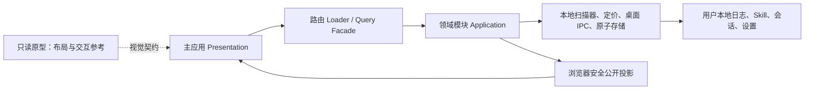

# TrustTools 原型对齐架构设计文档

| 属性     | 值                  |
| -------- | ------------------- |
| 文档类型 | 架构设计文档 (ARCH) |
| 项目名称 | TrustTools          |
| 版本     | v1.0                |
| 创建日期 | 2026-08-12 10:55:00 |
| 更新日期 | 2026-08-12 10:55:00 |
| 生成工具 | agile-feature-dev   |
| 文档状态 | 草稿                |

## 修订记录

| 版本 | 修改时间            | 修改内容                                         |
| ---- | ------------------- | ------------------------------------------------ |
| v1.0 | 2026-08-12 10:55:00 | 定义原型对齐的展示边界、会话路由接入和验证架构。 |

## 1. 系统架构

原型只提供视觉契约，不能被主应用导入。路由 loader 只请求模块公开查询接口；展示组件不得自行生成使用量、费用、安全结论或会话记录。

## 2. 模块划分

| 层         | 责任                                           | 本次变更                                                 |
| ---------- | ---------------------------------------------- | -------------------------------------------------------- |
| 路由层     | 文件路由、搜索参数验证、首屏加载               | 补齐会话列表/详情路由，保持原型路由表完整。              |
| 展示层     | 复用 V3 设计令牌、卡片、表格、状态和无障碍属性 | 对齐菜单、首页区间和各页视觉结构；不承载数据读取。       |
| 查询层     | 对展示层提供安全、可序列化 read model          | 增加会话查询/详情 facade，执行输入验证和错误归一化。     |
| 领域层     | 过滤、排序、分页、恢复可用性判断               | 复用 `sessions` 的 application service，不复制扫描规则。 |
| 基础设施层 | 本地会话与日志扫描、恢复命令执行、原子存储     | 继续使用 server-only adapter，永不向前端泄露路径或命令。 |

## 3. 会话数据模型与接口

浏览器层使用既有 `SessionSummary`：`sessionId`、来源、标题、项目键、模型、开始/结束时间、回合统计、Token/费用汇总、子代理调用数、状态、状态原因及 `resumeAvailable`。该模型不含原始文件路径、命令或会话全文。

| 接口         | 输入                                       | 输出          | 约束                                           |
| ------------ | ------------------------------------------ | ------------- | ---------------------------------------------- |
| 会话列表查询 | 来源、项目、区间、关键词、状态、分页、排序 | `SessionPage` | 仅公开投影；参数需校验。                       |
| 会话详情查询 | 安全的 sessionId                           | 单个公开摘要  | 未找到返回领域错误/404。                       |
| 恢复会话     | source + sessionId                         | 接受状态      | 使用现有恢复端口；命令仅在 server/IPC 端执行。 |

## 4. 关键技术决策

1. 真实数据优先：无来源数据即展示无数据，绝不引入原型的 `mock-data`、随机数据或固定 KPI。
2. 视觉适配独立于领域逻辑：使用 V3 CSS token 和可复用展示组件，避免将原型 React 文件复制到主应用。
3. 延迟与失败可见：页面 loader 或交互查询出现错误时保留框架、给出可操作错误；不以演示数据兜底。
4. 最小暴露：会话恢复命令和本地路径保留在 server-only adapter；前端仅得到是否可恢复和结果状态。
5. 防回归：新增路由冒烟、侧栏断言、无 mock 静态检查以及核心真实交互测试。

## 5. 扩展性设计

- 新增工具或会话来源通过工具注册表与 scanner adapter 扩展；页面不硬编码工具清单。
- 空态采用统一状态组件，以便未来来源恢复后自动展示真实数据。
- 页面视觉的共同样式限定在设计 token/共享 UI，避免跨领域组件反向依赖。
