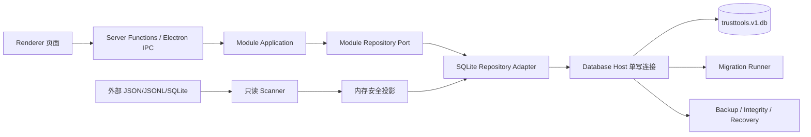
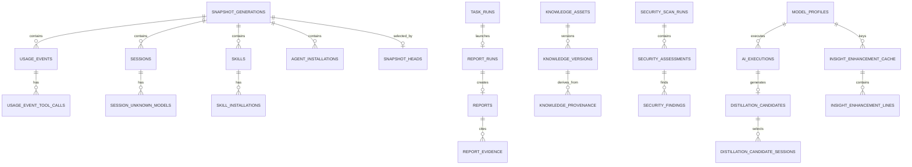

# TrustTools 本地存储数据库架构与全量表结构设计

| 属性 | 值 |
|------|-----|
| 文档类型 | 架构设计文档 (ARCH) |
| 项目名称 | TrustTools-本地存储数据库 |
| 版本 | v1.3 |
| 创建日期 | 2026-08-19 11:12:47 |
| 更新日期 | 2026-08-20 |
| 生成工具 | architecture-design + tech-selection + document-header |
| 文档状态 | 草稿 |

## 修订记录

| 版本 | 修改时间 | 修改内容 |
|------|---------|---------|
| v1.3 | 2026-08-20 | 按新项目模式定稿：移除 legacy 回退/迁移路线，SQLite 为唯一应用存储权威；§2.2 迁移/回滚行改为无迁移；§3.2 删除 legacy 回退分支；§5.0 更新为首期 10 表（data_migration_runs 已删除）+ 0002~0005 迁移落地；§11 退役；§13 标注 M2~M6 已完成 |
| v1.2 | 2026-08-19 17:38:04 | 按 Release 1 实现与独立安全审查加固回填：0001 头部 `PRAGMA application_id = 0x54544442`、`user_version` 由迁移运行器维护；枚举列 NOT NULL 与默认值、计数/格式域 CHECK、`ciphertext` 长度下限、禁存内容 SQL 级 CHECK；七列 UNIQUE 改为 COALESCE 表达式唯一索引；备份保留策略与迁移前备份 |
| v1.1 | 2026-08-19 11:53:04 | 按 Electron 43.4.1、Node 24.18.1、SQLite 3.53.1 实测运行时更新驱动约束和连接安全参数，采用 WAL 默认策略，并与今日洞察 SQLite 存储方案对齐 |
| v1.0 | 2026-08-19 11:12:47 | 基于现有模块化单体、AtomicJsonStore 和今日洞察双模式设计完整本地 SQLite 数据模型、迁移与实施方案 |

---

## 0. 结论摘要

推荐在现有模块化单体中增加一个**服务端专用嵌入式 SQLite 存储层**，收敛目前 15 份以上 `AtomicJsonStore`、Electron 偏好、安全历史、市场/汇率缓存以及未来今日洞察增强缓存。外部 Agent 的日志、会话正文、Skill 源码和外部 SQLite 仍是只读来源，不复制原始内容。

关键设计：

1. 数据库：SQLite，文件 `~/.trusttools/data/trusttools.v1.db`。
2. 驱动：`node:sqlite`，封装在 `SqliteDatabasePort` 后，不使用 ORM，不让业务模块直接写 SQL。
3. 当前已升级并实测为 Electron 43.4.1、Node 24.18.1、SQLite 3.53.1。首版直接使用 `WAL + synchronous=FULL`，保持单 Database Host/单 writer；启动必须确认 `PRAGMA journal_mode=WAL` 实际返回 `wal`，否则拒绝开启 SQLite 写路径。
4. 表按平台、快照、用量/会话、Skill、任务、报告/知识、蒸馏、AI、安全、搜索、今日洞察 11 个域组织：完整目标为 52 张基线普通表、1 张可选反馈表和 1 张可选 FTS5 虚拟表；首期不一次性创建全部表。
5. 高频查询字段规范化；低频、异构、小体量快照允许受约束 JSON。不能把整个系统再次设计成单表 JSON 文档库。
6. Insight Core 的规则结果不落库；只持久化可选 Enhancer 偏好、缓存、执行审计和预算，确保不接大模型时数据库中也没有模型调用数据。
7. 现有 Repository/Port 保持稳定；SQLite 为唯一应用存储权威，无 shadow write / read switch / JSON 归档（各域 SQLite 仓库已落地并接线）。

## 1. 输入验证、范围与假设

### 1.1 输入检查

| 检查项 | 状态 | 设计响应 |
|---|---|---|
| 需求与功能范围 | ✅ | V3.0 页面、业务模块化架构、今日洞察双模式架构均已提供 |
| 技术栈 | ✅ | Electron 43.4.1、Node 24.18.1、内置 SQLite 3.53.1、TypeScript、TanStack Start、Zod、本地优先 |
| 团队规模 | ✅ | 2 人全职；避免独立数据库服务和重 ORM |
| 当前存储 | ✅ | 已盘点 tasks、usage/session/skill/install snapshots、reports、knowledge、distill、model profile、monitoring、Electron prefs/security/cache |
| 数据规模 | ⚠️ | 缺少正式统计；按单用户、活跃 usage event ≤ 100 万、DB ≤ 2 GB 设计 |
| 并发模型 | ✅ | 低并发桌面应用；生产打包态同一 Electron 进程，开发态可能存在 Electron + Vite 两进程 |
| 一致性 | ✅ | 业务写入强一致；扫描快照 last-known-good；缓存可丢弃重建 |
| 数据保留 | ⚠️ | 设置已有默认 90 天；各域采用本文建议值，需产品最终确认 |
| 安全与隐私 | ✅ | renderer 隔离、本地优先、API Key server-only、正文和源码不持久化 |

非阻塞假设：

- 单一用户配置，不需要用户表、租户列或行级权限。
- 应用拥有数据库文件所在本地目录，不部署到网络文件系统。
- 所有时间以 UTC epoch milliseconds 存储；UI 层按 locale/timezone 格式化。
- Token/计数使用 SQLite 64 位 INTEGER，但 Repository 返回前必须验证不超过 JavaScript 安全整数。
- 金额使用 `microusd INTEGER`，禁止以浮点美元作为权威持久化格式。

### 1.2 纳入数据库

- 应用偏好、运行时开关、迁移历史和安全密钥引用。
- 任务偏好、任务运行、报告、知识、蒸馏候选、模型 Profile。
- Usage、Session、Skill、安装探测和项目分类的安全投影。
- 安全扫描/评估的元数据、规则版本、风险摘要和安全证据引用。
- 市场/汇率 HTTP 缓存、监控状态、搜索安全投影。
- 今日洞察可选 Enhancer 偏好、缓存、执行审计、预算和用户反馈。

### 1.3 明确不纳入

- 会话 transcript、reasoning、Prompt 正文和报告生成所用原始上下文。
- Skill 源码、文件正文、完整命令、命令输出、外部工具数据库副本。
- API Key 明文、Provider 原始响应、模型原始 Prompt、扫描源码证据。
- 仅用于日志排障的高频 observability event；继续使用可轮转 JSONL。
- 静态工具注册表、Job catalog、Prompt registry、安全规则包；继续由版本化代码/JSON 管理。

## 2. 当前持久化问题与数据库目标

### 2.1 当前事实

`src/app/composition.server.ts` 当前创建了 task preferences/runs、performance rollout、usage、classification、WSL、sessions、skills、installations、monitoring、reports、knowledge、distill candidates/quota 等多份 JSON store。Model Profile 另有独立 store；Electron 主进程还有 prefs、安全扫描历史/计划；market、exchange、search、distribution 等也有各自缓存或 Repository。

主要问题：

- 多个业务集合每次 mutation 都执行整文件 read-modify-write。
- 跨实体关联、分页、按时间/状态过滤依赖内存排序，增长后出现 N+1 或大 JSON 解析。
- 文件各自维护锁、schemaVersion、损坏恢复，无法跨模块原子提交。
- Electron prefs/localStorage、server JSON 和 scanner JSON 形成多个事实源。
- 今日洞察加入 14 页面缓存后，继续按文件扩展会放大文件数量和一致性成本。

### 2.2 成功标准

| 维度 | 标准 |
|---|---|
| 兼容 | 现有 Domain/Application contract 不因 SQLite 暴露 SQL 或数据库类型 |
| 正确性 | `foreign_key_check`、`integrity_check` 通过；业务事务无部分提交 |
| 查询 | 页面常用分页/聚合查询 P95 < 200 ms；单条偏好/缓存查询 P95 < 20 ms |
| 启动 | migration + capability probe 正常路径 < 500 ms；失败时阻止写入而不是自动破坏性重建 |
| 恢复 | 应用崩溃后数据库可打开，未完成任务按现有策略标记 abandoned |
| 隐私 | renderer 无 SQL/路径/密钥；禁存内容在 DB 检查中为零 |
| 迁移 | N/A（无迁移）—— 全新安装直接使用 SQLite；无 JSON 源 |
| 回滚 | 不需要降级数据库 schema；通过应用版本 + 备份恢复 |

## 3. 推荐存储架构

### 3.1 组件视图



依赖方向必须是 `domain/application → repository port ← sqlite adapter → database host`。`node:sqlite` 只能出现在 `platform/database/infrastructure` 和模块的 `*.server.ts` adapter 中。

### 3.2 连接与运行时

- 每个数据库绝对路径只有一个可写 `DatabaseHost` singleton。
- `DatabaseSync` 仅在 server/Electron trusted process 创建；renderer bundle boundary 必须阻断 `node:sqlite`。
- 运行时基线固定为 Electron 43.4.1 / Node 24.18.1 / SQLite 3.53.1；启动时必须读取并记录 `process.versions.electron/node/chrome` 与 `SELECT sqlite_version()`，版本或能力不匹配时拒绝开启 SQLite 写路径并让启动失败（无备用存储）。
- 连接显式使用 `timeout=5000`、`readBigInts=true`、`allowExtension=false`、`allowBareNamedParameters=false`、`allowUnknownNamedParameters=false` 和 `defensive=true`；Repository 负责把 BigInt 安全转换为领域数值或字符串。
- 首发直接使用 `journal_mode=WAL`、`synchronous=FULL`、`wal_autocheckpoint=1000`、`foreign_keys=ON`、`busy_timeout=5000`、`trusted_schema=OFF`。SQLite 3.53.1 已包含 WAL-reset 修复，满足当前单机本地文件系统基线。
- 初始化必须读取 `PRAGMA journal_mode` 并断言为 `wal`。未返回 `wal` 通常代表目录/文件系统不支持或环境异常：关闭连接、记录稳定错误码并让启动失败，不静默降为另一种 journal 语义。
- 只允许 Database Host 执行 checkpoint：正常运行依赖 autocheckpoint；空闲维护使用 `PASSIVE`；应用完整退出且无 reader 时可用 `TRUNCATE`。禁止业务 Repository 自行 checkpoint。
- `allowExtension=false`；不加载任意 SQLite extension。
- 所有用户输入经 prepared statement 绑定，表名/排序列来自代码白名单。
- 同步 SQL 不等于在 UI 主线程随意执行：collector 在事务外完成文件扫描和投影，写事务只做批量 statement + head pointer 切换。
- 开发态存在第二进程时，必须指定一个 Database Host；Electron 主进程数据经 DesktopStateBroker 写同一 DB，禁止两边各自直接写连接。

### 3.3 文件布局

```text
~/.trusttools/
├── data/
│   ├── trusttools.v1.db
│   ├── trusttools.v1.db-wal          # SQLite 运行时管理，不单独复制/删除
│   └── trusttools.v1.db-shm          # SQLite 运行时管理，不单独复制/删除
├── backups/
│   ├── trusttools-YYYYMMDD-HHmmss.db
│   └── manifest.json
├── cache/                              # 可丢弃缓存
└── logs/
    └── observability.jsonl
```

数据库目录权限尽力设置为 `0700`，数据库及 WAL/SHM 文件 `0600`；Windows 使用当前用户 ACL。备份与数据库同敏感级别。`-wal/-shm` 是否存在由 SQLite 决定，应用不得把它们当普通缓存文件清理。

## 4. 数据建模规则

### 4.1 SQL 约定

- 所有普通表使用 `STRICT`。
- 主键 ID 使用稳定 `TEXT`；大集合的内部 surrogate key 可使用 `INTEGER PRIMARY KEY`。
- UTC 时间统一为 `*_at_ms INTEGER CHECK (... >= 0)`；本地日预算使用 `date_key TEXT`，格式 `YYYY-MM-DD`。
- Boolean 使用 `INTEGER NOT NULL CHECK (value IN (0,1))`。
- 枚举用 `TEXT CHECK (...)`，Repository 层再做 Zod 校验。
- 可扩展对象使用 `*_json TEXT CHECK (json_valid(...))`，但查询/关联/约束字段不得藏在 JSON 中。
- 外键显式写 `ON DELETE CASCADE|RESTRICT|SET NULL`；启动执行 `foreign_key_check`。
- 不存原始绝对路径。跨快照关联使用 `HMAC-SHA256(installSalt, normalizedRef)` 的 `ref_hash`；显示使用现有 safe label。
- DB migration 只向前；回滚通过应用版本 + 备份恢复，不执行有损 down migration。

### 4.2 数据分级

| 级别 | 示例 | 存储策略 |
|---|---|---|
| L0 可重建缓存 | market response、search index、Insight enhancement cache | 可设置 TTL、可直接删除重建 |
| L1 安全投影 | usage/session/skill/install snapshot | 仅浏览器安全字段或本地敏感标识；保留最近 2 个成功 generation |
| L2 用户业务资产 | reports、knowledge、distillation approval、task preferences | 强事务、备份、保留审计 |
| L3 密钥 | API Key | 不明文；OS 加密 BLOB，renderer 永不读取 |

## 5. 全量表目录

### 5.0 首期小型数据库与完整目标的关系

本章是整个产品的目标数据模型，不代表第一个 migration 必须创建 54 个物理对象。首期（migration 0001）实际落地以下 10 张表（`data_migration_runs` 已删除）；0002~0005 迁移随后落地 task / snapshot / business-assets / search+wsl 各域：

| 首期分组 | 表 | 无模型时是否产生业务行 |
|---|---|---|
| 数据库内核 | `schema_migrations`、`app_preferences`、`runtime_flags` | 会；只保存版本、迁移和本地偏好 |
| 可选模型配置 | `secure_secrets`、`model_profiles` | 不会；用户未配置模型时保持空表 |
| 可选 AI 审计/预算 | `ai_executions`、`ai_daily_usage` | 不会；rules 模式不写入 |
| 今日洞察 | `insight_preferences`、`insight_enhancement_cache`、`insight_enhancement_lines` | 仅 preference 可有 `rules` 行；增强缓存保持空 |

Insight Core 继续通过现有模块 Repository 读取真实快照，不把 Evidence、规则候选或规则结果持久化。任务、Usage、Session、Knowledge 等模块的 SQLite 仓库已由 0002~0005 迁移落地并接线（task / snapshot / business-assets / search+wsl），无 shadow-write 或对账门。

### 5.1 平台、迁移、偏好与缓存（9 现行表，data_migration_runs 已废弃）

> 平台身份：migration 0001 头部写入 `PRAGMA application_id = 0x54544442`（`TTDB`），启动时验证 application_id 为 0（全新库）或该常量，否则拒绝写路径（§9-6）。`user_version` 由迁移运行器在每个迁移事务内与 ledger 同行维护，业务 SQL 不得自行设置。

#### `schema_migrations`

| 列 | 类型/约束 | 说明 |
|---|---|---|
| `version` | INTEGER PK | 单调递增 migration 版本 |
| `name` | TEXT NOT NULL UNIQUE | migration 名 |
| `checksum` | TEXT NOT NULL | SQL 文件 SHA-256 |
| `app_version` | TEXT NOT NULL | 执行 migration 的应用版本 |
| `applied_at_ms` | INTEGER NOT NULL | 完成时间 |
| `duration_ms` | INTEGER NOT NULL CHECK >= 0 | 执行耗时 |

#### `data_migration_runs`（已废弃，仅存档）

> 新项目模式已删除该表（无 JSON 导入）；下列定义仅作历史存档参考，不再是现行表。原列定义：`run_id`(PK)、`source_kind`、`source_path_hash`、`source_schema_version`、`status`、`started_at_ms`/`finished_at_ms`、`rows_read`/`rows_written`/`rows_skipped`、`error_code`、`source_fingerprint`；唯一索引 `(source_kind, source_path_hash, source_fingerprint)`。

#### `app_preferences`

| 列 | 类型/约束 | 说明 |
|---|---|---|
| `preference_key` | TEXT PK | 如 `ui.locale`、`settings.retentionDays`、`widget.layout` |
| `value_json` | TEXT NOT NULL CHECK json_valid + 禁存盘符/Bearer/反斜杠 | 值；禁止密钥 |
| `value_type` | TEXT NOT NULL CHECK `string|number|boolean|object|array|null` + 与 `json_type(value_json)` 一致性 CHECK | 解析保护 |
| `updated_at_ms` | INTEGER NOT NULL CHECK >= 0 | 修改时间 |

桌面 DB 为权威；localStorage 只保留启动镜像或浏览器开发态兼容值。

#### `secure_secrets`

| 列 | 类型/约束 | 说明 |
|---|---|---|
| `secret_id` | TEXT PK | 不透明 ID |
| `purpose` | TEXT NOT NULL DEFAULT `model-api-key` CHECK `model-api-key` | 首期仅模型密钥 |
| `ciphertext` | BLOB NOT NULL CHECK length >= 16 | Electron safeStorage/OS 加密结果 |
| `encryption_kind` | TEXT NOT NULL CHECK `dpapi|keychain|safe-storage` | 加密后端 |
| `created_at_ms`,`updated_at_ms` | INTEGER NOT NULL CHECK >= 0 | 时间 |

#### `runtime_flags`

| 列 | 类型/约束 | 说明 |
|---|---|---|
| `flag_key` | TEXT PK | performance rollout、Insight kill switch 等 |
| `value_json` | TEXT NOT NULL CHECK json_valid | 受 schema 限制的值 |
| `updated_at_ms` | INTEGER NOT NULL | 修改时间 |

#### `snapshot_generations`

| 列 | 类型/约束 | 说明 |
|---|---|---|
| `snapshot_id` | TEXT PK | generation ID |
| `domain` | TEXT NOT NULL | `usage|sessions|skills|installations|wsl|exchange` |
| `schema_version` | INTEGER NOT NULL | 域投影版本 |
| `revision` | TEXT NOT NULL | 当前 SnapshotEnvelope revision |
| `generated_at_ms` | INTEGER | 生成时间；empty 可空 |
| `source_fingerprint` | TEXT | 输入指纹 |
| `status` | TEXT CHECK `empty|fresh|stale|failed` | 只保存完成态 |
| `last_attempt_at_ms`,`last_success_at_ms` | INTEGER | 诊断时间 |
| `duration_ms`,`scanned_items`,`reused_items` | INTEGER | 诊断计数 |
| `created_at_ms` | INTEGER NOT NULL | 入库时间 |

唯一索引：`(domain, revision)`；清理索引：`(domain, created_at_ms DESC)`。

#### `snapshot_heads`

| 列 | 类型/约束 | 说明 |
|---|---|---|
| `domain` | TEXT PK | 每个域一行 |
| `snapshot_id` | TEXT NOT NULL FK → `snapshot_generations` RESTRICT | 当前 last-known-good |
| `updated_at_ms` | INTEGER NOT NULL | 指针切换时间 |

刷新事务先插入 generation 与全部子表，最后 upsert head；事务失败时旧 head 不变。

#### `snapshot_warnings`

| 列 | 类型/约束 | 说明 |
|---|---|---|
| `snapshot_id` | TEXT FK → generation CASCADE | 所属快照 |
| `sequence` | INTEGER | 顺序 |
| `warning_code` | TEXT NOT NULL | 稳定错误/警告码 |

主键：`(snapshot_id, sequence)`。

#### `snapshot_blobs`

| 列 | 类型/约束 | 说明 |
|---|---|---|
| `snapshot_id` | TEXT PK/FK → generation CASCADE | 小型异构快照 |
| `payload_json` | TEXT NOT NULL CHECK json_valid | 仅用于 WSL 等低频小对象 |
| `payload_bytes` | INTEGER NOT NULL CHECK >= 0 | 大小门禁 |

禁止 usage/session/skill 主数据写入该表。单 payload 默认上限 256 KB。

#### `http_cache_entries`

| 列 | 类型/约束 | 说明 |
|---|---|---|
| `namespace`,`cache_key` | TEXT 复合 PK | `market`、`exchange-source` 等 |
| `payload_json` | TEXT NOT NULL CHECK json_valid | 响应安全投影 |
| `etag` | TEXT | HTTP ETag |
| `fetched_at_ms`,`expires_at_ms` | INTEGER NOT NULL | TTL |
| `status_code` | INTEGER | 最近状态 |
| `payload_bytes` | INTEGER NOT NULL | 大小限制 |

索引：`(namespace, expires_at_ms)`；过期缓存可批量清理。

### 5.2 模型与 AI 执行（3 表）

#### `model_profiles`

| 列 | 类型/约束 | 说明 |
|---|---|---|
| `profile_id` | TEXT PK | 当前 profile.id |
| `name` | TEXT NOT NULL CHECK length 1–64 | 1–64 字符 |
| `mode` | TEXT NOT NULL DEFAULT `custom` CHECK `official|custom` | 模式 |
| `protocol` | TEXT NOT NULL CHECK `openai|anthropic` | 协议 |
| `endpoint` | TEXT | custom endpoint；server-only |
| `model` | TEXT | 模型 ID |
| `secret_id` | TEXT FK → `secure_secrets` SET NULL | API Key 引用 |
| `is_active` | INTEGER NOT NULL DEFAULT 0 CHECK boolean | 活跃标志 |
| `created_at_ms`,`updated_at_ms` | INTEGER NOT NULL CHECK >= 0 | 时间 |

部分唯一索引：`CREATE UNIQUE INDEX ... ON model_profiles(is_active) WHERE is_active=1`，保证最多一个 active。

#### `ai_executions`

| 列 | 类型/约束 | 说明 |
|---|---|---|
| `request_id` | TEXT PK | AIExecutionSummary.requestId |
| `capability` | TEXT NOT NULL | `distillation|report|security|page-insight` |
| `profile_id` | TEXT FK → model_profiles SET NULL | 可空，offline 无 Profile |
| `provider_id`,`model_id` | TEXT | 执行时快照 |
| `prompt_version_id` | TEXT NOT NULL | Prompt 注册项 |
| `prompt_version` | INTEGER NOT NULL | 版本 |
| `input_fingerprint` | TEXT | 脱敏输入哈希，不存 Prompt |
| `status` | TEXT NOT NULL CHECK 完整 AI 状态枚举 | completed/offline/fallback/budget/timeout/cancelled/failed |
| `used_fallback` | INTEGER NOT NULL DEFAULT 0 CHECK boolean | 是否使用本地结果 |
| `input_tokens`,`output_tokens` | INTEGER CHECK >= 0 | 用量 |
| `cost_microusd` | INTEGER | 可空代表未知 |
| `cost_confidence` | TEXT CHECK `exact|estimated|unknown` | 成本置信度 |
| `error_code` | TEXT | 稳定错误码 |
| `started_at_ms`,`finished_at_ms`,`duration_ms` | INTEGER CHECK >= 0 | 时间 |

索引：`(capability, started_at_ms DESC)`、`(profile_id, started_at_ms DESC)`、`(status, started_at_ms DESC)`。

#### `ai_daily_usage`

| 列 | 类型/约束 | 说明 |
|---|---|---|
| `date_key` | TEXT NOT NULL CHECK `YYYY-MM-DD` GLOB | 用户本地日 `YYYY-MM-DD` |
| `capability` | TEXT NOT NULL CHECK `distillation|report|security|page-insight` | 能力 |
| `profile_key` | TEXT NOT NULL | Profile ID；offline 使用固定 `offline` |
| `calls`,`input_tokens`,`output_tokens`,`cost_microusd` | INTEGER NOT NULL DEFAULT 0 CHECK >= 0 | 聚合计数 |
| `updated_at_ms` | INTEGER NOT NULL CHECK >= 0 | 时间 |

主键：`(date_key, capability, profile_key)`。调用配额检查和计数增加必须与 `ai_executions` 插入位于同一事务；Insight Enhancer 预算损坏/迁移失败时 fail-closed，Insight Core 不受影响。

### 5.3 任务运行（2 表）

#### `task_preferences`

| 列 | 类型/约束 | 说明 |
|---|---|---|
| `task_id` | TEXT PK | 必须存在于静态 Job catalog |
| `enabled` | INTEGER NOT NULL | boolean |
| `schedule_kind` | TEXT | `interval|daily|weekly|monthly` |
| `interval_minutes`,`weekday`,`day_of_month` | INTEGER | 按 kind 约束 |
| `local_time` | TEXT | `HH:mm` |
| `timezone` | TEXT | IANA timezone；缺省系统时区 |
| `options_json` | TEXT CHECK json_valid | task-specific scope/notify 等，需按 Job schema 校验 |
| `updated_at_ms` | INTEGER NOT NULL | 时间 |

CHECK 保证不同 schedule kind 的必需列组合合法。

#### `task_runs`

| 列 | 类型/约束 | 说明 |
|---|---|---|
| `run_id` | TEXT PK | 当前 runId |
| `task_id` | TEXT NOT NULL | 静态 catalog ID |
| `trigger` | TEXT CHECK `manual|schedule|startup-recovery|event` | 触发方式 |
| `status` | TEXT CHECK 现有 8 状态 | queued/running/waiting-approval/succeeded/failed/cancelled/skipped/abandoned |
| `queued_at_ms`,`started_at_ms`,`finished_at_ms`,`duration_ms` | INTEGER | 生命周期 |
| `attempt` | INTEGER CHECK 1–100 | 尝试次数 |
| `correlation_id` | TEXT NOT NULL | 关联 ID |
| `error_code` | TEXT | 稳定错误码 |
| `retryable` | INTEGER | boolean |
| `input_fingerprint`,`output_ref` | TEXT | 不透明引用 |
| `scanned`,`changed`,`diagnostic_count` | INTEGER | 当前 summary 展开列 |
| `skipped_reason` | TEXT | 固定枚举 |

索引：`(task_id, started_at_ms DESC)`、`(status, started_at_ms)`、`(correlation_id)`。应用启动在一个事务中把遗留 `running` 标为 `abandoned`。

### 5.4 Usage 与项目分类（9 表）

#### `usage_sources`

主键 `(snapshot_id, source_id)`；`snapshot_id` FK CASCADE。列：`available`、`detected`、`files_considered`、`files_read`、`files_reused`、`files_parsed`、`malformed_lines`、`event_count`。所有计数非负；不保存扫描路径。

#### `usage_source_diagnostics`

主键 `(snapshot_id, source_id, sequence)`；FK → `usage_sources` CASCADE。列：`code`、`count`、`message_key`。不保存当前 `diagnostic.path` 和自由文本 message。

#### `usage_events`

| 列 | 类型/约束 | 说明 |
|---|---|---|
| `snapshot_id`,`event_id` | 复合 PK | event_id 为稳定事件指纹 |
| `source_id` | TEXT NOT NULL | FK → usage_sources |
| `occurred_at_ms` | INTEGER NOT NULL | 事件时间 |
| `model_id` | TEXT NOT NULL | 模型标识 |
| `project_ref_hash` | TEXT | HMAC 后的项目引用 |
| `project_label` | TEXT | safe basename/unknown |
| `session_ref` | TEXT | 当前 sessionId；本地敏感 |
| `measurement` | TEXT CHECK `observed|estimated` | 缺省 observed |
| `input_tokens`,`cached_input_tokens`,`cache_creation_input_tokens`,`output_tokens`,`reasoning_output_tokens`,`total_tokens` | INTEGER NOT NULL CHECK >=0 | Token 列 |
| `has_text_response` | INTEGER | nullable boolean |

索引：`(snapshot_id, occurred_at_ms DESC)`、`(snapshot_id, source_id, occurred_at_ms DESC)`、`(snapshot_id, model_id)`、`(snapshot_id, project_ref_hash)`、`(snapshot_id, session_ref)`。

#### `usage_event_tool_calls`

主键 `(snapshot_id, event_id, name, category)`；列 `calls INTEGER >0`；FK → usage_events CASCADE。

#### `usage_event_skill_calls`

主键 `(snapshot_id, event_id, skill_name)`；列 `calls INTEGER >0`。Skill 名是 L1 本地敏感数据，绝不进入 LLM payload。

#### `usage_event_command_stats`

主键 `(snapshot_id, event_id, safe_signature)`；列：`executable_label`、`duration_bucket`、`output_size_bucket`、`exit_status`、`calls`。禁止完整命令和参数。

#### `usage_event_output_summaries`

主键/FK `(snapshot_id, event_id)`；列 `characters`、`lines`、`completed`、`calls`，均为聚合值。

#### `usage_daily_aggregates`

主键 `(snapshot_id, date_key, source_id)`；保存 `events` 与六类 token 计数。它是可重建 materialized projection，Dashboard/Tracker 首屏优先读取；写入时与 event generation 同事务。

#### `project_classifications`

| 列 | 类型/约束 | 说明 |
|---|---|---|
| `ref_hash` | TEXT PK | 规范化绝对引用的 HMAC，不存原路径 |
| `kind` | TEXT CHECK `workspace|quick-conversation|unknown` | 分类 |
| `label` | TEXT NOT NULL | 浏览器安全标签 |
| `fingerprint` | TEXT | 目录变化指纹，不含路径 |
| `classified_at_ms` | INTEGER NOT NULL | 时间 |
| `revision` | INTEGER NOT NULL | 乐观版本 |

索引：`(kind, classified_at_ms DESC)`。

### 5.5 Sessions（3 表）

#### `sessions`

主键 `(snapshot_id, source_id, session_id)`；`snapshot_id` FK CASCADE。列：

- 标识：`title`、`project_key`、`project_ref_hash`、`model_id`。
- 时间：`started_at_ms`、`ended_at_ms`、`duration_ms`。
- 活动：`turns`、`edit_turns`、`retry_turns`、`subagent_calls`。
- Token：与 Usage 相同六列。
- 成本：`known_microusd`、`estimated_microusd`、`cache_savings_microusd`、`priced_events`、`estimated_events`、`unknown_events`、`cost_complete`。
- 状态：`status`（available/interrupted/lost/unavailable）、`status_reason_code`、`resume_available`。

索引：`(snapshot_id, started_at_ms DESC)`、`(snapshot_id, source_id, started_at_ms DESC)`、`(snapshot_id, project_key)`、`(snapshot_id, status)`、`(snapshot_id, total_tokens DESC)`。title 只在本地搜索投影中使用，不发送模型。

#### `session_unknown_models`

主键 `(snapshot_id, source_id, session_id, model_id)`；FK → sessions CASCADE。

#### `session_daily_density`

主键 `(snapshot_id, date_key, source_id)`；列：`session_count`、`turns`、`edit_turns`、`subagent_calls`、`total_tokens`、`known_microusd`。它替代当前 snapshot 中的 density 数组。

### 5.6 Agent、Skill 与分发（7 表）

#### `agent_installations`

主键 `(snapshot_id, agent_id)`；列：`installed`、`executable_found`、`root_count`。FK → snapshot generation CASCADE。

#### `agent_installation_paths`

主键 `(snapshot_id, agent_id, relative_path)`；只允许 `~/` 相对展示路径，CHECK 拒绝盘符、UNC 与 `/` 绝对路径。

#### `skills`

主键 `(snapshot_id, skill_id)`；列：`name`、`description`、`last_used_at_ms`、`size_bytes`、`token_estimate`。索引：`(snapshot_id, last_used_at_ms DESC)`、`(snapshot_id, name)`。

#### `skill_installations`

主键 `(snapshot_id, skill_id, installation_ref)`；列：`agent_id`、`installed_at_ms`、`modified_at_ms`、`version`、`source_kind`、`source_label`、`update_status`、`update_reason_code`。FK → skills CASCADE。

#### `skill_blacklist`

主键 `(snapshot_id, skill_name)`；只存现有 blacklist 名称，不存路径。

#### `distribution_runs`

| 列 | 类型/约束 | 说明 |
|---|---|---|
| `run_id` | TEXT PK | 分发运行 |
| `skill_ref` | TEXT NOT NULL | 不透明 Skill 引用 |
| `operation` | TEXT CHECK `install|sync|uninstall|export` | 操作 |
| `status` | TEXT CHECK `planned|running|succeeded|partial|failed|rolled-back` | 状态 |
| `requested_at_ms`,`finished_at_ms` | INTEGER | 时间 |
| `actor` | TEXT NOT NULL | 本地 actor |
| `rollback_ref` | TEXT | 回滚引用，不存路径 |
| `error_code` | TEXT | 稳定错误码 |

#### `distribution_run_targets`

主键 `(run_id, agent_id)`；列：`status`、`installation_ref`、`error_code`、`backup_ref`。FK → distribution_runs CASCADE。

### 5.7 Reports、Knowledge 与 Distillation（9 表）

#### `report_runs`

`run_id` PK；列 `task_run_id`（可空 FK → task_runs SET NULL）、`definition_id`、`trigger`、`status`、`started_at_ms`、`finished_at_ms`、`error_code`、`retryable`、`ai_request_id`（FK → ai_executions SET NULL）。索引 `(definition_id, started_at_ms DESC)`。

#### `reports`

`report_id` PK；`run_id` UNIQUE FK → report_runs；列 `definition_id`、`status`（draft/approved/archived）、`title`、`body`、`generated_at_ms`、`template_version`、`approved_by`、`approved_at_ms`、`created_at_ms`、`updated_at_ms`。报告 body 属于 L2 数据，进入备份但不进入搜索或 LLM，除非另行授权。

#### `report_evidence`

主键 `(report_id, sequence)`；列 `module`、`evidence_ref`、`observed_at_ms`。FK → reports CASCADE。

#### `report_assets`

主键 `(report_id, asset_id, kind)`；`kind` 为 knowledge/chart/attachment；FK → reports CASCADE。`asset_id` 是引用，不在此复制正文。

#### `knowledge_assets`

`asset_id` PK；列 `kind`、`title`、`current_version`、`status`、`security_verdict`、`created_at_ms`、`updated_at_ms`、`revision`。索引 `(status, kind, updated_at_ms DESC)`。

#### `knowledge_versions`

`version_id` PK；UNIQUE `(asset_id, version)`；列 `kind`、`title`、`content_ref`、`content_hash`、`created_by`、`status`、`security_verdict`、`created_at_ms`、`updated_at_ms`、`audit_action`、`audit_actor`。FK → knowledge_assets RESTRICT。保持现有原则：知识正文不由 knowledge 模块存储，只保存 content ref/hash。

#### `knowledge_provenance`

主键 `(version_id, sequence)`；列 `source_ref`、`source_type`、`captured_at_ms`、`summary`。`summary` 最大长度与脱敏规则必须在 Repository 校验；FK → versions CASCADE。索引 `(source_ref)`。

#### `distillation_candidates`

`candidate_id` PK；列 `kind`、`title`、`summary`、`mode`、`approval_state`、`generated_at_ms`、`ai_request_id` UNIQUE FK → ai_executions、`approved_at_ms`、`cancelled_at_ms`、`knowledge_asset_id` FK SET NULL。summary 是已过滤的 L2 产物，最大 16 KB。

#### `distillation_candidate_sessions`

主键 `(candidate_id, sequence)`；列 `source_id`、`session_id`。最多 8 行，由 application 层和测试双重约束；FK → candidate CASCADE。不建立到滚动 session snapshot 的外键，避免清理快照时破坏审批记录。

### 5.8 Security 与 Monitoring（5 表）

#### `security_scan_runs`

`scan_id` PK；列 `mode`（quick/full）、`trigger`（manual/automatic）、`locale`、`status`、`started_at_ms`、`finished_at_ms`、`discovered_count`、`queued_count`、`completed_count`、`failed_count`、`skipped_count`、`error_code`、`rule_version`。索引 `(started_at_ms DESC)`、`(status, started_at_ms)`。

#### `security_assessments`

| 列 | 类型/约束 | 说明 |
|---|---|---|
| `assessment_ref` | TEXT PK | 当前 assessmentRef |
| `scan_id` | TEXT FK → scan_runs SET NULL | 所属批次 |
| `asset_ref` | TEXT NOT NULL | 安全不透明引用 |
| `asset_hash_ref` | TEXT | 内容哈希引用 |
| `asset_kind` | TEXT CHECK `skill|package|knowledge|distillation` | 类型 |
| `display_name` | TEXT | 已清理名称 |
| `verdict` | TEXT CHECK `clean|suspicious|dangerous|unknown` | 判定 |
| `status` | TEXT CHECK `complete|partial|failed|skipped|cancelled` | 执行状态 |
| `rule_version`,`rule_provenance`,`rule_pack_ref` | TEXT | 规则来源 |
| `assessed_at_ms` | INTEGER NOT NULL | 时间 |
| `files_scanned`,`evidence_count`,`duration_ms` | INTEGER | 聚合 |
| `error_code` | TEXT | 稳定错误码 |

索引：`(asset_ref, assessed_at_ms DESC)`、`(verdict, assessed_at_ms DESC)`、`(scan_id)`。不保存扫描路径、源码片段、原始错误。

#### `security_findings`

`finding_ref` PK；列 `assessment_ref` FK CASCADE、`severity`、`status`（active/resolved）、`dimension`、`rule_id`、`evidence_ref`、`title_key`、`detail_params_json`。不保存 evidence 原文；索引 `(assessment_ref, severity)`、`(status, severity)`。

#### `monitoring_state`

单行表，`singleton_id INTEGER PK CHECK =1`；列 `running`、`started_at_ms`、`heartbeat_at_ms`、`pending_count` 以及安全聚合计数/时间。它是可重建运行状态，不纳入用户导出。

#### `monitoring_collectors`

`collector_id` PK；列 `state`、`pending`、`last_started_at_ms`、`last_succeeded_at_ms`、`last_failed_at_ms`、`error_code`。启动时把遗留 running 状态恢复为 degraded/idle。

### 5.9 Search（1 普通表 + 1 可选虚拟表）

#### `search_documents`

`document_id` PK；列 `type`、`source_ref`、`title`、`tags_json`、`text_summary`、`freshness`、`updated_at_ms`、`source_revision`。UNIQUE `(type, source_ref)`；索引 `(type, updated_at_ms DESC)`、`(freshness)`。只保存现有 browser-safe SearchDocument。

#### `search_documents_fts`（可选）

FTS5 虚拟表列 `document_id UNINDEXED, title, tags, text_summary`。启动 capability probe 成功才启用；写入与 `search_documents` 在同一事务中由 Search Repository 显式维护。中文 substring 质量未完成基准前，保留现有内存评分或参数化 `LIKE` 路径，不能把 FTS5 存在等同于中文搜索质量已解决。

### 5.10 今日洞察双模式（4 表）

#### `insight_preferences`

| 列 | 类型/约束 | 说明 |
|---|---|---|
| `scope_key` | TEXT PK | `global` 或 `surface:<id>` |
| `mode` | TEXT CHECK `rules|enhanced-manual|enhanced-auto` | 默认 rules |
| `profile_id` | TEXT FK → model_profiles SET NULL | 可选 Profile |
| `consent_version` | TEXT | 远程聚合数据授权版本 |
| `consented_at_ms` | INTEGER | 授权时间 |
| `daily_call_limit` | INTEGER | 增强预算；rules 下无意义 |
| `updated_at_ms` | INTEGER NOT NULL | 时间 |

删除 Profile 时偏好保留但变为无 Profile；规则洞察仍正常。

#### `insight_enhancement_cache`

| 列 | 类型/约束 | 说明 |
|---|---|---|
| `cache_key` | TEXT PK | 内容寻址哈希 |
| `surface_id` | TEXT NOT NULL | 14 个 Surface 枚举 |
| `scope_hash`,`evidence_hash` | TEXT NOT NULL | 不含原事实值 |
| `locale` | TEXT NOT NULL | zh-CN/en-US/ja-JP 等 |
| `profile_id` | TEXT FK → model_profiles CASCADE | Profile 删除即清缓存 |
| `prompt_version_id`,`prompt_version` | TEXT/INTEGER | Prompt 版本 |
| `model_label` | TEXT | 安全展示名 |
| `ai_request_id` | TEXT FK → ai_executions SET NULL | 审计引用 |
| `generated_at_ms`,`expires_at_ms` | INTEGER NOT NULL CHECK >= 0 | TTL |
| `status` | TEXT NOT NULL DEFAULT `ready` CHECK `ready|invalidated` | 缓存状态 |

唯一性：表达式唯一索引 `(surface_id, scope_hash, evidence_hash, locale, COALESCE(profile_id,''), COALESCE(prompt_version_id,''), COALESCE(prompt_version,0))`（COALESCE 使 NULL 身份参与唯一判定，offline 缓存不会重复扣预算）；索引 `(surface_id, expires_at_ms)`。

#### `insight_enhancement_lines`

主键 `(cache_key, sequence)`；列 `candidate_id`、`analysis`、`action_id`。FK → cache CASCADE。`analysis` 禁止数字、URL、路径、命令和实体名（SQL 级 CHECK 拦截数字/盘符/反斜杠，其余由 Repository 隐私守卫强制）；事实句与动作 label 不持久化，始终由 Core 按当前证据本地渲染。

#### `insight_feedback`（COULD）

`feedback_id` PK；列 `surface_id`、`cache_key` FK SET NULL、`rating`（helpful/not-helpful）、`reason_code`、`created_at_ms`。不允许自由文本，避免新增敏感内容面。未实现反馈功能时不创建此表也不阻塞 Release A/B。

## 6. 核心关系图



## 7. 关键视图与查询

建议创建以下普通 View，不把业务规则藏进 trigger：

| View | 用途 |
|---|---|
| `v_current_usage_events` | `snapshot_heads(domain='usage')` 关联当前 usage rows |
| `v_current_sessions` | 当前 session generation |
| `v_current_skills` | 当前 skill + installations |
| `v_current_agent_installations` | 当前工具安装事实 |
| `v_latest_security_assessment` | 每个 asset_ref 最新评估 |
| `v_latest_reports` | 每类 report 最新 document |
| `v_active_model_profile` | 最多一个 active profile，不含 secret ciphertext |
| `v_valid_insight_cache` | `status=ready AND expires_at_ms>now` 由 Repository 参数化 now 实现，不在 view 调系统时间 |

典型访问：

- Dashboard：读取当前 usage daily aggregate、session density、安全最新摘要和 task runs；不扫描外部文件。
- Tracker：按当前 snapshot 的 project/model/source 聚合 usage_events；费用映射仍由 pricing domain 负责。
- Chats：按 `started_at_ms` keyset pagination，避免大 offset。
- Knowledge：`ORDER BY updated_at_ms DESC, asset_id DESC` keyset pagination；通过 `current_version` 单次 join，消除 N+1。
- Insight Core：只读上述安全 View/Repository，计算规则结果；不写 insight cache。
- Insight Enhancer：先读 Core candidate，再在一个短事务中检查预算/缓存；Provider 调用在事务外；返回后开启新事务写 execution/cache/usage。

## 8. 事务与一致性设计

### 8.1 快照提交

```text
事务外：扫描外部源 → 生成安全投影 → Zod 校验 → 计算 event_id/ref_hash
BEGIN IMMEDIATE
  INSERT snapshot_generations
  批量 INSERT domain rows / aggregates / warnings
  UPSERT snapshot_heads 指向新 snapshot_id
COMMIT
事务后：保留当前 + 上一个成功 generation，异步清理更旧可重建行
```

扫描失败时不创建新 head；更新原 generation 的状态也不能覆盖 last-known-good。禁止在数据库事务内读取文件、调用网络或运行模型。

### 8.2 业务资产事务

- Knowledge create/approve/publish/archive：校验 `revision` 后，插入 version、更新 asset current_version/status/revision 同事务。
- Distillation approve：更新 candidate approval、创建 knowledge asset/version/provenance 同事务；外部 Skill 写入仍由独立确认流程和补偿记录处理。
- Report generation：AI/规则生成在事务外；完成后写 report_run、report、evidence/assets 同事务。
- Task recovery：应用启动一次性更新所有 running → abandoned，再提交。
- AI budget：预占用调用额度和 execution pending 同事务；Provider 返回后更新 execution；超时恢复任务释放或按策略计费。

SQLite 不支持跨数据库/文件系统原子事务。任何外部 Skill 安装、文件导出和 DB 审计的组合必须使用 staging + backup + compensation，而不能假装是一个 ACID 事务。

### 8.3 幂等键

| 流程 | 幂等键 |
|---|---|
| Usage event | source + stable source event ID；缺失时使用允许字段指纹 |
| Snapshot | domain + revision |
| Task run | run_id；同 input_fingerprint 的并发由 scheduler singleflight |
| Insight cache | surface/scope/evidence/locale/profile/prompt 内容哈希 |
| AI execution | request_id；预算预占与 request_id 绑定 |

## 9. 安全设计

1. **连接边界**：renderer 只能调用固定 Server Function/IPC；不存在 executeSql、tableName、whereClause 等通用接口。
2. **密钥**：`secure_secrets.ciphertext` 使用 OS 账户绑定加密。DB 导出默认排除密钥；完整灾备若包含 ciphertext，也只能在同一 OS 用户上下文解密。
3. **路径**：数据库只存 display relative path 或 HMAC；绝对路径只在一次 scanner 调用内存中存在。
4. **内容禁区**：Repository 负向测试向字段注入 transcript、Bearer、API Key、`C:\\Users\\...`、`/Users/...`、命令和 Prompt injection，断言被拒绝或不可逆转换。
5. **SQL 安全**：prepared statements；动态 order by 使用枚举映射；`allowExtension=false`、`trusted_schema=OFF`。
6. **数据库替换**：启动验证 `application_id`、`user_version`、migration checksum 和核心表；不接受任意用户选择的 DB 路径覆盖生产 DB。
7. **导出**：业务 CSV/JSON 导出继续走安全 DTO，不允许用户下载完整数据库作为普通导出。

## 10. 生命周期、清理、备份与恢复

### 10.1 建议保留策略

| 数据 | 默认保留 | 说明 |
|---|---|---|
| Snapshot generations | 当前 + 上一个成功版本 | L1 可重建 |
| Usage/session 投影 | 跟随 snapshot；扫描窗口建议 90 天 | 用户 retentionDays 可调 |
| Task runs | 90 天或最近 2,000 条/任务 | 先按时间，再保留最小审计集 |
| Reports/Knowledge | 用户显式归档/删除 | L2 用户资产，不自动按 90 天删除 |
| Distill candidates | 90 天；approved 引用保留审计行 | summary 属于 L2 |
| Security assessment | 90 天或最近 500 次 | 与当前 30 天/500 条策略需产品统一 |
| AI executions | 90 天 | 不含 Prompt/响应正文 |
| Insight cache | 24 小时默认 | 随 Profile 删除或 Prompt 版本变化失效 |
| HTTP cache | 过期后 7 天内清理 | 可丢弃 |
| Search index | 与源数据同步 | 可全量重建 |

清理作为 `maintenance.retention` Job 执行，每次限制删除行数和事务时长；删除后仅在空闲/用户操作下执行 incremental vacuum，不在首屏路径 `VACUUM`。

### 10.2 备份

- 使用 `sqlite.backup(sourceDb, destination)` 创建包含已提交 WAL 状态的一致备份，不能直接复制打开中的 `.db`，也不能自行拼接复制 `.db/-wal/-shm`。
- migration 前强制备份；日常备份每天最多一次，保留 7 日 + 最近一个成功大版本迁移前备份。
- 备份完成后在只读连接执行 `PRAGMA quick_check`，写 manifest：schema version、app version、SQLite version、size、SHA-256、createdAt。
- 备份目标先写临时文件，校验后原子 rename；不覆盖最后成功备份。
- 备份前允许执行 `PRAGMA wal_checkpoint(PASSIVE)` 观测积压，但不得为了备份强制阻塞活跃 reader；online backup 本身是备份一致性的权威机制。

### 10.3 损坏恢复

```text
打开失败 / quick_check 失败
  → 关闭所有连接并把 DB、-wal、-shm 作为同一故障组隔离到 .corrupt.<timestamp>/
  → 查找最新 checksum + quick_check 通过的备份
  → 用户确认后恢复（L2 数据不可静默丢弃）
  → 无备份时创建空 DB
  → 外部只读源重建 L0/L1；报告/知识等 L2 标记无法恢复
```

严禁启动失败后直接删除数据库并静默重建。

## 11. JSON 到 SQLite 迁移映射（已废弃/退役）

> 本章已废弃：项目按新项目模式实现，无 JSON → SQLite 迁移；SQLite 为唯一应用存储权威，历史 JSON 存储代码已删除。原 JSON→SQLite 映射与迁移状态机不再作为现行流程保留，仅存档于历史版本。

## 12. 目标代码结构

```text
src/platform/database/
├── contracts.ts                    # SqliteDatabasePort / Transaction / Backup
├── database-host.server.ts         # 单连接生命周期与 capability probe
├── migrations/
│   ├── 0001_platform.sql
│   ├── 0002_low_risk_state.sql
│   ├── 0003_snapshot_read_models.sql
│   ├── 0004_business_assets.sql
│   └── 0005_search_wsl.sql
├── migration-runner.server.ts
├── backup.server.ts
├── integrity.server.ts
└── infrastructure/
    └── node-sqlite-database.server.ts

src/modules/<feature>/infrastructure/
└── sqlite-<feature>-repository.server.ts

src/app/
└── composition.server.ts           # 组装 SQLite Repository；业务 contract 不变

scripts/
├── verify-database-schema.mts
└── inspect-database.mts             # 只输出 schema/计数/健康，不输出内容
```

严禁实现一个含所有业务 SQL 的 `database-repository.ts`。平台层拥有连接和 migration；业务模块拥有本域 SQL 与映射。

## 13. 分阶段实施方案

### M0：能力探针与 ADR（2 人日）

- 固化 ADR、数据分类、禁存字段和 Electron 43.4.1 / Node 24.18.1 / SQLite 3.53.1 最低运行时基线。
- 将已完成的开发态版本探针固化为 Electron packaged/dev 的自动 capability probe，继续验证 JSON1、FTS5、online backup、defensive mode 和 BigInt 行为。
- 决定 Database Host 在开发双进程下的唯一所有者。
- 建立当前 JSON 文件和读模型 hash 基线。

质量门：打包态运行时不得低于 SQLite 3.53.1；`PRAGMA journal_mode` 必须返回 `wal`；任何第二写连接必须失败或被 broker 串行化；备份、强杀进程和 checkpoint 恢复必须通过。

### M1：数据库平台内核（4–5 人日）

- 实现 `SqliteDatabasePort`、单例 Host、migration/checksum、事务 helper。
- 创建 platform、snapshot、task 表和测试 fixture。
- 实现 online backup、quick/integrity/foreign-key check、损坏隔离。
- 加入 browser/server boundary 和 schema verify。

质量门：Windows/macOS 临时目录下迁移幂等、崩溃恢复、备份恢复、锁冲突测试通过。

### M2–M5：各域 SQLite 仓库落地（已完成）

M2（低风险状态）→ M3（快照与高价值查询）→ M4（业务资产与安全）→ M5（今日洞察与搜索）各域 SQLite Repository 均已落地并接线（task / snapshot / business-assets / search+wsl，对应迁移 0002~0005），无 shadow-write / read-switch / JSON read fallback。Electron prefs 经 DesktopStateBroker 写 SQLite `app_preferences`；项目 ref 以 HMAC 存储，不持久化绝对路径。

质量门（已达成）：running recovery、generation/head 原子切换、L2 备份恢复、密钥加解密、无模型 14 页面、隐私负向测试均通过。

### M6：JSON 归档（不适用）

M6 的「停止旧 JSON 写入并归档」不适用——新项目模式已删除 JSON 存储代码，无 legacy 数据需要归档或用户确认清理。

整体估算约 32–38 人日（历史值）；新项目模式下 M0–M5 已全部落地，无需分阶段迁移。

## 14. 测试设计输入

### 14.1 Schema 与迁移

- 空库从 0 升至 latest；每个中间版本升至 latest；重复执行无变化。
- migration checksum 改变时拒绝继续，不静默覆盖历史。
- N/A（无 legacy JSON 迁移）：旧 JSON 存储代码已删除，不再有导入用例。
- 明文 API Key：safeStorage 可用时加密迁移；不可用时不落库并要求重录。
- migration 中断后重启：已提交 version 不重复，未提交 version 可重试。

### 14.2 事务与恢复

- generation 子表写到一半抛错，head 仍指向旧 snapshot。
- Knowledge 并发 expectedRevision 只有一个成功。
- AI budget 并发调用不超限，不出现丢失 increment。
- 应用崩溃遗留 running task 恢复为 abandoned。
- 数据库损坏、磁盘满、只读目录、backup 目标占用、Windows rename/杀毒软件占用。

### 14.3 性能

- 10 万、50 万、100 万 usage events 的刷新事务、Dashboard 聚合、Tracker 排名和 retention 删除。
- 10 万 sessions 的 keyset pagination、筛选和排序。
- 1 万 knowledge assets 的 listLatest 单查询，无 N+1。
- FTS5 开/关、中文/英文/日文查询质量与数据库体积对比。

### 14.4 安全与隐私

- renderer bundle 不含 `node:sqlite`、DB path、secret ciphertext 和任意 SQL adapter。
- DB 文件扫描不存在 transcript、reasoning、API Key 明文、Bearer、绝对路径、完整命令和 Provider 原始响应。
- `app_preferences` 拒绝 secret key；`insight_enhancement_lines` 拒绝数字/URL/路径/命令。
- SQL injection、非法 order by、恶意 JSON、超长 payload、损坏 FTS 内容。

### 14.5 今日洞察专项

- rules 模式未创建 Profile/secret/cache/AI usage 也可运行 14 页面。
- enhanced-manual/auto 使用同一 evidence hash 时命中缓存，不重复扣预算。
- Profile、locale、Prompt、evidence、surface 任一变化不会串缓存。
- Provider 超时/无效输出后只记录失败 execution，Core 规则结果不变。

## 15. 风险与待确认项

| 风险/待确认 | 概率 | 影响 | 处理 |
|---|---|---|---|
| `node:sqlite` 在 Node 24 仍未达到 Stability 2 stable | 中 | 中高 | 薄 Port、Electron/Node 精确 pin、启动探针；必要时切 `better-sqlite3` adapter |
| WAL 的 checkpoint、磁盘占用和跨进程所有权实现不当 | 中 | 高 | 单 Database Host、自动/空闲 checkpoint、在线 backup、启动 journal 断言和崩溃恢复门禁 |
| 开发态 Electron/Vite 双进程写 | 高 | 高 | M0 明确唯一 Database Host；未完成 broker 前不迁移 Electron-main 写数据 |
| 正式数据量未知 | 中 | 中 | 首先采集匿名计数/字节基线；2 GB/100 万阈值触发复审 |
| 54 张表认知负担 | 中 | 中 | 按域 ownership、分 migration；Repository 隐藏跨域无关表 |
| 全库加密需求未确认 | 低到中 | 高 | 首期仅字段级密钥加密；若要求全库加密需单独选型 SQLCipher/加密 VFS |
| 90 天保留策略未批准 | 中 | 中 | L2 默认不自动删；L0/L1 采用保守可重建策略 |
| FTS5 中文质量未知 | 高 | 中 | 可选能力，先基准；现有搜索路径保留 |

发布前必须确认：

1. 数据库是否需要全库加密，还是 API Key 字段级 OS 加密即可。
2. 生产支持平台是否仍为 Windows 10/11 + macOS；Linux 若进入支持需补权限/文件锁/备份矩阵。
3. Security 历史统一保留 30 天还是 90 天。
4. 是否允许数据库备份包含 Reports/Knowledge 正文和加密后的 secret BLOB。
5. 开发双进程下 Database Host 采用 Electron IPC broker，还是开发 server 单独拥有且 Electron security 暂缓迁移。

## 16. 自检摘要

**检查时间**：2026-08-19 11:53:04

### 已修正项

- 没有把 SQLite 当成透明文件替换，而是保留 Repository/Port 和业务域所有权。
- 将 snapshot last-known-good 建模为 generation + head 指针，解决刷新半提交和历史清理问题。
- 把 usage/session 高频查询规范化，同时限制 JSON blob 只承载小型低频快照。
- 将 API Key 从 Profile 行分离并要求 OS 加密，避免把现有明文 JSON 直接搬入数据库。
- 明确 Insight Core 不写增强表，保持“不接大模型”完整可用。
- 根据当前实测 Electron 43.4.1 / Node 24.18.1 / SQLite 3.53.1 更新运行时基线；确认 WAL-reset 版本风险已解除，采用 `WAL + FULL`，并补齐 journal 断言、checkpoint、在线备份和单写者约束。
- 补充 `node:sqlite` 的 BigInt、defensive、严格命名参数、扩展禁用和运行时失配降级约束。
- 补齐备份、损坏隔离、migration checksum、Retention、跨文件补偿和测试门禁。

### 遗留待确认项

- 正式数据量、全库加密、Security 保留期、备份内容和开发态 Database Host 尚需产品/研发确认。
- FTS5 的 CJK 搜索质量需要真实数据基准，当前只作为可选能力。
- 表中业务枚举需在实施时从现有 Zod contract 生成/对照，避免 SQL CHECK 与 TypeScript 漂移。

### 使用的假设

- 单用户、单机、本地文件系统（高置信，来自当前产品形态）。
- 活跃 usage event 不超过 100 万、数据库不超过 2 GB（低置信，需基准验证）。
- 2 人团队分阶段实施，不一次性 big-bang（高置信，来自现有需求简报）。
- 外部日志和正文继续只读/内存处理，不转为应用数据库权威数据（高置信，来自本地优先与隐私约束）。

自检结论：表归属、事务、索引、迁移、备份、安全和今日洞察双模式相互一致；方案可按模块渐进实施。当前主要阻塞项不是表结构，而是开发态唯一 Database Host 与全库加密范围的确认。
