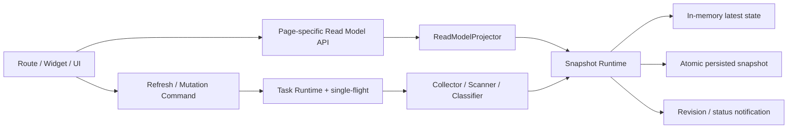
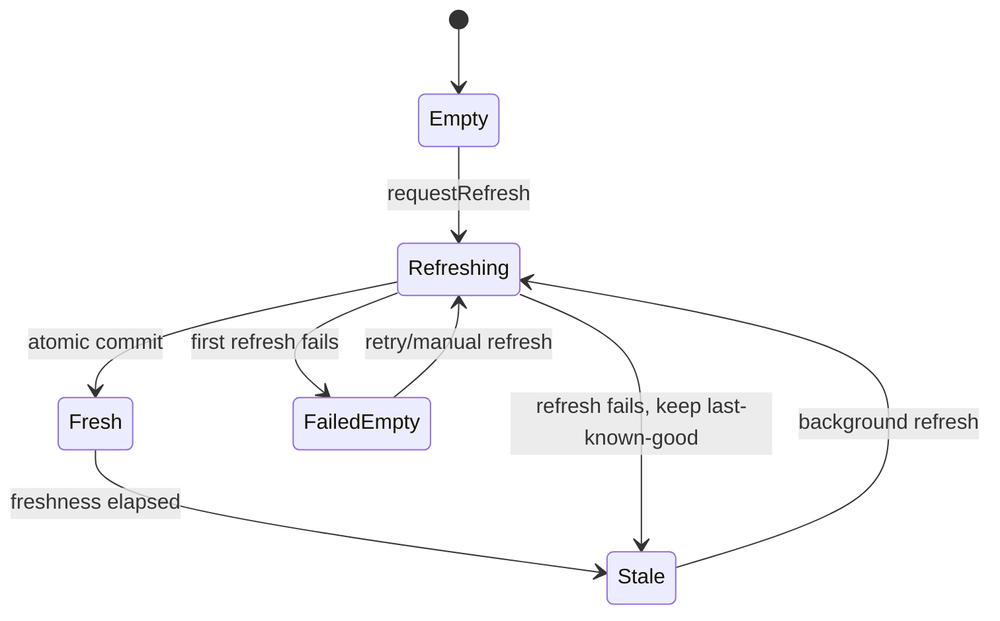

# TrustTools 页面性能架构设计

| 属性 | 值 |
|------|-----|
| 文档类型 | 架构设计文档 (ARCH) |
| 项目名称 | TrustTools |
| 版本 | v1.2 |
| 创建日期 | 2026-08-18 10:59:43 |
| 更新日期 | 2026-08-18 11:15:27 |
| 生成工具 | architecture-design |
| 文档状态 | 已批准 |

## 修订记录

| 版本 | 修改时间 | 修改内容 |
|------|---------|---------|
| v1.2 | 2026-08-18 11:15:27 | 用户批准架构、公共运行时策略、默认周期与迁移顺序，进入实施计划阶段。 |
| v1.1 | 2026-08-18 11:07:59 | 增加统一运行时策略配置源；汇率新鲜度改为 1 天，并集中扫描、任务与资源周期。 |
| v1.0 | 2026-08-18 10:59:43 | 基于代码、构建产物、真实本机数据和既有架构方案形成性能目标架构。 |

---

## 1. 背景、目标与范围

TrustTools 是 Electron + TanStack Start 的本地优先应用。随着本地日志、Skill、Session 和工具数量增长，当前页面读取链路开始暴露扫描阻塞、大对象传输、重复聚合及浏览器/服务器边界泄漏问题。

本设计不改变“模块化单体、本地优先、外部工具目录只读”的总体方向，而是在既有持久化任务运行时和 AtomicJsonStore 基础上，统一事实快照、后台刷新与页面读模型。

### 1.1 目标

1. 任意页面 loader 不执行目录全量扫描、子进程、模型调用或远程网络请求。
2. 页面始终从最近一次可用快照构建紧凑读模型；数据过期不阻塞交互。
3. 启动、计划、手动和数据变更后的刷新复用同一用例、single-flight、取消和审计记录。
4. 原始 Usage/Session 明细保持 server-only，按页面最小化传输。
5. 建立可量化的延迟、载荷、扫描次数、客户端计算和 bundle 预算。
6. 在普通个人电脑、少量数据和弱网络/离线环境下保持稳定可用，并能随数据量增长渐进优化。

### 1.2 非目标

- 不拆微服务，不引入 Redis、远程数据库服务器或消息队列。
- 不为了性能改变现有用户数据目录或读取外部工具目录的安全边界。
- 不在页面请求中追求所有数据强一致；本地分析允许最终一致和 last-known-good。
- 本文不包含文件级实施任务、工期和提交顺序；用户确认后另行生成实施计划。
- 本轮不承诺应用退出后由操作系统唤起后台任务。

### 1.3 设计输入

- 《TrustTools 业务模块化与任务编排架构设计》及 ADR-001～008。
- `docs/develop/performance-architecture-plan.md`。
- 《TrustTools 页面性能架构审计报告》。
- 当前代码、`tsc`、架构门禁、Vite 客户端/SSR 构建和本机真实数据基准。

## 2. 约束、假设与成功标准

### 2.1 约束与假设

| 项目 | 设计处理 |
|------|----------|
| Electron 单机运行 | 使用进程内协调器和本地原子快照，无分布式锁。 |
| renderer 无 Node 权限 | 浏览器只通过 browser-safe RPC/loader 获取 DTO。 |
| 默认离线 | 页面读取不得依赖 Google Fonts、汇率服务或其他远端成功。 |
| 数据允许最终一致 | stale 快照立即返回；刷新失败保留 last-known-good。 |
| 单机资源有限 | 重型 collector 串行或小并发，文件读取设全局上限。 |
| 多 renderer 可能存在 | 共享去重发生在本地服务器/任务层，而不是仅依赖浏览器模块单例。 |
| 现有数据需兼容 | 采用双读/回退和可回滚迁移，不破坏 `~/.trusttools` 数据。 |

### 2.2 建议性能预算

以下为架构验收预算，需经用户确认后写入详细计划：

| 指标 | 目标 |
|------|------|
| Electron 窗口/应用壳可见 | ≤ 500 ms |
| 已有快照的页面 loader | P95 ≤ 150 ms，P99 ≤ 500 ms |
| 缓存导航可交互 | P95 ≤ 500 ms |
| 首次无快照的路由响应 | ≤ 300 ms，随后后台采集 |
| Dashboard 首屏 DTO | ≤ 250 KB JSON |
| 其他单路由首屏 DTO | 通常 ≤ 150 KB JSON |
| Widget 状态检查 | P95 ≤ 50 ms，响应仅含 revision/status |
| 客户端单次同步聚合 | ≤ 50 ms；超过则必须服务端预聚合或切片 |
| 初始共享 JS | ≤ 250 KB gzip |
| 单路由增量 JS | ≤ 120 KB gzip |
| CSS | ≤ 40 KB gzip |
| browser 构建中的 server chunk/Node externalization | 0 |
| 同一领域同时运行的 collector | ≤ 1 |

## 3. 核心架构决策

### 3.1 保持模块化单体，增加统一快照运行时

推荐形态为：



关键约束：

- Query path 只能读 `Snapshot Runtime`，不能触发 Collector。
- Command path 只能请求任务刷新，不能绕过 Task Runtime 直接扫描。
- Collector 成功后一次性原子提交新 revision；失败保留旧数据并更新诊断状态。
- Page projector 只暴露页面所需字段，禁止把领域内部原始对象直接作为 DTO。

### 3.2 统一快照契约

每个领域使用一致的信封，不要求所有领域共用同一个巨型文件：

```ts
type SnapshotStatus =
  | "empty"
  | "fresh"
  | "stale"
  | "refreshing"
  | "failed";

interface SnapshotEnvelope<T> {
  schemaVersion: number;
  revision: string;
  generatedAt: string | null;
  sourceFingerprint: string | null;
  status: SnapshotStatus;
  data: T | null;
  diagnostics: {
    lastAttemptAt: string | null;
    lastSuccessAt: string | null;
    durationMs?: number;
    scannedItems?: number;
    reusedItems?: number;
    warningCodes: string[];
  };
}
```

`SnapshotCoordinator<T>` 的最小职责：

- 进程启动后按需将持久化快照 hydrate 到内存一次。
- `readLatest()` 为 O(1) 内存读取，绝不隐式刷新。
- `requestRefresh(reason)` 委托任务运行时，合并相同领域的并发请求。
- 成功时原子写入并同步内存；失败时保留 last-known-good。
- 提供 revision、freshness、refreshing 和失败摘要，不向 UI 暴露敏感路径。
- 写操作后按领域失效或请求定向刷新。

### 3.3 领域快照而非通用函数缓存

首期领域快照：

| 快照 | 内容 | 建议新鲜度 | 刷新触发 |
|------|------|------------|----------|
| ExchangeRateSnapshot | USD 到展示币种的汇率与来源 | 1 天 | 启动 if-stale、每日后台、手动刷新 |
| UsageSnapshot | 规范化事件、日聚合、工具/模型聚合 | 15 分钟 | 启动 if-stale、计划、手动、日志目录变更 |
| SessionSnapshot | 会话元数据、索引和报告聚合 | 30 分钟 | 启动 if-stale、计划、手动 |
| SkillSnapshot | Skill 元数据、大小/指纹、归属 | 60 分钟 | 启动 if-stale、计划、手动、变更后 |
| InstallationSnapshot | 工具安装与路径可用性事实 | 6 小时 | 启动 if-stale、手动、配置变化 |
| WslTopologySnapshot | distro 与 home 映射 | 6 小时 | 探测需要、手动、失败后短负缓存 |
| ProjectClassificationIndex | 唯一引用到分类结果及指纹 | 随 Usage 刷新增量更新 | 新引用、指纹变化、手动重建 |

通用 TTL/single-flight primitive 仅允许用于 WSL、安装探测等小型 discovery fact，并必须具备：`maxEntries`、负缓存 TTL、可注入 clock、命中/驱逐指标和明确失效 API。不得以 `JSON.stringify(args)` 包装任意领域查询。

### 3.4 公共运行时策略配置

新增唯一的人类可读配置源：`src/app/runtime-policy.source.json`。所有产品级新鲜度、后台刷新周期、任务超时、重试和资源预算从该文件生成或读取；不得继续在 scanner、ServerFn、组件和 composition root 中声明同类魔法数字。

建议结构：

```json
{
  "schemaVersion": 1,
  "snapshotPolicies": {
    "exchangeRates": {
      "freshForMinutes": 1440,
      "defaultRefreshMinutes": 1440,
      "startupPolicy": "if-stale",
      "staleReadable": true,
      "manualRefresh": true,
      "timeoutMs": 15000,
      "network": "allowed"
    },
    "usage": {
      "freshForMinutes": 15,
      "defaultRefreshMinutes": 15,
      "startupPolicy": "if-stale",
      "staleReadable": true,
      "manualRefresh": true,
      "timeoutMs": 120000,
      "network": "forbidden"
    },
    "sessions": {
      "freshForMinutes": 30,
      "defaultRefreshMinutes": 30,
      "startupPolicy": "if-stale",
      "staleReadable": true,
      "manualRefresh": true,
      "timeoutMs": 180000,
      "network": "forbidden"
    },
    "skills": {
      "freshForMinutes": 60,
      "defaultRefreshMinutes": 60,
      "startupPolicy": "if-stale",
      "staleReadable": true,
      "manualRefresh": true,
      "timeoutMs": 180000,
      "network": "forbidden"
    },
    "toolInstallations": {
      "freshForMinutes": 360,
      "defaultRefreshMinutes": 360,
      "startupPolicy": "if-stale",
      "staleReadable": true,
      "manualRefresh": true,
      "timeoutMs": 60000,
      "network": "forbidden"
    },
    "wslTopology": {
      "freshForMinutes": 360,
      "defaultRefreshMinutes": 360,
      "startupPolicy": "on-demand-if-stale",
      "staleReadable": true,
      "manualRefresh": true,
      "timeoutMs": 30000,
      "network": "forbidden"
    },
    "skillMarketEvidence": {
      "freshForMinutes": 360,
      "defaultRefreshMinutes": 360,
      "startupPolicy": "on-demand-if-stale",
      "staleReadable": true,
      "manualRefresh": true,
      "timeoutMs": 30000,
      "network": "allowed"
    }
  },
  "scheduledJobs": {
    "securityMonitor": { "kind": "interval", "minutes": 60 },
    "retention": { "kind": "daily", "localTime": "03:00" },
    "reports": { "kind": "weekly", "weekday": 1, "localTime": "09:00" }
  },
  "resourceBudgets": {
    "maxHeavyCollectors": 1,
    "maxFileOperations": 16,
    "maxProjectClassifiers": 8
  }
}
```

上例聚焦维护者最常调整的时间与资源字段；正式 `scheduledJobs` schema 继续包含 `executorKey`、约束、重试、队列和审批等现有安全元数据，但这些字段也归属同一源文件。

配置治理规则：

1. `freshForMinutes` 表示快照多久后标记为 stale；`defaultRefreshMinutes` 表示调度器默认多久尝试刷新。两者必须分别命名，不使用含义模糊的 `ttl`。
2. `runtime-policy.schema.ts` 对源文件进行严格校验；构建期从同一源生成 `runtime-policy.generated.ts` 和任务目录投影，生成文件不得手工编辑。
3. 现有 `job-catalog.json` 取消作为独立权威源，其任务定义并入 `scheduledJobs`；迁移完成后不得保留两个可独立修改的周期或超时值。
4. 持久化用户设置只可在配置声明的最小/最大范围内覆盖 `defaultRefreshMinutes`。内建安全上限、网络权限和 stale 降级策略不可由 UI 放宽。
5. 手动刷新可绕过 freshness 和 schedule，但仍受 single-flight、超时和资源预算约束。
6. 汇率在 24 小时内不发起自动网络刷新；超过 24 小时仍先返回 stale cache，再由后台任务尝试更新。离线失败继续使用 last-known-good。
7. 此文件只收纳会影响数据读取、后台 I/O、网络和任务资源的产品级策略。React debounce、动画时长、toast 时长和错误去重等局部 UI 参数留在所属模块。

首期建议的可读默认表：

| 策略键 | 数据新鲜度 | 默认刷新周期 | 说明 |
|--------|------------|--------------|------|
| `exchangeRates` | 1 天 | 1 天 | 页面从不等待网络；支持手动刷新。 |
| `usage` | 15 分钟 | 15 分钟 | 只在后台扫描，数据变化较频繁。 |
| `sessions` | 30 分钟 | 30 分钟 | 报表与会话列表共用快照。 |
| `skills` | 60 分钟 | 60 分钟 | 支持变更后的定向失效。 |
| `toolInstallations` | 6 小时 | 6 小时 | 安装状态变化较少，手动刷新可立即发现。 |
| `wslTopology` | 6 小时 | 6 小时或按需 | 避免重复启动 `wsl.exe`。 |
| `skillMarketEvidence` | 6 小时 | 6 小时或按需 | 替代 scanner 内部 5 分钟魔法常量。 |

非快照类的 Security Monitor、Retention 和 Reports 计划也放在同一文件的 `scheduledJobs` 中。它们与 `snapshotPolicies` 分区展示，避免把“缓存新鲜度”和“业务计划任务”误认为同一种周期。

## 4. 数据读取与投影设计

### 4.1 页面专用读模型

| 消费者 | DTO | 允许内容 | 禁止内容 |
|--------|-----|----------|----------|
| Dashboard | `DashboardSummaryReadModel` | KPI、趋势桶、Top N、洞察摘要、快照状态 | 完整原始事件、重复 V1/V2 snapshot |
| Agents | `AgentUsageOverviewReadModel` | Agent/工具聚合、趋势、状态 | Dashboard 全量 DTO |
| Skills | `SkillsReadModel` | Skill 列表、筛选项、必要的紧凑使用摘要 | 隐藏区域使用的完整 Dashboard 模型 |
| Widget | `WidgetReadModel` | today/7d/30d/all 四组预聚合数字、revision | 原始事件、浏览器端重新聚合 |
| Sources | `SourcesReadModel` | 工具安装、日志可用性、最近刷新和错误摘要 | 打开页面时重新扫描 |
| Reports | `ReportsReadModel` | 一次 SessionSnapshot 上的密度和分页结果 | 每页重新调用 scanner |
| Knowledge | `KnowledgeListReadModel` | 批量读取的列表摘要 | 每项独立 AtomicJsonStore read |

原始 Usage/Session 只保留在 server domain/infrastructure。确需明细时，使用显式分页、详情或导出接口，并设置页大小上限。

### 4.2 服务端预聚合

Usage refresh 完成时生成：

- 日粒度 buckets；
- today、7d、30d、all 常用窗口；
- 工具、模型、项目、Agent 的 Top N 与总量；
- Dashboard 和 Widget 所需的低基数趋势；
- 聚合输入 revision 与算法版本。

Projector 按 `snapshotRevision + locale + pageParams` 做有界内存 memoization。它只缓存紧凑投影，不缓存任意函数返回值；revision 变化时旧投影自然失效，并设置最大条目数。

若确认支持任意日期范围，则以日 buckets 在服务端查询，复杂度与天数而非事件数相关；不把所有事件发到浏览器。

### 4.3 首次运行与错误语义

页面读取遵循以下状态机：



- `empty`：立即返回空态/骨架并异步请求刷新。
- `stale`：立即返回旧数据，标记更新时间，同时后台刷新。
- `failed + data`：展示旧数据和非阻塞告警。
- `failed + no data`：展示可重试空态，不让 loader 等待扫描。

## 5. 路由、缓存与客户端状态

### 5.1 Loader 规则

所有 loader 必须满足：

1. 只调用 browser-safe query facade。
2. 服务端 query 只读 coordinator/projector。
3. 不调用文件遍历、`wsl.exe`、Git、模型、远程汇率或其他网络。
4. 缺少/过期快照时仅发起非阻塞 refresh 请求。
5. 返回 DTO 前记录序列化字节数和耗时，超预算在开发环境告警。

### 5.2 TanStack Router 与 Query 的所有权

采用当前 TanStack 语义：

- Router loader 负责 SSR 首屏和路由级数据；按页面配置 `staleTime`、`gcTime`、`preloadStaleTime`，使用默认后台 `staleReloadMode`。
- Query 负责 Widget/客户端交互轮询、mutation 后失效和不属于首屏路由的数据。
- 同一数据集只指定一个缓存所有者；不同时由 Router 和 Query 维护独立新鲜度。
- 使用 `loaderDeps` 把范围、筛选等显式纳入路由缓存键。

参考官方文档：[TanStack Router Data Loading](https://tanstack.com/router/latest/docs/guide/data-loading) 与 [TanStack Query SSR](https://tanstack.com/query/latest/docs/framework/react/guides/ssr)。

### 5.3 Widget 协议

Widget 不再每 30 秒读取完整 Dashboard：

1. 以 30～60 秒、页面可见性自适应的频率读取 `SnapshotStatusReadModel`。
2. 状态响应只含各领域 `revision/status/generatedAt` 及必要安全摘要。
3. 仅当 revision 变化时获取紧凑 `WidgetReadModel`。
4. 单 renderer 内由 Query 去重；跨 renderer 读取相同服务器内存投影，开销保持很小。
5. 窗口隐藏时暂停或显著降频，恢复可见时立即校验 revision。

## 6. 刷新、调度、取消与资源预算

### 6.1 唯一刷新入口

以下触发源都调用同一个 `RefreshDomainSnapshot` 用例：

- 启动 if-stale；
- 周期任务；
- 用户手动刷新；
- 数据写入/迁移后的失效；
- 首次页面发现 empty 后的 fire-and-forget 请求。

用例由 Task Runtime 持有 single-flight、运行记录、超时、取消和重试策略。页面与 API 禁止直接 new scanner 或调用 collector。

### 6.2 真实取消

`AbortSignal` 必须贯穿：

```text
Task Runtime
  -> Refresh Use Case
    -> Collector
      -> directory iterator / file read
      -> bounded classifier
      -> execFile child process
```

- 目录循环定期检查 `signal.aborted`。
- 子进程取消时发送终止并等待退出；失败时记录 warning，不启动更强制的破坏性操作。
- budget timeout 触发 controller abort，而不是只做 Promise race。
- commit 前再次检查 signal；被取消的半成品不得覆盖 last-known-good。

### 6.3 资源预算

- 同一领域 collector 并发：1。
- 全局重型采集并发：建议 1；轻型事实探测可与其并行。
- 文件读取/解析并发：初始 16，基准后可在 16～32 调整。
- 项目分类按唯一引用去重，使用有界 worker pool；依据路径指纹/mtime 增量复用。
- WSL 发行版枚举和 home 查询在一个 topology refresh 内完成，不在 Claude/Codex 扫描中分别重复。
- 若扫描持续时间超过计划周期，不排队堆积，只合并为一次后续 refresh-needed 标记。

## 7. Root、网络与静态资源

### 7.1 汇率

根 loader 只允许读取：fresh cache、stale cache 或内建默认汇率，不允许发起网络请求。汇率默认 24 小时后才标记过期并由独立后台/手动任务刷新，设置超时、退避、last-known-good 和来源时间。该周期只从公共运行时策略配置读取。

### 7.2 字体

删除首屏对 Google Fonts 的运行时依赖，优先使用随包自托管字体或可靠的系统字体栈。离线和 DNS 异常不得改变应用壳可见时间。

### 7.3 Electron 启动

保持“先创建窗口，后异步预热”。启动阶段只 hydrate 小型快照元数据和开启本地服务器；不得同步等待全量扫描。当前已实现的非阻塞预热不回退。

## 8. 浏览器/服务器边界与代码拆分

### 8.1 入口约束

每个模块提供窄入口：

```text
module/
  contracts.ts           # 纯 DTO/type，browser-safe
  query.ts               # createServerFn facade，browser-safe
  presentation/          # React UI
  application/           # server use cases
  infrastructure/        # scanner/store/Node APIs
  server.ts              # server-only composition
```

- presentation 不导入或 re-export `*.server.ts`。
- query handler 动态加载 server 入口；contracts 不引用 server 类型。
- 禁止“导出整个模块所有层”的 barrel；消费者从明确入口导入。
- browser 构建门禁扫描 Node externalization 警告、`*.server` 公开 chunk 及 Node builtin。

### 8.2 路由与可视化拆分

- 使用 TanStack Router 自动 code splitting 或 `.lazy.tsx` 拆分非关键 route component。
- Recharts、复杂图表、详情 modal 和 below-the-fold 区域按需加载。
- 拆分 `dashboard-v2-sections`、`ToolOverview`、`SkillsPage` 等大型组件，减少无关页面共同进入共享图。
- chunk 名称只用于定位，不假设 `createLucideIcon` 命名块全部来自 Lucide；以 bundle analyzer 的真实模块构成为准。

参考：[TanStack Router Code Splitting](https://tanstack.com/router/latest/docs/guide/code-splitting)。

## 9. 持久化、兼容与数据安全

### 9.1 持久化策略

- 复用现有 AtomicJsonStore 和 schema version。
- 每个领域独立文件或逻辑 key，采用临时文件 + 原子替换。
- repository 在首次读取后持有 read-through state；成功 write 后同步更新，而非每次 `get` 重读整文件。
- 快照只保存完成态；刷新中状态可只驻留内存，重启后按上次完成快照恢复。
- 原始路径、prompt、凭据等敏感值不进入聚合诊断或性能日志。

### 9.2 迁移兼容

1. 新 coordinator 优先读取新 schema；不存在时兼容读取现有 usage snapshot。
2. 切换阶段允许旧 query 与新 query 结果并行比对，但只向 UI 返回一个权威结果。
3. 新快照异常时可通过 feature flag 回退旧读取路径；不得删除用户原始日志。
4. 验证稳定后删除 legacy 30 秒 cache、页面直连 scanner 和冗余读模型。
5. schema 迁移失败时保留原文件并记录可诊断错误，不静默覆盖。

## 10. 可观测性与性能验证

### 10.1 指标

| 层 | 指标 |
|----|------|
| Route/API | loader/query/projector 耗时、DTO 序列化字节数、状态码 |
| Snapshot | revision、age、命中状态、hydrate/commit 耗时、last success/failure |
| Collector | 总耗时及 discover/read/parse/classify/aggregate 各阶段耗时 |
| Scanner | 扫描/复用/失败文件数、WSL 子进程次数、唯一项目引用数 |
| Task | 触发原因、合并/跳过/取消/超时、实际并发 |
| Client | hydration、JSON parse、长任务、视图同步计算、Widget 请求数 |
| Build | 初始/路由 chunk gzip、CSS、server 泄漏告警、循环依赖 |

所有本地日志默认脱敏，不记录完整用户路径、会话内容、API Key 或 prompt。

### 10.2 测试层次

- 单元：freshness 状态机、revision、投影正确性、容量淘汰、取消、last-known-good。
- 集成：快照 hydrate/refresh/commit、手动与计划 single-flight、mutation invalidation。
- 契约：DTO 不含原始事件/敏感字段，schema 可兼容升级。
- 性能：固定脱敏 fixture 的 cold/warm/10x 数据量基准。
- E2E：无快照、stale、刷新失败、离线、WSL 不可用、多窗口 Widget。
- 构建：bundle budget、server-only 边界、架构依赖门禁。

建议把本次实测结果保存为非阻断 baseline，优化阶段逐步收紧；最终门禁使用稳定 fixture，不依赖开发者私人数据。

## 11. 高层迁移路线

本节只定义架构阶段和退出条件，不替代用户确认后的详细实施计划。

### 阶段 A：基线与护栏

- 增加读模型字节数、扫描次数、阶段耗时和 bundle 分析。
- 建立 `runtime-policy.source.json`、schema 和生成投影，收敛现有分散周期。
- 修正架构门禁基线语义和 browser/server 构建门禁。
- **退出条件**：可稳定复现当前冷/热路径，新增回退能被 CI 或开发诊断捕获。

### 阶段 B：紧凑页面读模型

- 先移除 Dashboard 重复明细，拆分 Dashboard/Agents/Skills/Widget/Sources/Reports DTO。
- 将四个常用窗口和报告密度移到服务端一次聚合。
- **退出条件**：Dashboard ≤ 250 KB，Skills 不再加载 Dashboard，大部分客户端同步聚合 ≤ 50 ms。

### 阶段 C：统一快照协调器

- 在既有 AtomicJsonStore/UsageApplication 上引入统一 envelope/coordinator。
- 页面只读快照；empty/stale 时非阻塞请求 refresh。
- **退出条件**：所有目标 loader 都不执行 scanner、子进程或网络。

### 阶段 D：采集、索引和任务收敛

- Session、Skill、Installation、WSL、Classification 迁移到统一任务路径。
- 实现真实取消、有界并发、增量分类和单次 Session 投影。
- **退出条件**：所有刷新源 single-flight；超时后无遗留工作；Reports 无重复扫描。

### 阶段 E：客户端和构建清理

- 修复 server 泄漏、窄化 barrel、路由/图表懒加载、Widget revision 协议。
- 根 loader 网络移除，字体本地化。
- **退出条件**：bundle 和边界预算通过，无公开 server chunk。

### 阶段 F：清理与默认启用

- 观察一段稳定期后移除 legacy cache/直连 scanner/双读兼容。
- 更新 ADR、运维说明和故障恢复文档。
- **退出条件**：新链路默认启用，回滚演练和数据兼容测试通过。

每阶段必须可独立发布，通过 feature flag 或入口切换回滚；不得以一次大规模重写完成。

## 12. 方案权衡

| 选择 | 采用原因 | 代价/缓解 |
|------|----------|-----------|
| 持久化领域快照 | 首屏稳定、离线、重启可复用 | 数据最终一致；通过更新时间、手动刷新和 last-known-good 表达。 |
| 页面专用 DTO | 显著降低序列化和客户端计算 | DTO 数量增加；用公共低层 contract 和契约测试控制重复。 |
| 后台统一刷新 | 消除页面扫描与并发风暴 | 首次可能先见空态；提供明确进度和刷新状态。 |
| 服务端预聚合 | 避免把大明细送入 renderer | 刷新时 CPU/磁盘略增；一次计算、多次读取更适合本地应用。 |
| 不引入 Redis/数据库服务 | 符合单机、离线和运维约束 | 超大数据规模时需再评估嵌入式索引；当前先使用日 buckets/文件快照。 |
| Router/Query 单一所有权 | 避免双缓存语义 | 需要逐页面明确数据生命周期并迁移现有 provider。 |

## 13. 风险与缓解

| 风险 | 等级 | 缓解 |
|------|------|------|
| 聚合算法迁移导致数字与旧页面不一致 | 高 | 同 revision 影子对比、fixture 金标、误差为 0 后切换。 |
| 首次空态体验被认为“没数据” | 中 | 明确“正在首次扫描”、进度/阶段、完成后 revision 刷新。 |
| 快照 schema 演进损坏旧数据 | 高 | 版本化、原子写、保留原文件、失败回退 last-known-good。 |
| 任务默认未启用导致数据长期 stale | 高 | snapshot freshness 与任务偏好联动；empty/stale 可非阻塞触发；设置页可见状态。 |
| 取消传播不完整 | 高 | scanner contract 强制 signal，集成测试验证子进程/文件循环停止。 |
| 懒加载破坏 SSR/hydration | 中 | 按官方 route splitting 机制，增加 SSR smoke 和 hydration error 门禁。 |
| 过早建立复杂索引 | 中 | 先做紧凑投影和日 buckets；只在 fixture 显示必要时引入嵌入式索引。 |

## 14. 已确认决策

用户已确认以下默认值：

1. **首次体验**：无快照时立即显示壳层/空态并后台扫描（推荐），不阻塞等待真实数据。
2. **新鲜度**：汇率 1 天、Usage 15 分钟、Session 30 分钟、Skill 60 分钟、Installation/WSL 6 小时；全部在公共运行时策略源中集中声明，页面始终允许读 stale。
3. **自定义日期**：保留 Dashboard 任意日期范围，使用服务端日 buckets 查询，不向浏览器发送原始事件。
4. **本地持久化**：允许保存脱敏聚合快照、revision 和诊断摘要。
5. **迁移顺序**：先观测和紧凑 DTO，再统一快照/任务，最后拆包与删除 legacy。

完整实施计划已生成至 `docs/develop/plan/TrustTools-页面性能优化-敏捷任务清单.md`，包含 Epic、文件级任务、依赖、验收标准、测试、回滚、迁移与阶段门禁。

## 15. 架构自检

| 检查项 | 结果 |
|--------|------|
| 与模块化单体、本地优先和安全边界一致 | 通过 |
| 产品级刷新与新鲜度是否存在唯一、清晰的配置源 | 通过 |
| 组件所有权和依赖方向明确 | 通过 |
| 读取、刷新、失败、取消、持久化语义明确 | 通过 |
| 性能和容量目标可测量 | 通过，预算待用户确认 |
| 首次运行、stale、失败和多窗口场景覆盖 | 通过 |
| 数据兼容和回滚路径明确 | 通过 |
| 不包含未经确认的详细实施承诺 | 通过 |
| 仍需外部决策 | 无；进入实施后仅按 Gate 证据决定是否继续灰度。 |
