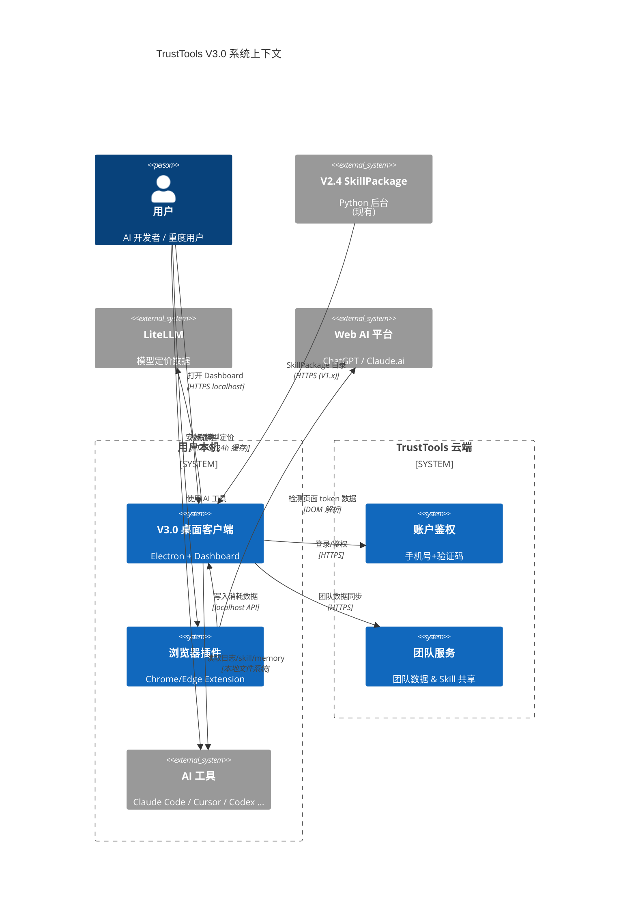
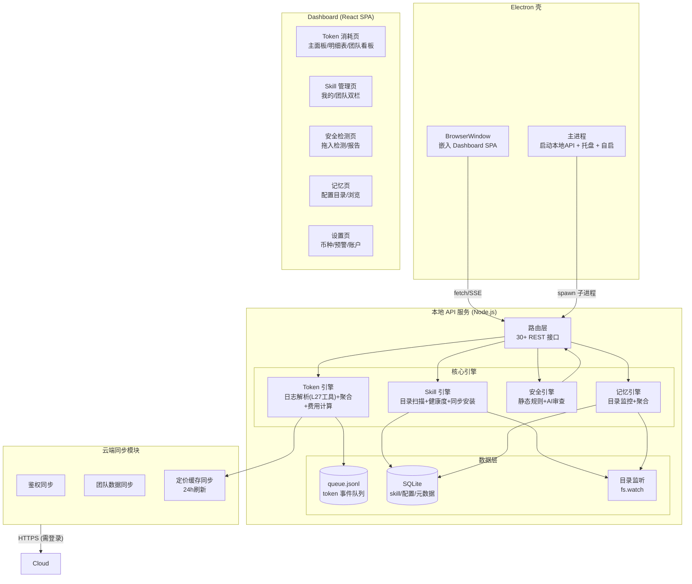
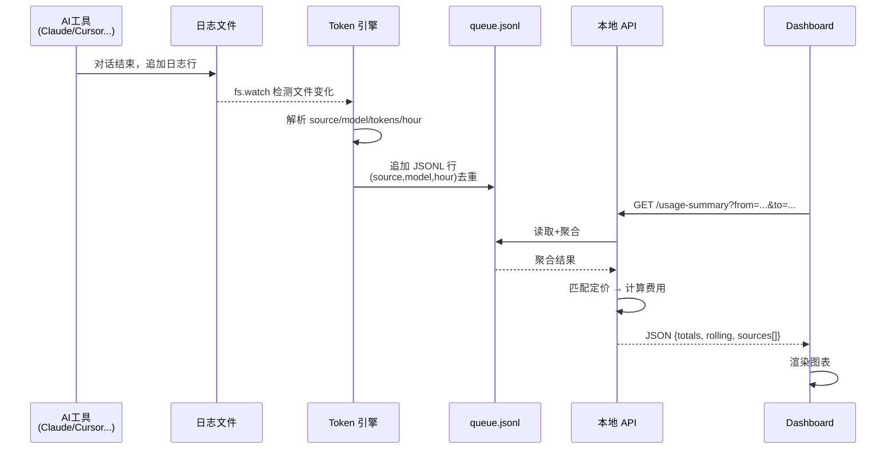
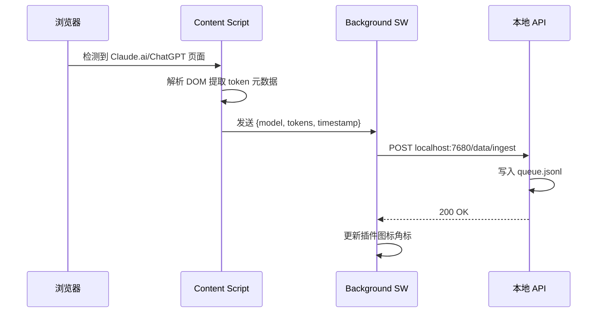
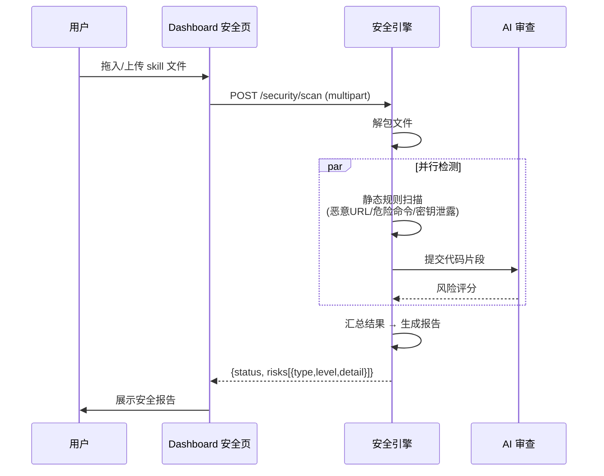

# TrustTools V3.0 架构设计文档

| 属性     | 值                          |
| -------- | --------------------------- |
| 文档类型 | 架构设计文档 (ARCH)         |
| 项目名称 | TrustTools V3.0（代号待定） |
| 版本     | v1.0                        |
| 创建日期 | 2026-07-24 14:08:36         |
| 更新日期 | 2026-07-24 14:08:36         |
| 生成工具 | architecture-design         |
| 文档状态 | 草稿                        |

## 修订记录

| 版本 | 修改时间            | 修改内容 |
| ---- | ------------------- | -------- |
| v1.0 | 2026-07-24 14:08:36 | 初始版本 |

---

## 1. 背景与目标

基于 TrustTools V2.4 已有能力（SkillPackage 后台），构建 V3.0 桌面客户端，把 Token 追踪、Skill 管理、安全检测、记忆聚合、团队协作整合为统一的个人 AI 主权工具。

**核心原则：本地优先，云端辅助。**

---

## 2. 架构总览

### 2.1 系统上下文图



### 2.2 本地 vs 云端边界

```
┌─────────────────────────────────────────────────────┐
│                    用户本机                          │
│                                                     │
│  ┌──────────┐  ┌──────────┐  ┌──────────────────┐  │
│  │ Electron │  │ 浏览器插件 │  │  27 个 AI 工具    │  │
│  │  壳+Dash │  │          │  │  (Claude Code,...) │  │
│  │  board   │  │          │  │                    │  │
│  └────┬─────┘  └────┬─────┘  └────────┬───────────┘  │
│       │             │                 │               │
│       │    ┌────────┴────────┐       │               │
│       └────┤  本地 API 服务   │◄──────┘               │
│            │  (localhost:7680)│                       │
│            └───────┬─────────┘                       │
│                    │                                 │
│         ┌──────────┼──────────┐                      │
│    ┌────┴────┐ ┌───┴────┐ ┌──┴──────┐               │
│    │ JSONL   │ │ SQLite │ │ 配置    │               │
│    │ token   │ │ skill/ │ │ 文件    │               │
│    │ events  │ │ memory │ │         │               │
│    └─────────┘ └────────┘ └─────────┘               │
│                                                     │
│   个人功能 100% 本地，不依赖云端                        │
└──────────────────────┬──────────────────────────────┘
                       │
            ┌──────────┴──────────┐
            │    TrustTools 云端   │
            │  （可选，需登录）      │
            │                     │
            │  ┌───────────────┐  │
            │  │  账户鉴权     │  │
            │  └───────────────┘  │
            │  ┌───────────────┐  │
            │  │  团队数据同步  │  │
            │  └───────────────┘  │
            │  ┌───────────────┐  │
            │  │  LiteLLM 定价  │  │
            │  │  缓存         │  │
            │  └───────────────┘  │
            └─────────────────────┘
```

---

## 3. V3.0 内部模块架构



---

## 4. 数据流

### 4.1 Token 采集链路



### 4.2 浏览器插件链路



## 4.3 Skill 安全检测链路



---

## 5. 数据模型

### 5.1 Token 事件

| 字段                        | 类型     | 说明                              |
| --------------------------- | -------- | --------------------------------- |
| source                      | string   | 来源工具 (claude/cursor/codex...) |
| model                       | string   | 模型名                            |
| hour_start                  | ISO 8601 | UTC 半小时桶                      |
| input_tokens                | number   | 输入 token                        |
| output_tokens               | number   | 输出 token                        |
| cached_input_tokens         | number   | 缓存读取                          |
| cache_creation_input_tokens | number   | 缓存写入                          |
| reasoning_output_tokens     | number   | 推理 token                        |
| billable_total_tokens       | number   | 计费 token                        |
| conversation_count          | number   | 对话轮次                          |
| project_key                 | string   | 项目标识 (可选)                   |

### 5.2 Skill 注册表

| 字段                  | 类型     | 说明                  |
| --------------------- | -------- | --------------------- |
| id                    | uuid     | 唯一标识              |
| name                  | string   | Skill 名称            |
| source_dir            | string   | 来源目录              |
| install_date          | datetime | 安装时间              |
| last_active           | datetime | 最近调用时间          |
| call_count_7d/30d/90d | number   | 各周期调用次数        |
| health_status         | enum     | 活跃/低频/休眠/废弃   |
| owner                 | enum     | 个人/团队             |
| team_id               | uuid     | 归属团队 (团队 skill) |

---

## 6. 部署拓扑

```
用户机器 A (macOS)                  用户机器 B (Windows)
┌────────────────────┐             ┌────────────────────┐
│  V3.0 Desktop.app  │             │  V3.0 Desktop.exe  │
│  Chrome Extension  │             │  Edge Extension    │
│  本地数据 (JSONL+SQLite)           │  本地数据            │
└────────┬───────────┘             └────────┬───────────┘
         │                                  │
         │    HTTPS (登录后)                    │
         └──────────────┬───────────────────┘
                        │
              ┌─────────┴─────────┐
              │  TrustTools 云端   │
              │  (最小化服务)      │
              │                   │
              │  Nginx            │
              │  ├─ Auth API      │
              │  │  (phone+code)  │
              │  ├─ Team API      │
              │  │  (MySQL/PSQL)  │
              │  └─ Pricing CDN   │
              │     (静态JSON)    │
              └───────────────────┘
```

---

## 7. 风险清单

| 风险                        | 影响               | 缓解                        |
| --------------------------- | ------------------ | --------------------------- |
| 技术栈未定                  | 阻塞排期           | 尽快和老板对齐              |
| 27 个 AI 工具日志格式差异大 | Token 引擎工作量大 | 好弄的先上，逐个覆盖        |
| 本地 API 和浏览器插件通信   | 跨进程通信复杂度   | 统一 localhost 协议         |
| 云端团队服务另增复杂度      | 运维成本           | 最小化云端——仅鉴权+团队数据 |

---

## 8. 自检摘要

- [x] 本地 vs 云端边界清晰划分
- [x] 数据流完整覆盖采集→存储→展示
- [x] 现有 V2.4 和 V3.0 关系明确
- [x] 技术栈标注为假设（Node.js）
- [ ] 待技术栈决策后更新部署和运行时章节
