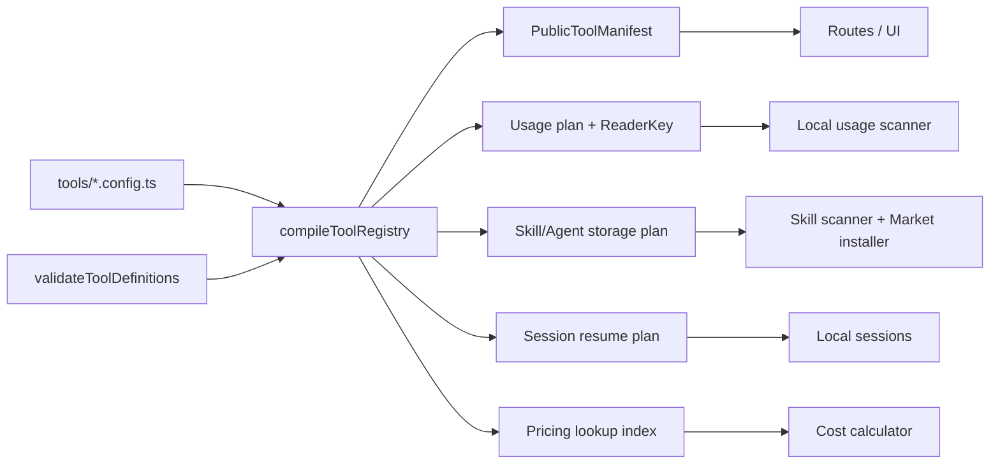

# TrustTools AI 工具模块化架构设计

| 属性     | 值                                     |
| -------- | -------------------------------------- |
| 文档类型 | 架构设计文档 (ARCH)                    |
| 项目名称 | TrustTools-AI工具模块化                |
| 版本     | v1.1                                   |
| 创建日期 | 2026-08-05 14:39:08                    |
| 更新日期 | 2026-08-05 14:42:59                    |
| 生成工具 | agile-feature-dev、architecture-design |
| 文档状态 | 草稿                                   |

## 修订记录

| 版本 | 修改时间            | 修改内容                                                   |
| ---- | ------------------- | ---------------------------------------------------------- |
| v1.1 | 2026-08-05 14:42:59 | 补充 source-aware 计费、公共 manifest 交付边界与注册白名单 |
| v1.0 | 2026-08-05 14:39:08 | 初始架构设计与迁移方案                                     |

## 1. 背景、目标与成功标准

TrustTools 已支持 27 个 AI 开发工具，并已有工具目录、用量采集适配器、Skill 扫描规则、价格表、会话恢复逻辑和市场安装目标。但这些知识分散在 `src/lib/tools/catalog.ts`、`src/lib/local-usage/adapters/catalog.ts`、`src/lib/local-skills/agent-rules.ts`、`src/lib/pricing/catalog.ts` 等处；新增一个工具会修改多个文件，且不能从一个位置判断该工具究竟支持哪些能力。

本次重构将每个工具的静态知识收敛为独立的 `*.config.ts`，例如 `codex.config.ts`。任何业务模块只能消费注册表的派生结果，不能维护自己的工具名单、工具名称或路径常量。

成功标准：

1. 新增一个“已有通用采集器支持”的工具时，只新增一个配置文件和一个注册表导出；不改 UI、市场、探测、Skill 或价格消费者。
2. 特殊格式工具只额外实现一个受控 Reader，并在该工具配置中引用 Reader ID；配置文件不含 I/O、网络、环境读取或解析代码。
3. 工具是否支持“探测、用量、Skill、Agent、会话恢复、市场安装、价格估算”等能力可由同一配置直接回答。
4. 配置在模块加载时和 CI 中同时校验：ID、路径安全性、能力组合、Reader 引用、模型价格匹配优先级均不可失效。
5. 现有 27 工具、9 个 Skill Agent、Codex/Claude 原生采集、3 个会话恢复工具及既有价格计算的行为保持兼容；迁移期间可随时回滚。

非目标：本期不把任意第三方 JavaScript/TypeScript 当作运行时插件执行，不把工具解析器动态下载到本机，也不承诺所有 27 个工具都具备用量、Skill 或恢复能力。

## 2. 输入验证、假设与约束

| 检查项           | 状态        | 结论                                                                                           |
| ---------------- | ----------- | ---------------------------------------------------------------------------------------------- |
| 功能描述         | ✅ 已提供   | 每个工具以独立 `*.config.ts` 描述全部相关能力。                                                |
| 技术约束         | ✅ 已提供   | 现有 React + TypeScript + TanStack Start + Electron 单仓库；保持本地优先与 Electron IPC 边界。 |
| 团队规模与所有权 | ⚠️ 部分提供 | 未提供；方案按 1–5 人维护同一模块化单体设计，不拆微服务。                                      |
| 数据规模、吞吐量 | ⚠️ 缺失     | 假设为本机日志扫描、百级工具配置、单用户交互；配置编译在启动期执行。                           |
| 延迟/可用性      | ⚠️ 缺失     | 假设探测与扫描仍可异步，页面 P95 < 500ms（缓存命中时）。                                       |
| 安全与合规       | ✅ 部分提供 | 延续“仅读结构化元数据、不读取/持久化对话正文”；配置和用户覆盖均需防路径逃逸。                  |

关键假设的置信度为中等。若团队将扩展为多包、多进程独立交付，或需要由远端动态发布工具定义，应在进入实施前重新评审注册表加载与签名分发方案。

现有工作区有未提交的 Skill 和文档修改。本方案不覆盖那些文件；迁移实施应在独立分支上进行，并以当前工作树为基线完成行为对照测试。

## 3. 架构驱动因素与现状映射

| 驱动因素             | 现状证据                                                      | 架构回应                                                                |
| -------------------- | ------------------------------------------------------------- | ----------------------------------------------------------------------- |
| 一个工具，多种能力   | `AI_TOOLS` 只描述名称和探测路径；Skill、Adapter、价格另有目录 | 单个 `ToolDefinition` 聚合能力配置，再按领域派生索引。                  |
| 特殊解析不可纯配置化 | Codex/Claude 解析与上下文统计具有专门实现                     | 配置只引用稳定 Reader Key；Reader 实现由受控工厂注册。                  |
| 本地路径与隐私安全   | 外部 adapter 已限制相对路径、只读 SQL                         | Registry 使用同等路径规则；运行时解析后的绝对路径不可泄露给浏览器。     |
| UI 需安全消费        | 工具名称、功能状态用于 Dashboard、Sources、Skills、Market     | 建立无 Node API 的 `public-manifest.ts`，由同一注册表导出安全展示字段。 |
| 价格需要确定性       | 当前 `MODEL_PRICES` 使用函数 matcher，规则不易审计            | 改为声明式 `ModelRateRule`，编译时生成索引并报告重叠与未知匹配。        |
| 可渐进迁移           | 现有产品功能与未提交工作不能中断                              | 先建立双读/对照，再逐消费者切换，最后删除兼容层。                       |

## 4. 推荐系统形态与核心决策

推荐形态是**模块化单体中的静态工具注册表 + 受控扩展点**，而不是可执行插件或微服务。

原因：工具数量是几十级，所有能力都运行在同一桌面客户端且共享隐私、缓存、Electron IPC 与发布节奏。静态 TypeScript 配置具有类型检查、打包可见性和可审查性；在尚无独立团队与部署需求时，微服务或任意代码插件会引入分布式和供应链风险，而不能降低新增工具的主要成本。

| 决策     | 采用                                                          | 放弃/代价                     | 复审触发条件                                           |
| -------- | ------------------------------------------------------------- | ----------------------------- | ------------------------------------------------------ |
| 配置格式 | 版本控制内的 `.config.ts` + `defineTool()`                    | 不能由最终用户直接执行外部 TS | 需要官方远程目录时，增加签名 JSON 分发层。             |
| 扩展机制 | 配置引用 Reader/Feature Key，工厂映射到内建实现               | 新日志格式仍需编写 Reader     | 同类工具超过 5 个重复 Reader 后，抽通用 Reader。       |
| 工具目录 | 按工具拆文件、集中注册                                        | 首次迁移涉及较多 import 变更  | 工具数超过 100 时，按 provider 子目录组织。            |
| 价格归属 | 价格规则随工具配置声明，注册表统一编译                        | 跨工具同名模型要明确优先级    | 多工具共享同一计费来源时，新增 provider 级可复用片段。 |
| 用户定制 | JSON 覆盖“启用状态/附加安全路径”，不允许覆盖 Reader/命令/价格 | 用户不能用配置注入任意行为    | 确有生态需求时引入签名的 declarative JSON schema。     |

## 5. 目标目录与依赖规则

```text
src/lib/tool-registry/
├── contracts.ts                 # 领域类型：ToolDefinition、Capability、ReaderKey
├── define-tool.ts               # 只做静态结构和类型收窄
├── validate.ts                  # 纯校验；供测试和启动期复用
├── registry.ts                  # 汇总、编译派生索引、get/list API
├── public-manifest.generated.ts # 预构建生成的 UI 安全投影；不导入完整 config
├── overrides.server.ts          # ~/.trusttools/tool-overrides.json 读取/校验/原子写入
├── tools/
│   ├── codex.config.ts
│   ├── claude-code.config.ts
│   ├── cursor.config.ts
│   └── ...每个支持工具一个文件
├── readers/
│   ├── contracts.ts             # UsageReader、SessionReader 接口
│   ├── usage-readers.ts         # ReaderKey -> 内建 usage reader
│   ├── session-readers.ts       # ReaderKey -> 内建 session reader
│   ├── codex.ts                 # 从现有 Codex reader 迁入
│   └── claude-code.ts           # 从现有 Claude reader 迁入
└── pricing/
    ├── contracts.ts
    └── index.ts                 # ToolDefinition[] -> 已排序价格查询索引

src/lib/local-usage/             # 保留扫描、聚合、缓存；只查询 registry
src/lib/local-skills/            # 保留文件发现、安装和同步；只查询 registry
src/lib/local-sessions/          # 保留聚合视图；只调用 session reader registry
src/lib/tools/                   # 过渡期兼容导出，最终仅保留 detection 或删除
src/lib/pricing/                 # 保留费用算法与动态快照；静态目录迁至 tool-registry
```

配置注册必须通过 `tools/index.ts` 的显式静态 import 白名单完成，禁止扫描目录或根据用户输入动态 import。依赖方向必须为：`routes/components -> 领域服务 -> tool-registry contracts/registry -> tool configs`；Reader 实现可以依赖本领域解析工具，但工具配置不能依赖 Reader 实现。`tool-registry` 不得导入 route、React、Electron IPC 或 server function。`public-manifest.generated.ts` 由校验通过的 registry 在 prebuild 生成，只包含 display、能力状态与 i18n key；浏览器不得导入完整 config、`overrides.server.ts` 或 Node Reader。

## 6. 每工具配置契约

工具配置是纯数据，使用 `satisfies ToolDefinition` 接受编译期约束。示意（字段为设计契约，不是本次提交的代码）：

```ts
export default defineTool({
  id: "codex",
  display: { name: "Codex CLI", nameZh: "Codex CLI", icon: "codex" },
  detection: { roots: [".codex"], executable: ["codex"] },
  storage: {
    dataRoots: [{ key: "home", path: ".codex" }],
    skills: {
      roots: [{ base: "env:CODEX_HOME|home", path: "skills" }],
      markers: ["SKILL.md", "skill.md"],
      maxDepth: 3,
    },
    agents: { roots: [{ base: "env:CODEX_HOME|home", path: "agents" }] },
  },
  capabilities: {
    usage: { mode: "native", reader: "codex-rollout-v1", paths: [/* ... */] },
    skills: { mode: "read-write" },
    agents: { mode: "read" },
    sessions: {
      mode: "resume",
      reader: "codex-session-v1",
      command: ["codex", "resume", "{sessionId}"],
    },
    market: { mode: "install-target" },
    security: { mode: "scan" },
  },
  pricing: {
    provider: "openai",
    rules: [
      {
        id: "gpt-5.6-sol",
        match: { exactOrDatedSnapshot: ["gpt-5.6-sol"] },
        rates: {/* USD/Mtoken */},
      },
    ],
  },
});
```

约束：

- `id` 是稳定 kebab-case，永不复用；展示名称可修改但必须有 i18n key 或中文/英文文本。
- 所有路径是相对路径或预定义的 `home`/受控环境变量基底；禁止绝对路径、`..`、NUL、glob 外的执行语义。
- `usage.mode` 为 `native`/`adapter` 时必须引用已注册 Reader，`unsupported` 时不得声明读取路径；`sessions.mode = resume` 必须有受控命令 token 模板和会话 Reader。
- Skill、Agent、Market 是独立能力：没有 Skill 根目录的工具不得自动成为市场安装目标。
- 价格规则是声明式，不可在 config 中放 `matches()` 函数；价格只对可识别模型估算，未知模型返回 `null` 而非猜测。费用查询一律接收 `event.source`（即 `toolId`），不得继续仅按 `model` 全局查价；运行时价格快照的键也必须为 `(toolId, normalizedModel)` 或含有无歧义 provider 归属。
- `configVersion` 从 1 开始。破坏性字段改名须增加迁移器或新版本，不能静默改变旧配置含义。

“Agent 目录”需与 Skill 目录分开建模：`storage.agents` 描述工具自身的 agent 定义所在位置和只读/可写权限；`capabilities.agents` 描述 TrustTools 是否扫描、展示或同步它。尚未确认各工具的 agent 格式时，先保留 `mode: "unsupported"`，不要把 Skill 目录误当作 Agent 目录。

## 7. 注册、派生索引与运行时流程



`compileToolRegistry(definitions)` 在模块初始化时完成以下纯操作：按 `id` 建 Map、按 capability 建列表、建立 Skill/Market 目标、编译路径计划、合并并按优先级排序价格规则、生成 `PublicToolManifest`。`prebuild` 运行同一编译器，将 manifest 写为受版本控制忽略的生成文件；开发模式由插件在 config 变更后重建。运行时服务只能调用下列 API：

| API                                            | 用途                                                          |
| ---------------------------------------------- | ------------------------------------------------------------- |
| `getTool(id)` / `requireTool(id)`              | 读取单工具完整定义（仅 server 代码）。                        |
| `listTools({ capability })`                    | 按能力过滤，取代手写工具数组。                                |
| `getUsagePlan(toolId)`                         | 返回 parser/adapter 所需的路径、格式、Reader Key。            |
| `getSkillPlan(toolId, environment)`            | 解析受控环境变量后的 Skill/Agent 根目录。                     |
| `getSessionPlan(toolId)`                       | 返回 session reader 与安全恢复命令模板。                      |
| `findModelRate({ toolId, model, occurredAt })` | 按工具、模型、价格生效期查询，不命中则 `null`。               |
| `getPublicTools()`                             | 返回不含真实路径、命令、环境变量和内部 Reader Key 的 UI DTO。 |

启动期校验应聚合所有错误并中止开发/CI，生产环境记录不可用工具并降级为“配置无效”，避免一个工具配置导致整个应用崩溃。开发命令另加 `npm run verify:tool-registry`，打印工具数、每项能力数、价格规则数与诊断。

## 8. 数据、一致性与外部配置

### 8.1 配置层级

| 层级      | 位置                                      | 权威性             | 允许内容                                                         |
| --------- | ----------------------------------------- | ------------------ | ---------------------------------------------------------------- |
| 内建定义  | `src/lib/tool-registry/tools/*.config.ts` | 最高，随应用发布   | 工具能力、Reader Key、路径模板、恢复模板、价格规则。             |
| 用户覆盖  | `~/.trusttools/tool-overrides.json`       | 仅覆盖内建允许字段 | 启用/禁用、额外安全扫描根、显示偏好；不得改 Reader、命令或价格。 |
| 缓存/快照 | `~/.trusttools/*`                         | 非权威             | 用量索引、市场缓存、动态价格快照。可删除重建。                   |

用户覆盖采用 JSON（非 TS），按“读取 → Zod/纯校验 → 合并到内建定义的白名单字段 → 原子 temp-file rename”处理。白名单仅为 `enabled`、用户新增的受限 discovery root 与显示偏好；不得改写 Reader、恢复模板、价格或市场写入根。任何无效覆盖只影响对应工具并产生诊断，绝不执行其内容。配置变更后的用量缓存携带 `registryFingerprint`；指纹改变后做增量失效，防止路径或 reader 改变时误用旧解析结果。

### 8.2 价格规则

每条规则至少含 `id`、匹配器、USD 每百万 token（input/output/cache read/cache write）、`effectiveFrom`、可选 `effectiveTo`、`priority`、来源和复核日期。编译器按 `(toolId, priority, 生效日期)` 排序，并在同一工具同一日期的同优先级规则可能同时命中时失败。动态价格快照保留现有 live/cache/fallback 来源，但其键从 `model` 升级为 `toolId:model`；迁移期先同时读取旧键，再写入新键并记录歧义诊断。来源、抓取时间和汇率必须保留在 `PricingSnapshot`。

### 8.3 会话与恢复

会话恢复 Reader 仍只产出 ID、时间、模型、项目路径、Token 汇总等既有脱敏元数据。恢复命令不由字符串拼接生成，而是从 token 数组模板生成；`sessionId` 必须经既有安全正则验证，最终 UI 仍只提供复制，不自动执行。

## 9. 安全、隐私、可观测性与故障降级

| 场景                    | 防护/降级                                                                                |
| ----------------------- | ---------------------------------------------------------------------------------------- |
| 恶意路径或 glob         | 注册表和覆盖校验拒绝绝对路径、遍历、NUL、超长字段；扫描器再做 realpath 边界检查。        |
| 恶意 SQL adapter        | 延续现有只读 `SELECT/WITH`、禁多语句及危险关键字限制；外部 adapter 不能注册 Reader Key。 |
| 配置中引用不存在 Reader | CI/启动期诊断；该工具在 Sources 中显示“配置不可用”，其他工具继续。                       |
| Reader 解析失败         | 单文件/单工具错误隔离，保留诊断和上次成功快照；不可读取 prompt/回复正文。                |
| 价格无匹配或冲突        | 无匹配显示费用未知；冲突阻塞构建，不能依赖数组顺序悄悄选择。                             |
| 用户覆盖损坏            | 忽略该覆盖、保留内建定义、提供可定位错误信息。                                           |

每次扫描记录 `toolId`、`readerKey`、耗时、文件数、事件数、跳过数、诊断码和 `registryFingerprint`，禁止记录会话正文、命令参数或 API 密钥。开发/CI 指标：配置总数、重复 ID=0、无效 capability=0、所有 Reader Key 已解析、价格重叠=0、公共 manifest 不含绝对路径/环境变量/恢复命令。

## 10. 迁移策略与兼容边界

采用“先编译、后切流、再删除”的绞杀式迁移：

1. 新 registry 与旧目录并存，建立 parity fixtures，比较 27 工具、9 Skill Agent、既有 usage/session 支持集与价格结果。
2. 先将 `AI_TOOLS` 的事实迁入配置，旧 `src/lib/tools/catalog.ts` 临时改为从 registry 派生的兼容导出；不改变任何 UI。
3. 按无副作用到高风险顺序切换：工具探测/Sources → Skill/Market → 通用 adapter → 原生 usage Reader → sessions → pricing。
4. 每一阶段先启用双读影子校验：同一 fixture 的旧、新事件数量、字段、费用和 resume command 必须相同；发现差异时新路径不接管。
5. 所有消费者接管且发布一个稳定版本后，删除 `AI_TOOLS`、`SKILL_AGENT_RULES`、内建 adapter list、旧静态价格表和兼容导出。

不要在首个迭代中把 27 个工具“补齐”为完整能力。`unsupported` 是明确、可测试的产品状态；只有获得真实样本和 fixture 后，才把工具能力升级为 `adapter`、`native` 或 `resume`。

## 11. 测试设计输入与验收门禁

必测流程：

1. 对每个内建配置编译通过，ID、名称、路径、能力和 Reader Key 均合法。
2. Codex 的 `CODEX_HOME` 覆盖、默认 `~/.codex`、Skill 目录和 Session/Usage 路径保持现有行为。
3. 27 工具的安装探测、Sources 三态与现有快照完全一致。
4. 9 个 Skill Agent 的多根目录、marker、递归深度、安装目标和冲突处理一致。
5. Codex/Claude 原生 reader、generic JSON/JSONL/SQLite adapter、3 个 session reader 的 fixture 输出与旧实现相同；异常文件隔离。
6. 价格：精确匹配、日期快照、缓存读/写、未知模型、重叠规则、动态快照 fallback。
7. 安全：路径遍历、环境变量空值、恶意 session ID、非法 override、公共 manifest 脱敏断言。
8. 回归：`npm run lint`、`npx tsc --noEmit`、所有 Node tests、`npm run test:e2e`、`npm run build`、`npm run build:electron`。

建议质量门槛：registry/validator/pricing compiler 100% 分支覆盖；Reader 迁移保持现有覆盖率不下降；新工具配置每个 capability 至少一条正例和一条非法组合反例。

## 12. 风险与待确认项

| 风险/待确认                       | 影响             | 缓解与责任                                                                     |
| --------------------------------- | ---------------- | ------------------------------------------------------------------------------ |
| 各工具实际 Agent 目录和格式未确认 | 误扫描或错误写入 | 先将 `agents` capability 标为 unsupported；由产品/维护者以真实安装验证后开启。 |
| 工具日志格式漂移                  | 采集缺失或误计费 | Reader 版本化、匿名结构 fixture、每次升级加入样本。                            |
| 模型别名跨工具冲突                | 费用估算错误     | 价格查询要求 `toolId`，不允许全局模糊优先级。                                  |
| 一次性迁移范围过大                | 回归和合并风险   | 严格按任务清单逐 Task commit；每阶段保留双读开关。                             |
| 用户希望运行时扩展工具            | 供应链与沙箱风险 | 本期只允许 declarative JSON 白名单覆盖；未来单独 ADR 评估签名目录。            |

## 附录：自检摘要

**检查时间**：2026-08-05 14:42:59  
**检查范围**：全文

### 已修正项

- 将“工具模块化”拆分为静态定义、受控 Reader 和用户覆盖，避免把解析代码塞进配置或执行未知插件。
- 明确 Skill 与 Agent 目录是不同能力，避免当前 Skill 规则被误用为 Agent 规则。
- 为价格规则增加工具上下文、日期和冲突验证，避免全局函数 matcher 的隐式优先级。
- 增加公共 manifest，防止 Node 路径、环境变量和恢复命令进入浏览器渲染层。
- 将现有仅按模型的计费查询改为 source-aware 迁移要求，并为动态价格快照定义兼容键策略。

### 遗留待确认项

- 团队规模、目标发布周期、性能/SLA 与基础设施预算未提供；当前按单桌面客户端、小团队维护假设设计。
- 27 个工具中 Agent 根目录和数据格式的权威清单尚未验证；不得凭名称推断写入位置。
- 动态价格数据源的授权、刷新频率和价格生效期仍需产品确认。

### 使用的假设

- 配置数量在百级以内，静态编译开销可忽略（高置信）。
- 现有 Electron、本地优先和 TypeScript 技术栈继续保留（高置信）。
- 初期由小团队在同一代码库发布，模块化单体优于服务拆分（中等置信）。
