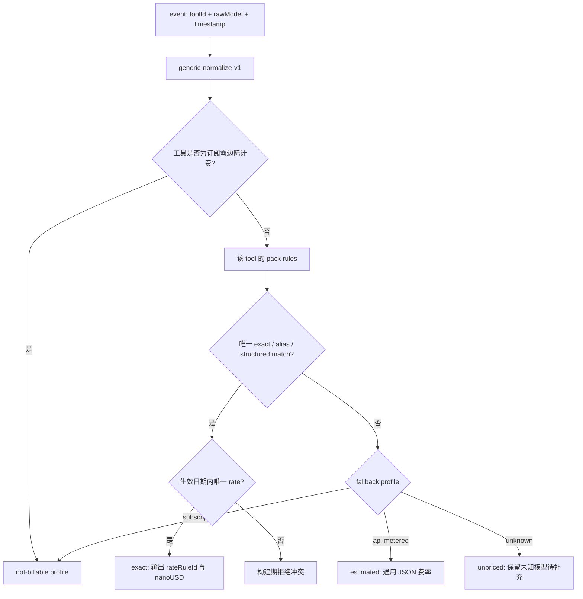

# TrustTools 模型定价与转换规则架构设计

| 属性     | 值                                   |
| -------- | ------------------------------------ |
| 文档类型 | 架构设计文档 (ARCH)                  |
| 项目名称 | TrustTools                           |
| 版本     | v1.1                                 |
| 创建日期 | 2026-08-05 16:27:11                  |
| 更新日期 | 2026-08-05 16:55:05                  |
| 生成工具 | architecture-design、document-header |
| 文档状态 | 草稿                                 |

## 修订记录

| 版本 | 修改时间            | 修改内容                         |
| ---- | ------------------- | -------------------------------- |
| v1.0 | 2026-08-05 16:27:11 | 初始离线模型定价与转换规则架构   |
| v1.1 | 2026-08-05 16:55:05 | 对齐共享策略包边界及路由规则命名 |

## 1. 背景、目标与边界

TrustTools 当前价格规则分散在 `src/lib/pricing/catalog.ts` 的函数 matcher、`dynamic.server.ts` 的 `OFFICIAL_PRICES` 与特例代码中。它按模型名查询时没有统一的 `toolId/source` 上下文，新增别名通常需要改 TypeScript；运行时 LiteLLM 查询的模糊匹配也可能将同名模型归到错误的供应商价格。

TokenTracker 提供了可借鉴的分层：内置 seed、人工 curated override、来源专用名称归一化、精确匹配优先和未知模型诊断。但它的 normalizer 和匹配优先级仍是 JavaScript，且未知模型返回零价格，均不适合作为 TrustTools 的最终契约。

本方案建立**内建、离线优先、声明式**的“定价规则包（Pricing Rule Pack）”。它随 Electron 客户端发版、在 build/startup 期校验、在运行期以只读索引查询；运营人员只需新增或调整 JSON 即可添加模型、别名和费率，不必编写匹配代码。

成功标准：

1. 每一条用量事件都带 `toolId/source + rawModel` 进入解析器，保留原始模型名；定价仅使用转换后的 `canonicalModelId` 和受控规则。
2. 新模型可通过新增 JSON rule 完成“名称转换 + 定价 + 来源 + 生效期”，无需修改 TypeScript 业务逻辑。
3. 未配置模型必经通用转换管道；若没有精确费率，按 JSON 声明的通用估算 profile 计算并显式标记 `estimated`，或按工具策略标记 `unpriced`，绝不静默显示为零费用。
4. macOS、Windows 10、Windows 11 使用同一份规则包，Linux 预留的用量能力亦可复用；定价不依赖操作系统路径或联网。
5. 客户端断网、首次启动、缓存删除后仍能从安装包完成价格转换与估算；网络与外部配置不得成为定价正确性的前提。
6. 同一工具、同一日期、同一输入不能匹配两条同优先级费率；冲突、循环引用、未知 profile 和不安全 pattern 均在构建期失败。

非目标：本期不建设远程运营配置中心、Web 管理后台、用户指定目录加载、运行时热更新、任意正则/脚本执行或自动抓取供应商价格。运营变更通过仓库 JSON、评审、CI 和客户端版本发布交付。外汇汇率不是模型定价规则的一部分；它可继续使用内建汇率并独立演进，但不得覆盖 USD 基准费率。

## 2. 输入验证、假设与约束

| 检查项             | 状态        | 处理方式                                                                      |
| ------------------ | ----------- | ----------------------------------------------------------------------------- |
| 功能需求           | ✅ 已提供   | 内建多份 JSON、离线、可配置模型转换、未知模型通用规则。                       |
| 技术与发布约束     | ✅ 已提供   | React + TypeScript + Electron 单仓库；已有 tool registry JSON 迁移方案。      |
| 运营分发方式       | ✅ 已确认   | 本期不使用远程配置；规则随客户端发版。                                        |
| 团队规模/审核职责  | ⚠️ 部分提供 | 按 1–5 人团队、代码评审 + CI 校验设计；owner 由仓库 CODEOWNERS/评审流程指定。 |
| 价格准确率 SLO     | ⚠️ 缺失     | 默认目标：对已配置 fixture 100% 可复算；未知模型不承诺准确金额。              |
| 规则规模与性能目标 | ⚠️ 缺失     | 假设千级 rule、启动编译 < 200ms、单次查询 < 1ms；超出时再引入预编译索引。     |

关键设计假设：运营人员能通过 Git/PR 发布 JSON，且每次价格变更可附官方来源 URL 和核验日期（中等置信度）。若未来必须在不发版的情况下调整规则，应另立 ADR，引入签名、审核、版本回滚与缓存失效机制，不能复用本期本地 loader。

## 3. 架构驱动因素与核心决策

| 驱动因素                | 决策                                                                   | 代价与取舍                                                   |
| ----------------------- | ---------------------------------------------------------------------- | ------------------------------------------------------------ |
| 离线可用与可审计        | 只加载随应用打包的 JSON rule packs；构建期生成显式 import 清单。       | 新规则需随客户端版本发布，不能即时下发。                     |
| 模型名高度不一致        | 分为原值、规范化名、canonical ID 三层；每个转换都有 rule ID 证据。     | JSON 比单一 `matches()` 函数更多，但可审计、可测试。         |
| 防止误匹配高价/低价模型 | 精确 > alias > 受限前后缀 > 通用 fallback；同优先级歧义构建失败。      | 不采用 TokenTracker 的任意子串反查，可能留下更多待配置模型。 |
| 未配置仍需可用          | 每个计费工具声明 fallback profile，结果标记估算等级与原因。            | 通用估算不是官方账单，UI/导出必须清楚标识。                  |
| 金额精度                | JSON 用十进制字符串，编译为整数 `nanoUsd`（十亿分之一美元）。          | schema/计算器稍复杂，换来确定性和避免 JS 浮点累计误差。      |
| 工具配置模块化          | `ToolDefinition.pricing` 只引用 rule pack/profile；价格详情独立 JSON。 | 工具和规则包存在跨文件引用，须由同一 compiler 统一校验。     |
| 防止配置成为代码执行面  | v1 matcher 仅允许 exact、alias、prefix、suffix、token-sequence、any。  | 不支持任意正则；罕见格式先以显式 alias 覆盖。                |

推荐形态是模块化单体内的**Pricing Registry**：JSON 是声明式业务数据，TypeScript compiler/calculator 是唯一执行实现。它嵌入既有 `tool-registry`，不新增服务、数据库或运行时网络依赖。

## 4. 规则包布局与所有权

```text
src/lib/tool-registry/definitions/
├── _shared/
│   ├── pricing-manifest.json              # 所有内建 pack 的版本与 import 顺序
│   └── pricing/
│       ├── defaults.rules.json            # 全局规范化、fallback profile、计费策略
│       ├── openai.rules.json               # 供应商/模型族的转换与费率
│       ├── anthropic.rules.json
│       ├── google.rules.json
│       ├── china-providers.rules.json
│       └── tool-routing.rules.json         # 仅工具路由/订阅等特殊情况
├── codex.tool.json                         # `pricing: { rulePackRefs, fallbackProfileRef }`
└── ...
src/lib/tool-registry/pricing/
├── contracts.ts                            # Zod schema 与 TypeScript 类型
├── compile.ts                              # pack 合并、引用展开、冲突检测、索引
├── normalize.ts                            # 固定的声明式操作解释器
├── resolve.ts                              # 单事件转换/匹配/审计结果
├── calculate.ts                            # nanoUSD 金额计算与 token 语义
└── public.ts                               # 脱敏的 UI/导出 projection
```

| 边界             | 职责                                                                    | 禁止项                                |
| ---------------- | ----------------------------------------------------------------------- | ------------------------------------- |
| 工具 JSON        | 声明工具可用的 rule packs、默认 fallback 和 token 计费语义。            | 写模型价、JS callback、网络 URL。     |
| 规则包 JSON      | 声明 canonicalization、别名、匹配器、费率、来源、有效期和估算 profile。 | I/O、模板执行、绝对路径、任意正则。   |
| Pricing Registry | 校验并编译规则、解析 event、输出可追溯 `PricingResolution`。            | 读取用户外部配置、调用网络。          |
| 成本聚合/UI      | 消费金额、置信等级和解释信息；聚合 exact/estimated/unpriced。           | 自行按模型名猜测、隐藏未知/估算状态。 |
| 运营发布流程     | 修改 JSON、添加证据与 fixtures、运行校验、发版。                        | 直接修改生成索引或绕过 CI。           |

`pricing-manifest.json` 是唯一 pack 入口。生成脚本只扫描这一固定文件所列出的仓库内相对路径，生成 `pricing-definitions.generated.ts`；客户端运行时直接 import 生成文件，因而既可离线也不接受指定目录加载。`tool-routing.rules.json` 是内建模型路由规则，不是也不得被误解为 `~/.trusttools/tool-overrides.json`；后者不属于允许的运行时配置层。

## 5. 数据契约与解析流程

### 5.1 事件与结果契约

输入必须是：

```ts
interface PricingLookupInput {
  toolId: string; // registry stable ID，不能只传 model
  rawModel: string; // 原日志值，永不被覆盖
  occurredAt: string; // 用于按生效期选价
  tokens: {
    input: bigint;
    output: bigint;
    cacheRead: bigint;
    cacheWrite: bigint;
    reasoningOutput: bigint;
  };
}
```

输出保留全部证据：

```ts
type PricingConfidence = "exact" | "estimated" | "unpriced" | "not-billable";

interface PricingResolution {
  rawModel: string;
  normalizedModel: string;
  canonicalModelId?: string;
  conversionRuleId: string; // 包括 `generic-normalize-v1`
  rateRuleId?: string;
  fallbackProfileId?: string;
  confidence: PricingConfidence;
  reason: string; // machine-readable enum，如 `no-rate-match`
  packageVersion: string;
  knownUsdNano?: bigint;
}
```

`rawModel` 用于 UI、诊断与后续补规则；`normalizedModel` 仅为稳定匹配键；`canonicalModelId` 是内部模型族 ID，不必须等于供应商展示名。价格总额、cache savings 和各 token 分项都使用 `bigint nanoUsd` 累加，展示层最后按币种转换和舍入。

### 5.2 JSON schema 示例

```json
{
  "schemaVersion": 1,
  "packId": "openai-core",
  "revision": "2026-08-05",
  "rules": [
    {
      "id": "codex-gpt-5-6-sol-high-to-sol",
      "scope": { "toolIds": ["codex"] },
      "priority": 200,
      "when": { "kind": "exact", "value": "gpt-5-6-sol-high" },
      "convertTo": "gpt-5.6-sol",
      "rateRef": "openai/gpt-5.6-sol/2026-07-27"
    },
    {
      "id": "gpt-snapshot-to-family",
      "scope": { "toolIds": ["codex", "cursor"] },
      "priority": 120,
      "when": { "kind": "prefix", "value": "gpt-5-6-sol-20" },
      "convertTo": "gpt-5.6-sol",
      "rateRef": "openai/gpt-5.6-sol/2026-07-27"
    }
  ],
  "rates": [
    {
      "id": "openai/gpt-5.6-sol/2026-07-27",
      "canonicalModelId": "gpt-5.6-sol",
      "effective": { "from": "2026-07-27", "to": null },
      "usdNanoPerMillion": {
        "input": "5000000000",
        "output": "30000000000",
        "cacheRead": "500000000",
        "cacheWrite": null
      },
      "source": {
        "kind": "official",
        "label": "OpenAI API pricing",
        "url": "https://platform.openai.com/pricing",
        "verifiedAt": "2026-07-27"
      }
    }
  ]
}
```

`usdNanoPerMillion` 为每百万 token 的 nanoUSD 字符串；例如 `$5/MTok = 5000000000`。`cacheWrite: null` 表示日志出现 cache-write token 时不能冒充已知价格，应转入 fallback 或 `unpriced`，取决于工具 policy。

### 5.3 通用转换与默认估算

每次查询首先执行固定 `generic-normalize-v1`：Unicode NFKC、trim、lowercase、`_`/空白归一为 `-`、连续分隔符合并；原始值绝不修改。随后只在工具声明的 packs 中按优先级检查 `exact`、`alias`、`prefix`、`suffix`、`token-sequence`，最后才命中 `any` fallback。前缀/后缀必须是完整 `-` 分段，禁止子串包含匹配，避免 `gpt-5` 意外匹配 `gpt-5-pro`。

```json
{
  "schemaVersion": 1,
  "packId": "defaults",
  "fallbackProfiles": [
    {
      "id": "api-generic-v1",
      "appliesTo": "api-metered",
      "usdNanoPerMillion": {
        "input": "1000000000",
        "output": "3000000000",
        "cacheRead": "100000000",
        "cacheWrite": "1250000000"
      },
      "confidence": "estimated",
      "label": "通用 API 估算费率；非官方账单",
      "reviewRequired": true
    },
    {
      "id": "subscription-zero-marginal-v1",
      "appliesTo": "subscription",
      "confidence": "not-billable",
      "label": "订阅制用量，不按 API 单价估算"
    },
    {
      "id": "unpriced-v1",
      "appliesTo": "unknown",
      "confidence": "unpriced",
      "label": "未配置费率，等待运营补充"
    }
  ]
}
```

示例数值只是契约示范；首次发布必须由运营核验后写入正式 JSON。每个 `ToolDefinition.pricing` 强制声明 `billingMode` 和 `fallbackProfileRef`，因此未知模型始终有确定、可显示的行为。`estimated` 与 `exact` 在 UI、导出、聚合中分别统计；默认不将 estimated 伪装为官方费用。

### 5.4 决策树与优先级



排序键固定为：`scope 精确度（toolId > provider > global）`、`matcher 精确度（exact > alias > prefix/suffix > token-sequence > any）`、`priority`、`effective.from`。同一排序层出现多个可用候选即为歧义，compiler 必须失败，不能依赖 JSON 顺序。历史事件按 `occurredAt` 选择当日有效费率；没有历史规则时可使用“当前最新规则”仅供估算，但结果须带 `historical-rate-missing` 原因。

## 6. 编译、集成与兼容策略

1. build/prebuild 读取 manifest 所列 JSON，Zod 校验并生成 `CompiledPricingRegistry` 与版本 hash；任一错误阻止构建。
2. `tool-registry` 先完成 `toolId -> pricing policy/pack refs`；Pricing Registry 再展开 pack 和 profile 引用。二者没有反向 import，避免循环依赖。
3. `estimateEventCost(event)` 迁移为 `resolveAndEstimate({ toolId: event.source, rawModel: event.model, occurredAt: event.timestamp, tokens })`。旧 `findModelPrice(model)` 仅作为迁移期兼容 API，调用时必须注入 `toolId` 或返回 `unpriced`。
4. 旧 `MODEL_PRICES`、`OFFICIAL_PRICES`、`exactOrSnapshot()`、`includesAll()` 和 `doubao` 特例按模型迁入 pack；运行时 LiteLLM 获取不可覆盖内建规则。可在开发脚本中把外部资料转成候选 JSON，但生成物必须经人工核验、提交和随包发布。
5. `PricingSnapshot` 拆为“规则包版本/转换结果/汇率快照”。模型价格来自 `CompiledPricingRegistry`；即使汇率刷新失败，也可显示 USD 与内建汇率换算，不能把模型价格标为 fallback 网络失败。
6. 公共 API 仅暴露模型显示名、置信等级、规则版本、来源标签和金额；不暴露内部 source URL 以外的操作路径或原始日志内容。
7. 定价是由 Tool Registry 编译和引用的专项共享包，与平台、Reader 默认项等共享策略使用相同的版本/校验边界；工具 JSON 只保存引用和工具专属例外，不复制全局费率。

## 7. 运行时、发布、回滚与运维

运行时启动一次编译内建 pack，并将 `pricingRegistryVersion = sha256(canonical manifest + all pack JSON)` 放入价格结果和本地缓存 key。规则更新只发生在安装新应用版本后；同一运行中不热加载，避免页面汇总前后采用不同价格。

发布流程：运营修改 rule pack → 提供官方来源/核验日期/生效期 → 新增或更新匿名 event fixture → `verify:pricing-rules` → code review → 构建签名客户端 → 灰度/正式发版。回滚即回退客户端版本或在下一补丁版本恢复上一个 pack；由于事件记录保留 raw model、时间和规则版本，可用历史 rule pack 重算。

必须记录的本地可观测数据（不含对话正文）：`pricingRegistryVersion`、toolId、rawModel 的 hash/受控展示值、conversionRuleId、rateRuleId、confidence、reason、matchedAt、规则来源标签。指标包括 exact/estimated/unpriced 比率、前十 unknown 模型、歧义构建失败数、规则过期天数。`unpriced` 比率异常增长应在研发/运营发布检查中阻塞新版本。

## 8. 安全、隐私与失败降级

| 风险                 | 控制措施                                                                |
| -------------------- | ----------------------------------------------------------------------- |
| JSON 被错误编辑      | Schema、引用、日期区间、整数金额、重复/歧义 matcher 在 build 期阻断。   |
| 模型误匹配           | 禁用任意子串/正则；匹配结果强制含 rule ID；exact 优先且有 fixture。     |
| 费用静默为零         | 未配置只能 `estimated`、`unpriced` 或明确 `not-billable`，UI 分别展示。 |
| 浮点累计误差         | JSON 十进制字符串 → BigInt nanoUSD；仅展示层做舍入。                    |
| 恶意/异常模型名      | 限制长度、NUL、控制字符；不执行配置文本；normalizer 线性时间。          |
| 供应商资料过期       | `verifiedAt`、review deadline、发布门禁和仪表盘提示；离线规则仍可用。   |
| 配置泄露或运行时注入 | 固定 manifest import；无用户目录/网络 loader；pack 只读、随签名包发布。 |

降级顺序固定：精确费率 → JSON 通用估算 → 未定价/订阅无边际费用。任何 pack 编译失败均视为发布失败；已安装客户端继续使用其自身完整 pack，不会因网络不可用失去定价能力。

## 9. 风险与待确认项

| 项目                              | 影响                             | 本期处理                                                  |
| --------------------------------- | -------------------------------- | --------------------------------------------------------- |
| 通用估算 profile 的正式初始数值   | 影响未配置模型的估算金额         | 首发前由运营确认；未经确认不启用 `api-generic-v1`。       |
| 订阅制工具能否换算成等效 API 成本 | “成本”与“边际费用”语义不同       | 默认 `not-billable`；未来另加显式 TCO/订阅分摊 profile。  |
| 多币种原始供应商报价              | 换汇准确性与历史重算             | v1 统一转换并存 USD 基准；汇率独立保留日期与来源。        |
| 真实模型名样本覆盖                | 转换规则的准确性                 | M0 提取匿名样本和 TokenTracker 规则对照；未知项进入报告。 |
| 未来远程配置                      | 需要签名、权限、审核、版本与回滚 | 明确不在本期；不能打开任意 URL/目录作为临时替代。         |

## 10. 分阶段交付与验收输入

1. **P1：离线规则内核。** 定义 schema/compiler/calculator，导入当前静态规则；所有既有 pricing fixture 可复算。
2. **P2：转换与默认策略。** 迁入 TokenTracker 可验证的 source aliases，建立受限 matcher 和每工具 fallback；unknown 不再以零费用呈现。
3. **P3：切流与清理。** 消费者改为 source-aware resolution，删除旧 matcher/静态表/运行时模型价格拉取，发布离线 rule pack。
4. **P4：运营闭环。** 增加规则作者指南、来源复核清单、unknown 模型报表与过期提醒；仍不增加远程配置。

供测试设计使用的 P0 场景：精确规则、source 专用别名、带日期的价格变更、cache-write 缺失、订阅制、未知 API 模型通用估算、完全离线启动、歧义/循环/非法 matcher 拒绝、BigInt 边界值、规则版本重算与 UI 标签一致性。

## 附录：自检摘要

**检查时间**：2026-08-05 16:55:05  
**检查范围**：全文

### 已修正项

- 将 TokenTracker 的 JavaScript normalizer/matcher 思路拆为可审计 JSON 规则与固定解释器，未直接复用其模糊子串匹配和未知零价行为。
- 明确客户端模型价格完全离线、内建、不可运行时注入，并与既有 tool registry 的固定 JSON 加载边界一致。
- 为每次转换、费率选择和 fallback 提供 rule ID、版本、置信等级和可重算证据。
- 将定价规则明确为可被 Tool Registry 引用的专项共享包，避免与被禁止的用户 `tool-overrides.json` 混淆。

### 遗留待确认项

- `api-generic-v1` 的正式基准费率及何时允许启用，需要运营确认后写入首个正式 rule pack。
- 订阅成本是否需要未来按月费/席位分摊，不在 API token 估算范围内。

### 使用的假设

- 规则随客户端版本发版，运营通过 Git/PR 审核修改 JSON（中等置信度）。
- 当前模型规则规模在千级以内，启动期一次编译可满足桌面客户端性能（中等置信度）。
