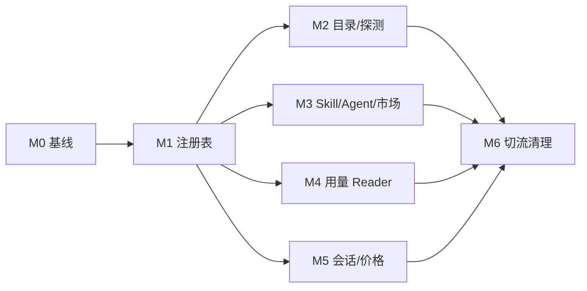

# TrustTools AI 工具模块化敏捷任务清单

| 属性     | 值                                     |
| -------- | -------------------------------------- |
| 文档类型 | 敏捷任务清单 (AGILE-TASK)              |
| 项目名称 | TrustTools-AI工具模块化                |
| 版本     | v1.0                                   |
| 创建日期 | 2026-08-05 14:39:08                    |
| 更新日期 | 2026-08-05 14:39:08                    |
| 生成工具 | agile-feature-dev、architecture-design |
| 文档状态 | 草稿                                   |

## 修订记录

| 版本 | 修改时间            | 修改内容                           |
| ---- | ------------------- | ---------------------------------- |
| v1.0 | 2026-08-05 14:39:08 | 初始迁移 Epic、Story 与可执行 Task |

## 0. 实施原则

- 每个 Task 控制在 0.5–1 人日；Story 控制在 2–5 人日。完成每个 Task 后执行格式化、lint、类型检查、相关单测并独立 commit。
- 新增或迁移 Reader 时先写 fixture/对照测试，再移动实现；未通过 parity 不得切换消费者。
- 不改写已推送历史；在 `codex/` 前缀的新分支上实施，保持每一次提交都可构建。
- 迁移结束前不删除旧导出；任何线上问题可由 feature flag/兼容导出回退到旧路径。

## Epic M0：冻结基线与定义验收（估算 2 人日）

### Story M0-S1：建立可量化的迁移基线（2 点）

**验收标准**：基线报告记录当前 27 个工具、9 个 Skill Agent、用量/会话/市场能力集、价格 fixture 结果；全量质量命令在迁移前有可复现输出。

- [ ] M0-T1：记录 `AI_TOOLS`、`SKILL_AGENT_RULES`、内建 usage adapter、session reader 与静态价格表的机器可读快照（0.5 天）。
- [ ] M0-T2：为工具探测、Skill roots、价格和 session resume 建立对照 fixture（1 天）。
- [ ] M0-T3：定义 `verify:tool-registry` 脚本、迁移 feature flag 及回退说明（0.5 天）。

## Epic M1：注册表内核与配置契约（估算 4 人日）

### Story M1-S1：提供稳定且可校验的 ToolDefinition（5 点）

**验收标准**：无工具业务消费者改动时，registry 可编译、校验并导出完整/公共两种视图；非法配置必须给出定位错误。

- [ ] M1-T1：新增 `contracts.ts`，定义稳定 ID、检测、路径基底、usage/skill/agent/session/market/security/pricing capability 的判别联合类型（1 天）。
- [ ] M1-T2：实现 `defineTool()`、纯校验器与聚合诊断；覆盖重复 ID、遍历路径、非法 capability、未知 Reader、价格重叠（1 天）。
- [ ] M1-T3：实现 `compileToolRegistry()`、get/list/plan API 与无敏感字段的 public manifest（1 天）。
- [ ] M1-T4：实现受限 `tool-overrides.json` schema、原子写入和 fingerprint；加脱敏/损坏文件测试（1 天）。

## Epic M2：工具目录与安装探测迁移（估算 3 人日）

### Story M2-S1：让每个工具拥有一个配置文件（3 点）

**验收标准**：27 个工具均有且只有一个 config；名称、检测根目录与现有 `AI_TOOLS` 输出逐项相等。

- [ ] M2-T1：创建 `tools/*.config.ts`，按当前 `AI_TOOLS` 拆入 27 个只含 detection/display/unsupported capability 的定义（1 天）。
- [ ] M2-T2：注册全部配置，增加“配置 ID 与文件名一致、配置数=27”测试（0.5 天）。
- [ ] M2-T3：将 `detection.server.ts`、Sources 页面和 onboarding 改读 registry；旧 catalog 临时作为派生兼容导出（1 天）。
- [ ] M2-T4：对比 27 工具三态及 Windows/macOS probe 路径，完成 UI 回归（0.5 天）。

## Epic M3：Skill、Agent 与市场能力迁移（估算 4 人日）

### Story M3-S1：Skill 和 Agent 目录具有明确所有权（5 点）

**验收标准**：当前 9 项 Skill discovery 与安装目标完全等价；Agent directory 不会被错误扫描；无 Skill 能力工具不会出现在市场安装目标中。

- [ ] M3-T1：将 `SKILL_AGENT_RULES` 的 roots、markers、depth、envHome 迁入对应工具 config（1 天）。
- [ ] M3-T2：实现 `getSkillPlan()`/`getAgentPlan()` 的环境解析与路径安全检查，替换 scanner 内的规则 Map（1 天）。
- [ ] M3-T3：让 market target、安装校验和类型从 `capabilities.market + skills.write` 派生（1 天）。
- [ ] M3-T4：添加 Codex `CODEX_HOME`、多根 Antigravity、冲突同步、缺失 Agent capability 的 parity/E2E 测试（1 天）。

## Epic M4：用量采集适配器与 Reader 注册（估算 5 人日）

### Story M4-S1：配置选择 Reader，Reader 保持受控实现（8 点）

**验收标准**：generic JSON/JSONL/SQLite 与 Codex/Claude 原生 reader 的测试输出不变；配置不导入 fs/network/解析器实现。

- [ ] M4-T1：定义 UsageReader contract、ReaderKey registry 与 generic adapter Reader，给 unknown key 加启动期失败测试（1 天）。
- [ ] M4-T2：迁移 `BUILTIN_USAGE_ADAPTERS` 的路径、mapping、query 到相应工具 config（1 天）。
- [ ] M4-T3：将 Claude/Codex 原生扫描、context reader 注册为 `claude-rollout-v1`、`codex-rollout-v1`（1 天）。
- [ ] M4-T4：将 scanner、adapter config、bridge 改为 `getUsagePlan()`，保留旧目录的影子对照（1 天）。
- [ ] M4-T5：用真实匿名结构 fixture 做事件字段、错误隔离、缓存 fingerprint 和性能回归测试（1 天）。

## Epic M5：会话恢复与价格迁移（估算 4 人日）

### Story M5-S1：把恢复能力和价格规则纳入工具定义（5 点）

**验收标准**：Codex/Claude/Grok 会话列表与复制命令保持一致；所有现有价格 fixture 结果一致，未知或冲突模型不会产生错误费用。

- [ ] M5-T1：定义 SessionReader contract，把 3 个 session source、路径和 resume token 模板迁入工具 config（1 天）。
- [ ] M5-T2：将 `local-sessions/scanner.server.ts` 改为 session reader registry，保留 session ID 安全校验和隐私断言（1 天）。
- [ ] M5-T3：把 `MODEL_PRICES` 转换为每工具声明式 rate rule，编译模型匹配与日期/优先级索引（1 天）。
- [ ] M5-T4：迁移 pricing snapshot/成本计算消费者，补缓存、写缓存、日期、重叠和无匹配测试（1 天）。

## Epic M6：切流、清理和质量门禁（估算 3 人日）

### Story M6-S1：移除分散事实源（3 点）

**验收标准**：所有业务代码只从 tool-registry 获得工具元数据；旧目录、硬编码名单和兼容开关删除后，完整构建和 Electron 冒烟通过。

- [ ] M6-T1：逐领域打开新 registry 路径，比较 M0 基线；对每项差异作显式接受或修复记录（1 天）。
- [ ] M6-T2：删除 `AI_TOOLS`、`SKILL_AGENT_RULES`、内建 adapter catalog、旧静态 pricing catalog 及无引用兼容导出（0.5 天）。
- [ ] M6-T3：运行 lint、tsc、全量单测、E2E、Web/Electron build 与手动 7 页面巡检（1 天）。
- [ ] M6-T4：更新 README、架构图、贡献指南与“新增工具”操作手册（0.5 天）。

## 依赖关系与建议里程碑



| 里程碑              | 完成条件                               | 预估   |
| ------------------- | -------------------------------------- | ------ |
| P1 可编译的配置内核 | M0+M1 完成；没有消费者迁移             | 6 人日 |
| P2 目录能力模块化   | M2+M3 完成；UI 和市场行为与基线一致    | 7 人日 |
| P3 数据能力模块化   | M4+M5 完成；用量/会话/价格 parity 通过 | 9 人日 |
| P4 清理发布         | M6 完成；无旧事实源、全量质量门禁通过  | 3 人日 |

总实施量约 25 人日；计划未计入发现新的日志格式、外部价格接口变更或各工具 Agent 格式验证的探索工作。每个里程碑都应预留约 20% 风险缓冲。

## 每 Task 强制验收模板

```text
Task 验收报告：
- Lint: npm run lint（通过）
- 类型检查: npx tsc --noEmit（通过）
- 单元测试: <相关 test 文件>（通过，核心 registry/compiler 100% 分支）
- 回归: <基线/parity 用例>（通过）
- Git commit: refactor(tool-registry): <任务摘要>（已提交）
```

M6-T3 额外执行：`npm run test:e2e`、`npm run build` 与 `npm run build:electron`。任何对照不一致、配置校验失败或隐私断言失败，都阻塞后续 Task，不可通过更新快照掩盖差异。
