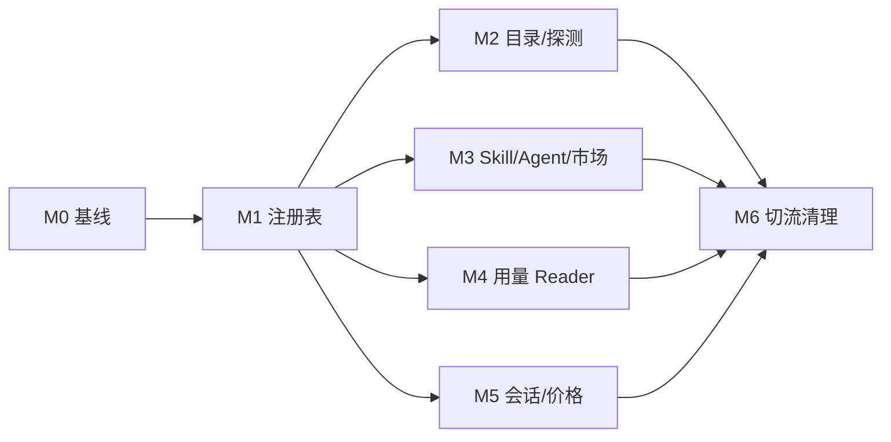

# TrustTools AI 工具模块化敏捷任务清单

| 属性     | 值                                     |
| -------- | -------------------------------------- |
| 文档类型 | 敏捷任务清单 (AGILE-TASK)              |
| 项目名称 | TrustTools-AI工具模块化                |
| 版本     | v1.4                                   |
| 创建日期 | 2026-08-05 14:39:08                    |
| 更新日期 | 2026-08-05 16:55:05                    |
| 生成工具 | agile-feature-dev、architecture-design |
| 文档状态 | 草稿                                   |

## 修订记录

| 版本 | 修改时间            | 修改内容                                        |
| ---- | ------------------- | ----------------------------------------------- |
| v1.4 | 2026-08-05 16:55:05 | 补齐共享策略、安全规则与遗留运行时入口清理任务  |
| v1.3 | 2026-08-05 16:35:57 | 定价任务引用内建离线规则专项方案                |
| v1.2 | 2026-08-05 16:12:35 | 补齐 legacy/context/价格/跨平台配置任务         |
| v1.1 | 2026-08-05 16:00:55 | 改为内建 JSON 定义，移除运行时目录加载/override |
| v1.0 | 2026-08-05 14:39:08 | 初始迁移 Epic、Story 与可执行 Task              |

## 0. 实施原则

- 每个 Task 控制在 0.5–1 人日；Story 控制在 2–5 人日。完成每个 Task 后执行格式化、lint、类型检查、相关单测并独立 commit。
- 新增或迁移 Reader 时先写 fixture/对照测试，再移动实现；未通过 parity 不得切换消费者。
- 不改写已推送历史；在 `codex/` 前缀的新分支上实施，保持每一次提交都可构建。
- 迁移结束前不删除旧导出；任何线上问题可由 feature flag/兼容导出回退到旧路径。

## Epic M0：冻结基线与定义验收（估算 2 人日）

### Story M0-S1：建立可量化的迁移基线（2 点）

**验收标准**：基线报告记录 27 个产品目录工具、AiPy/Cline legacy、9 个 Skill Agent、用量/上下文/会话/市场能力集、价格与三平台 fixture；全量质量命令在迁移前有可复现输出。

- [ ] M0-T1：记录 27 产品目录工具、AiPy/Cline legacy、`SKILL_AGENT_RULES`、usage/context adapter、session reader、`MODEL_PRICES`/`OFFICIAL_PRICES`、`COMMON_MAPPING`、扫描预算/缓存、Market 排序、用量分类、内建安全规则和 TokenTracker alias，以及三平台路径的机器可读快照（0.5 天）。
- [ ] M0-T2：为工具探测、Skill roots、价格和 session resume 建立对照 fixture（1 天）。
- [ ] M0-T3：定义 `verify:tool-registry` 脚本、迁移 feature flag 及回退说明（0.5 天）。

## Epic M1：注册表内核与配置契约（估算 4 人日）

### Story M1-S1：提供稳定且可校验的 ToolDefinition（5 点）

**验收标准**：无工具业务消费者改动时，registry 可编译、校验并导出完整/公共两种视图；非法配置必须给出定位错误。

- [ ] M1-T1：新增 `contracts.ts` 与 `schema.ts`，定义/推导 stable ID、平台 target/group、检测、路径基底、usage/context/skill/agent/session/market/security/pricing capability（1 天）。
- [ ] M1-T2：实现共享 platform、generic reader、scanner、market、taxonomy、pricing manifest 和内建 security JSON、resolver、loader 与聚合诊断；覆盖 JSON 语法、重复 ID、平台路径、遍历路径、非法 capability、未知 Reader、价格重叠、策略引用和受限安全规则（1 天）。
- [ ] M1-T3：实现 `compileToolRegistry()`、get/list/plan API 与无敏感字段的 public manifest（1 天）。
- [ ] M1-T4：实现内建 definitions 版本 hash、生成 import 清单和 public manifest；加脱敏/损坏 JSON/缓存失效测试（1 天）。

## Epic M2：工具目录与安装探测迁移（估算 3 人日）

### Story M2-S1：让每个工具拥有一个配置文件（3 点）

**验收标准**：27 个产品目录工具与 AiPy/Cline 两个 legacy source 均有且只有一个 JSON 定义；27 个可见工具的名称、检测根目录与现有 `AI_TOOLS` 输出逐项相等，legacy 不进入产品目录。

- [ ] M2-T1：创建 29 个 `definitions/*.tool.json`：27 产品目录工具 + `catalogVisible=false` 的 AiPy/Cline legacy，均含跨平台 detection/display/unsupported capability（1 天）。
- [ ] M2-T2：注册全部配置，增加“配置 ID 与文件名一致、配置数=29、27 个可见工具与 2 个隐藏 legacy 状态正确”测试（0.5 天）。
- [ ] M2-T3：将 `detection.server.ts`、Sources 页面和 onboarding 改读 registry；旧 catalog 临时作为派生兼容导出（1 天）。
- [ ] M2-T4：对比 27 个可见工具三态及 macOS、Windows 10、Windows 11 probe 路径；验证 Linux 仅返回 XDG/planned plan、不触发扫描，完成 UI 回归（0.5 天）。

## Epic M3：Skill、Agent 与市场能力迁移（估算 4 人日）

### Story M3-S1：Skill 和 Agent 目录具有明确所有权（5 点）

**验收标准**：当前 9 项 Skill discovery 与安装目标完全等价；Agent directory 不会被错误扫描；无 Skill 能力工具不会出现在市场安装目标中。

- [ ] M3-T1：将 `SKILL_AGENT_RULES` 的 roots、markers、depth、envHome 迁入对应工具 JSON（1 天）。
- [ ] M3-T2：实现 `getSkillPlan()`/`getAgentPlan()` 的环境解析与路径安全检查，替换 scanner 内的规则 Map（1 天）。
- [ ] M3-T3：让 market target、安装校验和类型从 `capabilities.market + skills.write` 派生，排序/展示分组从 `skill-market-policy.json` 读取并删除 `SKILL_AGENT_ORDER`（1 天）。
- [ ] M3-T4：添加 Codex `CODEX_HOME`、多根 Antigravity、冲突同步、缺失 Agent capability 的 parity/E2E 测试（1 天）。

## Epic M4：用量、上下文采集与 Reader 注册（估算 6 人日）

### Story M4-S1：配置选择 Reader，Reader 保持受控实现（8 点）

**验收标准**：generic JSON/JSONL/SQLite、Codex/Claude 原生 reader 与 context breakdown 的输出不变；不再读取外部 adapter JSON；配置不导入 fs/network/解析器实现。

- [ ] M4-T1：删除 `usage-adapters.json` / `ExternalUsageAdapter*` / `custom:*` 运行时入口，保留内建来源（1 天）。
- [ ] M4-T2：定义 UsageReader、ContextReader contract 与 registry，给 unknown key 加启动期失败测试（1 天）。
- [ ] M4-T3：迁移内建 adapter 路径、mapping、query 到工具 JSON；通用映射/默认值从 shared generic-reader policy 引用（1 天）。
- [ ] M4-T4：将 Claude/Codex context capability、可用维度和用量分类迁入工具/共享 JSON，注册原生 ContextReader（1 天）。
- [ ] M4-T5：将 scanner、adapter config 改为 `resolvePlatformPlan()`、`getUsagePlan()`、`getContextPlan()` 与 scanner policy；停用 bridge 自动执行和来源 alias，保留影子对照（1 天）。
- [ ] M4-T6：以 context breakdown、外部 adapter 不读取、三平台 path plan、错误隔离和缓存版本为 fixture 回归（1 天）。

## Epic M5：会话恢复与价格迁移（估算 19 人日）

### Story M5-S1：把恢复能力和价格规则纳入工具定义（19 点）

**验收标准**：Codex/Claude/Grok 会话列表与复制命令保持一致；所有现有价格 fixture 结果一致，未知或冲突模型不会产生错误费用。

- [ ] M5-T1：定义 SessionReader contract，把 3 个 session source、路径和 resume token 模板迁入工具 JSON（1 天）。
- [ ] M5-T2：将 sessions scanner、filter 白名单、resume command 与展示名都改为 session/tool registry 派生（1 天）。
- [ ] M5-T3：执行《`TrustTools-模型定价与转换规则-实施计划.md`》M0–M3（基线、契约、转换/BigInt、JSON rule packs 与 parity），完成内建离线规则包（10 天）。
- [ ] M5-T4：执行专项计划 M4–M5（source-aware 消费者、模型价格网络覆盖移除、离线发布门禁与运营交接）（7 天）。

## Epic M6：切流、清理和质量门禁（估算 6 人日）

### Story M6-S1：移除分散事实源（6 点）

**验收标准**：所有业务代码只从 tool-registry 获得工具元数据；旧目录、硬编码名单和兼容开关删除后，完整构建和 Electron 冒烟通过。

- [ ] M6-T1：逐领域打开新 registry 路径，比较 M0 基线；对每项差异作显式接受或修复记录，并验证共享策略均由 Registry 编译（1 天）。
- [ ] M6-T2：删除 `AI_TOOLS`、`SKILL_AGENT_RULES`、内建 adapter catalog、`COMMON_MAPPING`、`USAGE_ADAPTER_PRESETS`、`SKILL_AGENT_ORDER`、旧静态 pricing catalog、session 白名单/展示名映射、bridge alias、`tool-overrides.json`、`usage-adapters.json`、`custom:*` 与无引用兼容导出（1 天）。
- [ ] M6-T3：将内建安全扫描规则迁入 `security-rules.json`，实现构建期 schema/安全正则校验并保留 TypeScript ReDoS 防护；验证用户安全状态不能改变内建规则执行（1.5 天）。
- [ ] M6-T4：运行 lint、tsc、全量单测、E2E、macOS/Windows build；在 macOS、Windows 10、Windows 11 上执行 smoke，Linux 执行 XDG/planned-state tests（1.5 天）。
- [ ] M6-T5：更新 README、架构图、贡献指南与“新增工具/共享策略/专项规则”操作手册（1 天）。

## 依赖关系与建议里程碑



| 里程碑              | 完成条件                                          | 预估    |
| ------------------- | ------------------------------------------------- | ------- |
| P1 可编译的配置内核 | M0+M1 完成；没有消费者迁移                        | 6 人日  |
| P2 目录能力模块化   | M2+M3 完成；UI 和市场行为与基线一致               | 7 人日  |
| P3 数据能力模块化   | M4+M5 完成；用量/上下文/会话/离线价格 parity 通过 | 25 人日 |
| P4 清理发布         | M6 完成；无旧事实源、全量质量门禁通过             | 6 人日  |

基础实施量约 44 人日；考虑新的日志格式、价格核验或各工具 Agent 格式验证的探索工作，建议按约 55 人日排期（含约 20% 风险缓冲）。

## 每 Task 强制验收模板

```text
Task 验收报告：
- Lint: npm run lint（通过）
- 类型检查: npx tsc --noEmit（通过）
- 单元测试: <相关 test 文件>（通过，核心 registry/compiler 100% 分支）
- 回归: <基线/parity 用例>（通过）
- Git commit: refactor(tool-registry): <任务摘要>（已提交）
```

M6-T4 额外执行：`npm run test:e2e`、`npm run build` 与 `npm run build:electron`。任何对照不一致、配置校验失败或隐私断言失败，都阻塞后续 Task，不可通过更新快照掩盖差异。
