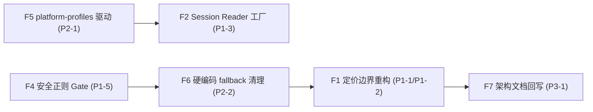

# TrustTools 架构偏差修复敏捷任务清单

| 属性     | 值                                            |
| -------- | --------------------------------------------- |
| 文档类型 | 敏捷任务清单 (AGILE-TASK)                     |
| 项目名称 | TrustTools-AI工具模块化-偏差修复              |
| 版本     | v1.0                                          |
| 创建日期 | 2026-08-06                                    |
| 更新日期 | 2026-08-06                                    |
| 生成工具 | agile-feature-dev                             |
| 文档状态 | 评审中                                        |
| 关联     | 问题清单 v1.1 / 架构设计 v1.5 / 定价架构 v1.1 |

## 修订记录

| 版本 | 修改时间   | 修改内容                                        |
| ---- | ---------- | ----------------------------------------------- |
| v1.0 | 2026-08-06 | 依据《实现与架构偏差问题清单 v1.1》拆分修复任务 |

## 0. 背景与范围

依据 `docs/develop/architecture/TrustTools-AI工具模块化-实现与架构偏差问题清单.md`（v1.1）的 8 个 Finding 制订修复计划。核心目标：**让声明配置（工具 JSON / 定价 JSON / 平台 JSON）成为运行时权威来源**，关闭审计发现的配置-运行时偏差。

| 编号 | 级别 | Finding                                   | 关联文件（证据）                                                                                                       |
| ---- | ---- | ----------------------------------------- | ---------------------------------------------------------------------------------------------------------------------- |
| P1-1 | P1   | 定价所有权错误绑定到工具                  | `pricing/resolve.ts`、`tool-policy.ts`、`index.ts`、29 个 `*.tool.json`                                                |
| P1-2 | P1   | 定价歧义检测只覆盖相同 matcher            | `pricing/compile.ts:232-260`                                                                                           |
| P1-3 | P1   | Session Reader 仍由硬编码路径和函数分派   | `local-sessions/scanner.server.ts:1045-1055`、`types.ts:11`、`resume-id.ts:24-35`                                      |
| P1-5 | P1   | 安全正则/ReDoS 防护只停留在注释           | `security/security-rules.schema.ts:39-55`、`rules.ts:46-68`、`input-validation.ts`                                     |
| P2-1 | P2   | platform-profiles.json 未实际驱动解析     | `tool-registry/loader.ts:57-75`、`registry.ts:291-345`                                                                 |
| P2-2 | P2   | 工具名单/展示名/Skill 顺序硬编码 fallback | `local-skills/agent-rules.ts:38-51`、`local-usage/types.ts:13-18`、`presentation.ts:86-91`、`pricing/index.ts:277-282` |
| P3-1 | P3   | 主架构文档未回写已批准目录漂移            | 架构文档 §5；决策记录 D2/D3                                                                                            |

## 1. 实施原则

- 每个 Task 控制在 0.5–1 人日；Story 控制在 2–5 人日。每个 Task 完成后执行：格式化、lint、类型检查、相关单测、**独立 git commit**。
- P1-1 是行为重构（定价解析流水线重写），必须先建立 parity 基线再切换消费者；不得用更新测试掩盖行为变化。
- 不引入新依赖（ReDoS 检测为自研线性扫描，禁止添加 regex 分析库）。
- 生成产物（`definitions.generated.ts`、`pricing-definitions.generated.ts`、`public-manifest.generated.ts`、`security-rules.generated.ts`）由脚本再生成并提交，不手改。
- 不改写已推送 git 历史；分支保持可构建。
- 所有四态（exact/estimated/unpriced/not-billable）是业务结果；UI/导出必须保留差异，禁止降级为 unknown。

## 2. Epic 总览与依赖



- F1（定价）依赖 F6 的展示名投影（`sourceName` 迁移到 manifest）；F2 依赖 F5 的平台路径解析。
- F4、F5 相互独立，可并行。
- F7 文档收尾在代码完成后执行。

## 3. Epic F1 — 定价所有权边界重构（P1-1 + P1-2，估算 8 人日）

### Story F1-S1：模型-路由-费率数据契约（2 人日）

**验收标准**：`pricing/contracts.ts` 增加 `BillingRoute`、`RouteSelectionRule`、`ModelAliasRule`、`ModelCatalogEntry` 等类型；费率主键含 `billingRouteId + canonicalModelId + region + effectiveAt`；工具 JSON 的 `pricing` 段改造为 `modelObservation`。

#### Tasks

- [ ] F1-T1: `contracts.ts` 新增 billing-route / route-selection / alias-rule / model-catalog / rate-pack（含 region）/ fallback-profiles 的 Zod schema 与类型；保留 `PricingLookupInput` 的 toolId/rawModel/occurredAt 契约，新增计费证据输入（provider/endpoint/accountPlan 等）。
- [ ] F1-T2: 新增 JSON 文件骨架与 manifest：`model-catalog.json`、`billing-routes.json`、`model-alias-rules.json`、`route-selection-rules.json`、`rate-packs/*.json`、`fallback-profiles.json`；从现有 `rules/*.rules.json` 迁移既有费率/别名/fallback 数据；`scripts/generate-pricing-imports.mjs` 扩展扫描清单与版本哈希。
- [ ] F1-T3: 工具 JSON `pricing` 段 → `modelObservation`（日志字段、模型归一化 profile、计费证据提取规则、Token 语义——reasoning 是否含于 output 等用量解析语义保留在此）；同步 `tool-registry/schema.ts` 与 `loader.ts` 编译分支；29 个 `*.tool.json` 全量迁移。

### Story F1-S2：Compiler 路由/模型费率索引与交集歧义检测（2 人日）

**验收标准**：compiler 对相同 `billingRouteId + canonicalModelId + region + priority + 有效期` 的不同 matcher 做交集检测；歧义在 build/prebuild 期失败；反例 fixture 覆盖「两个不同 token-sequence / prefix 相交」。

#### Tasks

- [ ] F1-T4: `compile.ts` 重写：以 billingRoute 为第一维度构建索引；matcher 交集检测（prefix∩prefix、prefix∩exact、token-sequence 相交等可判定规则集合）替代当前 `matchKey` 全等比较；补充 P1-2 反例 fixture 到 `compile.test.ts`。
- [ ] F1-T5: 扩展 `compile.test.ts`：billingRoute 维度冲突、region 隔离、历史分段合法共存、intersection 报错消息含两个 rule ID/文件名。

### Story F1-S3：Route-first 解析流水线 + 四态保真（3 人日）

**验收标准**：`resolvePrice` 先从计费证据选 route，再查 route 下模型费率；无证据/费率 → `unpriced`；参考价仅经声明的参考路由 → `estimated`；`TRUSTTOOLS_PRICING_ESTIMATES` 环境变量移除；`estimateEventCost` 保留四态不再降级 unknown；`ToolPricingPolicy`/`rulePackRefs`/工具级 `billingMode` 废弃。

#### Tasks

- [ ] F1-T6: `resolve.ts` 重写为 route-first：保留 `rawModel`/`normalizedModel`/`canonicalModelId`/`billingRouteId`/路由证据/规则版本/置信状态；证据不足返回 `unpriced`（reason 区分）；删除 `TRUSTTOOLS_PRICING_ESTIMATES` 分支（`resolve.ts:29,92-94`），fallback 行为仅由随包 JSON 决定。
- [ ] F1-T7: `tool-policy.ts` 删除或改为兼容薄壳；`ToolPricingPolicySchema`/`rulePackRefs`/工具级 `billingMode` 移除或标记 deprecated；`calculate.ts` 的 reasoning 语义改由 modelObservation（用量解析）驱动。
- [ ] F1-T8: `index.ts` 的 `estimateEventCost`/`estimateUsageCost` 保留四态（exact/estimated/unpriced/not-billable 各自计入 priced/unknown 之外的明确状态）；`CostEstimate` 增加置信度分桶；UI 消费者（`UsageDetailTable`、`ContextBreakdown`、`UsageHeatmapPanel`、`routes/index.tsx`、`local-sessions/cost.ts`）同步。
- [ ] F1-T9: `resolve.test.ts`/`parity.test.ts`/`pricing.test.ts`/`tool-policy.test.ts` 更新：route 选择、无证据 unpriced、参考路由 estimated、四态聚合、无 env flag 改写。

## 4. Epic F2 — Session Reader 注册表驱动（P1-3，估算 2 人日）

### Story F2-S1：SessionReader 受控工厂

**验收标准**：`SessionReaderKey → SessionReader` 工厂由 `listSessionTools()` + `getSessionPlan()` 驱动扫描任务与扫描根目录；`SessionSource` 收敛为 Registry 派生的运行时校验类型；新增/调整会话工具只改工具 JSON + 注册 Reader。

#### Tasks

- [ ] F2-T1: `tool-registry/readers/session-readers.ts`（或 local-sessions 内受控工厂）实现 `SessionReaderKey → 扫描函数` 映射，读取 `getSessionPlan()` 的平台路径计划（依赖 F5）；三个现有扫描函数（claude/codex/grok）注册为受控 reader。
- [ ] F2-T2: `scanner.server.ts:1045-1055` 删除硬编码 `.claude`/`.codex`/`.grok` 拼接与直接函数分派，改为遍历 `listSessionTools()` 生成扫描任务；`types.ts` 的 `SessionSource` 改为注册表派生校验（保留 `(string & {})` 开放分支）。
- [ ] F2-T3: `scanner.server.test.ts` 更新 + 新增「注册新 reader 即可扫描」用例；`resume-id.ts` 改用工厂产物。

## 5. Epic F4 — 安全正则 Gate（P1-5，估算 2 人日）

**验收标准**：内建与用户规则复用同一安全 gate；危险嵌套量词/回溯模式在构建期（内建）与保存期（用户）被拒绝；逐行与总扫描预算生效；ReDoS 负向测试覆盖。

#### Tasks

- [ ] F4-T1: `security-rules.schema.ts` 新增安全正则检测器（自研线性扫描：嵌套/重叠量词如 `(X+)+`、`(a*)*`、`(a|aa)+`、量词内量词等危险形态），`isSafeSecurityPattern` 增强；`scripts/generate-security-rules.mjs` 复用同一 gate。
- [ ] F4-T2: `rules.ts` 的 `validateSecurityRulePattern` 用户规则接入同一 gate；保存/解析用户规则时拒绝危险 pattern。
- [ ] F4-T3: `scanner.ts` 增加逐行与总扫描预算（按规则 × 行 × 尝试次数计数，超限中止该维度并标记 truncated 风险）；`MAX_SKILL_FILE_SIZE` 边界复核。
- [ ] F4-T4: 新增 ReDoS 负向测试（嵌套量词、超长行、预算截断），内建 26 规则全量过 gate 断言。

## 6. Epic F5 — platform-profiles 实际驱动（P2-1，估算 2 人日）

**验收标准**：`platform-profiles.json` 的 `basePlatforms`/`xdgFallback`/`defaultStatus` 被路径解析器消费；base-target 兼容性校验；XDG 环境变量支持；macOS/Windows 10/Windows 11/Linux planned fixture。

#### Tasks

- [ ] F5-T1: `loader.ts` 的 `BASE_PREFIX` 固定投影改为由 `platform-profiles.json` 派生（base → 平台集合 → 展开路径）；新增 XDG 环境变量（`XDG_CONFIG_HOME`/`XDG_DATA_HOME`）解析与 `xdgFallback` 应用。
- [ ] F5-T2: `registry.ts` 的 `resolvePlatformPlan` 校验 location base 是否适用于当前 target（不适用即跳过并诊断）；`defaultStatus` 作为兜底；`platformStatusFor` 收敛为 profile 驱动。
- [ ] F5-T3: 新增 fixture 测试：macOS/Windows 10/Windows 11/Linux planned 的路径展开、XDG 覆盖、非法 base-target 组合诊断。

## 8. Epic F6 — 硬编码 fallback 清理（P2-2，估算 1 人日）

**验收标准**：静态工具集合与标签 fallback 删除；生成产物缺失/不一致在 build 期失败；展示名与 legacy 状态统一从 Registry/public manifest 投影。

#### Tasks

- [ ] F6-T1: `agent-rules.ts:38-51` 删除 `SKILL_AGENT_ORDER` 的 9 工具 fallback；`public-manifest.generated.ts` 缺失 `skillAgentOrder` 时构建期失败（manifest 生成脚本 + registry 校验）。
- [ ] F6-T2: `local-usage/types.ts:13-18` 的 `LEGACY_ADAPTER_SOURCES` 从 manifest 的 legacy 标记投影；`presentation.ts:86-91` 的 `sourceLabel` 改为 manifest 展示名映射（或删除该硬编码路径）。
- [ ] F6-T3: `pricing/index.ts:277-282` 的 `sourceName` 删除/迁移到 `getToolDisplay()` 投影；相关 UI 消费者切换；存量测试断言无硬编码名单。

## 9. Epic F7 — 架构文档回写（P3-1，估算 0.5 人日）

**验收标准**：主架构文档 §5 目录布局标注 pricing/security 实际位置（`src/lib/pricing/rules/`、`src/lib/security/`），引用 D2/D3 批准 diff；明确 pricing/security 的生成与校验入口。

#### Tasks

- [ ] F7-T1: 更新 `docs/develop/architecture/TrustTools-AI工具模块化-架构设计文档.md` §5 目录图与 §6 依赖说明：pricing/security 目录漂移 + 生成/校验入口（`generate:pricing-imports`、`verify:pricing-rules`、`generate-security-rules`）。
- [ ] F7-T2: 同步更新架构审计报告/问题清单状态：各 Finding 标记修复 commit，文档状态推进。

## 10. 测试矩阵与发布准出

| 测试层级 | 必测内容                                                                               | 阻塞 |
| -------- | -------------------------------------------------------------------------------------- | ---- |
| 契约     | 新 billing-route/route-selection/model-catalog schema、modelObservation 工具 JSON 校验 | P0   |
| Compiler | route 维度冲突、matcher 交集歧义、region 隔离、历史分段                                | P0   |
| Resolver | route-first 选择、无证据 unpriced、参考路由 estimated、四态聚合                        | P0   |
| Parity   | 既有定价 fixture 可复算（金额不变或已批准差异）                                        | P0   |
| Sessions | 注册新 reader 即可扫描、平台路径计划驱动                                               | P0   |
| Security | ReDoS 负向测试、预算截断、内建 26 规则全过 gate                                        | P0   |
| 离线集成 | 断网/空缓存启动、LD 无 bridge 事件                                                     | P1   |
| UI/导出  | 四态标签、展示名投影、无硬编码名单                                                     | P1   |

准出条件：`npm run verify:tool-registry`、`verify:pricing-rules`、`npx tsc --noEmit`、`npm run lint`、全量 Node 单测、Playwright e2e 全绿；问题清单全部 Finding 关闭或标记已修复。

## 11. Task 完成模板

```text
Task 验收报告：
- 格式化：npm run format（通过）
- 类型检查：npx tsc --noEmit（通过）
- 单元测试：<相关测试文件>（通过）
- Git commit：<type>(<scope>): <摘要>（已提交）
```
