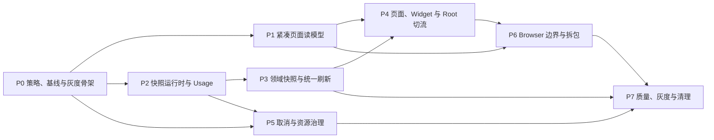

# TrustTools 页面性能优化实施计划

| 属性 | 值 |
|------|-----|
| 文档类型 | 敏捷任务清单 (AGILE-TASK) |
| 项目名称 | TrustTools |
| 版本 | v1.0 |
| 创建日期 | 2026-08-18 11:15:27 |
| 更新日期 | 2026-08-18 11:15:27 |
| 生成工具 | agile-feature-dev |
| 文档状态 | 评审中 |

## 修订记录

| 版本 | 修改时间 | 修改内容 |
|------|---------|---------|
| v1.0 | 2026-08-18 11:15:27 | 基于已批准的页面性能架构 v1.2，形成完整实施任务、依赖、验收、测试、迁移和回滚方案。 |

---

## 1. 计划目标与输入

本计划落实以下已确认文档：

- `docs/develop/architecture/TrustTools-页面性能架构设计文档.md`
- `docs/develop/architecture/TrustTools-页面性能架构审计报告.md`
- `docs/develop/performance-architecture-plan.md`（作为历史分析输入，不作为最终实现规范）

实施目标：

1. 页面 loader 不再执行全量目录扫描、子进程、模型调用或远程网络请求。
2. 建立 `src/app/runtime-policy.source.json` 作为新鲜度、刷新周期、超时、重试和资源预算的唯一人工维护源。
3. 汇率 1 天刷新一次；Usage 15 分钟、Session 30 分钟、Skill 60 分钟、AI 工具安装/WSL/Skill 市场证据 6 小时。
4. 建立持久化领域快照、统一后台刷新、真实取消和全局资源预算。
5. Dashboard 首屏 DTO 不超过 250 KB，其他首屏通常不超过 150 KB，Widget model 不超过 50 KB。
6. 清除浏览器构建中的 server chunk、Node externalization 和现有 15 项模块深层导入违规。
7. 通过影子比对、单调灰度、kill switch、copy-forward 数据迁移和 downgrade 演练保证可回滚。

### 1.1 范围优先级

| 优先级 | 范围 |
|--------|------|
| MUST | 公共运行时策略、紧凑读模型、快照运行时、统一刷新、真实取消、关键页面切流、隐私与性能门禁、可回滚迁移。 |
| SHOULD | 项目分类增量索引、Widget revision 协议、Router/Query 单一所有权、路由和图表拆包。 |
| COULD | 在稳定 fixture 证明必要后，引入更复杂的嵌入式索引；不作为首轮前置。 |
| WON'T | 微服务、Redis、远程数据库服务器、消息队列、应用退出后的 OS 级后台服务、随机用户分桶和远程遥测依赖。 |

## 2. 总体交付策略

### 2.1 单调 Rollout Stage

不得为每个页面建立可任意组合的布尔开关。统一使用：

```ts
type PerformanceRolloutStage =
  | "legacy"
  | "shadow"
  | "compact-read-model"
  | "snapshot-read"
  | "unified-refresh"
  | "new-default";
```

另设唯一紧急开关 `forceLegacyReadPath`。优先级为：紧急开关 > 本机 rollout state > 公共策略默认阶段。

| 阶段 | 用户响应的权威路径 | 后台行为 |
|------|--------------------|----------|
| `legacy` | 旧链路 | 新链路关闭。 |
| `shadow` | 旧链路 | 新链路后台运行，仅记录脱敏差异。 |
| `compact-read-model` | 新紧凑 DTO | 数据源仍可回退 legacy。 |
| `snapshot-read` | 新快照读取 | 刷新入口仍在兼容期。 |
| `unified-refresh` | 新快照读取 | 启动、计划、手动和 stale 全部走统一任务。 |
| `new-default` | 新链路 | 保留 kill switch 至少一个正式版本。 |

### 2.2 依赖与发布批次



| 批次 | 内容 | 可发布结果 |
|------|------|------------|
| R0 | P0 | 配置和基准可用，产品行为不变。 |
| R1 | P1 | 紧凑 DTO 可在 shadow/flag 下验证，先降低载荷和主线程计算。 |
| R2 | P2 | Usage 快照运行时可独立启用，旧文件保持不变。 |
| R3 | P3 + P5 | 领域快照、统一刷新、真实取消和资源预算完成。 |
| R4 | P4 | 页面、Widget、Root 全部只读快照。 |
| R5 | P6 | browser/server 边界和 bundle 预算通过。 |
| R6 | P7 | RC/Stable 灰度、回滚演练和 legacy 清理闭环。 |

### 2.3 工作量估算

- 任务粒度：每项 0.5～1 人日；Story 2～5 人日。
- 核心路径（P0～P5）：任务估算合计 50 人日。
- 构建、质量、灰度与清理（P6～P7）：任务估算合计 15 人日。
- 总计基线 65 人日；增加 20% 风险缓冲后按约 78 人日规划。
- 单人顺序实施约 16～20 周；两名开发者在 P0 后并行约 10～13 周。实际以每个 Gate 的证据为准，不按日期强行切阶段。

## 3. 全局实施规则与 Definition of Done

每个 Task 必须：

1. 开始前检查 `git status`，保留用户已有修改；任务独立可构建、可测试、可回滚，不混入无关重构。
2. 先加兼容/影子路径，再切入口，最后在稳定期删除 legacy。
3. 不原地覆盖或删除用户旧快照、原始 AI 工具日志和任务偏好。
4. 不手工编辑 generated 文件；修改源后运行生成和漂移验证。
5. 不记录绝对路径、prompt、API Key、命令、会话正文等敏感值。
6. 完成相关测试后单 Task 提交；保持 Lovable 连接分支可构建，不 force push、不 rebase/amend 已推送提交。

每个任务至少执行与改动相关的命令；阶段 Gate 执行完整集合：

```text
npm run prebuild
npm run verify:job-catalog
npm run verify:architecture:blocking
npx tsc --noEmit
npm run lint
node --import tsx --test <相关测试文件>
npm run test:perf
npm run build
npm run build:electron
npm run test:e2e
git diff --check
```

当前 `verify:architecture:blocking` 有 15 项失败。P0 必须记录并阻止新增，P6 必须清零；不得通过扩大永久 allowlist 伪造通过。

## 4. P0 — 公共策略、性能基线与灰度骨架

### Story P0-S1：建立唯一公共运行时策略

**用户故事：** 作为维护者，我希望从一个文件明确看到数据多久算旧、多久刷新、超时、网络权限和资源上限，以便安全调整性能策略而不遗漏隐藏常量。

| Task | 工作内容 | 主要文件 | 依赖 | 估算 |
|------|----------|----------|------|------|
| T0-01 | 盘点旧常量并建立“旧位置 → 新策略键 → 删除阶段”映射；局部 UI debounce/动画不纳入。 | `dynamic.server.ts`、`server-fns.ts`、`snapshot.server.ts`、Skill scanner、Usage application、`job-catalog.json` | 无 | 0.5d |
| T0-02 | 新增公共策略源、严格 schema、跨字段校验和类型；写入已批准默认周期及 `1/16/8` 资源预算。 | 新增 `src/app/runtime-policy.source.json`、`runtime-policy.schema.ts`、schema tests | T0-01 | 1d |
| T0-03 | 新增生成器，一次生成 runtime 投影与 task catalog；写入源 hash，并增加生成物漂移校验。 | 新增 `scripts/generate-runtime-policy.mjs`、`verify-runtime-policy.mjs`、generated files；更新 `package.json` | T0-02 | 1d |
| T0-04 | 取消 `job-catalog.json` 的独立权威性；任务定义并入 `scheduledJobs`，迁移现有偏好并校验 min/max override。 | tasks definitions、`task-storage.ts`、`task-api.ts`、生成/验证脚本 | T0-03 | 1d |
| T0-05 | 将汇率、Usage、Skill market、安装探测和 WSL 的分散产品级周期改为策略注入；保留兼容默认值一版。 | pricing、Usage、local-skills、tools detection、local-usage scanner | T0-03 | 1d |

**验收标准：**

- `exchangeRates.freshForMinutes/defaultRefreshMinutes` 均为 1440。
- Usage=15、Sessions=30、Skills=60、Installation/WSL/SkillMarket=360 分钟。
- 未知字段、负值、越界、重复任务、未登记 executor 和 generated 漂移均导致验证失败。
- renderer-safe 投影不包含 executor、路径、命令、URL 或可放宽安全策略的字段。
- 仓库不存在两个可独立修改的任务周期/超时权威源。

### Story P0-S2：建立确定性基线、观测骨架和 Rollout 状态

**用户故事：** 作为研发负责人，我希望每次优化都有可重复的基准和可回退阶段，以便用证据判断改动是否安全有效。

| Task | 工作内容 | 主要文件 | 依赖 | 估算 |
|------|----------|----------|------|------|
| T0-06 | 建立 empty/small/current-scale/10x 的固定脱敏 fixture 生成器和统一基准入口。 | 新增 `scripts/performance/*`、`tests/fixtures/performance/manifest.v1.json` | 无 | 1d |
| T0-07 | 保存非阻断现状 baseline 与目标预算；报告包含 git SHA、环境、fixture hash、P50/P95/P99、字节数和请求次数。 | 新增 `tests/performance/budgets.v1.json`、`docs/develop/test/baselines/*`、package scripts | T0-06 | 1d |
| T0-08 | 定义单调 rollout schema、合法迁移、本机状态和唯一 kill switch；初始默认 `legacy`。 | 新增 `src/app/performance-rollout.ts`、`performance-rollout.v1.json` repository/tests | T0-02 | 1d |
| T0-09 | 建立 loader/query/projector/collector 测量接口和隐私契约；此阶段只观测，不改变结果。 | 新增 `src/platform/observability/*`、测试 | T0-06 | 1d |

**Gate G0：** 策略生成和验证通过；fixture 可重复且无敏感数据；新基准不改变页面；架构违规不再增加；kill switch 测试通过。

## 5. P1 — 页面专用紧凑读模型

### Story P1-S1：公共读模型契约和 Dashboard 投影

**用户故事：** 作为 Dashboard 用户，我希望页面只加载必要的聚合结果，以便快速看到指标而不等待原始明细传输和重复计算。

| Task | 工作内容 | 主要文件 | 依赖 | 估算 |
|------|----------|----------|------|------|
| T1-01 | 定义 `ReadModelMeta`、禁止字段契约、有界 revision projector cache、DTO 字节/耗时包装器。 | 新增 `src/lib/read-model/*`、tests | T0-09 | 1d |
| T1-02 | 定义 `DashboardSummaryReadModel`，移除完整 `snapshot`、`v2.events` 和 server 类型依赖。 | `src/modules/dashboard/contracts.ts` | T1-01 | 0.5d |
| T1-03 | 服务端预计算 KPI、today/7d/30d/all、日 buckets、趋势和 Top N；同 revision 投影缓存。 | 新增 dashboard summary projector；更新 application tests | T1-02 | 1d |
| T1-04 | 新增紧凑 Dashboard query/API 并在 `shadow` 比对旧算法；UI 直接消费聚合结果。 | dashboard `api.server.ts`、`query.ts`、routes、Dashboard pages | T1-03、T0-08 | 1d |
| T1-05 | 自定义日期只对日 buckets 求和，限制合法范围；删除首屏重复 `createDashboardV2View`。 | dashboard query/presentation/tests | T1-04 | 1d |

**验收标准：** Dashboard JSON ≤250 KB；6,000+ 事件 fixture 下客户端同步计算 P95 ≤50 ms；自定义 365 天查询 P95 ≤100 ms；旧新金额、Token、时间桶和 Top N 汇总差异为 0。

### Story P1-S2：Agents、Skills 和 DTO 门禁

**用户故事：** 作为 Agents/Skills 用户，我希望页面只请求自身需要的数据，以便隐藏区域或其他页面的数据不会拖慢当前操作。

| Task | 工作内容 | 主要文件 | 依赖 | 估算 |
|------|----------|----------|------|------|
| T1-06 | 新增 `AgentUsageOverviewReadModel` 和服务端 projector；`/agents` 不再调用 Dashboard query。 | skill-catalog contracts/application/query、`routes/agents.tsx` | T1-03 | 1d |
| T1-07 | Skills loader 删除 `getDashboardReadModel`；确需统计时只返回紧凑 `SkillUsageBadgeReadModel`。 | `routes/skills.tsx`、Skills/SkillHub presentation/contracts | T1-02 | 0.5d |
| T1-08 | 新增统一 shadow compare、DTO 隐私/容量验证和预算阻断脚本。 | read-model shadow compare、`scripts/verify-read-model-budgets.mts`、tests | T1-04、T1-06、T1-07 | 1d |

**Gate G1：** Dashboard ≤250 KB；Agents/Skills 各 ≤150 KB；Skills 的 Dashboard query 调用数为 0；客户端不接收 raw events；shadow 金标差异为 0；可进入 `compact-read-model`。

## 6. P2 — 通用快照运行时与 Usage 迁移

### Story P2-S1：快照契约、协调器与持久化

**用户故事：** 作为本地应用用户，我希望页面立即读取最近一次有效数据，以便扫描失败或正在刷新时仍能正常使用。

| Task | 工作内容 | 主要文件 | 依赖 | 估算 |
|------|----------|----------|------|------|
| T2-01 | 定义 `SnapshotEnvelope<T>`、status、revision、diagnostics、repository 和 refresh port。 | 新增 `src/platform/snapshot-runtime/contracts.ts`、`index.ts` | T0-02 | 0.5d |
| T2-02 | 实现 AtomicJsonStore repository、schema version、损坏文件保留和 copy-forward 读取。 | 新增 snapshot runtime repository/tests；复用 platform persistence | T2-01 | 1d |
| T2-03 | 实现单次 hydrate、并发合并、O(1) `readLatest()`、freshness 和有界内存状态。 | 新增 coordinator/tests | T2-02 | 1d |
| T2-04 | 实现原子 commit、revision、last-known-good、invalidate、refreshing/failed 诊断和 abort-before-commit。 | coordinator/tests | T2-03 | 1d |

**验收标准：** 100 个并发首次读取只读磁盘一次；hydrate 后 `readLatest()` 不扫描、不排任务；失败/取消/写失败不改变 revision/data；日志与 envelope 不含敏感数据。

### Story P2-S2：Usage 接入统一快照

**用户故事：** 作为用量分析用户，我希望 Usage 数据在后台统一刷新并安全复用，以便页面打开不再触发长时间日志扫描。

| Task | 工作内容 | 主要文件 | 依赖 | 估算 |
|------|----------|----------|------|------|
| T2-05 | 将现有 `UsageApplication` 适配到统一 envelope，兼容读取旧 `usage-snapshot.v1.json`，新文件使用 sibling 路径。 | usage contracts/application/repository、composition | T2-04 | 1d |
| T2-06 | Usage refresh 一次生成日 buckets、常用周期聚合和必要索引；原始事件保持 server-only。 | usage collector/application/projectors/tests | T2-05 | 1d |
| T2-07 | 任务 executor 和 composition 只调用 Usage refresh use case；同次 refresh 只 commit 一次。 | composition、task executor registry、integration tests | T2-05 | 1d |
| T2-08 | 在 `shadow` 对比 legacy/new Usage；建立 empty/fresh/stale/failed/损坏 schema/重启恢复测试。 | usage + snapshot integration tests | T2-06、T2-07 | 1d |

**Gate G2：** Usage 新旧金标差异为 0；读取路径 scanner 调用数为 0；旧快照未被覆盖；损坏新快照可回旧路径；允许进入 `snapshot-read` 的 Usage 子集。

## 7. P3 — 领域快照与统一刷新入口

### Story P3-S1：Session、Skill 与本地发现快照

**用户故事：** 作为本地数据用户，我希望 Session、Skill、工具安装和 WSL 事实只采集一次并被多页面复用，以便降低电脑资源占用。

| Task | 工作内容 | 主要文件 | 依赖 | 估算 |
|------|----------|----------|------|------|
| T3-01 | 新增 SessionSnapshot repository/coordinator；scanner 只作为 collector adapter，快照包含列表索引和报告密度聚合。 | sessions contracts/application/infrastructure/composition/tests | T2-04 | 1d |
| T3-02 | 新增 SkillSnapshot repository/coordinator；Skill 列表、大小、归属、状态从快照读取。 | skill-catalog contracts/application/infrastructure/composition/tests | T2-04 | 1d |
| T3-03 | 新增 InstallationSnapshot，统一工具安装和路径可用性事实；Usage、Skill、Sources 共用。 | sources 或 platform discovery、`tools/detection.server.ts`、tests | T2-04 | 1d |
| T3-04 | 抽取 WslTopologySnapshot，一次枚举 distro/home，Claude/Codex 不再分别调用 `wsl.exe`。 | 新增 `src/platform/discovery/wsl-topology.server.ts`、repository/coordinator/tests | T2-04 | 1d |

**验收标准：** Session/Skill/Installation/WSL 可独立回退；页面读取不执行 scanner；同一次刷新只枚举一次 WSL；新快照损坏不影响旧文件和 last-known-good。

### Story P3-S2：汇率与项目分类索引

**用户故事：** 作为离线或弱网络用户，我希望汇率和项目分类使用可复用快照，以便页面不依赖实时网络或重复文件分类。

| Task | 工作内容 | 主要文件 | 依赖 | 估算 |
|------|----------|----------|------|------|
| T3-05 | 建立 ExchangeRateSnapshot；24 小时内自动路径不联网，过期仍先读 stale-cache，再后台刷新。 | pricing dynamic/server-fns、snapshot adapter、rates tests | T0-05、T2-04 | 1d |
| T3-06 | 将项目分类从 Dashboard request path 移到 Usage refresh；按唯一引用和指纹/mtime 增量复用。 | projects module、dashboard classification compatibility adapter/tests | T2-06 | 1d |
| T3-07 | 将 Skill market evidence 纳入公共策略和可复用事实快照；移除 scanner 内 5 分钟魔法常量。 | local-skills、skill-distribution/market adapter、tests | T0-05、T2-04 | 0.5d |

**验收标准：** 汇率 23:59 不发网络、24:00 后后台尝试；离线继续返回 last-known-good；6,224 refs 只对 132 个唯一引用分类，未变指纹命中复用。

### Story P3-S3：启动、计划、手动与 stale 统一刷新

**用户故事：** 作为用户，我希望自动刷新和手动刷新行为一致且不会重复扫描，以便更新数据时不会造成资源风暴。

| Task | 工作内容 | 主要文件 | 依赖 | 估算 |
|------|----------|----------|------|------|
| T3-08 | 定义 `RefreshDomainSnapshot` 命令、reason、结果和 collector port；query path 不持有 scanner。 | snapshot runtime refresh use case、各领域 application | T2-04 | 1d |
| T3-09 | 扩展任务投影与 executor registry；保留稳定 task ID，增加 exchange/install/WSL/on-demand 策略。 | runtime policy、tasks definitions/executor registry/tests | T3-08、T3-01～07 | 1d |
| T3-10 | 修正默认启用和 startup if-stale：Usage/Session/Skill 不再因默认偏好缺失而长期不刷新。 | scheduler、task storage、composition/tests | T3-09 | 1d |
| T3-11 | 手动、empty/stale、mutation 后刷新都通过 task API；重复请求返回 existing/skipped run。 | task API、各模块 query/api/mutation、integration tests | T3-09 | 1d |

**验收标准：** 启动、计划、手动同时触发同一领域时 collector 执行一次；empty/stale query 在 300 ms 内返回；手动刷新绕过 freshness 但不绕过 single-flight、超时、网络权限和资源预算。

## 8. P4 — Sources、Reports、Knowledge、Widget 与 Root 切流

### Story P4-S0：核心页面从 Legacy 数据源切换到快照

**用户故事：** 作为 Dashboard、Agents 和 Skills 用户，我希望紧凑页面真正读取后台快照，以便加载速度不再受本地数据量线性影响。

| Task | 工作内容 | 主要文件 | 依赖 | 估算 |
|------|----------|----------|------|------|
| T4-00 | Dashboard、Agents、Skills 的紧凑 projector 改为读取 Usage/Session/Skill/Installation/Classification 快照；`shadow` 比对通过后切换 `snapshot-read`，不得重新引入原始事件 DTO。 | dashboard/skill-catalog query/api/application、routes、composition/tests | T1-08、T2-06、T3-01～06 | 1d |

**验收标准：** 三个页面的 query trace 中 scanner、`wsl.exe`、PATH 探测和网络调用均为 0；DTO 数值与 `compact-read-model` 阶段一致；kill switch 可一次重启回 legacy。

### Story P4-S1：Sources、Reports 和 Knowledge

**用户故事：** 作为 Sources、Reports 和 Knowledge 用户，我希望列表与报告从一次快照或批量读取生成，以便避免重复扫描和 N+1 文件访问。

| Task | 工作内容 | 主要文件 | 依赖 | 估算 |
|------|----------|----------|------|------|
| T4-01 | Sources 建立 browser-safe query facade，从 Usage/Skill/Installation 快照投影；刷新按钮改为非阻塞 command。 | sources query/contracts/api/presentation/route/tests | T3-02、T3-03、T3-11 | 1d |
| T4-02 | Reports 从一次 SessionSnapshot 生成密度和分页结果，删除最多 10 次 `sessions.query()` 扫描循环。 | reports application/api/query/route/tests | T3-01 | 1d |
| T4-03 | Knowledge repository 提供单次 store read 的 batch/listLatest + cursor；首屏最多 50、上限 100。 | knowledge contracts/store/api/query/MemoryPage/tests | T1-01 | 1d |
| T4-04 | 为三个页面接入 DTO 字节、fresh/stale/empty/failed 状态和精确 mutation invalidation。 | sources/reports/knowledge + observability/tests | T4-01～03 | 1d |

**验收标准：** Sources/Reports loader 的 scanner 调用数为 0；Sources ≤100 KB；Reports/Knowledge ≤150 KB；Knowledge 列表 AtomicJsonStore 读取次数 ≤1；失败仍显示 last-known-good。

### Story P4-S2：Widget、Router/Query 与 Root

**用户故事：** 作为桌面 Widget 用户，我希望应用仅在数据 revision 变化时获取紧凑模型，以便后台常驻时保持低 CPU、低 I/O 和离线可用。

| Task | 工作内容 | 主要文件 | 依赖 | 估算 |
|------|----------|----------|------|------|
| T4-05 | 定义 `SnapshotStatusReadModel` 和 `WidgetReadModel`；服务端一次预聚合四周期并按 revision 缓存。 | widget contracts/application/api/query/tests | T1-03、T3-01 | 1d |
| T4-06 | Widget 使用 Query：可见时每 60 秒取 ≤2 KB status，revision 变化才取 ≤50 KB model；隐藏暂停。 | `widget-data.ts`、Widget presentation/query/E2E | T4-05 | 1d |
| T4-07 | 明确 Router/Query 所有权、query key、`staleTime/gcTime/preloadStaleTime/loaderDeps`；禁止同一 read model 双重缓存。 | `src/router.tsx`、新增 query keys、相关 routes/providers/tests | P1、T4-01～06 | 1d |
| T4-08 | Root loader 改为汇率 cache-only/fallback；网络刷新后台化；移除 Google Fonts 首屏依赖。 | root route config/presentation、i18n context、pricing、字体资源/tests | T3-05 | 1d |

**Gate G4：** Dashboard、Agents、Skills、Sources、Reports、Widget、Root 的 loader trace 中扫描/子进程/网络调用均为 0；已有快照 loader P95 ≤150 ms；无快照 ≤300 ms 返回；Widget 隐藏 5 分钟请求数为 0。

## 9. P5 — 真实取消、并发与资源预算

### Story P5-S1：AbortSignal 全链路

**用户故事：** 作为资源受限设备用户，我希望超时或取消后扫描真正停止，以便失败任务不会继续占用磁盘和子进程。

| Task | 工作内容 | 主要文件 | 依赖 | 估算 |
|------|----------|----------|------|------|
| T5-01 | 新增 parent/timeout signal 组合工具，区分 user-cancel、timeout、collector failure。 | 新增 `src/platform/runtime/abort.ts`、tests | T0-02 | 0.5d |
| T5-02 | 移除 Usage `Promise.race` 假取消；目录循环、文件解析和 commit 前检查 signal。 | Usage collector、local-usage scanner/contracts/tests | T5-01 | 1d |
| T5-03 | Session、Skill、Installation scanner/reader 全链路传播 signal，不再启动后续 I/O。 | local-sessions、local-skills、tools detection/tests | T5-01 | 1d |
| T5-04 | WSL 和其他子进程绑定 signal，取消后等待退出并记录稳定 warning；测试无悬挂 handle。 | WSL topology/discovery/tests | T5-01、T3-04 | 1d |

**验收标准：** timeout 后文件计数停止增长、子进程退出、无延迟 commit；取消、超时、普通失败错误码不同；last-known-good/revision 不变。

### Story P5-S2：全局资源预算和积压合并

**用户故事：** 作为桌面应用用户，我希望后台任务遵守统一并发上限并合并积压，以便前台交互始终保持响应。

| Task | 工作内容 | 主要文件 | 依赖 | 估算 |
|------|----------|----------|------|------|
| T5-05 | 实现可取消 semaphore/resource manager，从公共策略读取 heavy=1、file=16、classifier=8。 | 新增 `src/platform/runtime/resource-budget.ts`、tests | T0-02、T5-01 | 1d |
| T5-06 | Task/refresh/scanner 接入资源类别；异常和取消必释放 permit；manual 只提高优先级不突破上限。 | scheduler、refresh use case、composition、scanners/tests | T5-05 | 1d |
| T5-07 | 项目分类使用最多 8 worker，所有无界 `Promise.all` 改为有界池；按唯一引用去重。 | projects classification、Usage/Skill scanners/tests | T5-05 | 1d |
| T5-08 | 长任务跨周期时只保留一个 `refresh-needed`；增加并发峰值、取消延迟、子进程数和残留工作集成测试。 | scheduler/task storage/composition integration tests | T5-06、T5-07 | 1d |

**Gate G5：** 任意时刻 heavy collector ≤1、文件操作 ≤16、分类 worker ≤8；扫描跨两个周期最多执行一次合并补刷；超时后无残留 worker/子进程/pending commit。未通过前不得启用 `unified-refresh`。

## 10. P6 — Browser/Server 边界与客户端拆包

### Story P6-S1：收敛模块入口和构建边界

**用户故事：** 作为维护者，我希望 browser 和 server 依赖边界可自动验证，以便服务端代码不会再次进入渲染器包。

| Task | 工作内容 | 主要文件 | 依赖 | 估算 |
|------|----------|----------|------|------|
| T6-01 | 修复 `version-check.ts`、Sources presentation、Settings type imports 等静态 server 依赖，统一 browser-safe facade。 | version-check、sources query/presentation、settings query/contracts | P4 | 1d |
| T6-02 | 窄化 Dashboard、Skill Catalog、Reports、Security 等 barrel；清理当前 15 项深层导入违规。 | 各模块 `index.ts`、security public entry、违规消费者 | T1-06、T4 | 1d |
| T6-03 | 新增 browser/server boundary gate，阻断 `.server.ts`、`node:*`、composition/infrastructure 进入 browser graph。 | 新增 `scripts/verify-browser-server-boundary.mjs`、tests、package scripts | T6-01、T6-02 | 1d |

**验收标准：** `verify:architecture:blocking` 违规为 0；browser graph 无 `*.server.ts`/Node builtin；presentation 不 import/re-export server API；兼容 barrel 最多保留一版且内部不再使用。

### Story P6-S2：路由、图表和大组件拆包

**用户故事：** 作为页面用户，我希望只下载当前页面首屏所需代码，以便图表、编辑器和弹窗不会拖慢应用启动。

| Task | 工作内容 | 主要文件 | 依赖 | 估算 |
|------|----------|----------|------|------|
| T6-04 | 把目标 route 拆成 critical route 配置和 `.lazy.tsx` component；不手改 `routeTree.gen.ts`。 | index/agents/skills/sources/reports/memory/widget routes | P4 | 1d |
| T6-05 | Dashboard/ToolOverview 的 Recharts、详情 modal、Reports editor/Markdown、Knowledge editor 按需加载并有 chunk error fallback。 | dashboard sections/components、skill modals、reports/knowledge presentation | T6-04 | 1d |
| T6-06 | 建立 Vite manifest raw/gzip 预算、server chunk/Node externalization 阻断；迁移弃用的 `inputValidator()` API。 | bundle verify scripts、vite/package、dashboard/distillation/settings queries | T6-03～05 | 1d |

**Gate G6：** 初始共享 JS ≤250 KB gzip；单路由增量 ≤120 KB gzip；CSS ≤40 KB gzip；public `composition.server`/其他 server chunk 为 0；Node externalization 为 0；SSR/hydration smoke 无错误。

## 11. P7 — 测试、迁移、灰度、发布与清理

### Story P7-S1：风险驱动测试与性能门禁

**用户故事：** 作为发布负责人，我希望性能、正确性、隐私和恢复风险都有自动门禁，以便不依赖主观体验批准发布。

| Task | 工作内容 | 主要文件 | 依赖 | 估算 |
|------|----------|----------|------|------|
| T7-01 | 编写测试策略和测试用例，建立 P0/P1 风险—测试层—Gate 追踪矩阵。 | 新增 `docs/develop/test/TrustTools-页面性能优化-测试策略.md`、测试用例文档 | P0～P6 设计稳定 | 1d |
| T7-02 | 完成 policy/generated、DTO 隐私/容量、Snapshot 状态机、LKG、single-flight、取消和资源预算自动测试。 | 对应 unit/integration tests | P0～P5 | 1d |
| T7-03 | 扩充性能套件：cold/warm/10x、DTO、投影、扫描次数、请求次数、bundle；结构预算阻断，时间按环境分层。 | performance scripts/tests/budgets/package scripts | P1～P6 | 1d |
| T7-04 | 增加 Electron E2E：首次无快照、stale、刷新失败、离线汇率、WSL 不可用、多窗口 Widget、SSR/hydration。 | `tests/e2e/*`、Playwright config/fixtures | P3～P6 | 1d |

性能门禁分层：

- 普通提交：阻断 DTO 字节、扫描次数、请求次数、并发数、隐私和结果正确性；延迟相对 baseline 退化超过 20% 时阻断。
- 固定性能环境：阻断 loader P95 ≤150 ms、缓存导航 P95 ≤500 ms 等绝对预算。
- Release Candidate：目标 Windows 设备执行完整 cold/warm/10x 和 Electron 首次运行基准。

### Story P7-S2：数据迁移、灰度和回滚

**用户故事：** 作为现有用户，我希望优化升级可逐步启用并随时回退，以便我的旧数据和旧版本兼容性不受破坏。

| Task | 工作内容 | 主要文件 | 依赖 | 估算 |
|------|----------|----------|------|------|
| T7-05 | 建立旧/新快照映射、copy-forward migrator 和 preflight（空间、权限、schema、锁）；重复执行幂等。 | snapshot repositories/migrators；新增数据迁移清单 | P2、P3 | 1d |
| T7-06 | 执行 `shadow → compact-read-model → snapshot-read → unified-refresh → new-default` 灰度；每阶段只有一个 UI 权威路径。 | rollout state、composition/query adapters、差异报告 | 所有前序 Gate | 1d |
| T7-07 | 演练损坏新快照、磁盘写失败、collector 卡死、kill switch、旧版本 downgrade；生成发布证据。 | integration/E2E、回滚手册、证据模板 | T7-02～06 | 1d |
| T7-08 | `new-default` 稳定一个正式版本后删除 legacy 30 秒 cache、页面直连 scanner、旧双读和兼容 barrel；保持旧数据文件只读兼容。 | legacy 代码、模块入口、生成与门禁脚本 | T7-07 + 稳定期 | 1d |
| T7-09 | 更新 ADR-002/006、新增 ADR-009，并同步架构、审计、测试、运维和最终性能证据。 | `docs/develop/architecture`、`test`、运维文档 | T7-08 | 1d |

> **执行状态（2026-08-18 收口）：**
> - T7-06 ✅ 已执行：`runtime-policy.source.json` 的 `rollout.defaultStage` 由 `legacy` 推进为 `new-default`（新链路已全量接线，阶段推进即策略默认切换；`TRUSTTOOLS_FORCE_LEGACY_READ_PATH` kill switch 保留为紧急开关）。
> - T7-07 🔶 部分完成：损坏新快照、写失败、collector 卡死、kill switch 优先级均有自动化单测/集成测试覆盖；"旧版本 downgrade 发布演练"需正式发布版本执行（恢复旧安装包即可，旧数据文件只读兼容已保持）。
> - T7-08 ✅ 已执行：删除 legacy 30 秒缓存（`local-usage/snapshot.server.ts`）、页面直连 scanner 的旧 server-fn（`get-local-usage.ts`、`get-usage-sources.ts` 的 server-fn、`local-skills/server-fns.ts` 的 `getLocalSkills`）与兼容 barrel；Dashboard/Tracker/Sources/Skills 读路径全部切换到统一快照；旧数据文件（`usage-snapshot.v1.json` 等）保持只读兼容（copy-forward 保留）。
>
> **执行状态（审查修复轮）：** 针对 2026 性能审查报告待修复清单的收尾：
> - Knowledge 列表 N+1 根除：`listMemoryAssetsFrom` 改为一次 `listVersions()` 读取（`contracts.ts` 新增 `KnowledgeVersionedEntry`/`listVersions`），首屏截断 50 条并携带服务端精确 counts（T4-03 验收"读取次数 ≤1"达成）。
> - WSL 快照接线：usage collect 改经 `wslSnapshot` 协调器（360min 新鲜度），`wsl.exe` 从每 15 分钟一次降为每 6 小时至多一次；scanner fallback 枚举绑定 signal。
> - Installation 任务化（T3-03/T3-11）：新增 `installation.refresh` 任务（360min、if-stale、single-flight）与 `refresh-installation-v1` executor；`detectToolInstallations` 接受 AbortSignal 并贯穿探测循环。
> - 统一刷新入口（T3-11）：composition 为 usage/sessions/skills/installation 快照运行时接线 `requestRefresh` 端口到任务 API；Dashboard/Sources/Skills/Sessions 的空态与手动刷新、设置页汇率手动刷新（新增 `refreshExchangeRates` server-fn + `taskApi.awaitRun`）全部经统一任务运行时；汇率启动调用改纯缓存读取，移除页面路径的网络旁路。
> - 真实取消（T5-02/03/04）：`readJsonLines`/`collectAdapterFiles`/五个 structured parser/`parseGenericFile`/`loadPersistentIndex` 全部接收 AbortSignal；分类器 `classify(refs, signal)` 贯穿。
> - 资源预算（T5-06/07）：分类指纹 stat 经 `acquire("file")` 有界池；generic 适配器扫描改 8 路 worker 池（合计并发文件读 ≤16 与 `maxFileOperations` 对齐）。
> - Widget（T4-05/06）：status/model 序列化字节硬断言（≤2KB/≤50KB，超预算抛错）；恢复可见立即校验 revision（`refetchOnWindowFocus: "always"`）；Dashboard 懒加载面板包 ChunkErrorBoundary。
> - 可观测（T0-09）：composition 暴露 in-memory `metrics` sink，`measureReadModel` 接入 dashboard summary 投影。
> - 清理：删除死代码（`getDashboardReadModel`、`buildDashboardPosterData`/`buildDashboardExport`、`UsageTrendChart`、scanner `execFileAsync`、composition 死 import）；禁词表三处统一（补 path/root/home）；DTO 预算常量统一为 250/150/50/2 KiB；收窄 dashboard/knowledge barrel；修正 sessions 注释。
> - E2E（T7-04 补充）：新增 stale 快照、离线汇率回退、多窗口 Widget、WSL 不可用降级场景（`tests/e2e/performance-stale-offline.spec.ts` + `playwright.config.stale-home.ts`/`offline.ts` + stale-home fixture）。
> - 门禁复核：`tsc`、`lint`、`verify:architecture:blocking`（0 违规）、`verify:browser-server-boundary`、`verify:runtime-policy`、`verify:job-catalog`、`verify:read-model-budgets`、`verify:bundle-budget`（初始共享 JS 231KB ≤ 250KB、CSS 26.4KB、server chunk 0、Node externalization 0）与空 home E2E 全部通过；`local-usage/scanner.server.test.ts` 的 3 个缓存/Codex 用例在本机 Windows 环境（真实 `USERPROFILE` 数据）预先失败，与本次改动无关。

**Gate G7：** P0/P1 风险覆盖 100%；RC 预算通过；shadow 无未解释差异；kill switch、损坏快照和 downgrade 演练通过；原始日志及旧快照从未被不可逆修改。

## 12. 测试矩阵

| 测试层 | 必测内容 | 关键证据 |
|--------|----------|----------|
| Unit | policy schema、freshness 边界、rollout 合法迁移、projector、状态机、semaphore、AbortSignal | 边界和错误分支断言；可注入 clock/collector。 |
| Contract | generated 漂移、DTO 禁止字段/大小、browser-safe imports、task ID 映射 | 非法 fixture 必须导致 gate 失败。 |
| Integration | hydrate/commit/LKG、启动+计划+手动 single-flight、copy-forward、任务偏好迁移 | collector 次数、revision、文件保持、稳定错误码。 |
| Performance | empty/small/current/10x 的 cold/warm；扫描阶段、投影、序列化、客户端计算、bundle | JSON 报告含 fixture hash 和分位数。 |
| E2E | 无快照、stale、刷新失败、离线、WSL 不可用、多窗口、lazy chunk 错误 | 页面不白屏、预算内返回、可重试/回退。 |
| Build | TypeScript、lint、architecture、browser boundary、bundle、Electron | 所有 blocking gate 为 0 错误。 |
| Privacy/Security | 路径、prompt、凭据、命令注入到诊断输入 | 日志、DTO、指标和公开 manifest 无原值。 |

覆盖率目标：核心状态/调度逻辑 ≥90%；投影和数据转换 100%；边界值 100%；异常分支 ≥80%。覆盖率不能替代场景和性能门禁。

## 13. 数据迁移与文件策略

| 数据 | 迁移策略 | 回滚策略 |
|------|----------|----------|
| `tasks/usage-snapshot.v1.json` | 新协调器不存在新文件时兼容读取，copy-forward 写入独立 sibling；不原地修改。 | 旧版本继续读取旧文件；新文件可被忽略。 |
| Session/Skill/Installation/WSL snapshots | 新增版本化文件；只提交完整态。 | 删除读取开关即可回 legacy；不需要反向迁移。 |
| Exchange rate cache | 兼容读取旧 cache，下一次成功后台刷新后写新 envelope。 | stale/旧 cache/内建汇率逐级降级。 |
| Task preferences | 保留稳定 task ID；合法值迁移，越界旧值回到配置默认并记录非敏感诊断。 | repository schema 兼容旧版本；不删除旧字段直到稳定期。 |
| Rollout state | 独立 `performance-rollout.v1.json`，不是第二套策略源。 | 非法/损坏值安全回到 `legacy`；紧急开关优先。 |
| 原始 AI 工具日志 | 永不迁移、改写或删除，仅由受控 collector 只读。 | 不适用。 |

迁移失败的统一行为：停止写入、保留原文件、返回 last-known-good/空态、记录稳定错误码，并允许一次重启内通过 kill switch 回 legacy。

## 14. 发布、回滚与 Legacy 删除条件

### 14.1 发布阻断条件

出现以下任一情况，禁止进入下一阶段：

- 新旧金额、Token、Session 或项目分类存在未解释非零差异。
- 原始用户数据被覆盖、删除或需要不可逆反向迁移。
- timeout 后存在继续增长的文件计数、worker、子进程或延迟 commit。
- Dashboard/其他 DTO、bundle 或 browser/server 边界超过阻断预算。
- kill switch、快照损坏或 downgrade 演练失败。
- 任何 P0/P1 风险缺少自动测试或明确责任人接受记录。

### 14.2 回滚步骤

1. 将 `forceLegacyReadPath` 置为 true，重启本地应用。
2. 停止新 scheduler 对目标领域的触发，避免旧/新 collector 同时运行。
3. 验证 Dashboard、Skills、Sources、Reports 和 Widget 使用旧读取路径。
4. 保留新快照和诊断用于定位，不删除原始日志或旧快照。
5. 若是新 schema/写入故障，恢复旧安装包并执行 downgrade smoke。
6. 修复后从 `shadow` 重新开始，不直接跳到失败前阶段。

### 14.3 Legacy 删除条件

只有同时满足以下条件才执行 T7-08：

- `new-default` 至少稳定一个完整正式版本。
- shadow/RC 无未解释差异，所有性能与隐私门禁通过。
- kill switch、损坏快照、写失败和 downgrade 最终演练有记录。
- 用户旧数据和旧版本兼容已验证。
- 删除前单独提交清理，删除后仍可通过上一个发布版本恢复；不得改写 Lovable 已发布历史。

> **执行状态（2026-08-18）：** 经产品决策，legacy 清理提前执行（T7-08 ✅）：删除清单见上文 T7-08 状态；`runtime-policy.source.json` 已推进 `new-default`；kill switch 机制与 `performance-rollout.v1.json` 保留；删除后回滚方式为恢复上一个发布版本（旧数据文件只读兼容已验证）。"稳定一个完整正式版本"与"downgrade 发布演练"仍记录为发布期待办。

## 15. 可追踪性矩阵

| 架构目标 | 实施任务 | 验收证据 |
|----------|----------|----------|
| 公共配置和 1 天汇率 | T0-01～05、T3-05 | policy/generated tests、23:59/24:00 网络计数。 |
| 页面专用紧凑 DTO | T1-01～08、T4-01～06 | DTO bytes、禁止字段、客户端计算、请求次数。 |
| O(1) 快照读取与 LKG | T2-01～08、T3-01～07 | hydrate/commit/revision/损坏恢复测试。 |
| 统一任务刷新 | T3-08～11 | 启动/计划/手动并发 collector=1。 |
| 真实取消与资源预算 | T5-01～08 | timeout 无残留；并发峰值 1/16/8。 |
| Root/Widget 不阻塞 | T4-05～08 | 离线 Root、status/model 请求、隐藏窗口测试。 |
| Browser/server 边界 | T6-01～03 | architecture/boundary finding=0。 |
| 路由拆包和 bundle | T6-04～06 | Vite manifest、gzip budgets、hydration smoke。 |
| 可观测与隐私 | T0-06～09、T7-01～04 | 脱敏报告、隐私契约、固定 fixture。 |
| 数据兼容与回滚 | T0-08、T7-05～09 | copy-forward、kill switch、downgrade 演练。 |

## 16. 任务领取与协作建议

- P0 由一名全栈/架构负责人顺序完成，避免配置源和生成器并行冲突。
- P1 与 P2 在 P0 Gate 后可由前端/全栈和后端/平台两条线并行。
- P3 的 Session、Skill、Discovery、Exchange 可在 Snapshot Runtime 稳定后并行，但 composition 和 task registry 由一人统一收口。
- P5 可与 P3 并行开发；`unified-refresh` 必须等待 P5 Gate。
- P6 的 bundle baseline 可提前做，正式拆包等待页面 contracts 稳定。
- P7 测试任务应随各 Epic 同步落地，表中的 P7 是最终补齐和发布收口，不允许把测试全部推迟到最后。

## 17. 计划完成定义

本计划完成不等于“代码已写完”，而是同时满足：

1. 所有 Task 有独立提交和验收记录。
2. G0～G7 全部通过，无未解释 P0/P1 风险。
3. 目标页面读取路径的 scanner、子进程、网络调用数为 0。
4. DTO、loader、客户端同步计算、bundle 和资源并发均达到架构预算。
5. 公共运行时策略是唯一人工维护源，汇率及所有扫描周期清晰可查。
6. `new-default` 稳定、回滚/降级演练完成，才删除 legacy。
7. 架构、ADR、测试、运维和发布证据与最终代码保持一致。
