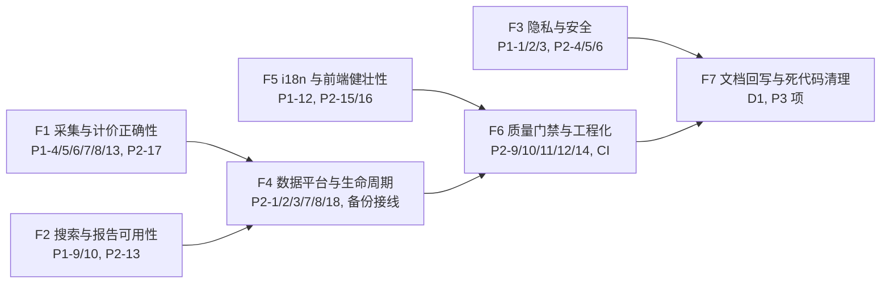

# TrustTools V3.0 审查修复敏捷任务清单

| 属性     | 值                                                         |
| -------- | ---------------------------------------------------------- |
| 文档类型 | 敏捷任务清单 (AGILE-TASK)                                  |
| 项目名称 | trusttools_webapp (AITracker V3.0)                         |
| 版本     | v1.0                                                       |
| 创建日期 | 2026-08-28                                                 |
| 更新日期 | 2026-08-28                                                 |
| 文档状态 | 评审中                                                     |
| 关联     | 审查报告《TrustTools-V3.0-深度审查报告-2026-08-28》v1.0     |

## 修订记录

| 版本 | 修改时间 | 修改内容 |
| ---- | -------- | -------- |
| v1.0 | 2026-08-28 | 依据深度审查报告 13×P1 / 18×P2 拆分修复任务，按数据正确性 → 安全合规 → 健壮性 → 门禁四批推进 |

## 0. 背景与范围

依据《TrustTools-V3.0-深度审查报告-2026-08-28》（下称"审查报告"）的发现编号（P1-1…P1-13、P2-1…P2-18、D1–D4）制订本计划。

**目标**：先修复影响数据可信度的缺陷（丢数/计价错误/口径不一），再收紧安全与合规边界，随后补齐健壮性与工程门禁，最后做文档回写与死代码清理。不引入新运行时依赖（已有自研先例优先复用）；不改写已推送 git 历史；分支保持可构建（`tsc --noEmit` + 相关单测 + `npm run verify:*` 通过后再提交）。

## 1. 实施原则

- 每个 Task 控制在 0.5–1 人日；每个 Story 控制在 1–3 人日。完成后执行：`npx tsc --noEmit`、`npm run lint`、相关单测、**独立 git commit**。
- 行为重构（P1-5/P1-6/P1-8 计价与口径）必须先建立 golden/parity 基线（现有 `tool-registry-expected-diff`、performance fixture 对拍）再切换，禁止用更新测试掩盖行为变化。
- 涉及数据库的改动必须走新增迁移（0002+），并同步放开 `scripts/verify-database-schema.mts` 的钉死断言（P2-14）。
- 生成产物（`*.generated.ts`、`public-manifest.generated.ts`、`job-catalog.generated.ts`）由脚本再生成并提交，不手改。
- 涉及合规口径的改动（P1-2 蒸馏、P1-7 Antigravity）需要产品确认后实施；未确认前不做行为变更，只做文档标注。
- 新增测试必须包含复现原缺陷的负向用例（先红后绿）。

## 2. Epic 总览与依赖

- F1/F2 相互独立可并行；F3 的 P1-2 需产品确认，其余可并行。
- F4 依赖 F1 的口径统一（P1-8 影响 tracker/insight 消费方）。
- F7 收尾在代码完成后执行（含 CLAUDE.md 修正）。

## 3. Epic F1 — 采集与计价数据正确性（约 6 人日）

### Story F1-S1：Grok 去重键修复（P1-4，0.5 人日）

**验收标准**：`scanner.server.ts` 的 Grok identityMaterial 在 eventId 存在时包含 sessionId（`[eventId, sessionId, model]`）；新增多会话回归测试：两个会话各写一条 `turn-1` 同模型不同 token → 断言 grok 事件数 = 2（修复前 = 1）；现有单会话测试不回归。

#### Tasks

- [ ] F1-T1: 修改 `grok` 的 `identityMaterial` 组装；确认 fallbackSessionId 分支不受影响。
- [ ] F1-T2: 在 `scanner.server.test.ts` 新增跨会话碰撞 fixture + 断言；运行 `node --import tsx --test src/lib/local-usage/scanner.server.test.ts`。

### Story F1-S2：reasoning 计价语义显式化（P1-5，1 人日）

**验收标准**：`modelObservation.tokenSemantics` 成为唯一语义来源；WorkBuddy/DSH/Antigravity 声明 `reasoningIncludedInOutput: false`；`estimateEventCost` 对 DSH/WorkBuddy/Antigravity 的 reasoning token 按对应费率计价；`tokenType=reasoning` 行不再恒 $0。

#### Tasks

- [ ] F1-T3: `tool-registry/schema.ts` 增加 `tokenSemantics` 字段校验（Zod），`loader.ts` 编译分支透传。
- [ ] F1-T4: 为 `dsh`/`workbuddy`/`antigravity` 三个 `.tool.json` 声明 `tokenSemantics.reasoningIncludedInOutput: false`；Claude/Codex 先核实真实日志语义（待确认项：Anthropic `input_tokens` 是否含 cache）再定，未核实前保持默认并加注释。
- [ ] F1-T5: 补 `pricing` 单测（deepseek-v4-pro 1M reasoning → knownUsd 含 reasoning 价）；`npm run verify:pricing-rules` 通过。

### Story F1-S3：cacheWrite 无价时按分量计价（P1-6，1 人日）

**验收标准**：命中真实费率时，即使 cacheWrite 费率为 null，input/output/cacheRead 仍按真实费率计价，cacheWrite 分量单独降级（不整体回退 `api-generic-v1`）；parity 基线（12 条 baseline 金额）不变。

#### Tasks

- [ ] F1-T6: `calculate.ts:107-110` 改为返回"已知分量计价 + cacheWrite 降级"而非整体 null；`resolve.ts:393-405` 相应调整 fallback 组装。
- [ ] F1-T7: 补 Codex+gpt-5.6-sol+cacheWrite fixture 断言（修复前 $5.25 → 修复后按真实费率 + cacheWrite 降级标记）；回归 `tool-registry-expected-diff`。

### Story F1-S4：Antigravity 估算口径（P1-7，需产品确认，0.5 人日）

**验收标准**：二选一落地——(a) 按架构文档 §4 将 Antigravity 降回 `usage: unsupported`（删除估算实现与事件产出）；或 (b) 文档修订为"允许估算并明示"，且 totals/bySource/byModel/daily 将 `measurement=estimated` 隔离为独立视图。**未获确认前不改行为，仅在工具 JSON 与文档标注 TODO**。

#### Tasks

- [ ] F1-T8: 向产品确认口径，记录决策到本清单修订记录。
- [ ] F1-T9: 按决策实施（删除估算路径 或 隔离 estimated 汇总 + `aggregate.ts:131-137` 增加 measurement 维度），补负向测试。

### Story F1-S5：totalTokens 口径统一（P1-8，1.5 人日）

**验收标准**：`LocalTokenCounts.totalTokens` 全源统一为 `input + cachedInput + cacheCreation + output + reasoning`；各 native reader 的 totalTokens 构造对齐该公式；`performance.test.ts` fixture 口径与真实 reader 一致；燃烧榜/环比/insight 不再源间漂移。

#### Tasks

- [ ] F1-T10: 定义共享 `computeTotalTokens()`（在 `local-usage/types.ts` 或 `aggregate.ts`），逐个 reader（claude/codex/grok/openclaw/workbuddy/dsh/antigravity/gemini/generic）接入。
- [ ] F1-T11: 更新 fixture 与 golden 对账（`__fixtures__/golden`、`performance.test.ts`）；`npm run test:perf` 通过。
- [ ] F1-T12: 检查依赖 totalTokens 的消费方（`tracker.ts:202`、`context-breakdown.ts`、`tool-overview.ts`）在口径变化后的展示语义，更新注释或拆分字段。

### Story F1-S6：工具趋势图 UTC/本地日统一 + events 计数口径（P1-13，0.5 人日）

**验收标准**：`tool-overview.ts` 趋势图使用本地日期键（与 dashboard v2 `dateKey` 一致）；`TZ=America/Los_Angeles` 与 `TZ=Asia/Shanghai` 下同一事件集归属同日；`rank()` 与卡片 events 统一为 `event.events ?? 1`。

#### Tasks

- [ ] F1-T13: 修复 `tool-overview.ts:222` 日期切片；抽取共享 `localDateKey`（与 `aggregate-projection.ts:35-39` 复用）。
- [ ] F1-T14: 修复 `tool-overview.ts:191,588` 计数；补 TZ 双跑测试。

### Story F1-S7：generic 适配器去重与采集内存上限（P2-17，1 人日）

**验收标准**：generic 管线按（结构化 sessionId + timestamp + token 摘要）跨文件去重，删除"重复累计 4 事件"的旧断言并替换为新去重断言；gemini/grok/openclaw/antigravity 声明 `maxFileSizeBytes`；`readJsonLines` 流式读取前增加文件大小预检；DSH zstd 解压后长度独立上限（或按帧流式解码）。

#### Tasks

- [ ] F1-T15: `scanGenericAdapter` 增加 byIdentity 去重（复用 `scanStructuredAdapter` 的合并模式）；workbuddy 去重覆盖缓存复用路径（P2-17 第二点）。
- [ ] F1-T16: 各结构化适配器 JSON 补 `maxFileSizeBytes`；`readJsonLines` 加 size 预检；`dsh-zstd.ts` 加解压后长度上限。
- [ ] F1-T17: 更新 `scanner.server.test.ts` 的重复累计断言（先红后绿）。

## 4. Epic F2 — 搜索与报告可用性（约 2.5 人日）

### Story F2-S1：搜索隐私守卫修复（P1-9，1.5 人日）

**验收标准**：`FORBIDDEN` 不再误伤独立词（"Token 使用统计"、"prompt 工程"等合法标题通过）；守卫对 `textSummary` 只匹配路径/凭据形态（复用 `PRIVATE_PATH_RE/CREDENTIAL_VALUE_RE` 思路）；单文档违规仅跳过该文档并记录诊断，不再使整个索引读写失败；domain 与 repository 两套守卫收敛为一套；`privacy-negative` 测试不回归。

#### Tasks

- [ ] F2-T1: 重写 `search/domain.ts:13-14` 守卫（独立词 → 形态匹配）；`createSnapshot` 违规处理改为 per-document 降级 + `skipped` 计数。
- [ ] F2-T2: 统一 `sqlite-search-index-repository.server.ts` 的 `assertProjectionSafe` 与 domain 守卫（单点权威）。
- [ ] F2-T3: 补正/负用例（含"Token 使用统计"标题）；运行 search 单测 + privacy-negative。

### Story F2-S2：报告正文上限统一（P1-10，0.5 人日）

**验收标准**：`safeReportText` 上限与传输/应用层一致（2MB 或降低传输层到 60K，产品拍板）；超限时 UI 明确提示而非静默截断；DB CHECK 与代码上限一致。

#### Tasks

- [ ] F2-T4: 统一 `reports/domain.ts:99` 与 `server-fns.ts:148`、`application/index.ts:272-275` 的上限；UI 编辑前预检提示。
- [ ] F2-T5: 补"70K 正文保存"测试（断言不静默截断）。

### Story F2-S3：search 全量重建分块（P2-13，0.5 人日）

**验收标准**：`DELETE … NOT IN` 按 500 一批分块执行；3.3 万+ 文档重建不触发 `SQLITE_MAX_VARIABLE_NUMBER`。

#### Tasks

- [ ] F2-T6: `sqlite-search-index-repository.server.ts:176-182` 分块删除 + 单测（构造 3.5 万文档 fixture）。

## 5. Epic F3 — 隐私与安全（约 4.5 人日）

### Story F3-S1：蒸馏入站脱敏与显式同意（P1-2，需产品确认，1.5 人日）

**验收标准**：发送给 LLM 的片段文本经过 `sanitizeDistilledText`（路径→~、凭据值→[REDACTED]）；会话标题/项目名按 `remoteEligible` 规则剔除或哈希；UI 在首次使用蒸馏时展示"将发送所选会话的原始片段"一次性确认；合规文档（CLEAN_ROOM / 需求规格）新增"蒸馏例外"章节。**产品未确认前只做文档标注**。

#### Tasks

- [ ] F3-T1: `domain.ts` 增加入站脱敏函数（复用 `sanitizeDistilledText`）；`application/index.ts` 组装 input 前应用。
- [ ] F3-T2: `api.server.ts` 增加确认参数透传；前端 `DistillationPage` 增加确认 UI。
- [ ] F3-T3: 更新 `docs/compliance/CLEAN_ROOM.md` 与需求文档；补脱敏负向测试。

### Story F3-S2：服务端实现分块移出公开目录 + 门禁 FAIL（P1-1，1 人日）

**验收标准**：`.output/public/assets/` 不再包含 `*.server-*.js`（构建层面解决：TanStack/Nitro 配置 server chunk 输出目录），或本地服务器对 `*.server-*.js` 资产同样要求 token；`verify-bundle-no-sqlite.mjs` 对命中改为 FAIL（exit 1）；curl 无 token 访问返回 401。

#### Tasks

- [ ] F3-T4: 排查 server 分块进入 public 的构建配置（`vite.config.ts`/TanStack 分块策略），移出或加鉴权；与 `local-web-server.ts` 的静态服务路径协同。
- [ ] F3-T5: `verify-bundle-no-sqlite.mjs` 断言改为失败；补充打包产物检查脚本（`grep -l "DatabaseSync" .output/public/assets/*.js` 应为空）。

### Story F3-S3：dormant dashboard AI 洞察处置（P1-3，0.5 人日）

**验收标准**：该服务删除，或改为：payload 只含匿名计数桶（count/tokens，不含项目名/路径）+ 走 `getCompositionRoot().aiExecutor`（进 `ai_executions` 审计与日预算）。

#### Tasks

- [ ] F3-T6: 删除 `ai-insight.server.ts` 的 LLM 路径（保留规则化 insight），或按验收标准改造；确认无页面引用后移除相关 server fn 注册。

### Story F3-S4：密钥与重置安全（P2-4/5/6，1.5 人日）

**验收标准**：HMAC 密钥改为随机生成并持久化（复用 `file-secret-codec` 的 `secure/secrets.key` 0600 模式或同族实现），project 哈希不可由 dataRoot 重算；桌面端模型 API key 使用 safeStorage（Electron 可用时），composition 注释与实现一致；`release-data-reset` 删除前弹出确认对话框（或改为移动到回收站/备份目录），marker 丢失时不再静默删除。

#### Tasks

- [ ] F3-T7: `database-runtime.server.ts:75-77` 换随机密钥文件（首启生成、wx 防竞态、chmod 0600）；旧库兼容（密钥缺失时重哈希导致旧行失配的处理方案：迁移 0002 重建哈希列，或保留旧派生密钥读取、新随机密钥写入）。
- [ ] F3-T8: composition 注入 safeStorage codec（Electron 侧），web 模式保留文件 codec；修正 `composition.server.ts:201-204` 注释。
- [ ] F3-T9: `release-data-reset.ts` 增加确认交互（`dialog.showMessageBox`）与"移动至备份目录"替代 `rm -rf` 的选项；补测试。

## 6. Epic F4 — 数据平台与生命周期（约 5 人日）

### Story F4-S1：分类索引二次哈希修复（P2-1，1 人日）

**验收标准**：hydrated 快照的 dashboard 加载不再触发 hash-of-hash 分类提交；`project_classifications` 不再累积垃圾行；insight "topProject" 重启前后显示一致（用 `projectLabel` 或 trackerBuckets label）。

#### Tasks

- [ ] F4-T1: `sqlite-usage-snapshot-repository` hydrate 时保留可解析的 ref（如同时输出 `projectRefRaw` 仅供服务端使用，不跨浏览器边界），或 `dashboard/api.server.ts:842-872` 在 resolve 前对已是哈希的 ref 跳过并改用 projectLabel。
- [ ] F4-T2: `insight-evidence.server.ts:371-384` 改用 `bucket.projectLabel`；清理既有垃圾行（迁移 0002 `DELETE FROM project_classifications WHERE ref_hash IN (二次哈希集合)` 或标记未知）。
- [ ] F4-T3: 补重启场景回归测试（采集→load→resolve 链路）。

### Story F4-S2：快照状态语义（P2-2/3，1 人日）

**验收标准**：warningCodes 在成功提交时清空（仅保留当次）；预算超时/健康降级提交 LKG 时保留原 generatedAt 并新增 `staleRefreshed` 标记（或 `status=stale`），UI "最后更新于"不再显示未发生的采集；每次超时不重复写库。

#### Tasks

- [ ] F4-T4: `coordinator.ts:190` 成功提交清空 warningCodes；`commit()` 增加 `generatedAt` 保留选项。
- [ ] F4-T5: `usage-collector`/composition collect 传 LKG 标记；`usage-snapshot-runtime.server.ts:63-78` 相应调整；补 budget=1ms 的 fresh/stale 断言测试。

### Story F4-S3：启动屏障语义放宽（P2-7，1 人日）

**验收标准**：必需启动任务 cancelled（超时/取消）不再导致整个应用启动失败——失败时跳过屏障继续后台重试，页面以 LKG/空态渲染并提示"数据刷新中"；Electron 首启在慢机器上不再弹错误框退出；web dev 首次加载不再被阻塞至超时。

#### Tasks

- [ ] F4-T6: `scheduler.ts:565-572` 的 `requiredFailure` 判定排除 `cancelled`（超时）状态，仅 `failed` 且重试耗尽才失败；或失败时降级为不阻塞。
- [ ] F4-T7: 补充调度器测试（超时启动任务 → 屏障不抛、任务进入重试）；回归 `desktop-startup-barrier` 测试。

### Story F4-S4：usage 刷新写放大缓解（P2-8，1 人日）

**验收标准**：`usage.refresh` 默认周期与 `freshForMinutes` 调整（如 1 分钟 → 5 分钟，产品确认），或代际提交改为增量（仅写变更 bucket）；运行 10 分钟观察 `-wal` 增长显著下降；Dashboard 状态轮询不受影响。

#### Tasks

- [ ] F4-T8: 调整 `job-catalog.generated.ts` 与 `runtime-policy.source.json` 的 usage 周期（两处同改 + 再生成）。
- [ ] F4-T9: （可选）`commitGeneration` 支持增量：新增/变更 bucket upsert + 过期窗口删除，替代全量 DELETE+INSERT；补性能测试观察点。

### Story F4-S5：备份/恢复子系统接线（D2，1 人日）

**验收标准**：任务目录新增 `backup.daily`（daily 调度，参照 `retention.apply`）→ `createOnlineBackup` + `pruneBackups`；`createDatabaseRuntime` 在迁移前调用 `createPreMigrationBackup`；`DatabaseHost.open` 抛 `corrupt` 时启动失败路径接入 `planRecovery/restoreFromBackup`（Electron 侧错误码 `database.corrupt` 已有出口）；备份文件落 `dataRoot/.aitracker/backups/`（0600）。

#### Tasks

- [ ] F4-T10: 注册 `backup.daily` 任务 + composition executor + `verify:job-catalog` 通过。
- [ ] F4-T11: 迁移前备份接入 `database-runtime.server.ts`；损坏恢复路径接入 `desktop-startup-barrier`/`startup-failure` 流程；补接线级测试。

### Story F4-S6：技能快照接线与 lastUsedAt（P2-18，1 人日）

**验收标准**：4 处绕过协调器的 `scanLocalSkills()` 调用改走 `SkillSnapshotRuntime`（或共享同一单飞入口）；技能收集器接收 usage 快照的 `context.skills` 计算 `lastUsedAt`（生产不再恒 null）；"最近调用"标签与排序恢复有效。

#### Tasks

- [ ] F4-T12: `local-market/api.server.ts:98-101`、`skill-distribution/query.ts:151-153`、`skill-catalog/query.ts:118-122`、`local-skill-monitor.server.ts:206` 统一走快照协调器。
- [ ] F4-T13: `skill-snapshot-runtime` collect 注入 usage 证据 → `skillUsageEvidence`；补集成测试。

## 7. Epic F5 — i18n 与前端健壮性（约 3 人日）

### Story F5-S1：模块展示层硬编码文案迁移（P1-12，1.5 人日）

**验收标准**：ExpCard（保存弹窗/质检徽章）、MarketPanel（领域胶囊，label 改 value+labelKey）、ReportsPage（周期日期用 `format.formatDate`）、DistillConfig/MemoryPage 兜底值全部走 locale 字典；`check-hardcoded-text.mjs` 扫描范围覆盖 `src/modules/*/presentation` 与 `src/modules/*/query/presentation`；`npm run check:i18n` 全链路通过且能抓出上述位置。

#### Tasks

- [ ] F5-T1: `locales/{zh-CN,en-US,ja-JP,ko-KR}` 新增 `distill.*`/`market.*`/`reports.*` 文案 key（四语同步）。
- [ ] F5-T2: 迁移 ExpCard/MarketPanel/ReportsPage/DistillConfig/MemoryPage 文案；MarketPanel 领域数据改为 `{ value, labelKey }`。
- [ ] F5-T3: 扩展 `check-hardcoded-text.mjs` 目录清单；补硬编码扫描回归样例（含 `distill` 目录）。

### Story F5-S2：ja/ko 路由标题回落修复（P2-15，0.5 人日）

**验收标准**：路由 `head()` 复用主字典 `loadCatalog`（lazy 路由下读取已 prime 的缓存），删除 `route-messages.ts` 第二份字典；SSR 首帧标题与 hydration 后一致（ja/ko 显示日/韩文）。

#### Tasks

- [ ] F5-T4: `root-route-config.ts`/各 route head 改用主字典；删除 `route-messages.ts` 及引用；`check:locale-sync` 通过。

### Story F5-S3：前端失败态与资源清理（P2-16，1 人日）

**验收标准**：`/agents` 懒加载失败渲染可重试错误面板（参照 `DashboardPage.tsx:66-86` 模式）；sources 重扫定时器链卸载即取消（useRef 句柄 + cleanup）；insight 模块级缓存按 surface 上限裁剪（LRU 或按 key 前缀截断）。

#### Tasks

- [ ] F5-T5: `agents.lazy.tsx` 区分 loading/error 两态 + 重试按钮。
- [ ] F5-T6: `sources/query/presentation/index.tsx:138-152` 定时器链加 cancelled/cleanup。
- [ ] F5-T7: `use-page-insight.ts:66-69` 缓存加裁剪（如每 surface 上限 50 条）。

## 8. Epic F6 — 质量门禁与工程化（约 2.5 人日）

### Story F6-S1：CI 与 verify 全链 blocking（D3、P2-9，1.5 人日）

**验收标准**：新增 `.github/workflows/ci.yml`（push/PR 触发）：`tsc --noEmit` → `npm run lint` → `npm run verify:architecture:blocking` → `npm run verify:database` → `npm run verify:runtime-policy` → `npm run verify:module-catalog` → `npm run verify:read-model-budgets`（含 fixture 生成）→ `npm run test:unit`（+ e2e 可选 job）；`verify-module-boundaries` 默认改为 blocking 或 CI 显式 `--blocking`；现有 9 条边界违规在 CI 启用前清理或登记豁免。

#### Tasks

- [ ] F6-T1: 清理 9 条 `module-deep-import` 违规（经公开出口导入；`tasks→reports/schedule.ts` 改 `reports/index`；security-assessment 经 composition root 注入；事件常量收敛共享模块）。
- [ ] F6-T2: 新增 CI workflow；把 `verify:runtime-policy`、`verify:module-catalog`、`verify:read-model-budgets` 挂入 `test:all`/`verify:database` 链。
- [ ] F6-T3: 新增 `check:generated-clean`（生成后 `git diff --exit-code`）防漂移。

### Story F6-S2：配额与审计治理（P2-10/11，0.5 人日）

**验收标准**：蒸馏配额改为事务内原子 `UPDATE … SET calls=calls+1 WHERE calls<limit`（先占坑），消除 check-then-act 竞态；AI 审计 capability 分类按 prompt id 前缀白名单（`security.`→security、`dashboard.`→dashboard-insight），统计不再混入 distillation。

#### Tasks

- [ ] F6-T4: `sqlite-quota-store.server.ts` 增加原子预留接口；`distillation/application/index.ts:239-250,324-330` 接入；补并发测试。
- [ ] F6-T5: `composition.server.ts:497-501` capability 映射白名单化。

### Story F6-S3：e2e 与脚本健壮性（P3 项，0.5 人日）

**验收标准**：e2e 工具数从魔法数字 36 改为读 manifest（或注入常量）；固定等待改用 `expect.poll`/`waitForFunction`；`route-open-performance` 读取 budgets 断言 P95 或标注为人工工具。

#### Tasks

- [ ] F6-T6: `desktop.spec.ts:269`、`full-system-smoke.spec.ts:69` 改动态断言。
- [ ] F6-T7: 替换主要固定等待；`route-open-performance.spec.ts` 接预算门禁。

## 9. Epic F7 — 文档回写与死代码清理（约 1.5 人日）

**验收标准**：CLAUDE.md 修正（快照 TTL 语义、`usage_events` 说明、token 传递方式、safeStorage 现状）；架构文档回写（TRUSTTOOLS_LLM_* 退役、Antigravity 决策、蒸馏例外）；死代码清单清空。

#### Tasks

- [ ] F7-T1: CLAUDE.md 与 `docs/architecture/trusttools_webapp-架构设计文档.md` 同步实际实现（D1）。
- [ ] F7-T2: 清理死代码：`usage_events` 家族死表（迁移 0002 DROP + 放开 `verify-database-schema.mts` 钉死断言，P2-14）、`src/components/dashboard/` 死组件、`findForbiddenDtoFields` 接线或移除、`genericReaderSpecFor` 接线或移除、`TokenStatus "challenge"` 死分支、`route-messages.ts`（F5-S2 已删）。
- [ ] F7-T3: 其他 P3 小项：`minimumComparableEvents` 注释/取值对齐、`sitemap[.]xml.ts` BASE_URL TODO、`docs/V3.0_TrustTools/` 本地快照清理说明、`$schema` 引用修正。

## 10. 里程碑与验收

| 里程碑 | 内容 | 出口条件 |
| ------ | ---- | -------- |
| M1 数据可信 | F1 全部 + F4-S1/S2 | `npm run test:perf`、`npm run verify:pricing-rules`、scanner/pricing/tracker 单测全绿；Grok 跨会话/计价/口径三项有负向回归测试 |
| M2 安全合规 | F3 全部（P1-2 需产品确认） | curl 无 token 访问 server 分块 401；蒸馏入站脱敏测试通过；重置有确认交互；HMAC 密钥随机化迁移完成 |
| M3 可用性 | F2 + F5 + F4-S3/S4/S6 | 搜索误伤用例通过；sessions keyset 分页压测（10 万条）；i18n 四语截图核对；启动屏障弱机器冒烟 |
| M4 门禁 | F6 + F7 | CI 全绿且 `--blocking` 生效；`check:generated-clean` 无漂移；死代码清单清空；CLAUDE.md 与实际一致 |

## 11. 风险与待确认

| 项 | 说明 | 影响 |
| --- | ---- | ---- |
| P1-2 蒸馏口径 | 需产品确认"用户授权原始片段"与 CLEAN_ROOM 的边界 | 决定 F3-S1 行为变更 or 仅文档 |
| P1-7 Antigravity | 估算 vs unsupported 二选一 | 决定 F1-S4 实现方向 |
| P1-10 报告上限 | 60K vs 2MB 统一方向 | 影响 F2-S2 与 UI |
| Claude cache 语义 | `input_tokens` 是否含 cache-read 待真实日志核实 | 影响 F1-T4 的 Claude 声明 |
| Codex archived_sessions | move 还是 copy 决定双计风险 | 影响 F1-S7 去重测试 |
| HMAC 密钥迁移 | 旧库哈希列与新密钥的兼容方案 | 影响 F3-T7 与数据可见性 |
| P2-8 写放大 | 增量代际提交改动面较大 | M1 可先调周期，增量作为可选 |
