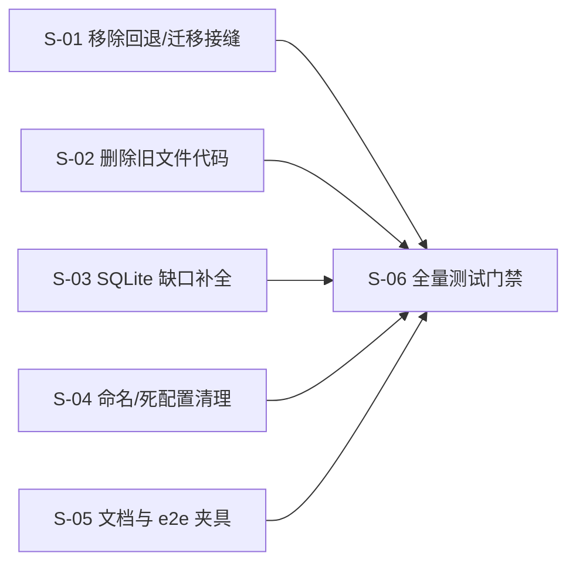

# TrustTools 本地存储数据库 SQLite 全面切换敏捷任务清单

| 属性 | 值 |
|------|-----|
| 文档类型 | 敏捷任务清单 (AGILE-TASK) |
| 项目名称 | TrustTools |
| 版本 | v1.0 |
| 创建日期 | 2026-08-20 |
| 生成工具 | agile-feature-dev |
| 文档状态 | 草稿 |

## 修订记录

| 版本 | 修改时间 | 修改内容 |
|------|---------|---------|
| v1.0 | 2026-08-20 | 初始版本：基于对 `src/`、`electron/` 全量盘点（4 个独立审计子代理 + 门禁基线实测），拆分「SQLite 全面切换：去除错误回退、数据迁移与旧文件读写代码」的 Epic/Story/Task |

---

## 0. 审计结论（本计划的事实基础）

**基线实测（2026-08-20，全部通过）**：`verify:sqlite-only` OK、`verify:database-schema` OK、`verify:browser-server-boundary` OK、`npx tsc --noEmit` 0 error、`npm run lint` 0 error（4 个既有 UI warning）。

**已完成 SQLite 化（不再改动）**：组合根 `src/app/composition.server.ts` 全部业务域（tasks/monitoring/reports/knowledge/distillation/usage/session/skill/installation 快照、分类索引、AI 执行、洞察、性能 rollout、模型 Profile、汇率、市场、技能 origins/blacklist）已走 `databaseRuntime.features` 的 SQLite 仓库；Electron 偏好/安全扫描历史/扫描计划/模型配置经 `DesktopStateBroker` → `app_preferences`；浏览器偏好经 server-fn → SQLite（无 localStorage）；迁移已推进到 0004（10 张平台表 + M2–M4 全量表）；扫描器增量索引已改为进程内重建缓存（不再写 `local-usage-index-v10.json`）。

**必须修复的问题（本计划的交付范围）**：

1. **错误回退残留**（违反「不要使用错误回退」）：5 个 `create*ReadFallback` 工厂（preference/report/candidate/security-history/knowledge）与 `withLegacySnapshotImport`（legacy JSON envelope 导入）仍存在；生产未接线，仅被测试锁定。
2. **数据迁移残留**（违反「不要使用数据迁移」）：7 个仓库的 `importLegacy*` 一次性导入方法（preference/insights/ai-executions/quota/run-store/candidate/report/knowledge/history）+ `task-storage.ts` 旧文档形状解析分支。
3. **旧文件读写代码残留**：`src/platform/persistence/infrastructure/`（node-file-system/node-file-lock）整体死代码；4 个 `atomic-*-store.ts` 已退化为 Zod schema 文件（knowledge 零引用）；旧 JSON task 仓库（task-run/task-preference-repository）仅测试引用；`model-profile.server.ts`、`distillation/quota.ts` 的 JSON 文档仓库工厂仅测试引用；`envelope-repository.ts` 为测试专用旧式适配器。
4. **SQLite 缺口**：WSL 拓扑快照仍用组合根内存仓库（未落 SQLite）；搜索索引仅内存实现（`search_documents` 表未建、未接线）；retention 任务仍清理已无写入者的 `~/.trusttools/cache/` 目录（`prune.server.ts`）；安全扫描历史以 JSON blob 存 `app_preferences`（`security_scan_runs/assessments` 表已建未接线）。
5. **遗留命名/死配置/文档漂移**：`legacy-usage-collector/adapter`、`legacy-session-adapter` 命名；`cacheFileName` 死字段（schema + scanner-policy + generated）；Electron `SecurityScannerServiceOptions.dataDirectory` 死参数；CLAUDE.md/README/electron contracts 注释仍描述 `trusttools-prefs.json` 与 `local-usage-index-v10.json`；ADR/架构文档仍描述 shadow-write/read-switch/`data_migration_runs`（该表已删除，实际 10 表）。

## 1. 目标与交付边界

按用户指令「完全按照新项目使用 SQLite 的方式」执行：**不保留错误回退、不保留数据迁移逻辑、删除旧的文件保存/读取代码、全量测试**。对应架构文档 §2.2 成功标准中的「兼容/正确性/隐私/可维护性」与「迁移：每个 JSON 源可重复导入且幂等」的**反向裁定**——后者在本计划中被废除（新项目无 JSON 源）。

### 1.1 本轮交付（Release 2，MUST）

| 交付物 | 说明 |
|---|---|
| 回退/迁移接缝清零 | 删除全部 `create*ReadFallback`、`withLegacySnapshotImport`、`importLegacy*`、旧文档形状解析分支及其测试 |
| 旧文件存储代码清零 | 删除 `platform/persistence/infrastructure/`、旧 JSON task 仓库、JSON 文档仓库工厂；`contracts.ts` 收缩为 `Clock`；`atomic-*` 文件删除或去前缀瘦身为纯 schema 模块 |
| SQLite 缺口补全 | 迁移 0005（`snapshot_blobs` + `search_documents`）；WSL 快照 SQLite 仓库；搜索索引 SQLite 仓库并接线组合根；retention 改为数据库清理（删除 `prune.server.ts`） |
| 命名/死配置清理 | `legacy-*` 适配器改名；`cacheFileName` 死字段删除；Electron 死参数删除 |
| 文档同步 | ADR v1.3、架构文档 v1.3（新项目 SQLite-only 模式）；CLAUDE.md/README/electron contracts 注释修正；e2e stale-home 夹具改 SQLite 种子 |
| 门禁强化 | `verify:sqlite-only` 新增回退/导入/旧文件名模式规则与负向测试 |
| 全量测试 | 全部 `src/**/*.test.ts` + `electron/*.test.ts` + `scripts/*.test.mjs` + 全部 verify 门禁 + tsc/eslint/prettier + 关键 e2e spec |

### 1.2 本轮明确不做（WON'T）

| 项 | 说明 |
|---|---|
| 安全扫描历史规范化落 `security_scan_runs/assessments` 表 | 数据已在 SQLite（app_preferences blob），规范化接线列入后续迭代（表与 store 已存在，仅差 broker 接线） |
| FTS5 全文搜索 | 沿用设计决策：能力与中文质量基准通过前不启用 |
| usage 扫描器文件级索引 SQLite 持久化 | 当前为进程内重建缓存（不落盘、无隐私面），符合「应用自身状态全部 SQLite」；跨重启热扫描作为后续性能迭代 |
| skills trash `manifest.jsonl` / `logs/skills-ops.log` | 属物理文件操作审计/可观测日志，与 `observability.jsonl` 同级豁免（设计 §1.3「仅用于日志排障的 JSONL 继续使用」） |

## 2. 需求与验收追踪

| 编号 | 来源 | 验收摘要 | 承担 Task |
|---|---|---|---|
| R-01 | 用户指令「不要使用错误回退」 | 生产代码零 `create*ReadFallback`/`withLegacySnapshotImport`/`legacy.read` 回退；测试删除 | S-01 |
| R-02 | 用户指令「不要使用数据迁移」 | 生产代码零 `importLegacy*`/旧文档形状解析；仓库接口不再暴露 legacy 参数 | S-01 |
| R-03 | 用户指令「去除旧的文件保存、读取代码」 | `platform/persistence` 仅剩 `Clock`；无 `atomic-*`/`node-file-*` 文件；无 JSON 文档仓库 | S-02 |
| R-04 | 用户指令「完全使用 SQLite」 | WSL 快照、搜索索引落 SQLite；retention 为 DB 清理；迁移 0005 注册且 schema 门禁通过 | S-03 |
| R-05 | 用户指令「进行完整的测试」 | 全量单测/脚本测/门禁/构建/关键 e2e 全绿；`verify:sqlite-only` 新增规则锁定回归 | S-06 |
| R-06 | 架构文档 §3.2/§9 | 无业务模块静态 import `node:sqlite`；renderer bundle 无 `DatabaseSync` | S-03/S-06 |
| R-07 | 隐私红线（CLEAN_ROOM） | 新表/仓库不存绝对路径、明文密钥、正文；禁存内容负向测试继续零命中 | S-03/S-06 |

## 3. 依赖图与发布里程碑

| 里程碑 | 完成定义 | SP |
|---|---|---|
| M-1 回退/迁移清零 | S-01 全绿；`verify:sqlite-only` 新规则拦截样例 | 5 |
| M-2 旧文件代码清零 | S-02 全绿；`tsc` 证明无旧符号引用 | 8 |
| M-3 SQLite 缺口补全 | S-03 全绿；迁移 0005 双源一致 | 8 |
| M-4 命名与文档 | S-04/S-05 全绿 | 5 |
| **Release 2 门禁** | S-06 全量测试 + 审查报告通过 | 8 |

## 4. Epic R2 — SQLite 全面切换与旧文件代码清理

### Story S-01：移除 legacy 回退与数据迁移接缝 — 5 SP

**验收标准**：生产代码中不存在任何 legacy 读取回退、一次性导入或旧文档形状解析；仓库接口不再暴露 legacy 参数（`tsc` 编译即证）；`verify:sqlite-only` 新增规则能拦截 `create*ReadFallback`/`importLegacy*`/`withLegacy*` 样例。

| Task | 工作项 | 依赖 | 验收标准 | 强制验证步骤 |
|---|---|---|---|---|
| T-01-01 | 删除 `platform/database/snapshot-generation.server.ts` 的 `withLegacySnapshotImport` 及 m3 测试中的对应用例 | 无 | 函数与引用清零；`loadGeneration/commitGeneration` 语义不变 | prettier --check → tsc --noEmit → lint → `npm run test:database` → commit |
| T-01-02 | 删除 5 个 ReadFallback 工厂：`sqlite-preference-repository.server.ts`（`createPreferenceReadFallback`+`LegacyPreferenceSource`）、`sqlite-report-store.server.ts`、`sqlite-candidate-store.server.ts`、`sqlite-history-store.server.ts`、`sqlite-knowledge-repository.server.ts`；同步删除各自测试中的 fallback 用例 | T-01-01 | 工厂符号清零；仓库构造器不再接受 legacy 参数；对应测试改为断言「无 legacy 参数」 | prettier --check → tsc --noEmit → lint → `npm run test:database` → commit |
| T-01-03 | 删除 7 个仓库的 `importLegacy*` 方法与测试：preference、insights、ai-executions、quota-store、skill-distribution run-store、candidate、report、knowledge、security-history | T-01-02 | `importLegacy*` 符号清零；接口类型同步删除 | prettier --check → tsc --noEmit → lint → `npm run test:database` → commit |
| T-01-04 | 清理 `modules/tasks/application/task-storage.ts` 中旧文档形状解析分支（`updatedAt`/`tasks` 兼容解析）及 `task-storage.test.ts` 对应用例 | T-01-02 | `preferenceSchema` 只解析当前形状；测试锁定旧形状被拒 | prettier --check → tsc --noEmit → lint → 相关单测 → commit |
| T-01-05 | 强化 `scripts/verify-sqlite-only.mjs`：新增内容规则 `\b(?:create\w*ReadFallback|importLegacy\w*|withLegacy\w*|LegacyPreferenceSource)\b` 与文件路径规则（`atomic-.*-store`、`node-file-(system|lock)`）；`verify-sqlite-only.test.mjs` 新增正/负样例 | T-01-03 | 篡改样例被拦截且正常仓库 OK；`npm run verify:sqlite-only` 与 `npm run test:scripts` 全绿 | prettier --check → lint → `npm run verify:sqlite-only` + `npm run test:scripts` → commit |

### Story S-02：删除旧文件存储代码 — 8 SP

**验收标准**：`src/platform/persistence/` 仅剩 `clock.ts` 与仅含 `Clock` 的 `contracts.ts`；`src/` 与 `electron/` 中不存在 `atomic-*-store`、`node-file-system`、`node-file-lock`、旧 JSON task 仓库与 JSON 文档仓库工厂；所有引用改指向 SQLite 仓库或测试专用 helper（位于 `src/test-support/`）。

| Task | 工作项 | 依赖 | 验收标准 | 强制验证步骤 |
|---|---|---|---|---|
| T-02-01 | 删除 `src/platform/persistence/infrastructure/`（node-file-system.ts、node-file-lock.ts）；`contracts.ts` 收缩为 `Clock`；删除 `index.ts` barrel（无引用）；`JsonSchema` 类型迁入 `src/test-support/`（供测试 helper 使用） | 无 | 死代码清零；`grep -r "node-file-system\|node-file-lock\|JsonMigration\|FileLock\|PersistenceError"` 零命中（测试支持除外） | prettier --check → tsc --noEmit → lint → commit |
| T-02-02 | `atomic-knowledge-store.ts` 整文件删除；`atomic-report-store.ts` 瘦身为 `report-schemas.ts`（仅 `ReportDocumentSchema`/`ReportRunSchema`）、`atomic-candidate-store.ts` 瘦身为 `candidate-schemas.ts`（仅 `PersistedCandidateSchema`/`DistillCandidateFile`）、`atomic-history-store.ts` 瘦身为 `history-schemas.ts`（仅 `securityAssessmentHistorySchema`/`SecurityAssessmentHistoryDocument`）；更新 `sqlite-*` 仓库 import | T-02-01 | `src/` 无 `atomic-` 前缀存储文件；verify:sqlite-only 新文件路径规则通过 | prettier --check → tsc --noEmit → lint → `npm run test:database` → commit |
| T-02-03 | 删除旧 JSON task 仓库 `task-run-repository.ts`、`task-preference-repository.ts`；`task-storage.test.ts` 改为直接验证 SQLite 仓库（复用 m2-state.test.ts 风格）或删除文件级用例 | T-02-02 | 旧仓库文件清零；任务域测试仍覆盖 schedule 语义 | prettier --check → tsc --noEmit → lint → `npm run test:database` + `src/modules/tasks` 测试 → commit |
| T-02-04 | `model-profile.server.ts` 剥离 JSON 文档仓库：删除 `createModelProfileRepository`（document-store 版）、`modelProfilesSchema()`、`ModelProfilesFileSchema`、`DEFAULT_MODEL_PROFILES_FILE`、`MODEL_PROFILES_SCHEMA_VERSION`；`model-profile.test.ts` 改为 SQLite 仓库测试（保留应用逻辑用例：active 唯一、密钥加密、chatUrl 等） | T-02-01 | `createModelProfileRepository` 符号清零；测试全绿且覆盖原用例语义 | prettier --check → tsc --noEmit → lint → `src/modules/ai-orchestration` 测试 → commit |
| T-02-05 | `distillation/quota.ts` 删除 `distillQuotaStoreSchema()`/`DEFAULT_DISTILL_QUOTA_FILE`/`createAtomicDistillQuotaStore`/`AtomicDistillQuotaStoreOptions`；`sqlite-quota-store.server.ts` 不再引用 `DistillQuotaFile`；`quota.test.ts` 重写为 SQLite 仓库测试 | T-02-04 | `createAtomicDistillQuotaStore` 符号清零；配额语义（同日累计、跨日重置、限额）测试仍全绿 | prettier --check → tsc --noEmit → lint → `src/modules/distillation` 测试 → commit |
| T-02-06 | `snapshot-runtime/envelope-repository.ts` 移入 `src/test-support/`（测试专用 helper，注释标明）；4 个快照 runtime 测试（session/skill/installation/wsl）改 import | T-02-05 | `src/platform/` 无 envelope-repository；4 个测试文件全绿 | prettier --check → tsc --noEmit → lint → 4 个测试文件 → commit |

### Story S-03：SQLite 缺口补全 — 8 SP

**验收标准**：迁移 0005（`snapshot_blobs` + `search_documents`）双源一致且 `verify:database-schema` 通过；WSL 快照与搜索索引经 SQLite 仓库持久化并接线组合根；retention 任务改为数据库清理；`prune.server.ts` 删除；隐私负向测试零命中。

| Task | 工作项 | 依赖 | 验收标准 | 强制验证步骤 |
|---|---|---|---|---|
| T-03-01 | 新建 `migrations/0005_search_wsl.sql` + `migrations/index.ts` 内联双源 `PLATFORM_MIGRATION_0005_SQL`：`snapshot_blobs`（snapshot_id PK/FK CASCADE、payload_json CHECK json_valid、payload_bytes CHECK >= 0）与 `search_documents`（架构 §5.9：UNIQUE(type, source_ref)、索引 (type, updated_at_ms DESC) 与 (freshness)、全部 STRICT）；`verify-database-schema.mts` 增加 0005 校验段 | S-01 | 双源 sha256 一致；空库 0→5 迁移通过；篡改任一 SQL 被 schema 门禁拦截 | prettier --check → tsc --noEmit → lint → `npm run test:database` + `npm run verify:database-schema` → commit |
| T-03-02 | 新建 `sqlite-wsl-snapshot-repository.server.ts`（复用 snapshot-generation helper，payload 走 `snapshot_blobs`，仓库层 payload ≤ 256 KB）；`database-runtime.server.ts` 增加 `wslSnapshots` feature；`composition.server.ts` 删除内存 envelope repo 改接线 | T-03-01 | WSL 快照重启后可恢复；内存 repo 代码清零；payload 超限被拒 | prettier --check → tsc --noEmit → lint → 新仓库测试 + `src/platform/discovery` 测试 → commit |
| T-03-03 | 新建 `sqlite-search-index-repository.server.ts`（实现 `SearchIndexRepository`）；`database-runtime.server.ts` 增加 `searchIndex` feature；`composition.server.ts` 接线 `SearchIndexService` 与 `search/api.server.ts` | T-03-01 | 搜索索引重启后恢复（现有「persists updates and reloads after restart」测试改为真实 SQLite）；`(type, source_ref)` 幂等 upsert | prettier --check → tsc --noEmit → lint → `src/modules/search` 测试 → commit |
| T-03-04 | retention 执行器改为数据库清理（过期 `http_cache_entries`、过期 insight cache、超量旧 snapshot generation）；删除 `lib/local-usage/prune.server.ts` 与 `prune.server.test.ts`；`composition.server.ts` retention executor 与 `runtime-policy` 相应调整；`app-config.ts` 的 `DATA_ROOT_MARKER` 若失去引用一并清理（先核对 `electron/app-config.ts` 镜像同步） | T-03-01 | `~/.trusttools/cache/` 不再被生产代码写入或清理；retention 任务有 DB 清理测试；`tsc` 无 prune 引用 | prettier --check → tsc --noEmit → lint → retention 测试 → commit |
| T-03-05 | 隐私负向：`search_documents`/`snapshot_blobs` 注入路径/密钥/正文断言被拒或不可逆；`verify:browser-server-boundary` 与 `verify:bundle-no-sqlite` 保持 OK | T-03-02/03 | 负向用例零穿透；bundle 无 DatabaseSync | prettier --check → lint → 负向测试 + 两个 verify 门禁 → commit |

### Story S-04：遗留命名与死配置清理 — 3 SP

**验收标准**：`src/` 生产代码中不存在以 `legacy-` 开头的持久化/采集模块名；`cacheFileName` 字段从 schema/policy/generated 定义中消失；Electron 无 `dataDirectory` 死参数。

| Task | 工作项 | 依赖 | 验收标准 | 强制验证步骤 |
|---|---|---|---|---|
| T-04-01 | 改名（含 import/测试/注释）：`legacy-usage-collector.server.ts`→`usage-collector.server.ts`、`legacy-usage-adapter.server.ts`→`usage-adapter.server.ts`、`legacy-session-adapter.server.ts`→`session-adapter.server.ts`；工厂 `createLegacyUsageCollector`→`createUsageCollector`、`createLegacyResumeSessionPort`→`createSessionResumePort`（核对 `node-resume-executor.server.ts`、`usage-snapshot-runtime.server.ts`、`session-snapshot-runtime.server.ts`、composition） | S-01 | 文件名/符号名不再含 legacy 前缀；相关测试全绿 | prettier --check → tsc --noEmit → lint → usage/sessions 测试 → commit |
| T-04-02 | 删除 `cacheFileName` 死字段：`tool-registry/schema.ts`、`definitions/_shared/scanner-policy.json`、`definitions/dsh.tool.json` 及 generated 产物（运行 `npm run generate:manifest` 重新生成）；核对 `dsh.server.test.ts` 断言不受影响 | T-04-01 | `grep -r cacheFileName src/` 零命中；generated 文件重新生成后无 diff 漂移 | prettier --check → tsc --noEmit → lint → `npm run verify:tool-registry` → commit |
| T-04-03 | Electron 清理：`SecurityScannerServiceOptions.dataDirectory` 死参数删除（`electron/security-scanner-service.ts`、`main.ts` 调用点）；`contracts.ts` 中「prefs file」注释改为「SQLite app_preferences via broker」 | T-04-01 | `dataDirectory` 符号清零；注释与实际一致 | prettier --check → `npm run build:electron` → tsc --noEmit → lint → electron 测试 → commit |

### Story S-05：文档与 e2e 夹具同步 — 3 SP

**验收标准**：ADR/架构文档与实现一致（新项目 SQLite-only 模式，无 shadow-write/read-switch/data_migration_runs/legacy adapter 回退）；CLAUDE.md/README/electron contracts 注释不再描述已删除的 JSON 文件；stale-home e2e 用 SQLite 种子构造 stale 状态且 spec 通过。

| Task | 工作项 | 依赖 | 验收标准 | 强制验证步骤 |
|---|---|---|---|---|
| T-05-01 | ADR 升级 v1.2：修订决策 5/6 与「后果」为「无 legacy 回退、无迁移、启动失败即致命」；架构设计文档升级 v1.3：修订 §2.2 迁移行、§3.2 回退语句、§5.0（实际 10 表、无 data_migration_runs）、§11/§13（标注已按新项目模式交付，迁移章节退役） | S-01/02 | 文档不再出现「保留 legacy adapter」「shadow-write」「data_migration_runs」等与实现矛盾的表述；修订记录完整 | prettier --check（md 免 lint）→ commit |
| T-05-02 | 修正 CLAUDE.md（prefs 与 local-usage 缓存描述）、README.md:105/123、`docs/plans/performance-architecture-plan.md:231` 的索引缓存描述 | T-05-01 | grep 零「local-usage-index-v10.json」落盘描述残留 | prettier --check → commit |
| T-05-03 | e2e stale-home 改造：`playwright.config.stale-home.ts` globalSetup 用种子脚本生成含旧时间戳快照的 SQLite 库到 fixture home（不提交二进制；DB 在 temp 生成）；删除 `tests/fixtures/e2e/stale-home/.trusttools/tasks/*.json` 旧 JSON 夹具；`performance-stale-offline.spec.ts` 断言不变 | T-03-02/03 | stale 场景仍复现「stale 快照 + 离线」路径且通过 | prettier --check → tsc --noEmit → `npx playwright test -c playwright.config.stale-home.ts` → commit |

### Story S-06：全量测试与门禁 — 8 SP

**验收标准**：新增 `test:unit`/`test:all` npm 脚本跑全部单测；`src/**`、`electron/**`、`scripts/**` 测试与全部 verify 门禁、tsc、eslint、prettier、build、bundle 检查、关键 e2e 全绿；qa-expert 与 code-reviewer-pro 独立审查通过且发现闭环。

| Task | 工作项 | 依赖 | 验收标准 | 强制验证步骤 |
|---|---|---|---|---|
| T-06-01 | package.json 增加 `test:unit`（`node --import tsx --test "src/**/*.test.ts"`，先本地验证 glob 行为避免虚绿）与 `test:all`（unit + test:scripts + test:database + check:i18n）；全量运行并修复所有失败 | S-01~05 | `npm run test:all` 全绿且测试文件数 ≥ 当前清单 | prettier --check → tsc --noEmit → lint → `npm run test:all` → commit |
| T-06-02 | 全门禁链：`verify:database`、`verify:browser-server-boundary`、`verify:sqlite-only`、`verify:bundle-no-sqlite`、`verify:tool-registry`、`verify:architecture`、`verify:database-schema`、`check:i18n`；`npm run build` 后 bundle 无 DatabaseSync | T-06-01 | 全部 OK；无新 WARN | 逐门禁运行 → commit |
| T-06-03 | e2e 关键 spec：`desktop.spec.ts`、`settings-model-config.spec.ts`、`performance-stale-offline.spec.ts`、`performance-scenarios.spec.ts`（按需） | T-06-02 | 通过；无存储相关回归 | playwright 运行 → commit |
| T-06-04 | 独立审查：qa-expert（测试策略/验收追踪）+ code-reviewer-pro + security-auditor（隐私红线）审查 Release 2 交付；修复所有 P0/P1 后归档报告至 `docs/tests/` | T-06-03 | 审查报告归档；P0/P1 清零 | 修复后重跑 T-06-01/02 → commit |

## 5. 依赖关系表

| Task | 依赖 | 阻塞 |
|---|---|---|
| T-01-01 | — | T-01-02 |
| T-01-02 | T-01-01 | T-01-03/04 |
| T-01-03 | T-01-02 | T-01-05 |
| T-01-04 | T-01-02 | — |
| T-01-05 | T-01-03 | S-03/S-04 |
| T-02-01 | — | T-02-02~06 |
| T-02-02 | T-02-01 | T-02-03 |
| T-02-03 | T-02-02 | — |
| T-02-04 | T-02-01 | T-02-05 |
| T-02-05 | T-02-04 | T-02-06 |
| T-02-06 | T-02-05 | — |
| T-03-01 | T-01-05 | T-03-02~05 |
| T-03-02 | T-03-01 | T-05-03 |
| T-03-03 | T-03-01 | T-05-03 |
| T-03-04 | T-03-01 | — |
| T-03-05 | T-03-02/03 | — |
| T-04-01 | T-01-05 | T-04-02/03 |
| T-04-02 | T-04-01 | — |
| T-04-03 | T-04-01 | — |
| T-05-01 | T-01-05/T-02-06 | T-05-02/03 |
| T-05-02 | T-05-01 | — |
| T-05-03 | T-03-02/03 | — |
| T-06-01 | S-01~S-05 | T-06-02 |
| T-06-02 | T-06-01 | T-06-03 |
| T-06-03 | T-06-02 | T-06-04 |
| T-06-04 | T-06-03 | — |

## 6. 工作量汇总与关键路径

| Story | 范围 | SP |
|---|---|---|
| S-01 移除回退/迁移接缝 | 5 个回退工厂 + withLegacySnapshotImport + 7 组 importLegacy + 门禁强化 | 5 |
| S-02 删除旧文件存储代码 | persistence 死代码 + 4 个 atomic + 旧 task 仓库 + model-profile/quota 剥离 + envelope-repository 迁移 | 8 |
| S-03 SQLite 缺口补全 | 迁移 0005 + WSL + 搜索 + retention + 隐私负向 | 8 |
| S-04 命名与死配置 | legacy 改名 + cacheFileName + Electron 死参数 | 3 |
| S-05 文档与 e2e | ADR/架构文档 + CLAUDE.md/README + stale-home 夹具 | 3 |
| S-06 全量测试门禁 | test:all 脚本 + 门禁链 + e2e + 独立审查 | 8 |
| **Epic R2 合计** | | **35** |

- 关键路径：`T-01-01 → T-01-02 → T-01-03 → T-01-05 → T-03-01 → T-03-02/03 → T-05-03 → T-06-*`。
- 并行策略：T-02-01 起可独立推进 S-02 全链；T-01-05 后可并行 S-03/S-04/S-05。
- 质量门：每 Task 的强制验证步骤（prettier --check → tsc --noEmit → npm run lint → 相关测试 → git commit）为完成定义；Phase 4 全部编码由 Sub-Agent 执行，编排者负责调度与验收报告。

## 7. 风险与假设

| 风险/假设 | 影响 | 缓解 |
|---|---|---|
| 现有用户机器上残留旧 JSON 文件/缓存目录 | 低 | 新项目模式不再读取；`~/.trusttools/cache` 清理逻辑删除后由一次性手动清理或后续「用户确认清理」处理；文档注明 |
| `test:unit` 的 glob 参数在 Node 24/Windows 下的行为差异（虚绿风险） | 中 | T-06-01 先用显式文件数断言 + 抽查运行输出，确认全部测试文件被执行 |
| 迁移 0005 双源契约（内联 SQL + .sql 文件）漂移 | 中 | 沿用 0001–0004 的双源测试与 `verify:database-schema` 校验；0005 同步纳入门禁 |
| 删除 `importLegacy*` 导致 m2/m3/m4 测试重写面较大 | 中 | 测试重写遵循「断言旧 API 不存在 + 现行语义不回归」双原则；逐仓库推进、每步可提交 |
| e2e stale-home 由二进制 DB 夹具改种子脚本带来的环境差异 | 中 | 种子脚本确定性（固定时钟输入），在 globalSetup 生成并校验 journal_mode=wal |
| Lovable 连接限制 | 低 | 只做常规向前提交，不重写已发布历史 |
