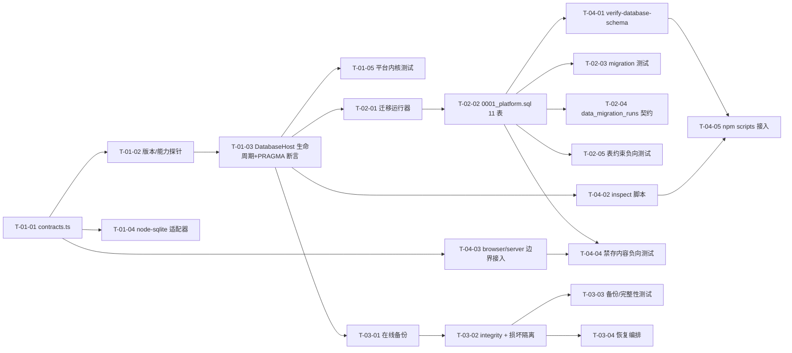

# TrustTools 本地存储数据库敏捷任务清单

| 属性 | 值 |
|------|-----|
| 文档类型 | 敏捷任务清单 (AGILE-TASK) |
| 项目名称 | TrustTools |
| 版本 | v1.0 |
| 创建日期 | 2026-08-19 13:32:45 |
| 更新日期 | 2026-08-19 13:32:45 |
| 生成工具 | agile-feature-dev |
| 文档状态 | 草稿 |

## 修订记录

| 版本 | 修改时间 | 修改内容 |
|------|---------|---------|
| v1.0 | 2026-08-19 13:32:45 | 初始版本：按《TrustTools 本地存储数据库架构设计文档》与 ADR，拆分 Release 1（数据库平台内核 + 首期 11 表 + 运维/巡检脚本 + 测试门禁）的 Epic/Story/Task |

---

## 1. 目标与交付边界

本计划对应《TrustTools-本地存储数据库-架构设计文档.md》(v1.1) 与《TrustTools-本地存储数据库-架构决策记录.md》(v1.1)，实施其中 **M1 数据库平台内核** 的首期范围，作为后续 M2+（各域 JSON 数据导入、shadow-write/read-switch）的平台基座。所有业务写入仍经现有 Domain/Application contract，不向业务暴露 SQL 或数据库类型。

### 1.1 本轮交付（Release 1，MUST）

| 交付物 | 位置 | 说明 |
|---|---|---|
| 数据库契约 | `src/platform/database/contracts.ts` | `SqliteDatabasePort` / `Transaction` / `Backup` 契约，无 `node:sqlite` 类型泄漏 |
| 连接生命周期与能力探针 | `src/platform/database/database-host.server.ts` | 单连接 singleton、PRAGMA 断言（WAL/synchronous=FULL/foreign_keys=ON/busy_timeout=5000/trusted_schema=OFF）、版本/能力不匹配拒绝写路径 |
| node:sqlite 适配器 | `src/platform/database/infrastructure/node-sqlite-database.server.ts` | `readBigInts=true`、`defensive=true`、`allowExtension=false`、严格命名参数、BigInt 安全边界转换 |
| 迁移运行器 | `src/platform/database/migration-runner.server.ts` | SQL 文件 SHA-256 checksum、只向前、拒绝篡改与回退 |
| 首期迁移 | `src/platform/database/migrations/0001_platform.sql` | 11 张 STRICT 表（§5.1/§5.2/§5.10），严格按架构文档列与约束 |
| 备份 | `src/platform/database/backup.server.ts` | `sqlite.backup()` 在线备份 + manifest + `quick_check` + 临时文件原子 rename |
| 完整性与损坏恢复 | `src/platform/database/integrity.server.ts` | `integrity_check` / `foreign_key_check`，损坏隔离到 `.corrupt.<ts>/` 目录 |
| 验证脚本 | `scripts/verify-database-schema.mts` | 静态校验 migration 顺序/checksum/首期 11 表 DDL 与文档对照 |
| 巡检脚本 | `scripts/inspect-database.mts` | 只输出 schema/计数/健康，不输出内容 |
| 边界门禁 | `scripts/verify-browser-server-boundary.mjs` 扩展 + bundle 检查 | 业务模块不静态 import `node:sqlite`；renderer bundle 无 `DatabaseSync` |

### 1.2 本轮明确不做（WON'T，仅预留）

| 项 | 说明 |
|---|---|
| M2+ 各域 JSON 数据导入 | tasks/reports/knowledge/usage/session 等域迁移与对账不在本轮 |
| shadow-write / read-switch / legacy 归档 | 不建立双写，不切换读取源 |
| 业务 Repository adapter | `src/modules/*/infrastructure/sqlite-*.server.ts` 不在本轮 |
| 今日洞察业务接入 | 仅建表与表约束，Insight Core/Enhancer 读写逻辑不在本轮 |
| `insight_feedback` 表 | COULD 项，本轮不创建 |
| 全库加密 / FTS5 | 字段级密钥加密仅建表（`secure_secrets.ciphertext` BLOB），加解密后端不在本轮；FTS5 不在本轮 |

**预留契约**：`data_migration_runs` 表结构与迁移状态机契约（`running|succeeded|failed|skipped` + 幂等唯一索引）本轮落地，供 M2+ 直接使用；不实现任何导入逻辑。

### 1.3 测试范围（架构文档 §14.1/§14.2/§14.4 子集）

空库从 0 到 latest、重复迁移幂等、checksum 篡改拒绝、WAL 断言失败拒绝写路径、BigInt 安全整数边界、`foreign_key_check`/`integrity_check`、备份-恢复往返、损坏文件隔离、禁存内容负向测试（路径/密钥/正文）、browser/server 边界（业务模块不 import `node:sqlite`、renderer bundle 无 `DatabaseSync`）。

## 2. 需求与验收追踪

| 编号 | 架构文档来源 | 验收摘要 | 承担 Task |
|---|---|---|---|
| R-01 | §2.2 兼容 / §12 | 业务 contract 不因 SQLite 暴露 SQL 或数据库类型 | T-01-01、T-04-03 |
| R-02 | §3.2 / §8 / ADR-4/5 | 单 Host、WAL+synchronous=FULL 断言；断言失败拒绝写路径并保留 legacy adapter | T-01-02、T-01-03、T-01-05 |
| R-03 | §3.2 / §9-5 | `readBigInts`/`defensive`/`allowExtension=false`/严格命名参数；BigInt 安全边界 | T-01-04、T-01-05 |
| R-04 | §4.1 / §5.1 / §5.2 / §5.10 | 11 张 STRICT 表，列/CHECK/FK/索引与文档一致 | T-02-02、T-02-05、T-04-01 |
| R-05 | §10.2 / ADR-6 | 在线备份一致性与 manifest；不直接复制 .db | T-03-01、T-03-03 |
| R-06 | §10.3 | 损坏隔离到 `.corrupt.<ts>/`；不静默重建；备份恢复闭环 | T-03-02、T-03-03、T-03-04 |
| R-07 | §9-4 / §14.4 | 禁存内容（路径/密钥/正文）负向测试零命中；renderer 无 DatabaseSync | T-04-03、T-04-04 |
| R-08 | §14.1 | 空库 0→latest、幂等、checksum 篡改拒绝、中断重启 | T-02-01、T-02-03 |
| R-09 | §13 M1 | browser/server boundary 与 schema verify 接入 npm scripts | T-04-01、T-04-03、T-04-05 |

## 3. 依赖图与发布里程碑

| 里程碑 | 完成定义 | 名义人日（累计） | SP（累计） |
|---|---|---:|---:|
| M-1 平台内核 | contracts/探针/Host/适配器 + 平台内核测试全绿 | 3.5 | 5 |
| M-2 迁移与首期表 | 迁移运行器 + 0001 11 表 + migration/约束测试全绿 | 8 | 13 |
| M-3 备份/恢复 | 在线备份、完整性、损坏隔离与恢复闭环 | 11.5 | 18 |
| **Release 1 门禁** | 脚本 + 边界 + 负向测试全绿；`tsc`/`eslint`/`prettier` 通过 | 15（名义） | 23 |

Release 1 是后续 M2+ 的硬依赖：未完成 Release 1，禁止开始任何域数据导入。

## 4. Epic R1 — 数据库平台内核与首期 11 表

### Story S-01：数据库平台内核（契约 + 能力探针 + node-sqlite 适配器 + DatabaseHost 生命周期）— 3.5 人日 / 5 SP

作为平台开发者，我需要可注入的契约、能力探针、`node:sqlite` 适配器与单连接生命周期，以便业务模块依赖稳定的 `SqliteDatabasePort` 而不接触驱动 API，并在运行时能力不满足基线时安全拒绝写路径。

**Story 验收标准**：初始化后的连接满足全部 PRAGMA 断言（journal_mode=wal、synchronous=FULL、foreign_keys=ON、busy_timeout=5000、trusted_schema=OFF）；注入低版本/能力不匹配时拒绝写路径并返回稳定错误码，不自动破坏性重建；同路径第二次打开 Host 被拒绝；平台层零业务 SQL；`npx tsc --noEmit`、`npm run lint`、`npx prettier --check` 与单测全绿。

| Task | 工作项 | 估时 | 依赖 | 验收标准（可验证） | 强制验证步骤 |
|---|---|---:|---|---|---|
| T-01-01 | 定义 `src/platform/database/contracts.ts`：`SqliteDatabasePort`、`Transaction`、`Backup`/`BackupManifest`、`DatabaseErrorCode` 与 `DatabaseError`（风格对齐 `src/platform/persistence/contracts.ts`） | 0.5d | 无 | 契约文件不 import `node:sqlite`；Port 只含最小同步方法（prepare/exec/transaction/close 等）；`Transaction` 含 begin/commit/rollback；错误码覆盖 `journal-not-wal`、`migration-checksum`、`migration-reverted`、`corrupt`、`capability-mismatch`、`already-open`；`DatabaseError` 不含绝对路径 | prettier --check → tsc --noEmit → npm run lint → commit |
| T-01-02 | 实现可注入版本/能力探针：`RuntimeVersionsProvider` 接口 + Node 实现（`process.versions.node/electron/chrome` + `SELECT sqlite_version()`），支持注入伪造版本 | 0.5d | T-01-01 | 正常路径返回四版本值；注入 `sqlite=3.52.x` 等低版本可驱动「拒绝写路径」分支；探针无副作用（不打开持久连接） | prettier --check → tsc --noEmit → npm run lint → commit |
| T-01-03 | `database-host.server.ts`：单连接生命周期——创建连接、应用并断言 `journal_mode=WAL` 返回 `wal`、`synchronous=FULL`、`foreign_keys=ON`、`busy_timeout=5000`、`trusted_schema=OFF`；断言失败关闭连接返回稳定错误码；同路径单例约束 | 0.5d | T-01-02 | 正常路径各 PRAGMA 值可被测试断言；断言失败时连接已关闭且错误码稳定，不静默改 journal 语义；同路径第二次打开抛 `already-open`；Host 持有探针与适配器但无业务 SQL | prettier --check → tsc --noEmit → npm run lint → commit |
| T-01-04 | `infrastructure/node-sqlite-database.server.ts`：实现 `SqliteDatabasePort`——`new DatabaseSync(path, { readBigInts:true, defensive:true, allowExtension:false, allowBareNamedParameters:false, allowUnknownNamedParameters:false, timeout:5000 })`；prepared statement helper；BigInt→安全整数转换与越界拒绝 | 1d | T-01-01、T-01-03 | 未命名/未知命名参数被拒绝；`allowExtension=false` 生效；BigInt 读取可转换；超出 `Number.MAX_SAFE_INTEGER`/`MIN_SAFE_INTEGER` 抛错而非静默失真；适配器不暴露 `DatabaseSync` 类型到 platform 外层 | prettier --check → tsc --noEmit → npm run lint → commit |
| T-01-05 | 平台内核测试（共置 `database-host.test.ts`、`node-sqlite-database.test.ts`）：PRAGMA 断言、注入低版本拒绝写路径、单例冲突、BigInt 安全整数边界 | 1d | T-01-03、T-01-04 | `node --import tsx --test src/platform/database/` 全绿；覆盖：journal 断言失败拒绝写路径、`synchronous`/`foreign_keys`/`busy_timeout`/`trusted_schema` 断言、注入 3.52.x 拒绝分支、同路径二次打开失败、BigInt 边界（MAX_SAFE_INTEGER/MIN_SAFE_INTEGER/越界抛错） | prettier --check → tsc --noEmit → npm run lint → node --import tsx --test src/platform/database/database-host.test.ts + node-sqlite-database.test.ts → commit |

### Story S-02：迁移运行器 + 0001_platform.sql 首期 11 表 — 4.5 人日 / 8 SP

作为平台开发者，我需要只向前的 checksum 迁移运行器和严格按架构文档的首期 11 张 STRICT 表，以便空库可从 0 升到最新、重复执行幂等、篡改被拒绝，并为 M2+ 预留迁移状态机契约。

**Story 验收标准**：空库从 0 迁移到 latest 且 `schema_migrations` 记录完整（version/name/checksum/app_version/applied_at_ms/duration_ms）；重复执行无变化；checksum 变更或版本回退被拒绝；11 表列/CHECK/FK/索引与架构文档逐项一致；`data_migration_runs` 状态机契约编译通过；§14.1 子集测试全绿。

| Task | 工作项 | 估时 | 依赖 | 验收标准（可验证） | 强制验证步骤 |
|---|---|---:|---|---|---|
| T-02-01 | `migration-runner.server.ts`：按序发现 `migrations/*.sql`、SHA-256 checksum、事务内执行并写 `schema_migrations`、只向前、拒绝 checksum 变更与版本回退 | 1d | T-01-01、T-01-03 | 空库 0→latest 成功；重复执行幂等（不重复应用）；篡改任一已应用 SQL 的 checksum 后拒绝继续；目标版本低于当前版本拒绝；中断重启后已提交 migration 不重跑 | prettier --check → tsc --noEmit → npm run lint → commit |
| T-02-02 | `migrations/0001_platform.sql`：11 张 STRICT 表——schema_migrations、data_migration_runs、app_preferences、runtime_flags、secure_secrets、model_profiles、ai_executions、ai_daily_usage、insight_preferences、insight_enhancement_cache、insight_enhancement_lines；严格按 §5.1/§5.2/§5.10 列/CHECK/FK/唯一与部分唯一索引 | 1d | T-02-01 | 11 表均为 STRICT；`model_profiles` 部分唯一索引（`is_active=1` 最多一个）；`ai_daily_usage` 复合主键 `(date_key, capability, profile_key)`；`data_migration_runs` 唯一索引 `(source_kind, source_path_hash, source_fingerprint)`；`insight_enhancement_cache` UNIQUE 七列 + 索引 `(surface_id, expires_at_ms)`；`insight_enhancement_lines` 主键 `(cache_key, sequence)` 且 FK CASCADE；所有 `*_json` 列 `CHECK(json_valid(...))`；所有 `*_at_ms` 非负 CHECK；不创建任何非首期表 | prettier --check → tsc --noEmit → npm run lint → node --import tsx --test（随 T-02-03 单测执行） → commit |
| T-02-03 | migration 测试（§14.1 子集）：空库从 0 到 latest、重复迁移幂等、checksum 篡改拒绝、中断重启 | 1d | T-02-01、T-02-02 | 全绿：0→latest 成功且 `schema_migrations` 恰 1 行；再跑 runner 无变化；篡改 SQL 后抛 `migration-checksum`；模拟中断后重启不重跑已提交版本；临时目录（Windows/macOS）下通过 | prettier --check → tsc --noEmit → npm run lint → node --import tsx --test src/platform/database/migration-runner.test.ts → commit |
| T-02-04 | `data_migration_runs` 状态机契约：类型 + 常量 + 校验器（`running|succeeded|failed|skipped`、幂等键字段），预留 M2+ 下游，不实现导入 | 0.5d | T-02-02 | 契约编译通过；枚举与字段类型与 §5.1 表结构一致；导出仅供后续迁移任务消费；本轮无任何导入逻辑 | prettier --check → tsc --noEmit → npm run lint → commit |
| T-02-05 | 表级约束负向测试：违反 FK/CHECK/部分唯一索引/唯一索引的插入全部被拒绝 | 1d | T-02-02 | 用例覆盖：第二个 active `model_profiles` 被拒；非法 `status`/`mode`/`encryption_kind` 枚举被拒；`value_json` 非 JSON 被拒；`ai_daily_usage` 复合主键重复被拒；`insight_enhancement_cache` UNIQUE 冲突被拒；`data_migration_runs` 幂等唯一索引冲突被拒；`schema_migrations.duration_ms < 0` 被拒 | prettier --check → tsc --noEmit → npm run lint → node --import tsx --test src/platform/database/table-constraints.test.ts → commit |

### Story S-03：备份 / 完整性 / 损坏恢复 — 3.5 人日 / 5 SP

作为平台运维者，我需要在线一致备份、完整性检测与损坏隔离，以便崩溃或损坏后可恢复到最新可靠状态，且绝不静默删除/重建数据库。

**Story 验收标准**：`sqlite.backup()` 生成的备份可恢复且包含已提交 WAL 状态；manifest 字段完整；备份后 `quick_check` 通过；损坏样本被隔离到 `.corrupt.<ts>/`（DB/-wal/-shm 同一故障组）；恢复流程不覆盖最后成功备份、不静默重建；§14.2 子集测试全绿。

| Task | 工作项 | 估时 | 依赖 | 验收标准（可验证） | 强制验证步骤 |
|---|---|---:|---|---|---|
| T-03-01 | `backup.server.ts`：`sqlite.backup()` 在线备份到临时文件、`quick_check`、写 manifest（SHA-256/schema version/app version/sqlite version/size/createdAt）、校验后原子 rename、不覆盖最后成功备份 | 1d | T-01-03 | 备份-恢复往返内容一致（含 WAL 中未 checkpoint 数据）；manifest 字段齐全；备份文件 `quick_check` 通过；目标已存在时写临时文件后原子替换且失败不破坏旧备份；不直接复制 `.db/-wal/-shm` | prettier --check → tsc --noEmit → npm run lint → commit |
| T-03-02 | `integrity.server.ts`：`integrity_check`/`foreign_key_check` 检测；打开失败或 `quick_check` 失败时把 DB/-wal/-shm 同故障组隔离到 `.corrupt.<ts>/`，不删除 | 1d | T-01-03、T-03-01 | 干净库两检查通过；人为损坏后检测失败并触发隔离；隔离目录名含时间戳；原文件保留不移除；隔离后主机可重新初始化空库 | prettier --check → tsc --noEmit → npm run lint → commit |
| T-03-03 | 备份/完整性测试（§14.2 子集）：备份-恢复往返、损坏隔离、`quick_check` 失败触发隔离、备份目标占用错误 | 1d | T-03-01、T-03-02 | 全绿：往返数据一致；损坏文件被隔离且可被检出；目标占用/只读目录等可模拟错误返回稳定错误码不崩溃；恢复后 `integrity_check` 通过 | prettier --check → tsc --noEmit → npm run lint → node --import tsx --test src/platform/database/backup.test.ts + integrity.test.ts → commit |
| T-03-04 | 恢复流程编排：隔离后定位最新通过 checksum+`quick_check` 的备份并提供恢复 API（用户确认前不覆盖）；无备份时创建空库并标记 | 0.5d | T-03-02 | 恢复 API 返回目标备份元数据（版本/时间/checksum）而不直接覆盖；无可用备份时走「创建空库 + 标记」路径且明确错误码；任何路径都不删除损坏文件 | prettier --check → tsc --noEmit → npm run lint → node --import tsx --test src/platform/database/recovery.test.ts → commit |

### Story S-04：验证与巡检脚本 + 边界门禁 — 3.5 人日 / 5 SP

作为交付守护者，我需要静态 schema 验证、只读巡检与 browser/server 边界门禁，以便 CI 可拦截迁移篡改、禁存内容泄漏与 `node:sqlite` 进入 renderer 的回归。

**Story 验收标准**：`verify-database-schema.mts` 对干净仓库 OK、篡改任一 SQL FAIL 且退出码非零；`inspect-database.mts` 只输出 schema/计数/健康且不含任何业务内容；`verify:browser-server-boundary` 检出违规样例且正常仓库通过；renderer bundle 无 `DatabaseSync`；§14.4 负向测试零命中。

| Task | 工作项 | 估时 | 依赖 | 验收标准（可验证） | 强制验证步骤 |
|---|---|---:|---|---|---|
| T-04-01 | `scripts/verify-database-schema.mts`：静态校验 migrations 顺序/checksum 一致性、0001 的 11 表 DDL 与文档对照（表名/STRICT/关键约束/索引） | 1d | T-02-01、T-02-02 | 干净仓库输出 OK 且退出码 0；篡改任一 SQL 或删表输出 FAIL 且退出码非零；不连接数据库即可运行；输出含 11 表清单核对结果 | prettier --check → tsc --noEmit → npm run lint → node --import tsx scripts/verify-database-schema.mts（对临时篡改样本验证 FAIL 分支） → commit |
| T-04-02 | `scripts/inspect-database.mts`：只输出 schema 对象列表、每表行数、健康（`integrity_check`/`journal_mode`/`foreign_keys`/`user_version`），绝不输出行内容 | 0.5d | T-01-03 | 对含数据临时库输出表计数与健康状态；输出文本不含任何业务字段值（可 grep 断言）；参数只接受数据库路径与只读标志 | prettier --check → tsc --noEmit → npm run lint → node --import tsx scripts/inspect-database.mts <tmp.db>（grep 校验无内容泄漏） → commit |
| T-04-03 | browser/server 边界接入：扩展 `verify-browser-server-boundary.mjs`——`src/platform/database/infrastructure/` 与 `*.server.ts` 排除在 browser graph，并新增「业务模块不得静态 import `node:sqlite`」规则 | 0.5d | T-01-01 | 构造违规样例（业务模块静态 import `node:sqlite`）被检出并 FAIL；`npm run verify:browser-server-boundary` 对正常仓库 OK；新目录被正确排除 | prettier --check → tsc --noEmit → npm run lint → npm run verify:browser-server-boundary → commit |
| T-04-04 | 禁存内容负向测试 + renderer bundle 检查：向 `app_preferences`（secret key 拒绝）与 `insight_enhancement_lines`（数字/URL/路径/命令拒绝）注入禁存内容断言拒绝；bundle 无 `DatabaseSync` | 1d | T-02-02、T-04-03 | 负向用例（transcript/Bearer/API Key/`C:\Users\...`/`/Users/...`/命令/Prompt injection）全部被拒绝或不可逆转换（不可逆哈希）；对 build 产物断言不存在 `DatabaseSync` 符号；§14.4 子集通过 | prettier --check → tsc --noEmit → npm run lint → node --import tsx --test src/platform/database/privacy-negative.test.ts → npm run build 后 bundle 检查 → commit |
| T-04-05 | npm scripts 接入：`verify:database-schema`、`inspect:database` 脚本入口 + README 说明 | 0.5d | T-04-01、T-04-02 | `npm run verify:database-schema` 可执行且输出 OK；`npm run inspect:database -- <path>` 可用；package.json scripts 与文档引用一致 | prettier --check → tsc --noEmit → npm run lint → npm run verify:database-schema → commit |

## 5. 依赖关系表

| Task | 依赖 | 阻塞 |
|---|---|---|
| T-01-01 | — | T-01-02、T-01-04、T-04-03 |
| T-01-02 | T-01-01 | T-01-03 |
| T-01-03 | T-01-02 | T-01-04、T-01-05、T-02-01、T-03-01、T-03-02、T-04-02 |
| T-01-04 | T-01-01、T-01-03 | T-01-05 |
| T-01-05 | T-01-03、T-01-04 | — |
| T-02-01 | T-01-01、T-01-03 | T-02-02、T-02-03、T-04-01 |
| T-02-02 | T-02-01 | T-02-03、T-02-04、T-02-05、T-04-01、T-04-04 |
| T-02-03 | T-02-01、T-02-02 | — |
| T-02-04 | T-02-02 | — |
| T-02-05 | T-02-02 | — |
| T-03-01 | T-01-03 | T-03-02、T-03-03 |
| T-03-02 | T-01-03、T-03-01 | T-03-03、T-03-04 |
| T-03-03 | T-03-01、T-03-02 | — |
| T-03-04 | T-03-02 | — |
| T-04-01 | T-02-01、T-02-02 | T-04-05 |
| T-04-02 | T-01-03 | T-04-05 |
| T-04-03 | T-01-01 | T-04-04 |
| T-04-04 | T-02-02、T-04-03 | — |
| T-04-05 | T-04-01、T-04-02 | — |

## 6. 工作量汇总（斐波那契点数）与关键路径

| Story | 范围 | 名义人日 | 点数（SP） |
|---|---:|---:|---:|
| S-01 数据库平台内核 | contracts + 探针 + Host + 适配器 + 内核测试 | 3.5 | 5 |
| S-02 迁移与首期 11 表 | runner + 0001 + migration/约束测试 + 状态机契约 | 4.5 | 8 |
| S-03 备份/完整性/损坏恢复 | backup + integrity + 隔离 + 恢复编排 | 3.5 | 5 |
| S-04 脚本与边界门禁 | verify/inspect 脚本 + 边界 + 负向测试 + npm 接入 | 3.5 | 5 |
| **Epic R1 合计** | | **15（名义，含缓冲约 16）** | **23** |

- 点数映射：0.5d Task = 1 SP，1d Task = 2 SP（Task 粒度）；Story 采用斐波那契点数 5/8/5/5，合计 23 SP。
- 关键依赖链（串行）：`T-01-01 (0.5d) → T-01-02 (0.5d) → T-01-03 (0.5d) → T-02-01 (1d) → T-02-02 (1d) → T-04-01 (1d) → T-04-05 (0.5d)`，约 **5 人日**；测试链路 `…→ T-02-03`、`…→ T-03-03` 约 4.5 人日。
- 并行策略（2 人团队）：T-01-01 完成后，一人走 S-01 剩余链路（探针→Host→适配器→内核测试），另一人在 T-01-03 就绪后并行推进 S-02 runner 与 S-03 backup；S-04 的 T-04-03 可最早在 T-01-01 后启动，T-04-01/T-04-04 等待 T-02-02。日历工期约 8–9 个工作日。
- 质量门：每个 Task 的强制验证步骤（`prettier --check` → `tsc --noEmit` → `npm run lint` → 相关单测 → commit）为完成定义；Release 1 门禁要求 `npm run verify:browser-server-boundary`、`npm run verify:database-schema` 全绿，且任何迁移文件/表结构变更须与 `0001_platform.sql` 及架构文档同步更新。

## 7. 风险与假设

| 风险/假设 | 影响 | 缓解 |
|---|---|---|
| `node:sqlite` 在 Node 24 非 Stability 2 | 中 | 薄 Port（T-01-01）；版本/能力探针可注入（T-01-02）；必要时切换 `better-sqlite3` adapter |
| 本地 Node v24.9.0 与 Electron 内置 Node 24.18.1/SQLite 3.53.1 差异 | 中 | 探针以 `SELECT sqlite_version()` 实测为准；低版本注入测试覆盖拒绝分支（T-01-05） |
| Windows 文件占用/杀软干扰备份 rename | 中 | 临时文件 + 原子 rename + 明确错误码（T-03-01、T-03-03） |
| 表约束与 TypeScript 枚举漂移 | 低 | SQL CHECK 与契约枚举同源维护；verify 脚本对照（T-04-01） |
| 2 人团队任务串并行调度 | 低 | Task 均 0.5–1 人日、单 Sub-Agent 可独立完成；依赖链已显式化（§5） |
